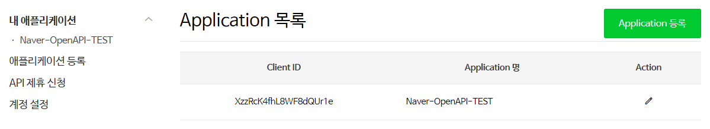
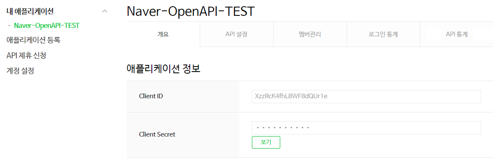
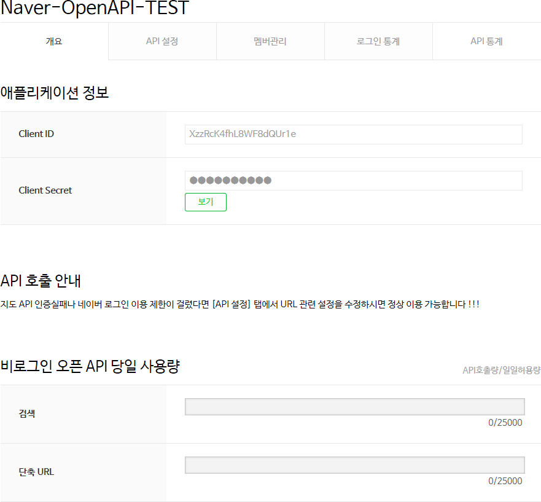
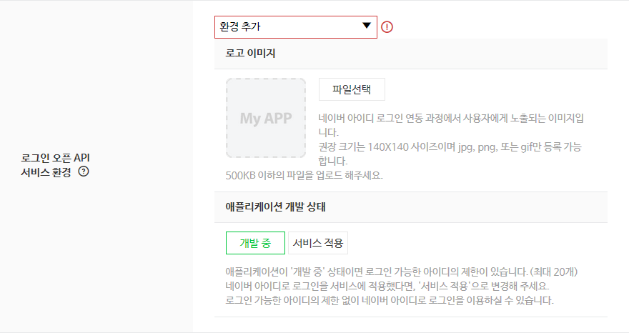
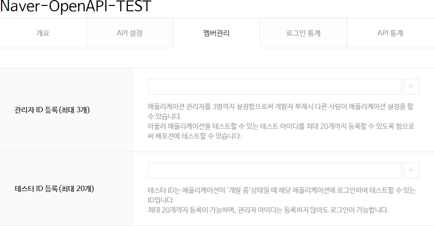
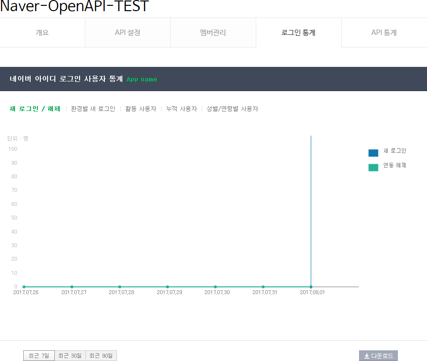
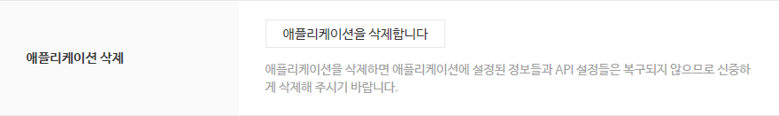

# 내 애플리케이션 관리

개발자 센터의 **[Application > 내 애플리케이션](https://developers.naver.com/apps/#/list)** 메뉴를 클릭하면 등록한 애플리케이션의 목록을 확인할 수 있습니다. 목록 위에 있는 **Application 등록**을 클릭하면 새로운 애플리케이션을 등록할 수 있습니다. 애플리케이션은 최대 10개까지 등록할 수 있습니다.
 

애플리케이션 목록에서 애플리케이션 이름을 클릭하거나 **내 애플리케이션** 메뉴의 하위 메뉴에서 애플리케이션 이름을 클릭하면 애플리케이션의 기본 정보와 설정 정보, API 사용 통계 등을 확인할 수 있습니다.
 

## 기본 정보

애플리케이션 관리 페이지의 **개요** 탭을 클릭하면 애플리케이션의 기본 정보와 API 사용량을 확인할 수 있습니다.
 

- 애플리케이션 정보: 클라이언트 아이디와 클라이언트 시크릿을 확인할 수 있습니다.
- API 호출 안내: API 호출 오류가 발생했을 때 해결 방법을 안내합니다.
- 비로그인 오픈 API 당일 사용량: 현재 호출된 API의 사용량을 보여 줍니다.

## API 설정

애플리케이션 관리 페이지의 **API 설정** 탭을 클릭하면 애플리케이션을 등록할 때 설정한 [세부 정보](appregister.md#애플리케이션-등록-세부-정보)를 확인하고 수정할 수 있으며, 카테고리와 로고 이미지를 추가로 설정할 수 있습니다. 애플리케이션이 [로그인 방식 오픈 API](apilist.md#로그인-방식-오픈-api)를 사용한다면 애플리케이션 개발 상태도 확인하고 변경할 수 있습니다.
 

- 카테고리: 애플리케이션의 성격에 맞는 분류 항목을 선택합니다.
- 로고 이미지: 네이버 아이디 로그인 연동 과정에서 사용자에게 노출되는 이미지입니다. **파일 선택**을 클릭해 새로운 이미지를 등록합니다.
- 애플리케이션 개발 상태: 로그인 방식 오픈 API를 사용하는 애플리케이션은 **개발 중**으로 최초 등록됩니다. **개발 중**이면 멤버 관리 탭에서 테스터ID로 등록된 네이버 아이디로만 애플리케이션에 접속할 수 있습니다. 테스터 ID는 최대 20개까지만 등록할 수 있습니다. 개발이 완료되고 실제 서비스에 적용하기 위해서는 **네아로 검수요청**을 등록하십시오. 검수를 통해 승인이 완료되면 개발 상태가 **서비스 적용**으로 변경되며 로그인 아이디 개수에 제한 없이 누구나 네이버 아이디로 애플리케이션에 접속할 수 있습니다.

	
<strong>주의</strong>

	
애플리케이션 개발 상태를 '서비스 적용'으로 하기 위해서는 반드시 검수요청을 등록해야 합니다. 검수 요청 등록 가이드를 참고하십시오.

  

## 멤버 관리

애플리케이션 관리 페이지의 **API 설정** 탭을 클릭하면 애플리케이션 관리자와 테스터를 등록할 수 있습니다.
 

- 관리자 ID 등록: 애플리케이션을 관리할 관리자의 네이버 아이디를 등록합니다. 최대 3개까지 등록할 수 있습니다.
- 테스터 ID 등록: 애플리케이션의 개발 상태가 '개발 중'일 때 애플리케이션에 로그인할 수 있는 네이버 아이디를 등록합니다. 최대 20개까지 등록할 수 있습니다.

## 통계 보기

애플리케이션 관리 페이지의 **로그인 통계** 탭과 **API 통계** 탭을 클릭하면 애플리케이션에 적용한 네이버 오픈API가 얼마나 호출됐는지 통계를 확인할 수 있습니다.
 

- 로그인 통계: 애플리케이션에 네이버 아이디로 로그인한 사용자 통계를 보여 줍니다.
- API 통계: 특정 기간 동안의 API 사용량 통계를 보여 줍니다.

## 애플리케이션 삭제

등록한 애플리케이션을 더 이상 사용하지 않을 때는 애플리케이션을 삭제할 수 있습니다.

애플리케이션을 삭제하면 애플리케이션에서 네이버 아이디로 로그인할 수 없으며, 삭제된 정보는 복구할 수 없습니다. 신중하게 삭제해 주시기 바랍니다.

등록된 애플리케이션을 삭제하는 방법은 다음과 같습니다.

1. 삭제하려는 애플리케이션의 관리 페이지에서 **API 설정** 탭을 클릭합니다.
2. **애플리케이션 삭제**의 **애플리케이션을 삭제합니다**를 클릭합니다.

