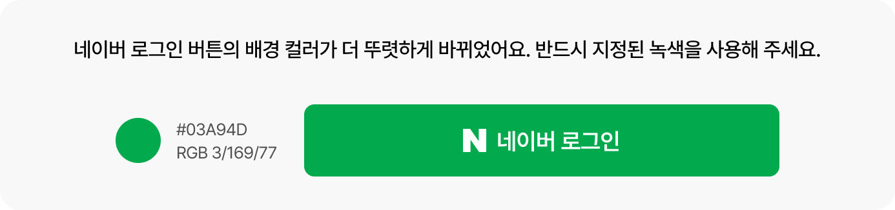
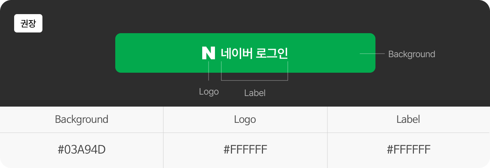
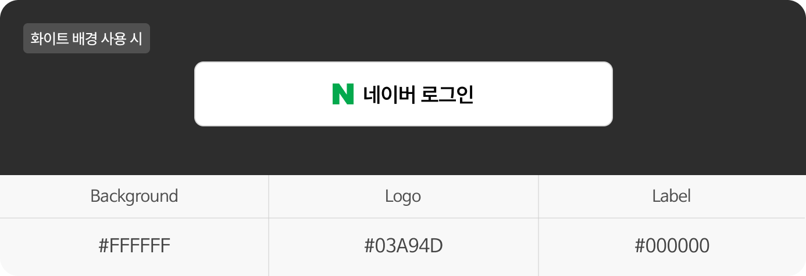
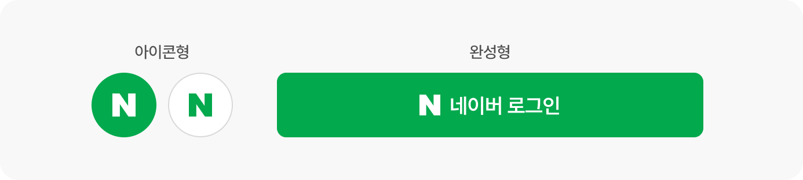
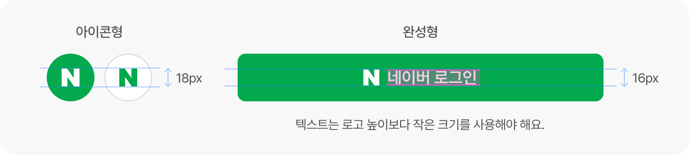
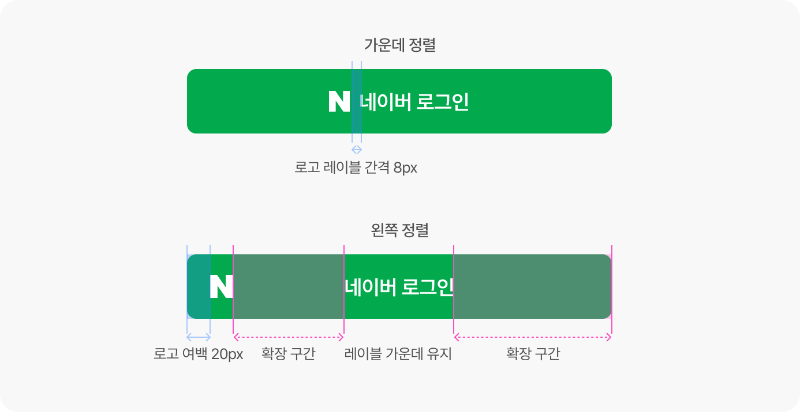
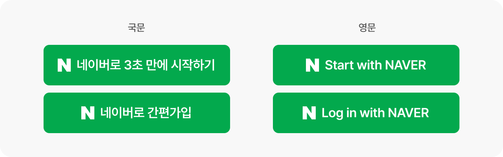
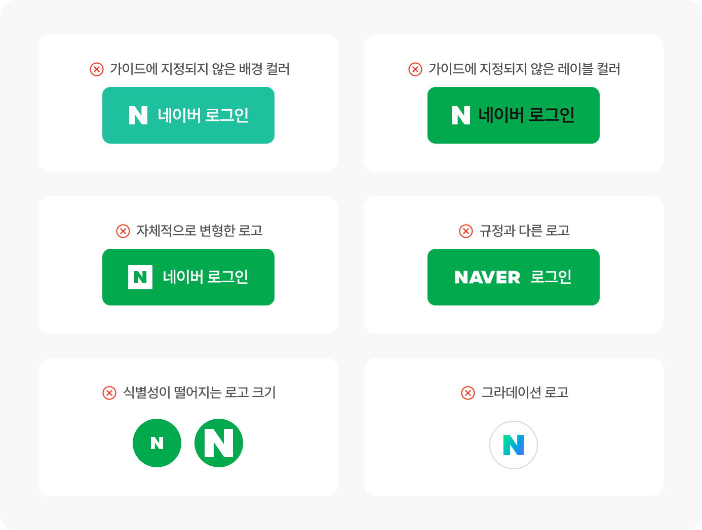
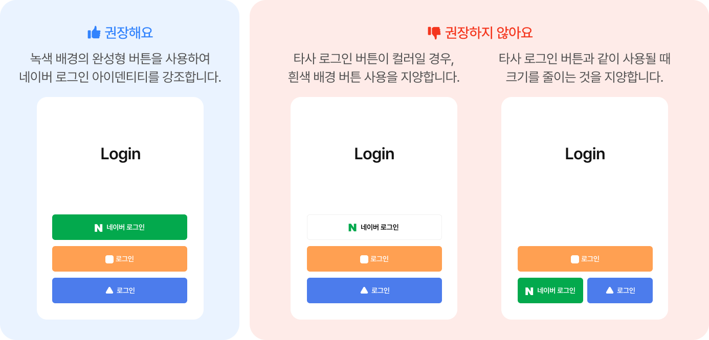

# 네이버 로그인 버튼 사용 가이드

## 1. 개요

네이버 로그인은 버튼 기본 이미지를 제공합니다.
버튼 이미지 디자인은 꼭 필요한 경우에 한해 일부 변경할 수 있으나, 네이버 고유의 아이덴티티가 사용자에게 오롯이 전달될 수 있도록, 본 가이드의 디자인을 최대한 유지하는 것을 권장합니다.

#### 한글 버튼 애셋

<a class="secondary" href="/inc/devcenter/downloads/bi/NAVER_login_KR.fig" download>Figma</a>
<a class="secondary" href="/inc/devcenter/downloads/bi/NAVER_login_KR.ai" download>Adobe Illustrator</a>
<a class="secondary" href="/inc/devcenter/downloads/bi/NAVER_login_KR.zip" download>PNG</a>

#### 영문 버튼 애셋

<a class="secondary" href="/inc/devcenter/downloads/bi/NAVER_login_EN.fig" download>Figma</a>
<a class="secondary" href="/inc/devcenter/downloads/bi/NAVER_login_EN.ai" download>Adobe Illustrator</a>
<a class="secondary" href="/inc/devcenter/downloads/bi/NAVER_login_EN.zip" download>PNG</a>

## 2. 지정 컬러를 반드시 지켜주세요

지정 컬러는 변경할 수 없으며, 네이버 아이덴티티가 효과적으로 강조되는 녹색 배경 사용을 권장합니다.

## 3. 디자인 가이드를 안내드려요

### 형태

버튼은 아이콘과 레이블로 구성되며, 아이콘형과 완성형 두 가지 형태로 제공됩니다.

### 로고

네이버 로고 타입 규정에 따라 N 로고 타입을 사용하며 로고를 기준으로 최소한의 여백을 유지합니다. 로고 형태를 변경하거나 다른 형태와 조합하는 것은 금지됩니다.

N 로고 크기는 아이콘형 18px, 완성형 16px 이상을 사용하고, 기준보다 작지 않도록 주의해 주세요.

### 크기

버튼은 완성형 사용을 권장드리며, 버튼의 가로 폭을 조정해야 하는 경우 로고를 레이블과 함께 가운데 정렬하거나, 로고만 왼쪽 정렬하여 사용할 수 있습니다.

가운데 정렬 시 로고와 레이블의 간격은 8px을 유지해 주세요.

## 4. 문구는 변경이 가능해요

네이버에 로그인하는 목적에 부합한다면, 한글이나 영문에 상관없이 버튼의 메시지를 변경할 수 있습니다.

## 5. 가이드를 꼭 유념하세요

가이드에서 벗어난 변경사항은 네이버의 아이덴티티를 약화시킬 수 있으므로 주의를 기울여 주세요.

## 6. 이렇게 쓰면 좋아요

네이버를 쉽게 인지하고 목적을 바로 이해할 수 있도록 녹색 배경의 완성형 버튼 사용을 권장합니다.

<a href="/myapps/new">오픈 API 이용 신청</a>
<a href="/products/login/api">네이버 로그인 소개페이지 이동</a>

