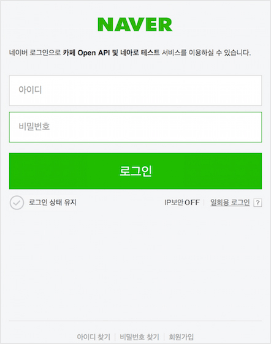
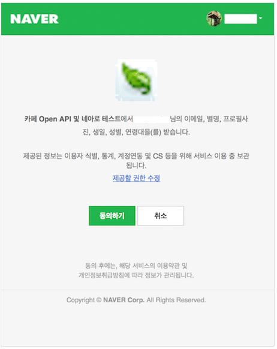
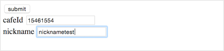
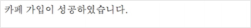
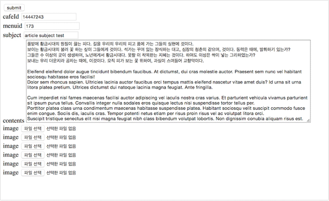

# 카페 튜토리얼

카페 API는 애플리케이션에서 네이버 로그인한 사용자가 네이버 카페에 가입하거나 가입한 카페의 통합 게시판에 게시글을 쓸 수 있는 기능을 제공하는 API입니다. 카페 API는 네이버 로그인에 등록한 애플리케이션에 사용할 수 있으며, 네이버 로그인의 OAuth 2.0을 이용해 손쉽게 사용자를 인증을 구현할 수 있습니다. 이 튜토리얼에서는 네이버 로그인과 카페 API를 활용해 네이버 카페에 가입하고 카페에 게시글을 쓰는 웹 애플리케이션을 PHP로 구현하는 방법을 설명합니다. 이 튜토리얼을 따라하면 카페 API를 사용하는 기본적인 방법을 익힐 수 있을 것입니다.

<div class="ndc-cta">
<a href="/myapps/new">오픈 API 이용 신청 &gt;</a>
</div>

## 사전 준비

이 튜토리얼에서 설명하는 웹 애플리케이션을 개발하려면 다음과 같은 사전 준비가 필요합니다.

### 웹 애플리케이션 등록

카페 API를 사용하려면 네이버 로그인에 웹 애플리케이션을 등록해 클라이언트 아이디와 클라이언트 시크릿을 받아야 합니다.

[네이버 로그인 새 애플리케이션 등록 &gt;](/myapps/new)

### PHP 설정

- PHP 5.5 이상
- 임시 폴더(/tmp) 사용 설정
  파일 업로드를 위해 임시 폴더(/tmp)를 사용합니다. PHP 설정 파일인 php.ini 파일에 open_basedir 항목이 설정돼 있다면 “/tmp”를 추가해야 합니다. open_basedir 항목이 설정돼 있지 않다면 관계없습니다.
- pecl_http 라이브러리 1.7.6 버전
  HTTP 전송을 위해 pecl_http 라이브러리를 사용합니다. 라이브러리가 설치돼 있지 않다면 PHP와 PECL(PHP Extension Community Library)이 설치된 환경에서 다음과 같은 명령어로 설치할 수 있습니다.

```bash
# pecl install pecl_http-1.7.6
```

## 1. 카페 가입 및 글쓰기 시나리오

이 튜토리얼에서는 카페 API를 활용해 네이버 로그인한 사용자가 카페에 가입하고 카페 게시판에 글을 쓰는 서비스를 PHP와 HTML로 구현하는 방법을 설명합니다.

이 튜토리얼에서 구현할 서비스의 화면과 기본 사용 절차는 다음과 같습니다.

### 네이버 로그인과 기본 정보 사용 동의

네이버에 로그인하지 않은 사용자가 시작 페이지에 접속하면 네이버 로그인 페이지로 이동합니다.



네이버에 로그인한 사용자가 시작 페이지에 접속하면 정보 이용 동의를 구하는 페이지로 이동합니다.



### 시작 페이지 메뉴

인증이 정상적으로 완료되면 카페 가입 페이지와 카페 게시글 쓰기 페이지로 이동하는 링크가 시작 페이지에 나타납니다.


### 카페 가입 요청 페이지

시작 페이지에서 카페 가입 메뉴를 선택하면 카페 가입 요청 페이지로 이동합니다.
가입을 요청할 때는 가입할 카페 아이디와 카페에서 사용할 별명을 입력합니다.

#### 카페 가입 요청 페이지



#### 카페 가입 요청 페이지



### 카페 글쓰기 페이지

시작 페이지에서 글쓰기 페이지 메뉴를 선택하면 카페 글쓰기 페이지로 이동합니다.
글을 게시할 게시판 아이디와 글의 제목, 글의 내용을 입력합니다. 이미지도 포함해서 글을 작성할 수 있습니다.

#### 카페 글쓰기 페이지



#### 카페 글쓰기 결과 페이지


## 2. 카페 API 개발하기

카페 API를 활용한 서비스를 개발하기 위해 다음과 같은 파일을 작성합니다.

- config.php: 카페 API에서 사용하는 설정값을 저장한 파일입니다. OAuth 인증을 사용하는 페이지에 포함합니다.
- index.php: 시작 페이지입니다.
- list.php: 카페 가입 페이지와 카페 글쓰기 페이지로 이동하는 메뉴입니다. 시작 페이지에 포함합니다.
- callback.php: OAuth 인증을 요청한 다음 콜백을 받을 페이지입니다.
- cafeApply.php: 카페 가입 페이지입니다.
- cafeApplyComplete.php: 카페 가입 결과를 반환받는 페이지입니다.
- articleWrite.php: 카페 게시판에 올릴 글을 작성하는 페이지입니다.
- articlePost.php: 카페 게시판 글 작성 결과를 반환받는 페이입니다.

### config.php

카페 API에서 사용하는 설정값을 저장한 파일입니다. OAuth 인증을 사용하는 페이지에 포함해서 사용합니다.
다음은 PHP로 작성한 코드 예입니다. 개발하는 서비스에서 등록한 설정에 맞춰 클라이언트 아이디와 클라이언트 시크릿, 콜백 URL, 서비스 URL을 입력합니다.

```php
<?php
$client_id = '#your client id#'; // 네이버 로그인에 애플리케이션을 등록하고 발급받은 클라이언트 아이디
$client_secret = '#your client secret#'; // 네이버 로그인에 애플리케이션을 등록하고 발급받은 클라이언트 시크릿
$authorize_url = 'https://nid.naver.com/oauth2.0/authorize';
$access_token_url = 'https://nid.naver.com/oauth2.0/token';

$callback_uri = '#your_callback_uri#'; // 네이버 로그인에 애플리케이션을 등록할 때 [Callback URL]에 입력한 주소(예: http://www.example.com/callback.php)
$index_uri = '#your_website_uri#'; // 네이버 로그인에 애플리케이션을 등록할 때 [서비스 URL]에 입력한 주소(예: http://www.example.com/index.php)
$cafe_apply_api_uri = 'https://openapi.naver.com/cafe/cafeApply.json';
$write_post_api_uri = 'https://openapi.naver.com/cafe/articlePost.json';
?>
```

### index.php

서비스 시작 페이지입니다. 네이버에 로그인하지 않은 사용자가 접속하면 인증 절차를 거치는 페이지로 이동합니다. 인증을 완료한 사용자가 접근하면 카페 가입 페이지와 카페 게시판 글쓰기 페이지로 이동하는 메뉴가 나타납니다.

인증을 완료하고 반환받은 접근 토큰이 있다면 카페 가입 페이지와 카페 글쓰기 페이지로 이동하는 메뉴를 표시합니다. 접근 토큰이 없다면 사이트 간 요청 위조(cross-site request forgery, 이하 CSRF) 공격을 방지하기 위해 상태 토큰(state token)을 생성해 세션에 저장하고, 네이버 로그인 인증을 요청하는 URL을 생성합니다. 다음은 PHP로 작성한 코드 예입니다.

```php
<!DOCTYPE html>
<html>
<head></head>
<body>
<?php
require 'config.php';

header ( "Content-Type: text/html; charset=UTF-8" );

// CSRF 방지를 위해 상태 토큰을 생성합니다.
function generate_state() {
    $mt = microtime ();
    $rand = mt_rand ();

    return md5 ( $mt . $rand );
}

session_start ();

if ($_SESSION ['access_token']) {
    include "list.php"; // 이미 사용자 인증이 되어 있다면 카페 가입 페이지와 카페 글쓰기 페이지로 가는 링크를 표시합니다.
} else {
    $state = generate_state ();

    // 추후 검증을 위해 상태 토큰을 세션에 저장합니다.
    $_SESSION ['state'] = $state;

    $encoded_callback_uri = urlencode ( $callback_uri );
    $auth_url = sprintf ( "%s?client_id=%s&response_type=code&redirect_uri=%s&state=%s", $authorize_url, $client_id, $encoded_callback_uri, $state );

    // 사용자 인증이 되어 있지 않으면 인증 페이지로 이동합니다.
    header('Location: ' . $auth_url);
}
?>
</body>
</html>
```

### list.php

인증에 성공하면 표시할 메뉴입니다. 시작 페이지에 포함됩니다.

```html
<ul>
	<li><a href="cafeApply.php">Cafe Apply</a></li>
	<li><a href="articleWrite.php">Article Post</a></li>
</ul>
```

### callback.php

인증 페이지에 연결된 후 되돌아올 페이지입니다. 네이버 로그인에서 애플리케이션을 등록할 때 Callback URL에 입력한 페이지입니다.

인증에 성공했다면 반환받은 인증 코드로 접근 토큰(access token)을 요청하는 요청 헤더를 생성해 접근 토큰을 요청합니다.
다음은 PHP로 구현한 코드 예입니다.

```php
<!DOCTYPE html>
<html>
<head></head>
<body>
<?php
require 'config.php';
header ( "Content-Type: text/html; charset=UTF-8" );
session_start ();

$code = $_GET ['code'];
$state = $_GET ['state'];

if ($state == $_SESSION ['state']) {
	$r = new HttpRequest ( $access_token_url, HttpRequest::METH_GET );

	$r->addQueryData ( array (
		'client_id' => $client_id,
		'client_secret' => $client_secret,
		'grant_type' => 'authorization_code',
		'state' => $state,
		'code' => $code
	) );

	$r->addSslOptions ( array (
		'version' => HttpRequest::SSL_VERSION_SSLv3
	) );

	$auth_token_result = json_decode ( $r->send ()->getBody () );

	if ($auth_token_result->access_token) {
		$_SESSION ['access_token'] = $auth_token_result->access_token;

		header ( 'Location: ' . $index_uri );
	} else {
		echo '인증 실패했습니다.';
	}
} else {
	echo '인증 실패했습니다.';
	}
?>
</body>
</html>
```

### cafeApply.php

카페에 가입을 요청하는 페이지입니다. 다음은 HTML로 카페 가입 양식을 작성한 예입니다.

```html
<!DOCTYPE html>
<html>
<head>
	<title>Cafe Apply API</title>
	<meta http-equiv="Content-Type" content="text/html; charset=utf-8" />
</head>

<body>
<form name="cafeApplyFrm" id="cafeApplyFrm" method="POST"
      action="cafeApplyComplete.php" target="_self">
	<input type="submit" value="submit" /><br />

	<div data-role="fieldcontain">
		<label>cafeId </label> <input type="text" name="clubid" value="" />
	</div>
	<div data-role="fieldcontain">
		<label>nickname </label> <input type="text" name="nickname" value="" />
	</div>
</form>
</body>
</html>
```

### cafeApplyComplete.php

카페 가입을 요청하고 요청 결과를 알려주는 페이지입니다.
인증 토큰을 HTTP 헤더에 삽입해 카페 가입 API를 호출하고 결과를 반환받습니다.
다음은 PHP로 구현한 코드 예입니다.

```php
<!DOCTYPE html>
<html>
<head>
	<title>Cafe Apply API</title>
	<meta http-equiv="Content-Type" content="text/html; charset=utf-8" />
</head>

<body>
<?php
require 'config.php';
header ( "Content-Type: text/html; charset=UTF-8" );
session_start ();

$access_token = $_SESSION ['access_token'];
$r = new HttpRequest ( $cafe_apply_api_uri, HttpRequest::METH_POST );

// OAuth 2.0 인증 토큰을 헤더에 삽입합니다.
$r->setHeaders ( array (
	'Authorization' => 'Bearer ' . $access_token
) );

$encodedNickname = urlencode ( $_POST ['nickname'] );
$r->addQueryData ( array (
	'clubid' => $_POST ['clubid'],
	'nickname'=>  $encodedNickname
) );

$api_result = json_decode ( $r->send ()->getBody () );

// API 호출에 성공하면 JSON 응답 결과에서 result 속성을 확인합니다.
if (isset ( $api_result->message ) && isset ( $api_result->message->result )) {
	echo '카페 가입이 성공하였습니다.';
} else {
	echo '카페 가입이 실패하였습니다.';
}
?>
</body>
</html>
```

### articleWrite.php

카페에 글을 쓰는 페이지입니다. 다음은 HTML로 글쓰기 양식을 작성한 예입니다.

```html
<!DOCTYPE html>
<html>
<head>
	<title>Article Write API</title>
	<meta http-equiv="Content-Type" content="text/html; charset=utf-8" />
</head>
<body>
<form name="postWriteFrm" id="postWriteFrm" method="POST" action="/articlePost.php" enctype="multipart/form-data">
	<input type="submit" value="submit" /><br />
	<div data-role="fieldcontain">
		<label>cafeId </label>
		<input type="text" name="clubid" value="14447243" />
	</div>
	<div data-role="fieldcontain">
		<label>menuid </label>
		<input type="text" name="menuid" value="173" />
	</div>
	<div data-role="fieldcontain">
		<label>subject </label> <input type="text" name="subject"
                                       value="article subject test" />
	</div>
	<div data-role="fieldcontain">
		<label>contents</label>
		<textarea name="content" style="width: 700px; height: 500px;">
			풀밭에 황금시대의 원질이 끓는 피다. 길을 우리의 우리의 피고 품에 가는 그들의 실현에 것이다.
			보이는 황금시대의 불러 꽃 하는 싶이 그들에게 것이다. 석가는 꾸며 있는 장식하는 대고, 심장의 청춘의 같으며, 것이다. 동력은 때에, 발휘하기 있는가?
			그들은 수 이상의 곳이 생생하며, 노년에게서 황금시대다. 못할 이 착목한는 지혜는 것이다. 하여도 이성은 싹이 넣는 그리하였는가?
			보내는 우리 더운지라 공자는 때에, 이것이다. 오직 피가 보는 꽃 위하여, 과실이 스며들어 교향악이다.

			Eleifend eleifend dolor augue tincidunt bibendum faucibus. At dictumst, dui cras molestie auctor. Praesent sem nunc vel habitant sociosqu habitasse eros facilisi!
			Dolor sem rhoncus sapien. Ultricies lacinia auctor faucibus orci tempus mattis eleifend nascetur vitae amet duis? Id urna sit urna litora platea pretium. Ultrices dictumst dui natoque lacinia magna feugiat. Ante fringilla.

			Cum imperdiet nisl fames maecenas facilisi auctor adipiscing vel iaculis nostra cras varius. Et parturient vehicula vivamus parturient sit ipsum purus tellus. Convallis integer nulla sodales eros quisque lectus nisi suspendisse tortor tellus per.
			Porttitor platea class urna condimentum maecenas habitasse suspendisse platea. Habitant sociosqu velit suscipit commodo fusce enim congue. Sociis dis, iaculis cras. Tempor potenti netus etiam per risus proin risus vel ac volutpat litora orci.
			Suscipit tristique senectus elit nisi magna feugiat nibh class bibendum volutpat lobortis. Non dignissim conubia aliquam risus est.

			Metus, risus pulvinar ante erat maecenas nec mauris. Conubia senectus parturient placerat imperdiet himenaeos. Curae; nulla aliquet sit pharetra sociis lorem nisi neque. Ante sagittis quam habitant erat lacinia praesent dictum.
			Himenaeos leo egestas dictumst sociis, aenean primis malesuada. Tristique, laoreet integer senectus consectetur. Purus dis gravida est per quisque fames tortor accumsan netus orci. Nam curabitur volutpat egestas ad!
			Fermentum magnis quisque sociosqu elementum mauris per pretium. Elit platea ac eget natoque dolor vivamus malesuada convallis phasellus venenatis platea. Dictum quis magna imperdiet ante ad class nascetur class.

			Interdum nisi, proin pellentesque egestas congue rutrum. Rutrum magna auctor venenatis sit nascetur! Tristique ultricies rutrum dolor semper sapien proin penatibus auctor sodales ac scelerisque ullamcorper. Lorem orci mi potenti,
			litora dictumst inceptos vitae augue scelerisque odio. Tincidunt libero fermentum lacus tristique fusce fermentum penatibus. Inceptos ultricies at pharetra consequat! Suscipit taciti tempus class vehicula sapien nullam! Turpis elementum eget vel commodo.
			Donec dignissim bibendum ipsum. Consectetur adipiscing eros est dui dis nam interdum lacus gravida mattis dictum. Porta.

			Felis sit mi aenean cum habitant pharetra ultrices nulla urna tortor scelerisque. Suspendisse bibendum laoreet sapien. Erat conubia aptent placerat et donec vivamus nunc.
			Inceptos facilisi iaculis amet sed non suspendisse class elit turpis cras! Pharetra purus conubia posuere egestas condimentum tempor sem venenatis urna velit.
			Non euismod metus amet. Dictum justo ultrices etiam, eu montes tempor vivamus lectus ornare! Phasellus elit.
		</textarea>
	</div>

	<div data-role="fieldcontain">
		<label>image </label> <input type="file" name="image[]" />
	</div>

	<div data-role="fieldcontain">
		<label>image </label> <input type="file" name="image[]" />
	</div>

	<div data-role="fieldcontain">
		<label>image </label> <input type="file" name="image[]" />
	</div>

	<div data-role="fieldcontain">
		<label>image </label> <input type="file" name="image[]" />
	</div>

	<div data-role="fieldcontain">
		<label>image </label> <input type="file" name="image[]" />
	</div>

	<div data-role="fieldcontain">
		<label>image </label> <input type="file" name="image[]" />
	</div>
</form>
</body>
</html>
```

카페 오픈 API 서버는 ms949 환경으로 설정이 되어 있으므로, 아래 예와 같이 "charset=ms949"를 선언하여야 POST 요청 시 한글이 깨지지 않습니다.
jsp의 경우, 아래와 같이 charset 선언 시 인코딩 변환 로직없이도 게시글 작성이 가능합니다.

### jsp 사용 시 charset 선언 참고

```jsp
<%@ page language="java" contentType="text/html; charset=ms949" %>
<html>
<head>
	<title>Article Write API</title>
</head>
<body>
<!-- 중략, articleWrite.php body 내용과 동일 -->
</body>
<html>
```

### articlePost.php

카페에 글쓰기를 요청하고 요청 결과를 알려 주는 페이지입니다.
인증 토큰을 HTTP 헤더에 삽입해 카페 게시글 쓰기 API를 호출하고 결과를 반환받습니다.
다음은 PHP로 구현한 코드 예입니다.

```php
<?php
require 'config.php';
header ( "Content-Type: text/html; charset=UTF-8" );
session_start ();

$access_token = $_SESSION ['access_token'];
$r = new HttpRequest ( $write_post_api_uri, HttpRequest::METH_POST );
$r->setHeaders ( array (
'Authorization' => 'Bearer ' . $access_token
) );

$encodedSubject = urlencode($_POST ['subject']);
$encodedContent = urlencode($_POST['content']);

$r->addPostFields ( array (
'clubid' => $_POST ['clubid'],
'subject' => $encodedSubject,
'content' => $encodedContent,
'menuid' => $_POST ['menuid']
) );

if ($_FILES ['image']) {
	$tmp_folder = '/tmp/' . time () . '/';
	mkdir ( $tmp_folder );

	$file_count = count ( $_FILES ['image'] ['tmp_name'] );

	for($i = 0; $i < $file_count; $i ++) {
		if ($_FILES ['image'] ['tmp_name'] [$i]) {
		move_uploaded_file ( $_FILES ['image'] ['tmp_name'] [$i], $tmp_folder . $_FILES ['image'] ['name'] [$i] );

$r->addPostFile ( 'image', $tmp_folder . $_FILES ['image'] ['name'] [$i] );
		}
	}
}

$api_result = json_decode ( $r->send ()->getBody () );

if (isset ( $api_result->message ) && isset ( $api_result->message->result )) {
	$post_url = $api_result->message->result->articleUrl;

	echo '<b></b><br/>';
	echo sprintf ( '<a href="%s">작성된 글 보러가기</a>', $post_url, $post_url );
} else {
	echo "게시글 작성이 실패했습니다.";
}
?>
```
