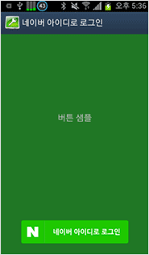

# Android

<html lang="ko">
<head>
    <title>NAVER Developers - 네이버아이디로로그인 안드로이드 개발가이드</title>
    <meta name="description" content="NAVER Developers - 네이버아이디로로그인 안드로이드 개발가이드">
</head>
<body>

    

        

    

    
Android용 네이버 아이디로 로그인 라이브러리는 서드파티 애플리케이션에서 네이버 아이디로 로그인이 제공하는 로그인, 로그아웃, 토큰 관리 등의 기능을 쉽게 구현할 수 있게 합니다.

     
    

        <a class="btn_b_hi3" href="/sdks/sdks.md">라이브러리 보기 &gt;</a>
        <a class="btn_b_hi3" href="https://developers.naver.com/apps/#/register?api=nvlogin">오픈 API 이용 신청 &gt;</a>
    

    <h3 class="h_sub">1. 요구 사항</h3>
    
네이버 아이디로 로그인 라이브러리를 사용하려면 다음과 같은 환경이 필요합니다.

    <ul class="list_type1">
        <li>SDK: Android API 15 이상</li>
        <li>JDK: JDK 8 이상</li>
	<li>IDE: Android Studio</li>
    </ul>
    

        <strong>참고</strong>
        
네이버 아이디로 로그인 라이브러리 3.x.x 버전은 OAuth 1.0a를 사용하고, 네이버 아이디로 로그인 라이브러리 4.x.x 버전은 OAuth 2.0을 사용합니다. 
        네이버 아이디로 로그인 라이브러리 3.x.x 버전을 사용하다 네이버 아이디로 로그인 라이브러리 4.x.x 버전으로 업그레이드할 때는 "3.x.x 버전에서 4.x.x 버전으로 업그레이드 방법"을 참고해서 개발합니다.

    

    <h3 class="h_sub">2. 라이브러리 구성</h3>
    
Android용 네이버 아이디로 로그인 라이브러리는 다음과 같이 이루어져 있으며 Github에서도 다운받을 수 있습니다. 프로젝트는 다음의 두 모듈로 구성되어 있습니다.

    <ul class="list_type1">
        <li>naveridlogin_android_sdk: 네이버 아이디로 로그인 라이브러리 aar파일이 있는 모듈</li>
        <li>naveridlogin_android_sample: 네이버 아이디로 로그인 라이브러리를 사용하는 예제 프로젝트 모듈</li>
    </ul>
    <h3 class="h_sub">3. 개발 환경 설정</h3>
    <h4 class="h_subsub">3.1. Maven repository 사용하기</h4>
    
gradle 스크립트에 아래와 같이 추가하시면 사용할 수 있습니다.

    

<pre class="prettyprint">&lt;!-- might use implementation in Android Studio 3.0(Gradle 4.1) --&gt;
compile ('com.naver.nid:naveridlogin-android-sdk:4.2.6')
</pre>
    

    
네이버 로그인 SDK에서 사용하는 라이브러리는 다음과 같습니다. 필요에 따라 exclude 하여 사용하시면 됩니다.

    

<pre class="prettyprint">compile 'com.android.support:appcompat-v7:28.0.0'
compile 'com.android.support:support-core-utils:28.0.0'
compile 'com.android.support:customtabs:28.0.0'
compile 'com.android.support:support-v4:28.0.0'
</pre>
    

    <h4 class="h_subsub">3.2. Gradle 에서 설정</h4>
    <ul class="list_type1">
        <li>Android 프로젝트의 libs 폴더 밑에 naveridlogin_android_sdk_4.2.6.aar 파일을 복사합니다.</li>
        <li>프로젝트의 build.gradle에 다음과 같이 추가합니다.</li>
    </ul>
    

<pre class="prettyprint">dependencies {
  &lt;!-- might use implementation in Android Studio 3.0(Gradle 4.1) --&gt;
  compile files('libs/naveridlogin_android_sdk_4.2.6.aar')
 
  compile 'com.android.support:appcompat-v7:28.0.0'
  compile 'com.android.support:support-core-utils:28.0.0'
  compile 'com.android.support:customtabs:28.0.0'
  compile 'com.android.support:support-v4:28.0.0'
}
</pre>
    

    <h4 class="h_subsub">3.3. Android Studio 프로젝트 설정</h4>
    <ul class="list_type1">
        <li>[file]-[project structure] 실행</li>
        <li>좌측 상단의 + 버튼 클릭</li>
        <li>jar/aar 모듈 추가 선택</li>
	<li>다운받은 naveridlogin_android_sdk_4.2.6.aar 선택</li>
	<li>프로젝트 build.gradle에 다음과 같이 추가</li>
    </ul>
    

<pre class="prettyprint">dependencies {
  &lt;!-- might use implementation in Android Studio 3.0(Gradle 4.1) --&gt;
  compile project(path: ':naveridlogin_android_sdk_4.2.6')
 
  compile 'com.android.support:appcompat-v7:28.0.0'
  compile 'com.android.support:support-core-utils:28.0.0'
  compile 'com.android.support:customtabs:28.0.0'
  compile 'com.android.support:support-v4:28.0.0'
}
</pre>
    

    <h4 class="h_subsub">3.4. ProGuard 적용 제외 설정</h4>
    
네이버 아이디로 로그인 라이브러리는 ProGuard로 코드 난독화를 적용하면 안 됩니다. 네이버 아이디로 로그인 라이브러리를 사용하는 애플리케이션을 .apk 파일로 빌드할 때 ProGuard를 적용한다면, 다음과 같이 proguard-project.txt 파일을 수정해 ProGuard 적용 대상에서 네이버 아이디로 로그인 라이브러리 파일을 제외합니다. 라이브러리 파일의 이름과 폴더는 버전이나 개발 환경에 따라 다를 수 있습니다.

    

<pre class="prettyprint">-keep public class com.nhn.android.naverlogin.** {
       public protected *;
}
</pre>
    

    <h3 class="h_sub">4. 초기화</h3>
    
네이버 아이디로 로그인 라이브러리를 애플리케이션에 적용하려면 다음과 같은 코드를 추가해 네이버 아이디로 로그인 인스턴스를 초기화합니다.

    

<pre class="prettyprint">mOAuthLoginModule = OAuthLogin.getInstance();
mOAuthLoginModule.init(
	OAuthSampleActivity.this
	,OAUTH_CLIENT_ID
	,OAUTH_CLIENT_SECRET
	,OAUTH_CLIENT_NAME
	//,OAUTH_CALLBACK_INTENT
	// SDK 4.1.4 버전부터는 OAUTH_CALLBACK_INTENT변수를 사용하지 않습니다.
);
</pre>
    

    <ul class="list_type1">
        <li>OAUTH_CLIENT_ID: 애플리케이션 등록 후 발급받은 클라이언트 아이디</li>
        <li>OAUTH_CLIENT_SECRET: 애플리케이션 등록 후 발급받은 클라이언트 시크릿</li>
        <li>OAUTH_CLIENT_NAME: 네이버 앱의 로그인 화면에 표시할 애플리케이션 이름. 모바일 웹의 로그인 화면을 사용할 때는 서버에 저장된 애플리케이션 이름이 표시됩니다.</li>
    </ul>
    

        <em class="warning"><i class="xi-info-suqare"></i>주의</em>
        
4.1.3 이하 버전의 SDK를 적용한 경우 OAUTH_CALLBACK_INTENT변수를 추가하여 초기화 해야합니다.

    

    

        <strong>참고</strong>
        
OAuthLogin.init() 메서드가 여러 번 실행돼도 기존에 저장된 접근 토큰(access token)과 갱신 토큰(refresh token)은 삭제되지 않습니다. 
        기존에 저장된 접근 토큰과 갱신 토큰을 삭제하려면 OAuthLogin.logout() 메서드나 OAuthLogin.logoutAndDeleteToken() 메서드를 호출합니다.

    

    <h3 class="h_sub">5. 로그인</h3>
    
로그인은 두 가지 방법으로 구현합니다. 첫 번째는 OAuthLoginButton 객체로 네이버 아이디로 로그인 버튼을 레이아웃에 추가하는 방법이고, 두 번째는 OAuthLogin.startOAuthLoginActivity() 메서드를 직접 실행하는 방법입니다.

    

        
    

    <h4 class="h_subsub">5.1. OAuthLoginButton 객체로 버튼 추가</h4>
    
OAuthLoginButton 객체로 네이버 아이디로 로그인 버튼을 추가하는 방법은 다음과 같습니다.

    <ul class="list_type1">
        <li>레이아웃 파일에 다음과 같은 구문을 추가합니다.
            

<pre class="prettyprint">&lt;com.nhn.android.naverlogin.ui.view.OAuthLoginButton
      android:id="@+id/buttonOAuthLoginImg"
      android:layout_width="wrap_content"
      android:layout_height="50dp" /&gt;
</pre>
            

        </li>
        <li>액티비티에 로그인이 종료되었을 때 실행할 OAuthLoginHandler 클래스와 배경 타입을 등록하는 코드를 추가합니다.
            

<pre class="prettyprint">mOAuthLoginButton = (OAuthLoginButton) findViewById(R.id.buttonOAuthLoginImg);
mOAuthLoginButton.setOAuthLoginHandler(mOAuthLoginHandler);
mOAuthLoginButton.setBgResourceId(R.drawable.img_loginbtn_usercustom);
</pre>
            

        </li>
    </ul>
    

        <em class="warning"><i class="xi-info-suqare"></i>주의</em>
        
OAuthLoginButton 객체를 이용할 때 네이버 아이디로 로그인 버튼의 디자인은 반드시 네이버 아이디로 로그인 버튼 사용 가이드를 따라야 합니다.

        
<a class="color_p2 underline" href="/bi/bi.md">네이버 아이디로 로그인 버튼 사용 가이드 &gt;</a>

    

    <h4 class="h_subsub">5.2. startOAuthLoginActivity() 메서드를 이용한 로그인</h4>
    
OAuthLogin.startOAuthLoginActivity() 메서드를 직접 실행해 로그인하면 먼저 갱신 토큰이 있는지 확인합니다.

    <ul class="list_type1">
        <li>갱신 토큰이 있으면 접근 토큰의 갱신을 시도합니다. 
            − 갱신에 성공하면 OAuthLoginHandler 객체가 호출됩니다. 
            − 갱신에 실패하면 로그인 창이 나타납니다.
        </li>
        <li>갱신 토큰이 없으면 로그인 창이 나타납니다.</li>
        <li>
            * 접근 토큰 갱신 관련 주의: 접근토큰은 일정 시간(현재 1시간)이 지나면 만료되기 때문에 만료시간이 지난 경우 refreshAccessToken() 을 호출해서 access token 을 갱신해줘야 합니다.
             또한 refreshAccessToken() 을 사용하시는 경우 메쏘드의 실행이 끝나면 access token 을 받을 수 있기 때문에 좀 더 편리하게 개발하실 수 있습니다.
        </li>
    </ul>
    
로그인 창에서 로그인이 완료되거나 취소될 때에도 OAuthLoginHandler가 호출됩니다. 다음은 OAuthLogin.startOAuthLoginActivity() 메서드를 이용한 로그인을 구현한 예제입니다.

    

<pre class="prettyprint">/**
* OAuthLoginHandler를 startOAuthLoginActivity() 메서드 호출 시 파라미터로 전달하거나 OAuthLoginButton 객체에 등록하면 인증이 종료되는 것을 확인할 수 있습니다.
*/
private OAuthLoginHandler mOAuthLoginHandler = new OAuthLoginHandler() {
      @Override
      public void run(boolean success) {
             if (success) {
                   String accessToken = mOAuthLoginModule.getAccessToken(mContext);
                   String refreshToken = mOAuthLoginModule.getRefreshToken(mContext);
                   long expiresAt = mOAuthLoginModule.getExpiresAt(mContext);
                   String tokenType = mOAuthLoginModule.getTokenType(mContext);
                   mOauthAT.setText(accessToken);
                   mOauthRT.setText(refreshToken);
                   mOauthExpires.setText(String.valueOf(expiresAt));
                   mOauthTokenType.setText(tokenType);
                   mOAuthState.setText(mOAuthLoginModule.getState(mContext).toString());
             } else {
                   String errorCode = mOAuthLoginModule.getLastErrorCode(mContext).getCode();
                   String errorDesc = mOAuthLoginModule.getLastErrorDesc(mContext);
                   Toast.makeText(mContext, "errorCode:" + errorCode
                         + ", errorDesc:" + errorDesc, Toast.LENGTH_SHORT).show();
             }
      };
};
 
mOAuthLoginModule.startOauthLoginActivity(mContext, mOAuthLoginHandler);
</pre>
    

    

        <strong>약전계에서 로그인 호출 시</strong>
        
약전계에서 로그인 과정을 진행할 때는 로그인 방법에 따라 다음과 같이 오류를 반환받습니다.

        <ul class="list_type1">
            <li>웹뷰에서 로그인할 때는 웹뷰에 웹 페이지를 표시할 수 없다는 오류 화면이 나타납니다. 이때 사용자가 뒤로 가기 버튼을 누르거나 닫기 버튼을 눌러 애플리케이션으로 돌아오면 OAuthErrorCode.CLIENT_USER_CANCEL 오류를 반환받습니다.</li>
            <li>네이버 앱으로 로그인 과정을 진행하거나 백그라운드에서 토큰을 갱신하고 있는 등 HttpClient 객체를 사용할 때는 타임아웃 시간(최대 10초)이 지나 호출이 실패하면 OAuthErrorCode.CLIENT_ERROR_CONNECTION_ERROR 오류를 반환받습니다.</li>
        </ul>
    

    <h3 class="h_sub">6. 접근 토큰 얻기</h3>
    
로그인에 성공했을 때는 OAuthLogin.getAccessToken() 메서드로 접근 토큰 정보를 얻을 수 있습니다. 로그인에 실패했다면 OAuthLogin.getLastErrorCode() 메서드나 OAuthLogin.getLastErrorDesc() 메서드로 실패 이유와 에러 코드를 얻을 수 있습니다.

    <h3 class="h_sub">7. 로그아웃</h3>
    
애플리케이션에서 로그아웃할 때는 다음과 같이 OAuthLogin.logout() 메서드를 호출합니다.

    

        <pre class="prettyprint">mOAuthLoginModule.logout(mContext);</pre>
    

    
OAuthLogin.logout() 메서드가 호출되면 클라이언트에 저장된 토큰이 삭제되고 OAuthLogin.getState() 메서드가 OAuthLoginState.NEED_LOGIN 값을 반환합니다.

    

        <strong>약전계에서 로그아웃 호출 시</strong>
        
저장된 토큰만 삭제하므로 약전계나 네트워크 오류에 영향을 받지 않습니다.

    

    <h3 class="h_sub">8. 연동 해제</h3>
    

        네이버 아이디와 애플리케이션의 연동을 해제하는 기능은 다음과 같이 OAuthLogin.logoutAndDeleteToken() 메서드로 구현합니다.
        연동을 해제하면 클라이언트에 저장된 토큰과 서버에 저장된 토큰이 모두 삭제됩니다. 네트워크를 이용하므로 AsyncTask 등으로 스레드를 새로 생성해 호출합니다.
    

    

<pre class="prettyprint">boolean isSuccessDeleteToken = mOAuthLoginInstance.logoutAndDeleteToken(mContext);
 
if (!isSuccessDeleteToken) {
      // 서버에서 토큰 삭제에 실패했어도 클라이언트에 있는 토큰은 삭제되어 로그아웃된 상태입니다.
      // 클라이언트에 토큰 정보가 없기 때문에 추가로 처리할 수 있는 작업은 없습니다.
      Log.d(TAG, "errorCode:" + mOAuthLoginInstance.getLastErrorCode(mContext));
      Log.d(TAG, "errorDesc:" + mOAuthLoginInstance.getLastErrorDesc(mContext));
}
</pre>
    

    
연동이 해제된 것은 PC에서 네이버의 내정보 &gt; 보안설정 &gt; 외부 사이트 연결 페이지에 접속해 외부사이트 → 네이버에서 연결 정보 삭제 여부로 확인할 수 있습니다.

    

        <strong>약전계에서 연동 해제 시</strong>
        

            OAuthLogin.logoutAndDeleteToken() 메서드로 연동을 해제할 때는 클라이언트에 저장된 토큰과 서버에 저장된 토큰을 모두 삭제합니다. 이때 네트워크 오류가 발생하면 서버 호출에 실패하기 때문에 서버에 저장된 토큰을 삭제하지 못할 수 있습니다.
            PC에서 네이버의 내정보 &gt; 보안설정 &gt; 외부 사이트 연결 페이지에 접속해 외부사이트 → 네이버에서 확인했을 때 연결 정보가 삭제되지 않은 채로 남아 있을 수 있습니다.
        

    

    <h3 class="h_sub">9. 오픈 API 호출</h3>
    
접근 토큰으로 오프API와 같이 제한된 리소스에 접근할 때는 OAuthLogin.requestApi() 메서드를 사용합니다.

    

        <pre class="prettyprint">mOAuthLoginModule.requestApi(mContext, accessToken, url);</pre>
    

    <h3 class="h_sub">10. SDK 버전 업그레이드 가이드</h3>
    <h4 class="h_subsub">10.1. SDK 4.1.X 버전에서 4.2.0 버전으로 업그레이드 방법</h4>
    <ul class="list_type1">
        <li>depedency 설정 변경 배포하는 아카이브 타입이 jar에서 aar로 변경됨에 따라 3의 개발환경 구축 가이드에 따라 변경해야 합니다.</li>
        <li>Manifest 변경 aar로 배포함에 따라 Manifest 설정이 아카이브에 포함됩니다. 기존에 Manifest에 설정한 정보들은 모두 삭제합니다.</li>
        <li>proguard 변경 기존에 proguard에 아래의 설정은 삭제합니다.</li>
    </ul>
    

        <pre class="prettyprint">-libraryjars ../PORJECT_NAME/libs/naveroauthloginlib-4.x.x.jar</pre>
    

    <h3 class="h_sub">11. 기타 설정</h3>
    <h4 class="h_subsub">11.1. 로그 설정</h4>
    

      Android의 logcat 로그에 네이버 아이디로 로그인 로그를 확인할 수 있게 하려면 OAuthLogin 객체에서 showDevelopersLog 메소드를 통해 설정합니다.
      네이버 아이디로 로그인 라이브러리가 출력하는 logcat 로그의 접두어는 NaverLoginOAuth입니다.
    

    

      <pre class="prettyprint">mOAuthLoginInstance.showDevelopersLog(true);
      </pre>
    

    

        <em class="warning"><i class="xi-info-suqare"></i>주의</em>
        
로그 출력이 활성화되면 토큰 등의 민감한 정보가 로그에 표시되기 때문에 배포 버전에는 로그를 남기도록 않도록 false로 설정합니다.

    

    <h4 class="h_subsub">11.2. 문구 변경</h4>
    

        다국어 지원 등으로 대화 상자에 나타나는 문구를 변경하려면 다음 예제와 같이 리소스 파일 (예: res/value/message.xml)을 덮어 쓸 수 있습니다.
    

    

<pre class="prettyprint">&lt;resources&gt;
      &lt;string name="naveroauthlogin_string_getting_token"&gt;Receiving access token..&lt;/string&gt;
&lt;/resources&gt;
</pre>
    

    

        설정 가능한 리소스 이름은 다음과 같습니다.
    

    <table class="tbl_h" border="1">
        <caption>리소스 설명 표</caption>
        <colgroup>
            <col style="width:50%"><col>
        </colgroup>
        <thead>
        <tr>
            <th scope="col">리소스 명</th>
            <th scope="col">기본 설정</th>
        </tr>
        </thead>
        <tbody>
        <tr class="big">
            <td class="left">use_application</td>
            <td class="left">사용할 어플리케이션</td>
        </tr>
        <tr class="big">
            <td class="left">retry</td>
            <td class="left">재시도</td>
        <tr>
        <tr class="big">
            <td class="left">naveroauthlogin_string_getting_token</td>
            <td class="left">네이버 아이디로 로그인 중입니다.</td>
        <tr>
        <tr class="big">
            <td class="left">naveroauthlogin_string_network_state_not_available</td>
            <td class="left">네트워크에 접속할 수 없습니다. 네트워크 연결상태를 확인해 주세요.</td>
        <tr>
        <tr class="big">
            <td class="left">naveroauthlogin_string_group_id_not_available</td>
            <td class="left">단체아이디는 네이버 아이디로 로그인이 지원되지 않습니다. 개인아이디로 로그인 해 주세요.</td>
        <tr>
        <tr class="big">
            <td class="left">naveroauthlogin_string_update_naverapp</td>
            <td class="left">네이버 앱 업데이트 후 이용할 수 있는 서비스입니다.</td>
        <tr>
        </tbody>
    </table>
    <h3 class="h_sub">12. 네이버 아이디로 로그인 라이브러리 API</h3>
    <h4 class="h_subsub">12.1. OAuthErrorCode</h4>
    

        OAuth 인증 과정 중 발생할 수 있는 오류의 에러 코드를 가지고 있는 enum 타입의 클래스.
        "The OAuth 2.0 Authorization Framework" 문서 의 '4.1.2.1. Error Response'에서 제시하는 오류 유형에 해당하는 에러 코드를 가지고 있습니다.
        OAuthErrorCode 클래스에 있는 에러 코드는 다음과 같습니다.
        'SERVER_ERROR_'로 시작하는 에러 코드는 서버에서 발생하는 오류의 에러 코드입니다.
        'CLIENT_ERROR_'로 시작하는 에러 코드는 애플리케이션에서 발행하는 오류의 에러 코드입니다.
        'ACTIVITY_IS_SINGLE_TASK'는 개발자 설정의 활동 보관 안 함 설정에 관련된 에러 코드입니다.
    

    <ul class="list_type1">
        <li>NONE</li>
        <li>SERVER_ERROR_INVALID_REQUEST</li>
        <li>SERVER_ERROR_UNAUTHORIZED_CLIENT</li>
        <li>SERVER_ERROR_ACCESS_DENIED</li>
        <li>SERVER_ERROR_UNSUPPORTED_RESPONSE_TYPE</li>
        <li>SERVER_ERROR_INVALID_SCOPE</li>
        <li>SERVER_ERROR_SERVER_ERROR</li>
        <li>SERVER_ERROR_TEMPORARILY_UNAVAILABLE</li>
        <li>ERROR_NO_CATAGORIZED</li>
        <li>CLIENT_ERROR_PARSING_FAIL</li>
        <li>CLIENT_ERROR_NO_CLIENTID</li>
        <li>CLIENT_ERROR_NO_CLIENTSECRET</li>
        <li>CLIENT_ERROR_NO_CLIENTNAME</li>
        <li>CLIENT_ERROR_NO_CALLBACKURL</li>
        <li>CLIENT_ERROR_CONNECTION_ERROR</li>
        <li>CLIENT_ERROR_CERTIFICATION_ERROR</li>
        <li>CLIENT_USER_CANCEL</li>
        <li>ACTIVITY_IS_SINGLE_TASK</li>
    </ul>
    
OAuthErrorCode 클래스의 메서드는 다음과 같습니다.

    <ul class="list_type1">
        <li>getCode()</li>
        <li>getDesc()</li>
    </ul>
    
12.1.1. getCode()

    

        <strong>설명</strong> 
        에러 코드를 반환합니다.
    

    
<strong>구문</strong>

    

        <pre class="prettyprint">public String getCode();</pre>
    

    

        <strong>파라미터</strong> 
        없음
    

    

        <strong>반환값</strong> 
        에러 코드
    

    

        <strong>코드 예</strong> 
        없음
    

    
12.1.2. getDesc()

    

        <strong>설명</strong> 
        오류에 대한 설명을 반환합니다.
    

    
<strong>구문</strong>

    

        <pre class="prettyprint">public String getDesc()</pre>
    

    

        <strong>파라미터</strong> 
        없음
    

    

        <strong>반환값</strong> 
        오류에 대한 설명
    

    

        <strong>코드 예</strong> 
        없음
    

    <h4 class="h_subsub">12.2. OAuthLogin</h4>
    
네이버 아이디로 로그인의 모든 연산을 수행하는 클래스.

    
OAuthLogin 클래스의 메서드는 다음과 같습니다.

    <ul class="list_type1">
        <li>getAccessToken()</li>
        <li>getExpiresAt()</li>
        <li>getInstance()</li>
        <li>getLastErrorCode()</li>
        <li>getLastErrorDesc()</li>
        <li>getRefreshToken()</li>
        <li>getState()</li>
        <li>getTokenType()</li>
        <li>getVersion()</li>
        <li>init()</li>
        <li>logout()</li>
        <li>logoutAndDeleteToken()</li>
        <li>refreshAccessToken()</li>
        <li>requestApi()</li>
        <li>startOAuthLoginActivity()</li>
    </ul>
    
12.2.1. getAccessToken()

    

        <strong>설명</strong> 
        로그인 결과로 얻은 접근 토큰(access token)을 반환합니다.
    

    
<strong>구문</strong>

    

        <pre class="prettyprint">public String getAccessToken(Context context);</pre>
    

    
<strong>파라미터</strong>

    <table border="1" class="tbl_h">
        <caption>파라미터 설명 표</caption>
        <colgroup>
            <col style="width:15%"><col style="width:15%"><col style="width:15%"><col>
        </colgroup>
        <thead>
        <tr>
            <th scope="col">파라미터</th>
            <th scope="col">타입</th>
            <th scope="col">필수 여부</th>
            <th scope="col">설명</th>
        </tr>
        </thead>
        <tbody>
        <tr class="big">
            <td class="left">context</td>
            <td class="center">Context</td>
            <td class="center">Y</td>
            <td class="left">Shared preference에 접근하기 위한 Context 객체</td>
        </tr>
        </tbody>
    </table>
    

        <strong>반환값</strong> 
        접근 토큰
    

    
<strong>코드 예</strong>

    

<pre class="prettyprint">String at = mOAuthLoginInstance.getAccessToken(mContext);
return mOAuthLoginInstance.requestApi(mContext, at, url);
</pre>
    

    
12.2.2. getExpiresAt()

    

        <strong>설명</strong> 
        접근 토큰(access token)의 만료 시간을 반환합니다.
    

    
<strong>구문</strong>

    

        <pre class="prettyprint">public long getExpiresAt(Context context);</pre>
    

    
<strong>파라미터</strong>

    <table border="1" class="tbl_h">
        <caption>파라미터 설명 표</caption>
        <colgroup>
            <col style="width:15%"><col style="width:15%"><col style="width:15%"><col>
        </colgroup>
        <thead>
        <tr>
            <th scope="col">파라미터</th>
            <th scope="col">타입</th>
            <th scope="col">필수 여부</th>
            <th scope="col">설명</th>
        </tr>
        </thead>
        <tbody>
        <tr class="big">
            <td class="left">context</td>
            <td class="center">Context</td>
            <td class="center">Y</td>
            <td class="left">Shared preference에 접근하기 위한 Context 객체</td>
        </tr>
        </tbody>
    </table>
    

        <strong>반환값</strong> 
        타임스탬프(단위: 초)
    

    
<strong>코드 예</strong>

    

        <pre class="prettyprint">Log.d(TAG, "DEBUG expires at : " + OAuthLogin.getInstance().getExpiresAt(mContext));</pre>
    

    
12.2.3. getInstance()

    

        <strong>설명</strong> 
        네이버 아이디로 로그인 인스턴스(싱글턴 인스턴스)를 얻습니다.
    

    
<strong>구문</strong>

    

        <pre class="prettyprint">public static OAuthLogin getInstance();</pre>
    

    

        <strong>파라미터</strong> 
        OAuthLogin 객체. 싱글턴 패턴을 이용해 OAuthLogin 객체를 새로 생성해 반환하거나 기존에 생성했던 객체를 반환합니다.
    

    

        <strong>반환값</strong> 
        오류에 대한 설명
    

    
<strong>코드 예</strong>

    

        <pre class="prettyprint">mOAuthLoginInstance = OAuthLogin.getInstance();</pre>
    

    
12.2.4. getLastErrorCode()

    

        <strong>설명</strong> 
        마지막으로 실패한 로그인의 에러 코드를 반환합니다.
    

    
<strong>구문</strong>

    

        <pre class="prettyprint">public OAuthErrorCode getLastErrorCode(Context context);</pre>
    

    
<strong>파라미터</strong>

    <table border="1" class="tbl_h">
        <caption>파라미터 설명 표</caption>
        <colgroup>
            <col style="width:15%"><col style="width:15%"><col style="width:15%"><col>
        </colgroup>
        <thead>
        <tr>
            <th scope="col">파라미터</th>
            <th scope="col">타입</th>
            <th scope="col">필수 여부</th>
            <th scope="col">설명</th>
        </tr>
        </thead>
        <tbody>
        <tr class="big">
            <td class="left">context</td>
            <td class="center">Context</td>
            <td class="center">Y</td>
            <td class="left">Shared preference에 접근하기 위한 Context 객체</td>
        </tr>
        </tbody>
    </table>
    

        <strong>반환값</strong> 
        OAuthErrorCode 타입의 에러 코드. OAuthErrorCode 클래스에 관한 자세한 내용은 "OAuthErrorCode"를 참고합니다.
    

    
<strong>코드 예</strong>

    

<pre class="prettyprint">String errorCode = OAuthLogin.getInstance().getLastErrorCode(mContext).getCode();
String errorDesc = OAuthLogin.getInstance().getLastErrorDesc(mContext);
Toast.makeText(mContext, "errorCode:" + errorCode + ", errorDesc:" + errorDesc, Toast.LENGTH_SHORT).show();
</pre>
    

    
12.2.5. getLastErrorDesc()

    

        <strong>설명</strong> 
        마지막으로 실패한 로그인의 에러 메시지를 반환합니다.
    

    
<strong>구문</strong>

    

        <pre class="prettyprint">public String getLastErrorDesc(Context context);</pre>
    

    

        <strong>파라미터</strong> 
        context Shared preference에 접근하기 위한 Context 객체
    

    

        <strong>반환값</strong> 
        에러 메시지
    

    
<strong>코드 예</strong>

    

<pre class="prettyprint">String errorCode = OAuthLogin.getInstance().getLastErrorCode(mContext).getCode();
String errorDesc = OAuthLogin.getInstance().getLastErrorDesc(mContext);
Toast.makeText(mContext, "errorCode:" + errorCode + ", errorDesc:" + errorDesc, Toast.LENGTH_SHORT).show();
</pre>
    

    
12.2.6. getRefreshToken()

    

        <strong>설명</strong> 
        로그인 결과로 얻은 갱신 토큰(refresh token)을 반환합니다.
    

    
<strong>구문</strong>

    

        <pre class="prettyprint">public String getRefreshToken();</pre>
    

    

        <strong>파라미터</strong> 
        없음
    

    

        <strong>반환값</strong> 
        갱신 토큰
    

    
<strong>코드 예</strong>

    

        <pre class="prettyprint">Log.d(TAG, "DEBUG refresh token : " + OAuthLogin.getInstance().getRefreshToken(mContext));</pre>
    

    
12.2.7. getState()

    

        <strong>설명</strong> 
        네이버 아이디로 로그인 인스턴스의 현재 상태를 반환합니다.
    

    
<strong>구문</strong>

    

        <pre class="prettyprint">public OAuthLoginState getState(Context context)</pre>
    

    
<strong>파라미터</strong>

    <table border="1" class="tbl_h">
        <caption>파라미터 설명 표</caption>
        <colgroup>
            <col style="width:15%"><col style="width:15%"><col style="width:15%"><col>
        </colgroup>
        <thead>
        <tr>
            <th scope="col">파라미터</th>
            <th scope="col">타입</th>
            <th scope="col">필수 여부</th>
            <th scope="col">설명</th>
        </tr>
        </thead>
        <tbody>
        <tr class="big">
            <td class="left">context</td>
            <td class="center">Context</td>
            <td class="center">Y</td>
            <td class="left">Shared preference에 접근하기 위한 Context 객체</td>
        </tr>
        </tbody>
    </table>
    

        <strong>반환값</strong> 
        OAuthLoginState 타입의 에러 메시지(예: OAuthLoginState.NEED_INIT, OAuthLoginState.NEED_LOGIN, OAuthLoginState.OK). OAuthLoginState 클래스에 관한 자세한 내용은 "오류! 책갈피가 자신을 참조하고 있습니다."를 참고합니다.
    

    
<strong>코드 예</strong>

    

<pre class="prettyprint">if (OAuthLoginState.OK.equals(OAuthLogin.getInstance().getState(this))) {
    // access token 이 있는 상태로 로그인 버튼 안보여 줌
} else {
    showNaverLoginButton();
}
</pre>
    

    
12.2.8. getTokenType()

    

        <strong>설명</strong> 
        로그인 결과로 얻은 토큰의 타입을 반환합니다.
    

    
<strong>구문</strong>

    

        <pre class="prettyprint">public String getTokenType(Context context);</pre>
    

    
<strong>파라미터</strong>

    <table border="1" class="tbl_h">
        <caption>파라미터 설명 표</caption>
        <colgroup>
            <col style="width:15%"><col style="width:15%"><col style="width:15%"><col>
        </colgroup>
        <thead>
        <tr>
            <th scope="col">파라미터</th>
            <th scope="col">타입</th>
            <th scope="col">필수 여부</th>
            <th scope="col">설명</th>
        </tr>
        </thead>
        <tbody>
        <tr class="big">
            <td class="left">context</td>
            <td class="center">Context</td>
            <td class="center">Y</td>
            <td class="left">Shared preference에 접근하기 위한 Context 객체</td>
        </tr>
        </tbody>
    </table>
    

        <strong>반환값</strong> 
        토큰의 타입
    

    
<strong>코드 예</strong>

    

        <pre class="prettyprint">Log.d(TAG, "DEBUG token type : " + OAuthLogin.getInstance().getTokenType(mContext));</pre>
    

    
12.2.9. getVersion()

    

        <strong>설명</strong> 
        네이버 아이디로 로그인 라이브러리의 버전을 반환합니다.
    

    
<strong>구문</strong>

    

        <pre class="prettyprint">public static String getVersion ();</pre>
    

    

        <strong>파라미터</strong> 
        없음
    

    

        <strong>반환값</strong> 
        '4.x.x' 형식으로 된 문자열
    

    

        <strong>코드 예</strong> 
        없음
    

    
12.2.10. init()

    

        <strong>설명</strong> 
        네이버 아이디로 로그인 인스턴스에 클라이언트 정보를 설정합니다.
    

    
<strong>구문</strong>

    

        <pre class="prettyprint">public void init(Context context, String clientId, String clientSecret, String clientName, String callbackIntent);</pre>
    

    
<strong>파라미터</strong>

    <table border="1" class="tbl_h">
        <caption>파라미터 설명 표</caption>
        <colgroup>
            <col style="width:15%"><col style="width:15%"><col style="width:15%"><col>
        </colgroup>
        <thead>
        <tr>
            <th scope="col">파라미터</th>
            <th scope="col">타입</th>
            <th scope="col">필수 여부</th>
            <th scope="col">설명</th>
        </tr>
        </thead>
        <tbody>
        <tr class="big">
            <td class="left">context</td>
            <td class="center">Context</td>
            <td class="center">Y</td>
            <td class="left">sharedPreference 객체를 얻을 때 사용할 Context 객체</td>
        </tr>
        <tr class="big">
            <td class="left">clientId</td>
            <td class="center">String</td>
            <td class="center">Y</td>
            <td class="left">애플리케이션 등록 후 발급받은 클라이언트 아이디</td>
        </tr>
        <tr class="big">
            <td class="left">clientSecret</td>
            <td class="center">String</td>
            <td class="center">Y</td>
            <td class="left">애플리케이션 등록 후 발급받은 클라이언트 시크릿</td>
        </tr>
        <tr class="big">
            <td class="left">clientName</td>
            <td class="center">String</td>
            <td class="center">Y</td>
            <td class="left">네이버 앱의 로그인 화면에 표시할 애플리케이션 이름. 모바일 웹의 로그인 화면을 사용할 때는 서버에 저장된 애플리케이션 이름이 표시됩니다.</td>
        </tr>
        <tr class="big">
            <td class="left">callbackIntent</td>
            <td class="center">String</td>
            <td class="center">Y</td>
            <td class="left">Deprecated.(SDK 4.1.4 이상에서는 사용되지 않습니다.) 애플리케이션을 등록할 때 안드로이드 Intent에 설정한 값</td>
        </tr>
        </tbody>
    </table>
    

        <strong>반환값</strong> 
        없음
    

    
<strong>코드 예</strong>

    

        <pre class="prettyprint">mOAuthLoginInstance = OAuthLogin.getInstance();</pre>
    

    
12.2.11. logout()

    

        <strong>설명</strong> 
        클라이언트에 저장된 접근 토큰(access token)과 갱신 토큰(refresh token)을 삭제합니다.
    

    
<strong>구문</strong>

    

        <pre class="prettyprint">public void logout(Context context);</pre>
    

    
<strong>파라미터</strong>

    <table border="1" class="tbl_h">
        <caption>파라미터 설명 표</caption>
        <colgroup>
            <col style="width:15%"><col style="width:15%"><col style="width:15%"><col>
        </colgroup>
        <thead>
        <tr>
            <th scope="col">파라미터</th>
            <th scope="col">타입</th>
            <th scope="col">필수 여부</th>
            <th scope="col">설명</th>
        </tr>
        </thead>
        <tbody>
        <tr class="big">
            <td class="left">context</td>
            <td class="center">Context</td>
            <td class="center">Y</td>
            <td class="left">Shared preference에 접근하기 위한 Context 객체</td>
        </tr>
        </tbody>
    </table>
    

        <strong>반환값</strong> 
        없음
    

    
<strong>코드 예</strong>

    

<pre class="prettyprint">case R.id.buttonOAuthLogout: {
    OAuthLogin.getInstance().logout(mContext);
    updateView();
    break;
}
</pre>
    

    
12.2.12. logoutAndDeleteToken()

    

        <strong>설명</strong> 
        클라이언트와 서버에 저장된 접근 토큰(access token)과 갱신 토큰(refresh token)을 삭제해 애플리케이션과 네이버 아이디의 연동을 해제합니다.
    

    
<strong>구문</strong>

    

        <pre class="prettyprint">public boolean logoutAndDeleteToken();</pre>
    

    

        <strong>파라미터</strong> 
        없음
    

    

        <strong>반환값</strong> 
        연동 해제 성공 여부
    

    <ul class="list_type1">
        <li>true: 연동 해제 성공</li>
        <li>false: 서버에 저장된 토큰을 삭제하지 못하고 클라이언트의 토큰만 삭제되어 연동 해제에 실패</li>
    </ul>
    
<strong>코드 예</strong>

    

<pre class="prettyprint">private class DeleteTokenTask extends AsyncTask&lt;Void, Void, Void&gt; {
    @Override
    protected Void doInBackground(Void... params) {
        boolean isSuccessDeleteToken = mOAuthLoginInstance.logoutAndDeleteToken(mContext);
 
        if (!isSuccessDeleteToken) {
            // 서버에서 토큰 삭제에 실패했어도 클라이언트에 있는 토큰은 삭제되어 로그아웃된 상태입니다.
            // 클라이언트에 토큰 정보가 없기 때문에 추가로 처리할 수 있는 작업은 없습니다.
            Log.d(TAG, "errorCode:" + mOAuthLoginInstance.getLastErrorCode(mContext));
            Log.d(TAG, "errorDesc:" + mOAuthLoginInstance.getLastErrorDesc(mContext));
        }
 
        return null;
    }
 
    protected void onPostExecute(Void v) {
        updateView();
    }
}
</pre>
    

    
12.2.13. refreshAccessToken()

    

        <strong>설명</strong> 
        클라이언트에 저장된 갱신 토큰(refresh token)을 이용해 접근 토큰(access token)을 갱신하고 갱신된 접근 토큰을 반환합니다.
    

    
<strong>구문</strong>

    

        <pre class="prettyprint">public OAuthLogin refreshAccessToken(Context context);</pre>
    

    
<strong>파라미터</strong>

    <table border="1" class="tbl_h">
        <caption>파라미터 설명 표</caption>
        <colgroup>
            <col style="width:15%"><col style="width:15%"><col style="width:15%"><col>
        </colgroup>
        <thead>
        <tr>
            <th scope="col">파라미터</th>
            <th scope="col">타입</th>
            <th scope="col">필수 여부</th>
            <th scope="col">설명</th>
        </tr>
        </thead>
        <tbody>
        <tr class="big">
            <td class="left">context</td>
            <td class="center">Context</td>
            <td class="center">Y</td>
            <td class="left">Shared preference에 접근하기 위한 Context 객체</td>
        </tr>
        </tbody>
    </table>
    
<strong>반환값</strong>

    <ul class="list_type1">
        <li>성공: 접근 토큰</li>
        <li>실패: null</li>
    </ul>
    
<strong>코드 예</strong>

    

<pre class="prettyprint">private class RefreshTokenTask extends AsyncTask&lt;Void, Void, String&gt; {
    @Override
    protected String doInBackground(Void... params) {
        return OAuthLogin.getInstance().refreshAccessToken(mContext);
    }
 
    protected void onPostExecute(String res) {
        updateView();
    }
}
</pre>
    

    
12.2.14. requestApi()

    

        <strong>설명</strong> 
        GET 메서드로 API를 호출합니다. 성공하면 결과(content body)를 반환합니다.
    

    
<strong>구문</strong>

    

        <pre class="prettyprint">public String requestApi(Context context, String accessToken, String url);</pre>
    

    
<strong>파라미터</strong>

    <table border="1" class="tbl_h">
        <caption>파라미터 설명 표</caption>
        <colgroup>
            <col style="width:15%"><col style="width:15%"><col style="width:15%"><col>
        </colgroup>
        <thead>
        <tr>
            <th scope="col">파라미터</th>
            <th scope="col">타입</th>
            <th scope="col">필수 여부</th>
            <th scope="col">설명</th>
        </tr>
        </thead>
        <tbody>
        <tr class="big">
            <td class="left">context</td>
            <td class="center">Context</td>
            <td class="center">Y</td>
            <td class="left">Shared preference에 접근하기 위한 Context 객체</td>
        </tr>
        </tbody>
    </table>
    

        <strong>반환값</strong> 
        API 호출 결과
    

    <ul class="list_type1">
        <li>API 호출 성공: API 호출 결과(content body)</li>
        <li>API 호출 실패: null</li>
    </ul>
    
<strong>코드 예</strong>

    

<pre class="prettyprint">private class RequestApiTask extends AsyncTask&lt;Void, Void, String&gt;{
    @Override
    protected void onPreExecute() {
        mApiResultText.setText((String) "");
    }
 
    @Override
    protected String doInBackground(Void... params) {
        String url = "https://apis.naver.com/nidlogin/nid/getHashId_v2.xml";
        String at = mOAuthLoginInstance.getAccessToken(mContext);
        return mOAuthLoginInstance.requestApi(mContext, at, url);
    }
 
    protected void onPostExecute(String content) {
        mApiResultText.setText((String) content);
    }
}
</pre>
    

    
12.2.15. startOAuthLoginActivity()

    

        <strong>설명</strong> 
        로그인에 성공하면 접근 토큰(access token)과 갱신 토큰(refresh token)을 받아 옵니다.
    

    
<strong>구문</strong>

    

        <pre class="prettyprint">public void startOauthLoginActivity(Activity activity, OAuthLoginCallback oauthLoginCallback);</pre>
    

    
<strong>파라미터</strong>

    <table border="1" class="tbl_h">
        <caption>파라미터 설명 표</caption>
        <colgroup>
            <col style="width:20%"><col style="width:15%"><col style="width:15%"><col>
        </colgroup>
        <thead>
        <tr>
            <th scope="col">파라미터</th>
            <th scope="col">타입</th>
            <th scope="col">필수 여부</th>
            <th scope="col">설명</th>
        </tr>
        </thead>
        <tbody>
        <tr class="big">
            <td class="left">activity</td>
            <td class="center">Activity</td>
            <td class="center">Y</td>
            <td class="left">메서드를 실행하는 액티비티의 Context 객체</td>
        </tr>
        <tr class="big">
            <td class="left">oauthLoginCallback</td>
            <td class="center">OAuthLoginCallback</td>
            <td class="center">Y</td>
            <td class="left">로그인 결과를 받을 콜백 메서드</td>
        </tr>
        </tbody>
    </table>
    

        <strong>반환값</strong> 
        없음
    

    

        <strong>참고</strong>
        
접근 토큰이 유효하지 않아 API 호출이 실패했을 때(인증 실패) startOAuthLoginActivity() 메서드로 접근 토큰을 새로 받아 API를 다시 호출합니다. 단, API 인증에 실패했을 때에만 startOAuthLoginActivity() 메서드를 호출해야 합니다. 서버 오류 등으로 실패했을 때에 startOAuthLoginActivity() 메서드를 호출하면 재시도를 무한으로 반복할 수 있습니다. 재시도 횟수를 제한하는 로직을 추가하면 서비스를 더 안정적으로 제공할 수 있습니다.

    

    
<strong>코드 예</strong>

    

        <pre class="prettyprint">OAuthLogin.getInstance().startOauthLoginActivity(OAuthSampleActivity.this, mOAuthLoginHandler);</pre>
    

    <h4 class="h_subsub">12.3. OAuthLoginButton</h4>
    
네이버 아이디로 로그인 버튼 클래스. OAuthLoginButton 클래스의 메서드는 다음과 같습니다.

    <ul class="list_type1">
        <li>setBgResourceId()</li>
        <li>setOAuthLoginHandler()</li>
    </ul>
    
12.3.1. setBgResourceId()

    

        <strong>설명</strong> 
        버튼의 배경 이미지를 지정합니다. 지정하지 않으면 기본 이미지를 사용합니다.
    

    
<strong>구문</strong>

    

        <pre class="prettyprint">public void setBgResourceId(int resId);</pre>
    

    
<strong>파라미터</strong>

    <table border="1" class="tbl_h">
        <caption>파라미터 설명 표</caption>
        <colgroup>
            <col style="width:15%"><col style="width:15%"><col style="width:15%"><col>
        </colgroup>
        <thead>
        <tr>
            <th scope="col">파라미터</th>
            <th scope="col">타입</th>
            <th scope="col">필수 여부</th>
            <th scope="col">설명</th>
        </tr>
        </thead>
        <tbody>
        <tr class="big">
            <td class="left">activity</td>
            <td class="center">Activity</td>
            <td class="center">Y</td>
            <td class="left">메서드를 실행하는 액티비티의 Context 객체</td>
        </tr>
        <tr class="big">
            <td class="left">resId</td>
            <td class="center">int</td>
            <td class="center">Y</td>
            <td class="left">기본 배경 이미지 대신 사용할 이미지 리소스의 아이디</td>
        </tr>
        </tbody>
    </table>
    

        <strong>반환값</strong> 
        없음
    

    
<strong>코드 예</strong>

    

        <pre class="prettyprint">mOAuthLoginButton.setBgResourceId(R.drawable.img_naver_login_button);</pre>
    

    
12.3.2. setOAuthLoginHandler()

    

        <strong>설명</strong> 
        네이버 아이디로 로그인 버튼을 클릭해 로그인하는 경우 로그인 결과를 받을 핸들러를 지정합니다.
    

    
<strong>구문</strong>

    

        <pre class="prettyprint">public void setOAuthLoginHandler(OAuthLoginHandler oauthLoginHandler);</pre>
    

    
<strong>파라미터</strong>

    <table border="1" class="tbl_h">
        <caption>파라미터 설명 표</caption>
        <colgroup>
            <col style="width:20%"><col style="width:15%"><col style="width:15%"><col>
        </colgroup>
        <thead>
        <tr>
            <th scope="col">파라미터</th>
            <th scope="col">타입</th>
            <th scope="col">필수 여부</th>
            <th scope="col">설명</th>
        </tr>
        </thead>
        <tbody>
        <tr class="big">
            <td class="left">oauthLoginHandler</td>
            <td class="center">OAuthLoginHandler</td>
            <td class="center">Y</td>
            <td class="left">버튼을 눌러서 로그인 요청이 완료되면 수행할 핸들러. 핸들러에 관한 자세한 내용은 "OAuthLoginHandler"를 참고합니다.</td>
        </tr>
        </tbody>
    </table>
    

        <strong>반환값</strong> 
        없음
    

    
<strong>코드 예</strong>

    

<pre class="prettyprint">mOAuthLoginButton = (OAuthLoginButton) findViewById(R.id.buttonOAuthLoginImg);
mOAuthLoginButton.setOAuthLoginHandler(mOAuthLoginHandler);
</pre>
    

    <h4 class="h_subsub">12.4. OAuthLoginHandler</h4>
    
OAuth 인증 요청이 종료됐음을 알려 주는 콜백 클래스. OAuthLoginHandler 클래스의 메서드는 다음과 같습니다.

    <ul class="list_type1">
        <li>run()</li>
    </ul>
    
12.4.1. run()

    

        <strong>설명</strong> 
        OAuthLoginHandler 클래스의 인스턴스를 만들어 run() 메서드를 구현한 뒤 생성된 인스턴스를 다음 두 개 메서드의 파라미터로 전달하면 인스턴스의 run() 메서드로 요청이 종료됐음을 확인할 수 있습니다.
    

    <ul class="list_type1">
        <li>OAuthLogin.startOAuthLoginActivity() 메서드 호출 시 파라미터로 넘겨줌</li>
        <li>OAuthLoginButton.setOAuthLoginHandler() 메서드 호출 시 파라미터로 넘겨줌</li>
    </ul>
    
위 메서드를 호출해 얻은 데이터는 OAuthLoginHandler로 직접 전달되지 않기 때문에 OAuthLogin.getAccessToken() 메서드나 OAuthLogin.getRefreshToken() 메서드, OAuthLogin.getLastErrorCode() 메서드 등으로 확인합니다.

    
<strong>구문</strong>

    

        <pre class="prettyprint">public abstract void run(boolean success);</pre>
    

    
<strong>파라미터</strong>

    <table border="1" class="tbl_h">
        <caption>파라미터 설명 표</caption>
        <colgroup>
            <col style="width:20%"><col style="width:15%"><col style="width:15%"><col>
        </colgroup>
        <thead>
        <tr>
            <th scope="col">파라미터</th>
            <th scope="col">타입</th>
            <th scope="col">필수 여부</th>
            <th scope="col">설명</th>
        </tr>
        </thead>
        <tbody>
        <tr class="big">
            <td class="left">success</td>
            <td class="center">boolean</td>
            <td class="center">Y</td>
            <td class="left">
                인증 성공 여부. 
                <ul class="list_type1">
                    <li>true: OAuth 2.0 인증이 성공해 접근 토큰(access token)과 갱신 토큰(refresh token)을 정상적으로 발급받았을 때 라이브러리로부터 반환받는 값입니다.</li>
                    <li>false: OAuth 2.0 인증이 실패하거나 다른 이유로 접근 토큰이나 갱신 토큰을 정상적으로 발급받지 못했을 때 라이브러리로부터 반환받는 값입니다.</li>
                </ul>
            </td>
        </tr>
        </tbody>
    </table>
    

        <strong>반환값</strong> 
        없음
    

    
<strong>코드 예</strong>

    

<pre class="prettyprint">mOAuthLoginHandler = new OAuthLoginHandler() {
    @Override
    public void run(boolean success) {
        if (success) {
        // 네이버 아이디로 로그인 인증이 성공했을 때 수행할 코드 추가
        } else {
            String errorCode = OAuthLogin.getInstance()
                .getLastErrorCode(mContext).getCode();
            String errorDesc = OAuthLogin.getInstance().getLastErrorDesc(mContext);
            Toast.makeText(mContext, "errorCode:" + errorCode
                + ", errorDesc:" + errorDesc, Toast.LENGTH_SHORT).show();
        }
    };
};
mOAuthLoginInstance.startOauthLoginActivity(OAuthSampleActivity.this, mOAuthLoginHandler);
</pre>
    

    <h4 class="h_subsub">12.5. OAuthLoginState</h4>
    
네이버 아이디로 로그인 인스턴스의 현재 로그인 상태를 반환하는 클래스. 네이버 아이디로 로그인 인스턴스의 상태는 다음과 같습니다.

    <ul class="list_type1">
        <li>NEED_INIT: 초기화가 필요한 상태</li>
        <li>NEED_LOGIN: 로그인이 필요한 상태. 접근 토큰(access token)과 갱신 토큰(refresh token)이 모두 없습니다.</li>
        <li>NEED_REFRESH_TOKEN: 토큰 갱신이 필요한 상태. 접근 토큰은 없고, 갱신 토큰은 있습니다.</li>
        <li>OK: 접근 토큰이 있는 상태. 단, 사용자가 네이버의 내정보 &gt; 보안설정 &gt; 외부 사이트 연결 페이지에서 연동을 해제했다면 서버에서는 상태 값이 유효하지 않을 수 있습니다.</li>
    </ul>
     
     
     
     

</body>
</html>
