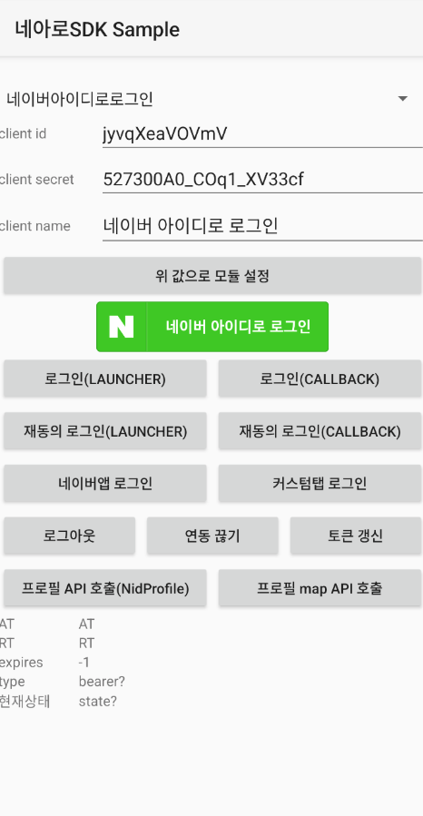

# Android

Android용 네아로SDK는 서드파티 애플리케이션에서 네이버 로그인이 제공하는 로그인, 로그아웃, 토큰 관리 등의 기능을 쉽게 구현할 수 있게 합니다.
<div class="con">
    <div class="buttons2">
        <a class="btn_b_hi3" href="/sdks/sdks.md">라이브러리 보기 &gt;</a>
        <a class="btn_b_hi3" href="https://github.com/naver/naveridlogin-sdk-android/issues">이슈 등록 &gt;</a>
        <a class="btn_b_hi3" href="https://developers.naver.com/apps/#/register?api=nvlogin">오픈 API 이용 신청 &gt;</a>
    </div>
</div>

Github을 참고해 주세요. 문의사항이 있다면 github issue를 생성해 주세요.

아래 네아로SDK 적용 예제는 Kotlin으로 작성되었습니다. 개발 시 참고 부탁드립니다.

### 1. 요구사항
네아로SDK를 사용하려면 다음과 같은 환경이 필요합니다.
- SDK: Android API 21 이상
- JDK: JDK 11 이상
- IDE: Android Studio

> **참고** <br/>
> JDK 8 버전의 경우 별도의 artifact를 의존해주세요.

### 2. 라이브러리 구성
Android용 네아로SDK는 다음과 같이 이루어져 있으며 Github에서도 다운받을 수 있습니다. 

프로젝트는 다음의 두 모듈로 구성되어 있습니다.

- **Nid-OAuth**: 네아로SDK
- **Samples**: 네아로SDK를 사용하는 예제 프로젝트 

### 3. 개발 환경 설정
#### 3.1. Maven repository 사용하기
gradle 스크립트에 아래와 같이 추가하시면 사용할 수 있습니다.

```groovy
# groovy
implementation 'com.navercorp.nid:oauth:5.7.0' // jdk 11
implementation 'com.navercorp.nid:oauth-jdk8:5.7.0' // jdk 8
```

```kt
# kts
implementation("com.navercorp.nid:oauth:5.7.0") // jdk 11
implementation("com.navercorp.nid:oauth-jdk8:5.7.0") // jdk 8
```

네아로SDK에서 사용하는 라이브러리는 다음과 같습니다. 필요에 따라 exclude 하여 사용하시면 됩니다.

```groovy
implementation 'org.jetbrains.kotlin:kotlin-stdlib:1.6.10'
implementation 'org.jetbrains.kotlinx:kotlinx-coroutines-android:1.3.9'
implementation 'androidx.appcompat:appcompat:1.3.1'
implementation 'androidx.legacy:legacy-support-core-utils:1.0.0'
implementation 'androidx.browser:browser:1.0.0'
implementation 'androidx.legacy:legacy-support-v4:1.0.0'
implementation 'androidx.constraintlayout:constraintlayout:1.1.3'
implementation 'androidx.security:security-crypto:1.1.0-alpha06'
implementation 'androidx.core:core-ktx:1.3.0'
implementation 'androidx.fragment:fragment-ktx:1.3.6'
implementation 'androidx.lifecycle:lifecycle-viewmodel-ktx:2.4.0'
implementation 'com.squareup.retrofit2:retrofit:2.9.0'
implementation 'com.squareup.retrofit2:converter-gson:2.9.0'
implementation 'com.squareup.moshi:moshi-kotlin:1.11.0'
implementation 'com.squareup.okhttp3:logging-interceptor:4.2.1'
implementation 'com.airbnb.android:lottie:3.1.0'
```

#### 3.2. Gradle 에서 설정
Android 프로젝트의 libs 폴더 밑에 oauth-5.7.0.aar 파일을 복사합니다.

> **다운로드 링크** <br/>
> [oauth-5.7.0.aar](https://repo1.maven.org/maven2/com/navercorp/nid/oauth/5.7.0/oauth-5.7.0.aar)

프로젝트의 build.gradle에 다음과 같이 추가합니다.

```groovy
# groovy
dependencies {
  implementation files('libs/oauth-5.7.0.aar')
}
```

```kt
# kts
dependencies {
  implementation(files("libs/oauth-5.7.0.aar"))
}
```

#### 3.3. Android Studio 프로젝트 설정
1. [file]-[project structure] 실행
1. 좌측 상단의 + 버튼 클릭
1. jar/aar 모듈 추가 선택
1. 다운받은 oauth-5.7.0.aar 선택
1. 프로젝트 build.gradle에 다음과 같이 추가

```groovy
# groovy
dependencies {
  implementation project(path: ':oauth-5.7.0')
}
```

```kt
# kts
dependencies {
  implementation(project(":oauth-5.7.0"))
}
```

### 4. 초기화
네아로SDK를 애플리케이션에 적용하려면 다음과 같은 코드를 추가해 네아로 객체를 초기화합니다.
```kt
NaverIdLoginSDK.initialize(context, {OAUTH_CLIENT_ID}, {OAUTH_CLIENT_SECRET}, {OAUTH_CLIENT_NAME})
```

- OAUTH_CLIENT_ID: 애플리케이션 등록 후 발급받은 클라이언트 아이디
- OAUTH_CLIENT_SECRET: 애플리케이션 등록 후 발급받은 클라이언트 시크릿
- OAUTH_CLIENT_NAME: 네이버 앱의 로그인 화면에 표시할 애플리케이션 이름. 모바일 웹의 로그인 화면을 사용할 때는 서버에 저장된 애플리케이션 이름이 표시됩니다.

> **참고** <br/>
> `NaverIdLoginSDK.initialize()` 메서드가 여러 번 실행돼도 기존에 저장된 접근 토큰(access token)과 갱신 토큰(refresh token)은 삭제되지 않습니다.<br/>
> 기존에 저장된 접근 토큰과 갱신 토큰을 삭제하려면 `NaverIdLoginSDK.logout()` 메서드나 `NidOAuthLogin().callDeleteTokenApi()` 메서드를 호출합니다.

### 5. 로그인
로그인은 두 가지 방법으로 구현합니다.

첫 번째는 `NidOAuthLoginButton` 객체로 네이버 로그인 버튼을 레이아웃에 추가하는 방법이고, 

두 번째는 `NaverIdLoginSDK.authenticate()` 메서드를 직접 실행하는 방법입니다.



#### 5.1. NidOAuthLoginButton 객체로 버튼 추가
`NidOAuthLoginButton` 객체로 네이버 로그인 버튼을 추가하는 방법은 다음과 같습니다.

레이아웃 파일에 다음과 같은 구문을 추가합니다.

```xml
<com.navercorp.nid.oauth.view.NidOAuthLoginButton
      android:id="@+id/buttonOAuthLoginImg"
      android:layout_width="wrap_content"
      android:layout_height="50dp" />
```

로그인 창을 실행할 `ActivityResultLauncher`나 로그인 후 실행될 `OAuthLoginCallback` 객체를 등록하는 코드를 추가합니다.

```kt
binding.buttonOAuthLoginImg.setOAuthLogin(launcher)
// OR
binding.buttonOAuthLoginImg.setOAuthLogin(oauthLoginCallback)
```

> **주의** <br/>
> `NidOAuthLoginButton` 객체를 이용할 때 네이버 로그인 버튼의 디자인은 반드시 네이버 로그인 버튼 사용 가이드를 따라야 합니다. <br/>
> [네이버 로그인 버튼 사용 가이드](/bi/bi.md)


#### 5.2. authenticate() 메서드를 이용한 로그인
`NaverIdLoginSDK.authenticate()` 메서드를 직접 실행하면 먼저 갱신 토큰이 있는지 확인합니다.
- 갱신 토큰이 있으면 접근 토큰의 갱신을 시도합니다.
  - 갱신에 성공하면 `launcher의 ActivityResultCallback` 이나 `oauthLoginCallback.success()`을 통해 결과를 확인할 수 있습니다.
  - 갱신에 실패하면 로그인 창이 나타납니다.
- 갱신 토큰이 없으면 로그인 창이 나타납니다.

> **접근 토큰 갱신 관련 주의** <br/>
> 접근토큰은 일정 시간(현재 1시간)이 지나면 만료되기 때문에 만료시간이 지난 경우 `callRefreshAccessTokenApi()` 을 호출해서 access token 을 갱신해줘야 합니다. 
> `callRefreshAccessTokenApi()` 성공 시 매개변수로 넣은 `OAuthLoginCallback` 객체의 `onSuccess()` 메소드 안에서 `NaverIdLoginSDK.getAccessToken()`을 호출하면 access token을 얻을 수 있습니다.

`NaverIdLoginSDK.authenticate(context, launcher)`을 실행 한 경우 `launcher의 ActivityResultCallback`를 통해 결과를 확인 할 수 있습니다. resultCode 가 Activity.RESULT_OK 일 경우 성공, Activity.RESULT_CANCELED일 경우 실패나 에러입니다.

`NaverIdLoginSDK.authenticate(context, oauthLoginCallback)`을 실행한 경우 `OAuthLoginCallback`이 호출됩니다. 로그인 창에서 로그인이 완료되거나 취소될 때에도 `OAuthLoginCallback`이 호출됩니다.

다음은 `NaverIdLoginSDK.authenticate()` 메서드를 이용한 로그인을 구현한 예제입니다.

```kt
/**
 * launcher나 OAuthLoginCallback을 authenticate() 메서드 호출 시 파라미터로 전달하거나 NidOAuthLoginButton 객체에 등록하면 인증이 종료되는 것을 확인할 수 있습니다.
 */
private val launcher = registerForActivityResult<Intent, ActivityResult>(ActivityResultContracts.StartActivityForResult()) { result ->
        when(result.resultCode) {
            RESULT_OK -> {
                // 네이버 로그인 인증이 성공했을 때 수행할 코드 추가
                binding.tvAccessToken.text = NaverIdLoginSDK.getAccessToken()
                binding.tvRefreshToken.text = NaverIdLoginSDK.getRefreshToken()
                binding.tvExpires.text = NaverIdLoginSDK.getExpiresAt().toString()
                binding.tvType.text = NaverIdLoginSDK.getTokenType()
                binding.tvState.text = NaverIdLoginSDK.getState().toString()
            }
            RESULT_CANCELED -> {
                // 실패 or 에러
                val errorCode = NaverIdLoginSDK.getLastErrorCode().code
                val errorDescription = NaverIdLoginSDK.getLastErrorDescription()
                Toast.makeText(context, "errorCode:$errorCode, errorDesc:$errorDescription", Toast.LENGTH_SHORT).show()
            }
        }
    }

NaverIdLoginSDK.authenticate(context, launcher)

// OR

val oauthLoginCallback = object : OAuthLoginCallback {
    override fun onSuccess() {
        // 네이버 로그인 인증이 성공했을 때 수행할 코드 추가
        binding.tvAccessToken.text = NaverIdLoginSDK.getAccessToken()
        binding.tvRefreshToken.text = NaverIdLoginSDK.getRefreshToken()
        binding.tvExpires.text = NaverIdLoginSDK.getExpiresAt().toString()
        binding.tvType.text = NaverIdLoginSDK.getTokenType()
        binding.tvState.text = NaverIdLoginSDK.getState().toString()
    }
    override fun onFailure(httpStatus: Int, message: String) {
        val errorCode = NaverIdLoginSDK.getLastErrorCode().code
        val errorDescription = NaverIdLoginSDK.getLastErrorDescription()
        Toast.makeText(context,"errorCode:$errorCode, errorDesc:$errorDescription",Toast.LENGTH_SHORT).show()
    }
    override fun onError(errorCode: Int, message: String) {
        onFailure(errorCode, message)
    }
}


NaverIdLoginSDK.authenticate(context, oauthLoginCallback)
```

> **참고** <br/>
> 커스텀탭 로그인 모드를 사용하는 경우에 사용자 기기의 기본 브라우저 앱이 네이버앱이라면 네이버앱으로 로그인이 진행됩니다. 

### 6. 접근 토큰 얻기
로그인에 성공했을 때는 `NaverIdLoginSDK.getAccessToken()` 메서드로 접근 토큰 정보를 얻을 수 있습니다. 

로그인에 실패했다면 `NaverIdLoginSDK.getLastErrorCode()` 메서드나 `NaverIdLoginSDK.getLastErrorDescription()` 메서드로 실패 이유와 에러 코드를 얻을 수 있습니다.


### 7. 로그아웃
애플리케이션에서 로그아웃할 때는 다음과 같이 `NaverIdLoginSDK.logout()` 메서드를 호출합니다.

```kt
NaverIdLoginSDK.logout()
```

`NaverIdLoginSDK.logout()` 메서드가 호출되면 클라이언트에 저장된 토큰이 삭제되고 

`NaverIdLoginSDK.getState()` 메서드가 NidOAuthLoginState.NEED_LOGIN 값을 반환합니다.
 
> **약전계에서 로그아웃 호출 시** <br/>
> 저장된 토큰만 삭제하므로 약전계나 네트워크 오류에 영향을 받지 않습니다.


### 8. 연동 해제
네이버 아이디와 애플리케이션의 연동을 해제하는 기능은 다음과 같이 `NidOAuthLogin().callDeleteTokenApi()` 메서드로 구현합니다.

연동을 해제하면 클라이언트에 저장된 토큰과 서버에 저장된 토큰이 모두 삭제됩니다.

```kt
NidOAuthLogin().callDeleteTokenApi(object : OAuthLoginCallback {
    override fun onSuccess() {
        //서버에서 토큰 삭제에 성공한 상태입니다.
    }
    override fun onFailure(httpStatus: Int, message: String) {
        // 서버에서 토큰 삭제에 실패했어도 클라이언트에 있는 토큰은 삭제되어 로그아웃된 상태입니다.
        // 클라이언트에 토큰 정보가 없기 때문에 추가로 처리할 수 있는 작업은 없습니다.
        Log.d(TAG, "errorCode: ${NaverIdLoginSDK.getLastErrorCode().code}")
        Log.d(TAG, "errorDesc: ${NaverIdLoginSDK.getLastErrorDescription()}")
    }
    override fun onError(errorCode: Int, message: String) {
        // 서버에서 토큰 삭제에 실패했어도 클라이언트에 있는 토큰은 삭제되어 로그아웃된 상태입니다.
        // 클라이언트에 토큰 정보가 없기 때문에 추가로 처리할 수 있는 작업은 없습니다.
        onFailure(errorCode, message)
    }
})
```

연동이 해제된 것은 PC에서 네이버의 내정보 > 보안설정 > 외부 사이트 연결 페이지에 접속해 외부사이트 → 네이버에서 연결 정보 삭제 여부로 확인할 수 있습니다.

> **약전계에서 연동 해제 시** <br/>
> `NidOAuthLogin().callDeleteTokenApi()` 메서드로 연동을 해제할 때는 클라이언트에 저장된 토큰과 서버에 저장된 토큰을 모두 삭제합니다. 
> 이때 네트워크 오류가 발생하면 서버 호출에 실패하기 때문에 서버에 저장된 토큰을 삭제하지 못할 수 있습니다. 
> PC에서 네이버의 내정보 > 보안설정 > 외부 사이트 연결 페이지에 접속해 외부사이트 → 네이버에서 확인했을 때 연결 정보가 삭제되지 않은 채로 남아 있을 수 있습니다.


### 9. 프로필 API 호출
접근 토큰으로 프로필 정보를 가져올 때는 `NidOAuthLogin().callProfileApi()` 메서드를 사용합니다.

```kt
NidOAuthLogin().callProfileApi(nidProfileCallback)
```

### 10. 기타 설정
#### 10.1. 로그 설정
Android의 logcat 로그에 네이버 로그인 로그를 확인할 수 있게 하려면 `NaverIdLoginSDK` 객체에서 `showDevelopersLog` 메소드를 통해 설정합니다.

네아로SDK가 출력하는 logcat 로그의 접두어는 NaverIdLogin입니다.

```kt
NaverIdLoginSDK.showDevelopersLog(true)
```

> **주의** <br/>
> 로그 출력이 활성화되면 토큰 등의 민감한 정보가 로그에 표시되기 때문에 배포 버전에는 로그를 남기도록 않도록 false로 설정합니다.

#### 10.2. 문구 변경
다국어 지원 등으로 대화 상자에 나타나는 문구를 변경하려면 다음 예제와 같이 리소스 파일 (예: res/value/message.xml)을 덮어 쓸 수 있습니다.

```xml
<resources>
      <string name="naveroauthlogin_string_getting_token">Receiving access token..</string>
</resources>
```

설정 가능한 리소스 이름은 다음과 같습니다.

| 리소스 명 | 기본 설정 |
| :-- | :-- |
| use_application | 사용할 어플리케이션 |
| retry | 재시도 |
| naveroauthlogin_string_getting_token | 네이버 아이디로 로그인 중입니다. |
| naveroauthlogin_string_network_state_not_available | 네트워크에 접속할 수 없습니다. 네트워크 연결상태를 확인해 주세요. |
| naveroauthlogin_string_group_id_not_available | 단체아이디는 네이버 아이디로 로그인이 지원되지 않습니다. 개인아이디로 로그인 해 주세요. |
| naveroauthlogin_string_update_naverapp | 네이버 앱 업데이트 후 이용할 수 있는 서비스입니다. |


### 11. 네아로SDK API
#### 11.1. NidOAuthErrorCode
OAuth 인증 과정 중 발생할 수 있는 오류의 에러 코드를 가지고 있는 enum 타입의 클래스.

"The OAuth 2.0 Authorization Framework" 문서 의 '4.1.2.1. Error Response'에서 제시하는 오류 유형에 해당하는 에러 코드를 가지고 있습니다.

NidOAuthErrorCode 클래스에 있는 에러 코드는 다음과 같습니다.

'SERVER_ERROR_'로 시작하는 에러 코드는 서버에서 발생하는 오류의 에러 코드입니다.

'CLIENT_ERROR_'로 시작하는 에러 코드는 애플리케이션에서 발행하는 오류의 에러 코드입니다.

'ACTIVITY_IS_SINGLE_TASK'는 개발자 설정의 활동 보관 안 함 설정에 관련된 에러 코드입니다.

네아로 SDK v5.2.0 부터 WebView 가 제거되었습니다. WebView 로그인 모드로 인증을 시도할 경우 'WEB_VIEW_IS_DEPRECATED' 에러코드를 반환합니다.

'NO_APP_FOR_AUTHENTICATION'는 인증을 진행할 수 있는 앱(네이버앱이나 커스텀탭)이 없는 경우 발생합니다.

'SDK_IS_NOT_INITIALIZED'는 SDK 초기화가 되지 않은 경우 발생합니다.

- NONE
- SERVER_ERROR_INVALID_REQUEST
- SERVER_ERROR_UNAUTHORIZED_CLIENT
- SERVER_ERROR_ACCESS_DENIED
- SERVER_ERROR_UNSUPPORTED_RESPONSE_TYPE
- SERVER_ERROR_INVALID_SCOPE
- SERVER_ERROR_SERVER_ERROR
- SERVER_ERROR_TEMPORARILY_UNAVAILABLE
- ERROR_NO_CATAGORIZED
- CLIENT_ERROR_PARSING_FAIL
- CLIENT_ERROR_NO_CLIENTID
- CLIENT_ERROR_NO_CLIENTSECRET
- CLIENT_ERROR_NO_CLIENTNAME
- CLIENT_ERROR_NO_CALLBACKURL
- CLIENT_ERROR_CONNECTION_ERROR
- CLIENT_ERROR_CERTIFICATION_ERROR
- CLIENT_USER_CANCEL
- ACTIVITY_IS_SINGLE_TASK
- WEB_VIEW_IS_DEPRECATED
- NO_APP_FOR_AUTHENTICATION
- SDK_IS_NOT_INITIALIZED

NidOAuthErrorCode 클래스의 프로퍼티는 다음과 같습니다.

- code
- description

##### 11.1.1. code

**설명** <br/>
에러 코드를 반환합니다.

**구문**
```kt
val code: String
```

**반환값** <br/>
에러 코드

**코드 예** <br/>
없음

##### 11.1.2. description

**설명** <br/>
오류에 대한 설명을 반환합니다.

**구문**
```
val description: String
```

**반환값** <br/>
오류에 대한 설명

**코드 예** <br/>
없음

#### 11.2. NaverIdLoginSDK
네이버 로그인의 결과로 저장된 값을 가져오고 초기화, 인증을 수행하는 클래스.

NaverIdLoginSDK 클래스의 메서드는 다음과 같습니다.

- getAccessToken()
- getExpiresAt()
- getLastErrorCode()
- getLastErrorDescription()
- getRefreshToken()
- getState()
- getTokenType()
- getVersion()
- initialize()
- authenticate(context, launcher)
- authenticate(context, callback)
- reagreeAuthenticate(context, launcher)
- reagreeAuthenticate(context, callback)
- logout()

##### 11.2.1. getAccessToken()

**설명** <br/>
로그인 결과로 얻은 접근 토큰(access token)을 반환합니다.

**구문**
```kt
fun getAccessToken(): String?
```

**파라미터** <br/>
없음

**반환값** <br/>
접근 토큰

**코드 예**
```kt
val at = NaverIdLoginSDK.getAccessToken()
```

##### 11.2.2. getExpiresAt()

**설명** <br/>
접근 토큰(access token)의 만료 시간을 반환합니다.

**구문**
```kt
fun getExpiresAt(): Long
```

**파라미터** <br/>
없음

**반환값** <br/>
타임스탬프(단위: 초)

**코드 예**
```kt
Log.d(TAG, "DEBUG expires at : ${NaverIdLoginSDK.getExpiresAt()}")
```

##### 11.2.3. getLastErrorCode()

**설명** <br/>
마지막으로 실패한 로그인의 에러 코드를 반환합니다.

**구문**
```kt
fun getLastErrorCode(): NidOAuthErrorCode
```

**파라미터** <br/>
없음

**반환값** <br/>
NidOAuthErrorCode 타입의 에러 코드. NidOAuthErrorCode 클래스에 관한 자세한 내용은 "NidOAuthErrorCode"를 참고합니다.

**코드 예**
```kt
val errorCode = NaverIdLoginSDK.getLastErrorCode().code
val errorDesc = NaverIdLoginSDK.getLastErrorDescription()
Toast.makeText(context, "errorCode: $errorCode, errorDesc: $errorDesc", Toast.LENGTH_SHORT).show()
```

##### 11.2.4. getLastErrorDescription()

**설명** <br/>
마지막으로 실패한 로그인의 에러 메시지를 반환합니다.

**구문**
```kt
fun getLastErrorDescription(): String?
```

**파라미터** <br/>
없음

**반환값** <br/>
에러 메시지

**코드 예**
```kt
val errorCode = NaverIdLoginSDK.getLastErrorCode().code
val errorDesc = NaverIdLoginSDK.getLastErrorDescription()
Toast.makeText(context, "errorCode: $errorCode, errorDesc: $errorDesc", Toast.LENGTH_SHORT).show()
```

##### 11.2.5. getRefreshToken()

**설명** <br/>
로그인 결과로 얻은 갱신 토큰(refresh token)을 반환합니다.

**구문**
```kt
fun getRefreshToken(): String?
```

**파라미터** <br/>
없음

**반환값** <br/>
갱신 토큰

**코드 예**
```kt
Log.d(TAG, "DEBUG refresh token : ${NaverIdLoginSDK.getRefreshToken()}")
```

##### 11.2.6. getState()

**설명** <br/>
네이버 로그인 인스턴스의 현재 상태를 반환합니다.

**구문**
```kt
fun getState(): NidOAuthLoginState
```

**파라미터** <br/>
없음

**반환값** <br/>
NidOAuthLoginState 타입의 에러 메시지
- NidOAuthLoginState.NEED_INIT
- NidOAuthLoginState.NEED_LOGIN
- NidOAuthLoginState.OK

NidOAuthLoginState 클래스에 관한 자세한 내용은 "NidOAuthLoginState"를 참고합니다.

**코드 예**
```kt
if (NidOAuthLoginState.OK.equals(NaverIdLoginSDK.getState())) {
    // access token 이 있는 상태로 로그인 버튼 안보여 줌
} else {
    showNaverLoginButton()
}
```

##### 11.2.7. getTokenType()

**설명** <br/>
로그인 결과로 얻은 토큰의 타입을 반환합니다.

**구문**
```kt
fun getTokenType(): String?
```

**파라미터** <br/>
없음

**반환값** <br/>
토큰의 타입

**코드 예**
```kt
Log.d(TAG, "DEBUG token type : ${NaverIdLoginSDK.getTokenType()}")
```

##### 11.2.8. getVersion()

**설명** <br/>
네아로SDK의 버전을 반환합니다.

**구문**
```kt
fun getVersion(): String
```

**파라미터** <br/>
없음

**반환값** <br/>
"5.x.x" 형식으로 된 문자열

**코드 예** <br/>
없음

##### 11.2.9. initialize()

**설명** <br/>
네이버 로그인 인스턴스에 클라이언트 정보를 설정합니다.

**구문**
```kt
fun initialize(context: Context, clientId: String, clientSecret: String, clientName: String)
```

**파라미터**
| 파라미터 | 타입 | 필수 여부 | 설명 |
|:--:|:--:|:--:|:--|
|context|Context|Y|EncryptedPreferences를 초기화 할 때 사용할 Context 객체|
|clientId|String|Y|애플리케이션 등록 후 발급받은 클라이언트 아이디|
|clientSecret|String|Y|애플리케이션 등록 후 발급받은 클라이언트 시크릿|
|clientName|String|Y|네이버 앱의 로그인 화면에 표시할 애플리케이션 이름. 모바일 웹의 로그인 화면을 사용할 때는 서버에 저장된 애플리케이션 이름이 표시됩니다.|

**반환값** <br/>
없음

**코드 예**
```kt
NaverIdLoginSDK.initialize(context, clientId, clientSecret, clientName)
```

##### 11.2.10. authenticate(context, launcher)
 
 **설명** <br/>
로그인에 성공하면 접근 토큰(access token)과 갱신 토큰(refresh token)을 받아 옵니다.

**구문**
```kt
fun authenticate(context: Context, launcher: ActivityResultLauncher<Intent>)
```

**파라미터**
| 파라미터 | 타입 | 필수 여부 | 설명 |
|:--:|:--:|:--:|:--|
|context|Context|Y|메서드를 호출한 Activity의 Context 객체|
|launcher|ActivityResultLauncher&#60;Intent&#62;|Y|OAuth 인증을 실행할 ActivityResultLauncher|

**반환값** <br/>
없음

> **참고** <br/>
> 접근 토큰이 유효하지 않아 API 호출이 실패했을 때(인증 실패) `authenticate()` 메서드로 접근 토큰을 새로 받아 API를 다시 호출합니다. <br/>
> 단, API 인증에 실패했을 때에만 `authenticate()` 메서드를 호출해야 합니다. <br/>
> 서버 오류 등으로 실패했을 때에 `authenticate()` 메서드를 호출하면 재시도를 무한으로 반복할 수 있습니다. <br/>
> 재시도 횟수를 제한하는 로직을 추가하면 서비스를 더 안정적으로 제공할 수 있습니다.

**코드 예**
```kt
NaverIdLoginSDK.authenticate(context, launcher)
```

##### 11.2.11. authenticate(context, callback)
 
 **설명** <br/>
로그인에 성공하면 접근 토큰(access token)과 갱신 토큰(refresh token)을 받아 옵니다.

**구문**
```kt
fun authenticate(context: Context, callback: OAuthLoginCallback)
```

**파라미터**
| 파라미터 | 타입 | 필수 여부 | 설명 |
|:--:|:--:|:--:|:--|
|context|Context|Y|메서드를 호출한 Activity의 Context 객체|
|callback|OAuthLoginCallback|Y|메서드가 끝나고 실행될 OAuthLoginCallback. OAuthLoginCallback에 관한 자세한 내용은 "OAuthLoginCallback"을 참고합니다.|

**반환값** <br/>
없음

> **참고** <br/>
> 접근 토큰이 유효하지 않아 API 호출이 실패했을 때(인증 실패) `authenticate()` 메서드로 접근 토큰을 새로 받아 API를 다시 호출합니다. <br/>
> 단, API 인증에 실패했을 때에만 `authenticate()` 메서드를 호출해야 합니다. <br/>
> 서버 오류 등으로 실패했을 때에 `authenticate()` 메서드를 호출하면 재시도를 무한으로 반복할 수 있습니다. <br/>
> 재시도 횟수를 제한하는 로직을 추가하면 서비스를 더 안정적으로 제공할 수 있습니다.

**코드 예**
```kt
NaverIdLoginSDK.authenticate(context, oauthLoginCallback)
```

##### 11.2.12. reagreeAuthenticate(context, launcher)
 
 **설명** <br/>
재동의를 요청하고, 로그인에 성공하면 접근 토큰(access token)과 갱신 토큰(refresh token)을 받아 옵니다.

**구문**
```kt
fun reagreeAuthenticate(context: Context, launcher :ActivityResultLauncher<Intent>)
```

**파라미터**
| 파라미터 | 타입 | 필수 여부 | 설명 |
|:--:|:--:|:--:|:--|
|context|Context|Y|메서드를 호출한 Activity의 Context 객체|
|launcher|ActivityResultLauncher&#60;Intent&#62;|Y|OAuth 인증을 실행할 ActivityResultLauncher|

**반환값** <br/>
없음

**코드 예**
```kt
NaverIdLoginSDK.reagreeAuthenticate(context, launcher)
```

##### 11.2.13. reagreeAuthenticate(context, callback)
 
 **설명** <br/>
재동의를 요청하고, 로그인에 성공하면 접근 토큰(access token)과 갱신 토큰(refresh token)을 받아 옵니다.

**구문**
```kt
fun reagreeAuthenticate(context: Context, callback: OAuthLoginCallback)
```

**파라미터**
| 파라미터 | 타입 | 필수 여부 | 설명 |
|:--:|:--:|:--:|:--|
|context|Context|Y|메서드를 호출한 Activity의 Context 객체|
|callback|OAuthLoginCallback|Y|메서드가 끝나고 실행될 OAuthLoginCallback. OAuthLoginCallback에 관한 자세한 내용은 "OAuthLoginCallback"을 참고합니다.|

**반환값** <br/>
없음

**코드 예**
```kt
NaverIdLoginSDK.reagreeAuthenticate(context, oauthLoginCallback)
```

##### 11.2.14. logout()

**설명** <br/>
클라이언트에 저장된 접근 토큰(access token)과 갱신 토큰(refresh token)을 삭제합니다.

**구문**
```kt
fun logout()
```

**파라미터** <br/>
없음

**반환값** <br/>
없음

**코드 예**
```kt
R.id.buttonOAuthLogout -> {
    NaverIdLoginSDK.logout()
    updateView()
}
```

##### 11.3. NidOAuthLogin
네이버 로그인 연산을 수행하는 클래스.

NidOAuthLogin 클래스의 메서드는 다음과 같습니다.

- callDeleteTokenApi()
- callRefreshAccessTokenApi()
- callProfileApi()

##### 11.3.1. callDeleteTokenApi()

**설명** <br/>
클라이언트와 서버에 저장된 접근 토큰(access token)과 갱신 토큰(refresh token)을 삭제해 애플리케이션과 네이버 아이디의 연동을 해제합니다.

**구문**
```kt
fun callDeleteTokenApi(callback: OAuthLoginCallback)
```

**파라미터**
| 파라미터 | 타입 | 필수 여부 | 설명 |
|:--:|:--:|:--:|:--|
|callback|OAuthLoginCallback|Y|메서드가 끝나고 실행될 OAuthLoginCallback. OAuthLoginCallback에 관한 자세한 내용은 "OAuthLoginCallback"을 참고합니다.|

**반환값** <br/>
없음

**코드 예**
```kt
NidOAuthLogin().callDeleteTokenApi(object : OAuthLoginCallback {
    override fun onSuccess() {
        // 서버에서 토큰 삭제에 성공한 상태입니다.
        updateView()
    }
    override fun onFailure(httpStatus: Int, message: String) {
        // 서버에서 토큰 삭제에 실패했어도 클라이언트에 있는 토큰은 삭제되어 로그아웃된 상태입니다.
        // 클라이언트에 토큰 정보가 없기 때문에 추가로 처리할 수 있는 작업은 없습니다.
        val errorCode = NaverIdLoginSDK.getLastErrorCode().code
        val errorDescription = NaverIdLoginSDK.getLastErrorDescription()
        Toast.makeText(context, "errorCode: $errorCode, errorDesc: $errorDesc", Toast.LENGTH_SHORT).show()
        updateView()
    }
    override fun onError(errorCode: Int, message: String) {
        // 서버에서 토큰 삭제에 실패했어도 클라이언트에 있는 토큰은 삭제되어 로그아웃된 상태입니다.
        // 클라이언트에 토큰 정보가 없기 때문에 추가로 처리할 수 있는 작업은 없습니다.
        onFailure(errorCode, message)
    }
})
```

##### 11.3.2. callRefreshAccessTokenApi()

**설명** <br/>
클라이언트에 저장된 갱신 토큰(refresh token)을 이용해 접근 토큰(access token)을 갱신합니다.

**구문**
```kt
fun callRefreshAccessTokenApi(callback: OAuthLoginCallback)
```

**파라미터**
| 파라미터 | 타입 | 필수 여부 | 설명 |
|:--:|:--:|:--:|:--|
|callback|OAuthLoginCallback|Y|메서드가 끝나고 실행될 OAuthLoginCallback. OAuthLoginCallback에 관한 자세한 내용은 "OAuthLoginCallback"을 참고합니다.|

**반환값** <br/>
없음

**코드 예**
```kt
NidOAuthLogin().callRefreshAccessTokenApi(object : OAuthLoginCallback {
    override fun onSuccess() {
        // 접근 토큰 갱신에 성공한 경우 수행할 코드 추가
        updateView()
    }
    override fun onFailure(httpStatus: Int, message: String) {
        val errorCode = NaverIdLoginSDK.getLastErrorCode().code
        val errorDescription = NaverIdLoginSDK.getLastErrorDescription()
        Toast.makeText(context, "errorCode: $errorCode, errorDesc: $errorDesc", Toast.LENGTH_SHORT).show()
        updateView()
    }
    override fun onError(errorCode: Int, message: String) {
        onFailure(errorCode, message)
    }
})
```

##### 11.3.3. callProfileApi()

**설명** <br/>
GET 메서드로 API를 호출합니다. 성공하면 `NidProfileCallback.onSuccess()`가 실행됩니다.

**구문**
```kt
fun callProfileApi(callback: NidProfileCallback<NidProfileResponse>)
```

**파라미터**
| 파라미터 | 타입 | 필수 여부 | 설명 |
|:--:|:--:|:--:|:--|
|callback|NidProfileCallback<NidProfileResponse>|Y|메서드가 끝나고 실행될 NidProfileCallback. NidProfileCallback에 관한 자세한 내용은 "NidProfileCallback"을 참고합니다.|

**반환값** <br/>
없음

**코드 예**
```kt
NidOAuthLogin().callProfileApi(object : NidProfileCallback<NidProfileResponse> {
    override fun onSuccess(response: NidProfileResponse) {
        Toast.makeText(context,"$response",Toast.LENGTH_SHORT).show()
        binding.tvApiResult.text = response.toString()
    }
    override fun onFailure(httpStatus: Int, message: String) {
        val errorCode = NaverIdLoginSDK.getLastErrorCode().code
        val errorDescription = NaverIdLoginSDK.getLastErrorDescription()
        Toast.makeText(context, "errorCode: $errorCode, errorDesc: $errorDesc", Toast.LENGTH_SHORT).show()
        binding.tvApiResult.text = ""
    }
    override fun onError(errorCode: Int, message: String) {
        onFailure(errorCode, message)
    }
})
```

#### 11.4. NidOAuthLoginButton
네이버 로그인 버튼 클래스. NidOAuthLoginButton 클래스의 메서드는 다음과 같습니다

- setOAuthLogin(launcher)
- setOAuthLogin(oauthLoginCallback)

##### 11.4.1. setOAuthLogin(launcher)

**설명** <br/>
네이버 로그인 버튼을 클릭해 로그인하는 경우 OAuth 인증을 실행할 ActivityResultLauncher를 지정합니다.

**구문**
```kt
fun setOAuthLogin(launcher: ActivityResultLauncher<Intent>)
```

**파라미터**
| 파라미터 | 타입 | 필수 여부 | 설명 |
|:--:|:--:|:--:|:--|
|launcher|ActivityResultLauncher&#60;Intent&#62;|Y|OAuth 인증을 실행할 ActivityResultLauncher|

**반환값** <br/>
없음

**코드 예**
```kt
private val launcher = registerForActivityResult<Intent, ActivityResult>(ActivityResultContracts.StartActivityForResult()) { result ->
        when(result.resultCode) {
            RESULT_OK -> {
                // 네이버 로그인 인증이 성공했을 때 수행할 코드 추가
                binding.tvAccessToken.text = NaverIdLoginSDK.getAccessToken()
                binding.tvRefreshToken.text = NaverIdLoginSDK.getRefreshToken()
                binding.tvExpires.text = NaverIdLoginSDK.getExpiresAt().toString()
                binding.tvType.text = NaverIdLoginSDK.getTokenType()
                binding.tvState.text = NaverIdLoginSDK.getState().toString()
            }
            RESULT_CANCELED -> {
                // 실패 or 에러
                val errorCode = NaverIdLoginSDK.getLastErrorCode().code
                val errorDescription = NaverIdLoginSDK.getLastErrorDescription()
                Toast.makeText(context, "errorCode:$errorCode, errorDesc:$errorDescription", Toast.LENGTH_SHORT).show()
            }
        }
    }

binding.buttonOAuthLoginImg.setOAuthLogin(launcher)
```

##### 11.4.2. setOAuthLogin(oauthLoginCallback)

**설명** <br/>
네이버 로그인 버튼을 클릭해 로그인하는 경우 로그인 후 실행될 Callback을 지정합니다.

**구문**
```kt
fun setOAuthLogin(oauthLoginCallback: OAuthLoginCallback)
```

**파라미터**
| 파라미터 | 타입 | 필수 여부 | 설명 |
|:--:|:--:|:--:|:--|
|oauthLoginCallback|OAuthLoginCallback|Y|버튼을 눌러서 로그인 요청이 완료되면 수행할 Callback. Callback에 관한 자세한 내용은 "OAuthLoginCallback"를 참고합니다.|

**반환값** <br/>
없음

**코드 예**
```kt
binding.buttonOAuthLoginImg.setOAuthLogin(object : OAuthLoginCallback {
    override fun onSuccess() {
        // 네이버 로그인 인증이 성공했을 때 수행할 코드 추가
        binding.tvAccessToken.text = NaverIdLoginSDK.getAccessToken()
        binding.tvRefreshToken.text = NaverIdLoginSDK.getRefreshToken()
        binding.tvExpires.text = NaverIdLoginSDK.getExpiresAt().toString()
        binding.tvType.text = NaverIdLoginSDK.getTokenType()
        binding.tvState.text = NaverIdLoginSDK.getState().toString()
    }
    override fun onFailure(httpStatus: Int, message: String) {
        val errorCode = NaverIdLoginSDK.getLastErrorCode().code
        val errorDescription = NaverIdLoginSDK.getLastErrorDescription()
        Toast.makeText(
            context,
            "errorCode:$errorCode, errorDesc:$errorDescription",
            Toast.LENGTH_SHORT
        ).show()
    }
    override fun onError(errorCode: Int, message: String) {
        onFailure(errorCode, message)
    }
})
```

#### 11.5. OAuthLoginCallback
OAuth 인증 요청이 종료됐음을 알려 주는 콜백 인터페이스. OAuthLoginCallback 인터페이스의 메서드는 다음과 같습니다.

- onSuccess()
- onFailure()
- onError()

##### 11.5.1. onSuccess()

**설명** <br/>
`OAuthLoginCallback` 인터페이스를 상속하는 익명클래스를 만들어 `onSuccess()` 메서드를 구현한 뒤 생성된 인스턴스를 다음 네 개 메서드의 파라미터로 전달하면 인스턴스의 `onSuccess()` 메서드로 요청이 성공했음을 확인할 수 있습니다.

- `NaverIdLoginSDK.authenticate()` 메서드 호출 시 파라미터로 넘겨줌
- `NidOAuthLoginButton.setOAuthLogin()` 메서드 호출 시 파라미터로 넘겨줌
- `NidOAuthLogin().callRefreshAccessTokenApi()` 메서드 호출 시 파라미터로 넘겨줌
- `NidOAuthLogin().callDeleteTokenApi()` 메서드 호출 시 파라미터로 넘겨줌

위 메서드를 호출해 얻은 데이터는 `OAuthLoginCallback`으로 직접 전달되지 않기 때문에 `NaverIdLoginSDK.getAccessToken()` 메서드나 `NaverIdLoginSDK.getRefreshToken()` 메서드, `NaverIdLoginSDK.getLastErrorCode()` 메서드 등으로 확인합니다.

**구문**
```kt
fun onSuccess()
```

**파라미터** <br/>
없음

**반환값** <br/>
없음

**코드 예**
```kt
val oauthLoginCallback = object : OAuthLoginCallback {
    override fun onSuccess() {
        updateView()
    }
    override fun onFailure(httpStatus: Int, message: String) {
        val errorCode = NaverIdLoginSDK.getLastErrorCode().code
        val errorDescription = NaverIdLoginSDK.getLastErrorDescription()
        Toast.makeText(context, "errorCode: $errorCode, errorDesc: $errorDesc", Toast.LENGTH_SHORT).show()
    }
    override fun onError(errorCode: Int, message: String) {
        onFailure(errorCode, message)
    }
}

NaverIdLoginSDK.authenticate(context, oauthLoginCallback)
```

##### 11.5.2. onFailure()

**설명** <br/>
`OAuthLoginCallback` 인터페이스를 상속하는 익명클래스를 만들어 `onFailure()` 메서드를 구현한 뒤 생성된 인스턴스를 다음 네 개 메서드의 파라미터로 전달하면 인스턴스의 `onFailure()` 메서드로 요청이 실패했음을 확인할 수 있습니다.

- `NaverIdLoginSDK.authenticate()` 메서드 호출 시 파라미터로 넘겨줌
- `NidOAuthLoginButton.setOAuthLogin()` 메서드 호출 시 파라미터로 넘겨줌
- `NidOAuthLogin().callRefreshAccessTokenApi()` 메서드 호출 시 파라미터로 넘겨줌
- `NidOAuthLogin().callDeleteTokenApi()` 메서드 호출 시 파라미터로 넘겨줌

위 메서드를 호출해 얻은 데이터는 `OAuthLoginCallback`으로 직접 전달되지 않기 때문에 `NaverIdLoginSDK.getAccessToken()` 메서드나 `NaverIdLoginSDK.getRefreshToken()` 메서드, `NaverIdLoginSDK.getLastErrorCode()` 메서드 등으로 확인합니다.

**구문**
```kt
fun onFailure(httpStatus: Int, message: String)
```

**파라미터**
| 파라미터 | 타입 | 필수 여부 | 설명 |
|:--:|:--:|:--:|:--|
|httpStatus|Int|Y|HTTP status code|
|message|String|Y|HTTP status message|

**반환값** <br/>
없음

##### 11.5.3. onError()

**설명** <br/>
`OAuthLoginCallback` 인터페이스를 상속하는 익명클래스를 만들어 `onError()` 메서드를 구현한 뒤 생성된 인스턴스를 다음 네 개 메서드의 파라미터로 전달하면 인스턴스의 `onError()` 메서드로 요청에서 에러가 발생했음을 확인할 수 있습니다.

- `NaverIdLoginSDK.authenticate()` 메서드 호출 시 파라미터로 넘겨줌
- `NidOAuthLoginButton.setOAuthLogin()` 메서드 호출 시 파라미터로 넘겨줌
- `NidOAuthLogin().callRefreshAccessTokenApi()` 메서드 호출 시 파라미터로 넘겨줌
- `NidOAuthLogin().callDeleteTokenApi()` 메서드 호출 시 파라미터로 넘겨줌

위 메서드를 호출해 얻은 데이터는 `OAuthLoginCallback`으로 직접 전달되지 않기 때문에 `NaverIdLoginSDK.getAccessToken()` 메서드나 `NaverIdLoginSDK.getRefreshToken()` 메서드, `NaverIdLoginSDK.getLastErrorCode()` 메서드 등으로 확인합니다.

**구문**
```kt
fun onError(errorCode: Int, message: String)
```

**파라미터**
| 파라미터 | 타입 | 필수 여부 | 설명 |
|:--:|:--:|:--:|:--|
|errorCode|Int|Y|HTTP status code or -1|
|message|String|Y|HTTP status message or 발생한 예외|

**반환값** <br/>
없음

#### 11.6. NidProfileCallback
Profile 요청이 종료됐음을 알려 주는 콜백 인터페이스. NidProfileCallback 인터페이스의 메서드는 다음과 같습니다.

- onSuccess()
- onFailure()
- onError()

##### 11.6.1. onSuccess()

**설명** <br/>
`NidProfileCallback` 인터페이스를 상속하는 익명클래스를 만들어 `onSuccess()` 메서드를 구현한 뒤 생성된 인스턴스를 다음 메서드의 파라미터로 전달하면 인스턴스의 `onSuccess()` 메서드로 요청이 성공했음을 확인할 수 있습니다.

`NidOAuthLogin().callProfileApi()` 메서드 호출 시 파라미터로 넘겨줌

**구문**
```kt
fun onSuccess(result: T)
```

**파라미터**
| 파라미터 | 타입 | 필수 여부 | 설명 |
|:--:|:--:|:--:|:--|
|result|T|Y|`NidOAuthLogin().callProfileApi()`를 호출해 얻은 데이터가 `onSuccess()`로 전달됩니다.|

**반환값** <br/>
없음

**코드 예**
```kt
val profileCallback = object : NidProfileCallback<NidProfileResponse> {
    override fun onSuccess(response: NidProfileResponse) {
        Toast.makeText(context,"$response",Toast.LENGTH_SHORT).show()
        binding.tvApiResult.text = response.toString()
    }
    override fun onFailure(httpStatus: Int, message: String) {
        val errorCode = NaverIdLoginSDK.getLastErrorCode().code
        val errorDescription = NaverIdLoginSDK.getLastErrorDescription()
        Toast.makeText(context, "errorCode: $errorCode, errorDesc: $errorDesc", Toast.LENGTH_SHORT).show()
        binding.tvApiResult.text = ""
    }
    override fun onError(errorCode: Int, message: String) {
        onFailure(errorCode, message)
    }
})

NidOAuthLogin().callProfileApi(profileCallback)
```

##### 11.6.2. onFailure()

**설명** <br/>
`NidProfileCallback` 인터페이스를 상속하는 익명클래스를 만들어 `onFailure()` 메서드를 구현한 뒤 생성된 인스턴스를 다음 메서드의 파라미터로 전달하면 인스턴스의 `onFailure()` 메서드로 요청이 실패했음을 확인할 수 있습니다.

`NidOAuthLogin().callProfileApi()` 메서드 호출 시 파라미터로 넘겨줌

**구문**
```kt
fun onFailure(httpStatus: Int, message: String)
```

**파라미터**
| 파라미터 | 타입 | 필수 여부 | 설명 |
|:--:|:--:|:--:|:--|
|httpStatus|Int|Y|HTTP status code|
|message|String|Y|HTTP status message|


**반환값** <br/>
없음

##### 11.6.3. onError()

**설명** <br/>
`NidProfileCallback` 인터페이스를 상속하는 익명클래스를 만들어 `onError()` 메서드를 구현한 뒤 생성된 인스턴스를 다음 메서드의 파라미터로 전달하면 인스턴스의 `onError()` 메서드로 요청에 에러가 발생했음을 확인할 수 있습니다.

`NidOAuthLogin().callProfileApi()` 메서드 호출 시 파라미터로 넘겨줌

**구문**
```kt
fun onError(errorCode: Int, message: String)
```

**파라미터**
| 파라미터 | 타입 | 필수 여부 | 설명 |
|:--:|:--:|:--:|:--|
|errorCode|Int|Y|HTTP status code or -1|
|message|String|Y|HTTP status message or 발생한 예외|

**반환값** <br/>
없음

#### 11.7. NidOAuthLoginState
네이버 로그인 인스턴스의 현재 로그인 상태를 반환하는 클래스. 네이버 로그인 인스턴스의 상태는 다음과 같습니다.
- NEED_INIT: 초기화가 필요한 상태
- NEED_LOGIN: 로그인이 필요한 상태. 접근 토큰(access token)과 갱신 토큰(refresh token)이 모두 없습니다.
- NEED_REFRESH_TOKEN: 토큰 갱신이 필요한 상태. 접근 토큰은 없고, 갱신 토큰은 있습니다.
- OK: 접근 토큰이 있는 상태. 단, 사용자가 네이버의 내정보 > 보안설정 > 외부 사이트 연결 페이지에서 연동을 해제했다면 서버에서는 상태 값이 유효하지 않을 수 있습니다.
