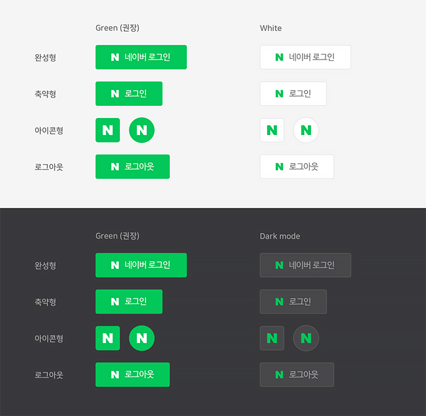
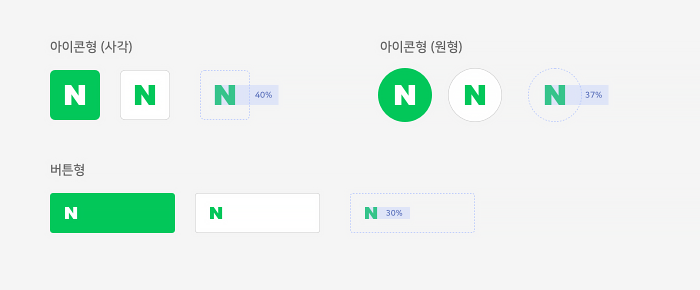
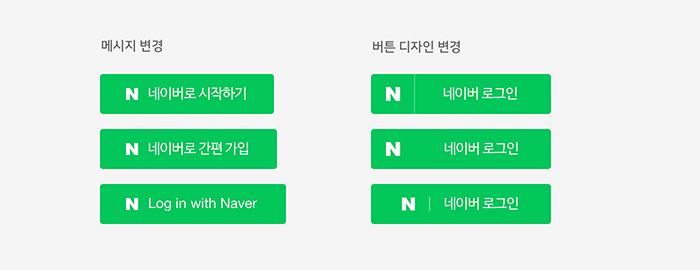
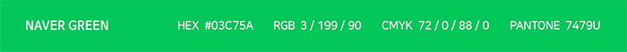
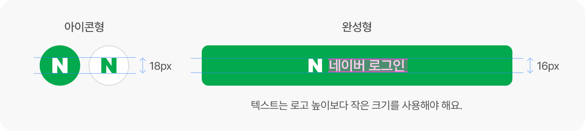

# 로그인 버튼 사용 가이드

<html lang="ko">
<head>
    <title>NAVER Developers - 네이버아이디로로그인 로그인 버튼 사용 가이드</title>
    <meta name="description" content="NAVER Developers - 네이버아이디로로그인 로그인 버튼 사용 가이드">
</head>
<body>

    

        

    

    

        네이버 아이디로 로그인은 애플리케이션에 사용할 수 있는 네이버 로그인 버튼 기본 이미지를 제공합니다. 애플리케이션의 상황에 맞게 버튼 이미지의 디자인을 변경할 수 있지만 네이버 고유의 아이덴티티를 유지할 수 있도록 이 가이드에 제시된 디자인을 최대한 유지하는 것을 권장합니다. 
    

    

        <a class="btn_b_hi3" href="https://developers.naver.com/apps/#/register?api=nvlogin">오픈 API 이용 신청 &gt;</a>
    

     
    <ul class="list_type1">
        <li>버튼 이미지 다운로드(한글)
            

                <a class="btn_n" href="https://developers.naver.com/inc/devcenter/downloads/naveridro/2021_Login_with_naver_guidelines_kr.ai">
                    <i class="xi-download"></i> 버튼 다운로드(ai)</a>
                
                <a class="btn_n" href="https://developers.naver.com/inc/devcenter/downloads/naveridro/2021_Login_with_naver_guidelines_Kr.zip">
                    <i class="xi-download"></i> 버튼 다운로드(png)</a>
                
            

        </li>
        <li>버튼 이미지 다운로드(영문)
            

                <a class="btn_n" href="https://developers.naver.com/inc/devcenter/downloads/naveridro/2021_Login_with_naver_guidelines_En.ai">
                    <i class="xi-download"></i> 버튼 다운로드(ai)</a>
                
                <a class="btn_n" href="https://developers.naver.com/inc/devcenter/downloads/naveridro/2021_Login_with_naver_guidelines_En.zip">
                    <i class="xi-download"></i> 버튼 다운로드(png)</a>
                
            

        </li>
    </ul>
    <h3 class="h_sub">1. 로그인 버튼 기본 디자인</h3>
    

        로그인 버튼은 아이콘과 버튼 레이블로 구성되어 있으며 유형별로 완성형, 축약형, 아이콘형이 제공됩니다.
        네이버의 아이덴티티가 효과적으로 강조되는 녹색 배경의 버튼을 사용할 것을 권장합니다.
    

    

        
    

    <h3 class="h_sub">2. 로고 적용 가이드</h3>
    
로그인 버튼에 사용하는 네이버 로고 타입은 다음의 규정을 따릅니다. N 로고 타입을 사용하고 로고를 기준으로 최소한의 여백 공간을 확보하여 적용합니다. 로고의 형태를 변경하거나 다른 형태와의 조합은 금지합니다.

    

        
    

    <h3 class="h_sub">3. 버튼 디자인과 메시지 변경</h3>
    
버튼의 형태는 네이버 고유의 이미지를 해치지 않는 범위 내에서 유연하게 디자인을 변경할 수 있습니다. 
    표시되는 메시지는 네이버 아이디로 로그인 목적에 부합한다면 한글이나 영문 상관없이 변경할 수 있습니다.

    

        
    

    <h3 class="h_sub">4. 컬러규정</h3>
    
로그인 버튼에 사용하는 색상 값은 다음과 같습니다.

    

        
    

    <h3 class="h_sub">5. 금지규정</h3>
    
가이드에서 벗어난 사용은 네이버의 아이덴티티를 약화시키므로 사용상 주의를 기울이도록 합니다.

    

        
    

     
     
     
     

</body>
</html>
