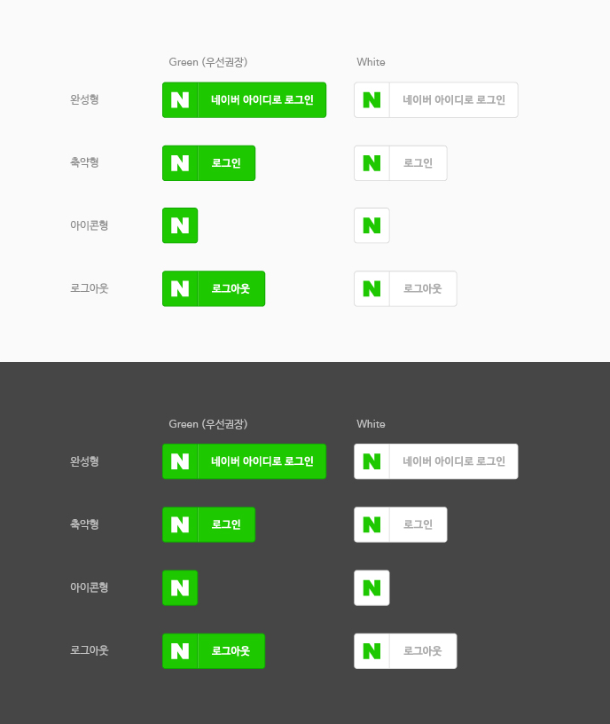
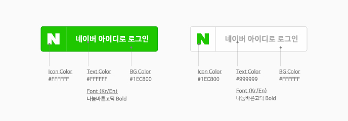
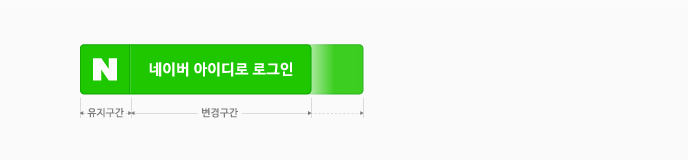
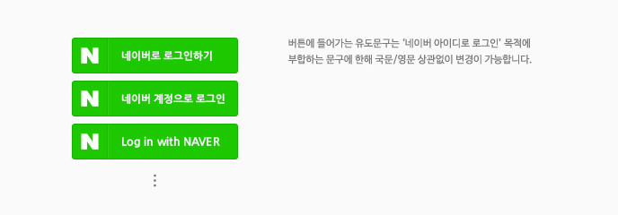
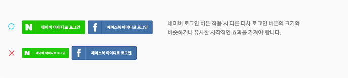

# 로그인 버튼 사용 가이드

<html lang="ko">
<head>
    <title>NAVER Developers - 네이버아이디로로그인 로그인 버튼 사용 가이드</title>
    <meta name="description" content="NAVER Developers - 네이버아이디로로그인 로그인 버튼 사용 가이드">
</head>
<body>

    

        

    

    

        네이버 아이디로 로그인은 애플리케이션에 사용할 수 있는 네이버 로그인 버튼 기본 이미지를 제공합니다.
        애플리케이션의 상황에 맞게 버튼 이미지의 디자인을 변경할 수 있지만 네이버 고유의 아이덴티티를 유지할 수 있도록 이 가이드에 제시된 디자인을 최대한 유지하는 것을 권장합니다. 
    

    

        <a class="btn_b_hi3" href="https://developers.naver.com/apps/#/register?api=nvlogin">오픈 API 이용 신청 &gt;</a>
    

     
    <ul class="list_type1">
        <li>버튼 이미지 다운로드(한글)  
            <a class="btn_n" href="https://developers.naver.com/inc/devcenter/downloads/naveridro/2014_Login_with_Naver_Guidelines.ai"><i class="xi-download"></i> 버튼 다운로드(ai)</a>
            <a class="btn_n" href="https://developers.naver.com/inc/devcenter/downloads/naveridro/2014_Login_with_NAVER_button_png.zip"><i class="xi-download"></i> 버튼 다운로드(png)</a>   
        </li>
        <li>버튼 이미지 다운로드(영문)  
            <a class="btn_n" href="https://developers.naver.com/inc/devcenter/downloads/naveridro/2015_Login_with_Naver_Guidelines_en.ai"><i class="xi-download"></i> 버튼 다운로드(ai)</a>
            <a class="btn_n" href="https://developers.naver.com/inc/devcenter/downloads/naveridro/2015_Login_with_NAVER_button_png_en.zip"><i class="xi-download"></i> 버튼 다운로드(png)</a>
        </li>
    </ul>
    <h3 class="h_sub">1. 로그인 버튼 기본 디자인</h3>
    

        로그인 버튼은 아이콘과 버튼 레이블로 구성되어 있으며 유형별로 완성형, 축약형, 아이콘형이 제공됩니다.
        네이버의 아이덴티티가 효과적으로 강조되는 녹색 배경의 버튼을 사용할 것을 권장합니다.
    

    

        
    

    <h3 class="h_sub">2. 디자인 사양</h3>
    
로그인 버튼에 사용하는 색상과 글꼴은 다음의 규정을 따릅니다.

    

        
    

    <h4 class="h_subsub">2.1. 녹색 배경 버튼</h4>
    <table border="1" class="tbl_h">
        <caption>녹색 배경 버튼 설명 표</caption>
        <colgroup>
            <col style="width:20%"><col>
        </colgroup>
        <thead>
        <tr>
            <th scope="col">구성 요소</th>
            <th scope="col">디자인 규정</th>
        </tr>
        </thead>
        <tbody>
        <tr class="big">
            <td class="left">아이콘</td>
            <td class="left">색상: #FFFFFF</td>
        </tr>
        <tr class="big">
            <td class="left">글자</td>
            <td class="left">
                색상: #FFFFFF 
                글꼴: 나눔바른고딕 Bold
            </td>
        </tr>
        <tr class="big">
            <td class="left">배경</td>
            <td class="left">색상: #1EC800</td>
        </tr>
        </tbody>
    </table>
    <h4 class="h_subsub">2.2. 흰색 배경 버튼</h4>
    <table border="1" class="tbl_h">
        <caption>흰색 배경 버튼 설명 표</caption>
        <colgroup>
            <col style="width:20%"><col>
        </colgroup>
        <thead>
        <tr>
            <th scope="col">구성 요소</th>
            <th scope="col">디자인 규정</th>
        </tr>
        </thead>
        <tbody>
        <tr class="big">
            <td class="left">아이콘</td>
            <td class="left">색상: #1EC800</td>
        </tr>
        <tr class="big">
            <td class="left">글자</td>
            <td class="left">
                색상: #999999 
                글꼴: 나눔바른고딕 Bold
            </td>
        </tr>
        <tr class="big">
            <td class="left">배경</td>
            <td class="left">색상: #FFFFFF</td>
        </tr>
        </tbody>
    </table>
    <h3 class="h_sub">3. 크기 변경</h3>
    

        버튼의 너비는 버튼에 표시되는 메시지의 길이와 적용할 영역의 상황에 맞도록 조절할 수 있습니다.
        단, 네이버 아이콘이 있는 유지 구간의 가로, 세로 비율은 유지해야 합니다.
    

    

        
    

    <h3 class="h_sub">4. 메시지 변경</h3>
    
버튼에 표시되는 메시지는 네이버 아이디로 로그인 목적에 부합한다면 한글이나 영문 상관 없이 변경할 수 있습니다.

    

        
    

    <h3 class="h_sub">5. 버튼 디자인 변경</h3>
    
네이버 로그인 버튼은 네이버 고유의 이미지를 해치지 않는 범위 내에서 유연하게 디자인을 변경할 수 있습니다.

    

        
    

    <h3 class="h_sub">6. 다른 버튼과 함께 사용</h3>
    
네이버 로그인 버튼을 다른 로그인 버튼과 함께 사용할 때는 다른 로그인 버튼의 크기와 비슷하거나 유사한 시각적 효과를 나타내야 합니다.

    

        
    

    <h3 class="h_sub">7. 금지 규정</h3>
    

        이 가이드를 벗어난 디자인은 네이버의 아이덴티티를 약화시키므로 사용상 주의를 기울이도록 합니다.
        다음은 가이드를 벗어나 사용한 예입니다.
    

    

        
    

    <h3 class="h_sub">8. 색상 규정</h3>
    
로그인 버튼에 사용하는 색상값은 다음과 같습니다.

    

        
    

     
     
     
     

</body>
</html>