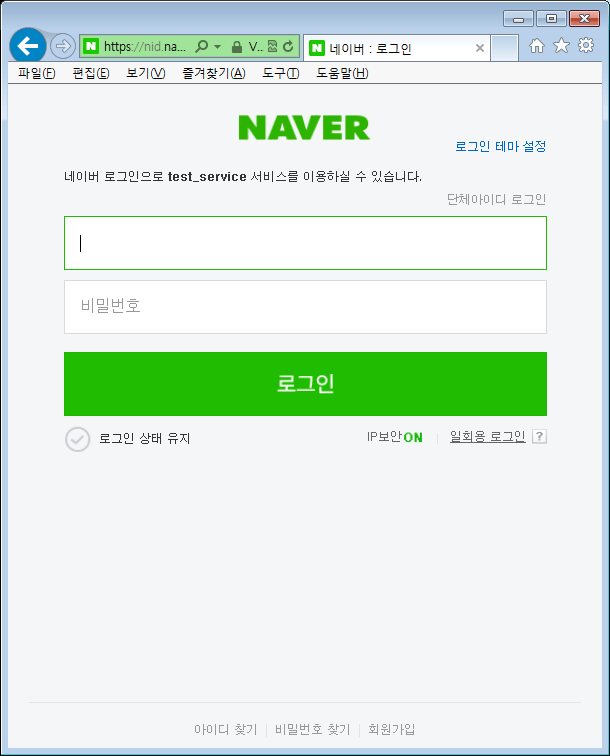
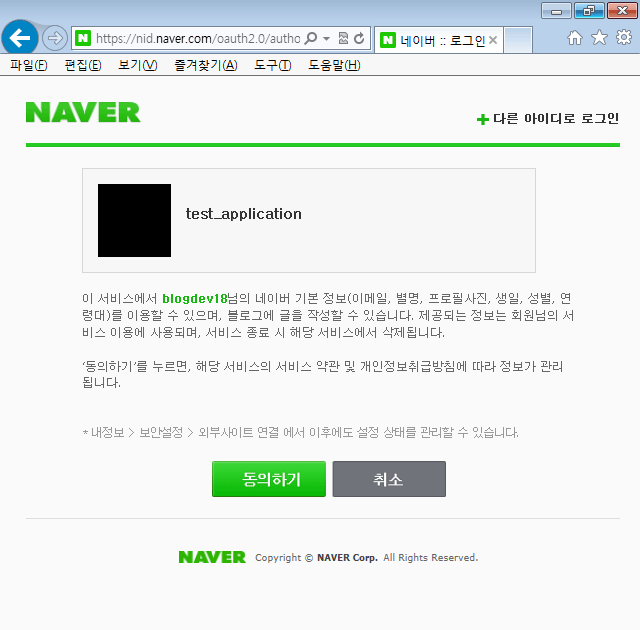
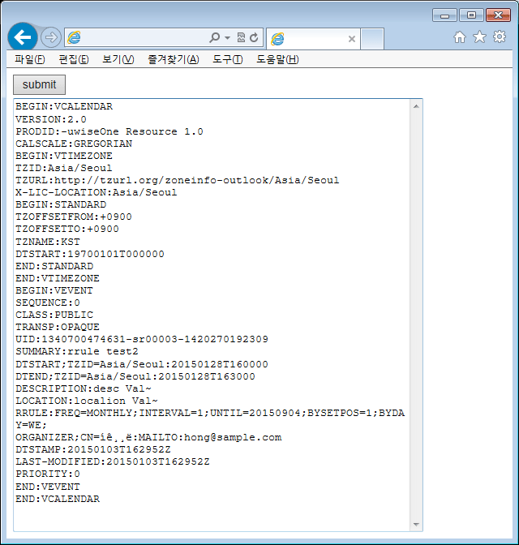
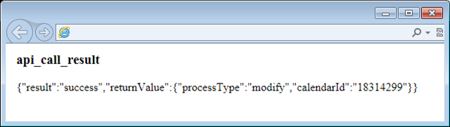

# 캘린더 튜토리얼

<html lang="ko">
<head>
    <title>NAVER Developers - 캘린더 튜토리얼</title>
    <meta name="description" content="NAVER Developers - 캘린더 튜토리얼">
</head>
<body>

    

        

    

    <h3 class="h_sub">사전 준비</h3>
    

        아래 샘플 프로젝트는 JDK 1.7 / maven / Spring Boot 환경에서 실행 가능합니다.
        네이버 Open Api 사용을 위해서는 http://developers.naver.com/register 페이지에서 사용하실 서비스 등록작업이 필요합니다. 등록하신 CLIENT_ID, CLIENT_SECRET, CALLBACK_URL 값을 샘플 프로젝트에 입력하시면 준비가 완료됩니다.
        Application.java의 main method를 실행 하시면 서버가 시작됩니다.
    

    

        <a class="btn_n" href="https://developers.naver.com/inc/devcenter/lib/calendar_openApi_sample.tar.gz"><i class="xi-download"></i> 샘플코드 다운로드</a>
        <a class="btn_b_hi3" href="https://developers.naver.com/apps/#/register?api=calendar">오픈 API 이용 신청 &gt;</a>
    

    <h3 class="h_sub">1. 인증단계</h3>
    <ul class="list_type1">
        <li>네이버 Open Api 사용을 위해서는 미리 2단계의 인증을 받아야 합니다.</li>
        <li>첫 번째. 로그인한 사용자에게 OAuth를 사용해서, 특정 서비스를 사용하겠다는 동의</li>
        <li>두 번째. 동의한 사용자인경우, 오픈 API를 사용하기 위한 accessToken 획득</li>
        <li>상세 설명은<a href="/overview/overview.md" target="_blank" title="새창" class="color_p2 underline">"네이버 로그인 개발가이드"</a>로 대체합니다.</li>
    </ul>
    <h3 class="h_sub">2. 설명 (샘플 프로젝트 중 CalendarController.java 파일에 대한 설명입니다.)</h3>
    <h4 class="h_subsub">2.1. index.nhn &ndash; OAuth 인증이 없는 사용자가 접근할 경우, 인증 페이지로 redirect합니다.</h4>
    

<pre class="prettyprint">
@RequestMapping("/index.nhn")
public ModelAndView index(HttpServletRequest request, HttpServletResponse response, Model model) {
	String authorizationCode = getParam(request, KEY_AUTH_RESPONSE_TYPE);
	String accessToken = getParam(request, KEY_ACCESS_TOKEN);
 
	// 회원 정보 동의얻는 화면으로 이동. 동의를 얻으면 다시 /index.nhn로 callBack
	if (Strings.isNullOrEmpty(authorizationCode) && Strings.isNullOrEmpty(accessToken)) {
	log.info("인증코드 미확인. 인증획득 화면으로 이동");
	return redirectToAuthPage(response);
	}
 
	// accessToken이 없다면, accessToken을 획득한다.
	if (Strings.isNullOrEmpty(accessToken)) {
		log.info("access_token 획득 시도");
		accessToken = getAccessToken(authorizationCode, getParam(request, KEY_STATE));
		if (Strings.isNullOrEmpty(accessToken)) {
			model.addAttribute(KEY_API_CALL_RESULT, "인증값 획득 실패!");
			return new ModelAndView("callResult");
		}
	}
	model.addAttribute(KEY_ACCESS_TOKEN, accessToken);
	return inputSchedule(request, response, model);
}
</pre>
    

    

<pre class="prettyprint">
private ModelAndView redirectToAuthPage(HttpServletResponse response) {
	String state = "stateVal" + new java.util.Random().nextInt();
	response.addHeader(KEY_STATE, state);
 
	String authUrl = AUTHORIZE_URL + "?client_id=" + CLIENT_ID + "&response_type=" + KEY_AUTH_RESPONSE_TYPE + "&redirect_uri=" + URLEncoder.encode(CALLBACK_URL) + "&state=" + state;
	log.info(authUrl);
 
	return new ModelAndView("redirect:" + authUrl);
}
</pre>
    

    <h4 class="h_subsub">2.2. OAuth를 사용하는 애플리케이션에 대한 동의 절차 페이지</h4>
    

    

    <h4 class="h_subsub">2.3. 동의하기를 click 한 경우, redirect 시 설정한 CALLBACK_URL (예제에서는 index.nhn)를 호출하게 됩니다. Index.nhn에서는 OAuth 인증을 확인했으므로, AccessToken의 획득을 시도합니다.</h4>
    

<pre class="prettyprint">
private String getAccessToken(String authCode, String state) {
	String authUrl = "https://nid.naver.com/oauth2.0/token?client_id=" + CLIENT_ID + "&client_secret=" + CLIENT_SECRET + "&grant_type=authorization_code&response_type=authorization_code&state=" + state + "&code=" + authCode;
	log.info(authUrl);
 
	String result = callApiByGet(authUrl);
 
	Map&lt;String, Object&gt; accessTokenMap;
	try {
		accessTokenMap = new ObjectMapper().readValue(result, HashMap.class);
	} catch (Exception e) {
		log.warn(e.getMessage(), e);
		return null;
	}
 
	String tokenType = (String) accessTokenMap.get("token_type");
	String accessToken = (String) accessTokenMap.get("access_token");
 
	log.info("accessToken=" + accessToken);
	log.info("token_type=" + tokenType);
 
	return accessToken;
}
</pre>
    

    <h4 class="h_subsub">2.4. AccessToken을 획득한 후, inputSchedule.nhn으로 화면을 넘깁니다.</h4>
    

<pre class="prettyprint">
@RequestMapping("/inputSchedule.nhn")
public ModelAndView inputSchedule(HttpServletRequest request, HttpServletResponse response, Model model) {
	log.info("일정 등록 화면 로딩");
	return new ModelAndView("inputSchedule");
}
</pre>
    

    

        inputSchedule.nhn에 대한 설명입니다.
    

    

<pre class="prettyprint">
&lt;!DOCTYPE html&gt;
&lt;html&gt;
&lt;head&gt;
&lt;title&gt;Write API&lt;/title&gt;
&lt;meta http-equiv="Content-Type" content="text/html; charset=utf-8" /&gt;
&lt;/head&gt;
 
&lt;body&gt;
	&lt;!-- &lt;p th:text="'access_token : ' + $access_token "/&gt; --&gt;
 
	&lt;form name="postWriteFrm" id="postWriteFrm" method="POST" action="createSchedule.nhn"
          target="writeFrmGen" enctype="multipart/form-data"&gt;
 
	&lt;input type="hidden" name="access_token" th:value="$access_token"/&gt;
	&lt;input type="submit" value="submit"/&gt;&lt;br/&gt;
 
	&lt;textarea name="scheduleIcalString" style="width: 500px; height: 700px;"&gt;
		BEGIN:VCALENDAR
		VERSION:2.0
		PRODID:-uwiseOne Resource 1.0
		CALSCALE:GREGORIAN
		BEGIN:VTIMEZONE
		TZID:Asia/Seoul
		TZURL:http://tzurl.org/zoneinfo-outlook/Asia/Seoul
		X-LIC-LOCATION:Asia/Seoul
		BEGIN:STANDARD
		TZOFFSETFROM:+0900
		TZOFFSETTO:+0900
		TZNAME:KST
		DTSTART:19700101T000000
		END:STANDARD
		END:VTIMEZONE
		BEGIN:VEVENT
		SEQUENCE:0
		CLASS:PUBLIC
		TRANSP:OPAQUE
		UID:1340700474631-sr00003-1420270192309
		SUMMARY:rrule test2
		DTSTART;TZID=Asia/Seoul:20150128T160000
		DTEND;TZID=Asia/Seoul:20150128T163000
		DESCRIPTION:desc Val~
		LOCATION:localion Val~
		RRULE:FREQ=MONTHLY;INTERVAL=1;UNTIL=20150904;BYSETPOS=1;BYDAY=WE;
		ORGANIZER;CN=홍길동:MAILTO:hong@sample.com
		DTSTAMP:20150103T162952Z
		LAST-MODIFIED:20150103T162952Z
		PRIORITY:0
		END:VEVENT
		END:VCALENDAR
	&lt;/textarea&gt;
	&lt;/form&gt;
&lt;/body&gt;
&lt;/html&gt;
</pre>
    

    

    <h4 class="h_subsub">2.5.	일정 iCal을 입력 후, submit으로 createSchedule.nhn을 호출합니다.</h4>
    

        createSchedule은 From에서 parameter를 추출한 후, 일정 생성 openAPI https://openapi.naver.com/calendar/createSchedule.json를 호출합니다.
    

    

<pre class="prettyprint">
@RequestMapping("/createSchedule.nhn")
public ModelAndView createSchedule(HttpServletRequest request, HttpServletResponse response, Model model) {
	log.info("일정 생성 요청 전송");
	Map&lt;String, String&gt; param = new HashMap&lt;String, String&gt;();
	param.put("calendarId", "defaultCalendarId");
	param.put("scheduleIcalString", getParam(request, "scheduleIcalString"));
	String result = callApi(CREATE_SCHEDULE_API_URL, param, getParam(request, KEY_ACCESS_TOKEN));
	log.info("result=" + result);
	model.addAttribute(KEY_API_CALL_RESULT, result);
	return new ModelAndView("callResult");
}
</pre>
    

    <h4 class="h_subsub">2.6.	호출 결과를 표시합니다. 새로운 일정 uuid를 사용하면 create, 같은 uuid로 생성을 시도하면 기존 일정을 수정한 modify가 반환됩니다.</h4>
    

        callResult.nhn에 대한 설명입니다.
    

    

<pre class="prettyprint">
&lt;!DOCTYPE html&gt;
&lt;html&gt;
&lt;head&gt;
&lt;title&gt;Call result&lt;/title&gt;
&lt;meta http-equiv="Content-Type" content="text/html; charset=utf-8" /&gt;
&lt;/head&gt;
&lt;body&gt;
	&lt;h3&gt; api_call_result &lt;/h3&gt;
	&lt;p th:text="$api_call_result"/&gt;
&lt;/body&gt;
&lt;/html&gt;
</pre>
    

    

     
     
     
     

</body>
