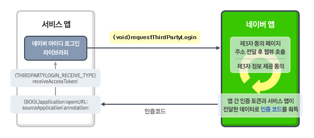
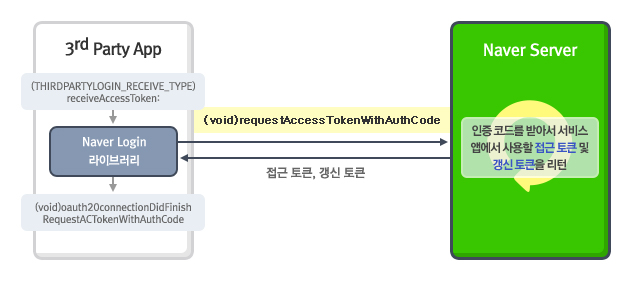
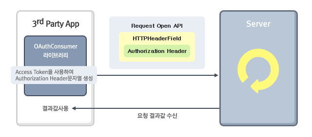

# IOS

> 위 문서는 네이버 아이디로 로그인 iOS SDK 구버전(5.0.0 버전 미만)에 대한 가이드를 제공합니다.
> 구버전 SDK 지원이 종료될 예정이니, 신버전 SDK를 사용해주시길 바랍니다.
> [신버전 가이드](ios.md)

<html lang="ko">
<head>
    <title>NAVER Developers - 네이버 로그인 iOS 개발가이드</title>
    <meta name="description" content="NAVER Developers - 네이버 로그인 iOS 개발가이드">
</head>
<body>

    

        

    

    
iOS용 네이버 로그인 라이브러리는 Objective-C로 만들어졌으며, 서드파티 애플리케이션에서 네이버 로그인이 제공하는 로그인, 로그아웃, 토큰 관리 등의 기능을 쉽게 구현할 수 있게 합니다.

     
    

        <a class="btn_b_hi3" href="/sdks/sdks.md">라이브러리 보기 &gt;</a>
        <a class="btn_b_hi3" href="https://developers.naver.com/apps/#/register?api=nvlogin">오픈 API 이용 신청 &gt;</a>
    

    <h3 class="h_sub">1. 요구 사항</h3>
    
네이버 로그인 라이브러리를 사용하려면 다음과 같은 환경이 필요합니다.

    <ul class="list_type1">
        <li>애플리케이션 사용 환경: iOS 9.0 이상</li>
        <li>IDE: XCode 9.0 이상</li>
    </ul>
    <h3 class="h_sub">2. 라이브러리 구성</h3>
    
iOS용 네이버 로그인 라이브러리는 다음과 같이 이루어져 있습니다.

    <ul class="list_type1">
        <li>NaverThirdPartyLogin.Framework 
        </li>
    </ul>
    <h3 class="h_sub">3. OAuth 2.0 인증 절차</h3>
    
애플리케이션에서 OAuth 2.0으로 네이버 로그인을 사용할 때 애플리케이션과 네이버 앱, 네이버 서버 사이에 인증을 요청하고 인증 코드(authentication code)와 접근 토큰(access token)을 획득하는 과정, 오픈 API를 호출하는 과정은 다음과 같습니다.

    <h4 class="h_subsub">3.1. 인증 코드 획득</h4>
    

        
    

    

        사용자가 애플리케이션에서 네이버 로그인할 때 애플리케이션은 네이버 앱에 OAuth 2.0 인증을 요청합니다. 네이버 앱은 간편 로그인 프로세스를 거쳐 인증 코드를 획득하고, 획득한 인증 코드를 애플리케이션의 URL Scheme을 통해 애플리케이션에 반환합니다.
        모바일 기기에 네이버 앱이 설치돼 있지 않다면 SafariViewController를 실행해 로그인 절차를 진행합니다. 로그인 절차를 거치면 애플리케이션의 URL Scheme을 통해 애플리케이션에 인증 코드가 반환됩니다. 애플리케이션은 반환받은 인증 코드로 인증 성공 여부를 판단하고 오픈 API 호출 시 필요한 값을 사용할 수 있도록 준비합니다.
    

    <h4 class="h_subsub">3.2. 접근 코드 획득</h4>
    

        
    

    
인증 코드 획득에 성공하면 네이버 서버에서 접근 토큰과 갱신 토큰(refresh token)을 받아옵니다. 서버 호출 결과로 값을 받으면 델리게이트를 호출하고 호출 성공 여부를 판단합니다. 호출에 성공하면 접근 토큰으로 오픈 API를 호출할 수 있습니다.

    <h4 class="h_subsub">3.3. 오픈 API 호출</h4>
    

        
    

    
오픈 API를 호출할 때 애플리케이션에서는 접근 토큰을 사용해 인증 헤더(authorization header) 문자열을 구성해야 합니다. 이렇게 구성된 문자열은 오픈 API 호출 시 HTTP Header 필드에 추가해 서버로 함께 전송합니다.

    <h3 class="h_sub">4. 개발 환경 설정</h3>
    
<a href="https://github.com/naver/naveridlogin-sdk-ios">샘플앱 및 라이브러리 다운로드 링크</a>

    <h3 class="h_sub">5. 기본 설정</h3>
    <h4 class="h_subsub">5.1. 인증 방식 설정</h4>
    

        네이버 로그인에 사용할 인증 방식을 설정합니다. iOS에서 네이버 로그인을 사용할 때 사용하는 인증 방식은 두 가지가 있습니다. 첫 번째는 네이버 앱을 활성화해 인증하는 방식이고, 두 번째는 애플리케이션에서 SafariViewController를 실행해 인증하는 방식입니다.
        네이버 앱으로 인증하는 방식과 SafariViewController에서 인증하는 방식을 모두 활성화하면 네이버 로그인할 때 모바일 기기에 네이버 앱이 설치돼 있는지 확인합니다. 네이버 앱이 설치돼 있다면 네이버 앱으로 인증하고, 네이버 앱이 설치돼 있지 않으면 SafariViewController에서 인증합니다.
    

    <ul class="list_type1">
        <li>네이버 앱으로 인증하는 방식을 활성화하려면 앱 델리게이트에 다음 코드를 추가합니다. 
            

                <pre class="prettyprint">[[NaverThirdPartyLoginConnection getSharedInstance] setIsNaverAppOauthEnable:YES];</pre>
            

        </li>
        <li>SafariViewContoller에서 인증하는 방식을 활성화하려면 앱 델리게이트에 다음 코드를 추가합니다. 
            

                <pre class="prettyprint">[[NaverThirdPartyLoginConnection getSharedInstance] setIsInAppOauthEnable:YES];</pre>
            

        </li>
    </ul>
    <h4 class="h_subsub">5.2. 화면 방향 설정</h4>
    
인증 화면을 iPhone의 세로 모드에서만 사용하려면 다음 코드를 추가합니다.

    

        <pre class="v1">[[NaverThirdPartyLoginConnection getSharedInstance] setOnlyPortraitSupportInIphone:YES];</pre>
    

    <h4 class="h_subsub">5.3. 네이버 로그인하기 설정</h4>
    
네이버 로그인 라이브러리가 사용하는 상수를 설정하는 파일인 NaverThirdPartyConstantsForApp.h 파일에서 상숫값을 개발하고 있는 애플리케이션에 맞는 값으로 변경합니다.

    

<pre class="prettyprint">...
#define kUrlSampleAppUrlScheme @"thirdparty20samplegame" // 콜백을 받을 URL Scheme
#define kConsumerKey @"jyvqXeaVOVmV" // 애플리케이션에서 사용하는 클라이언트 아이디
#define kConsumerSecret @"527300A0_COq1_XV33cf" // 애플리케이션에서 사용하는 클라이언트 시크릿
#define kServiceAppName @"네이버 로그인하기" // 애플리케이션 이름
</pre>
    

    
상수에 설정하는 값은 다음과 같습니다.

    <table border="1" class="tbl_h">
        <caption>상수 설명 표</caption>
        <colgroup>
            <col style="width:25%"><col>
        </colgroup>
        <thead>
        <tr>
            <th scope="col">상수</th>
            <th scope="col">설명</th>
        </tr>
        </thead>
        <tbody>
        <tr class="big">
            <td class="left">kUrlSampleAppUrlScheme</td>
            <td class="left">
                애플리케이션을 등록할 때 입력한 URL Scheme 
                OAuth 2.0 로그인 프로세스가 완료되고 난 뒤 콜백을 받을 URL Scheme입니다.
            </td>
        </tr>
        <tr class="big">
            <td class="left">kConsumerKey</td>
            <td class="left">애플리케이션 등록 후 발급받은 클라이언트 아이디</td>
        </tr>
        <tr class="big">
            <td class="left">kConsumerSecret</td>
            <td class="left">애플리케이션 등록 후 발급받은 클라이언트 시크릿</td>
        </tr>
        <tr class="big">
            <td class="left">kServiceAppName</td>
            <td class="left">애플리케이션 이름</td>
        </tr>
        </tbody>
    </table>
    
다음과 같이 NaverThirdPartyLoginConnection 객체를 앱 델리게이트에 설정해 NaverThirdPartyConstantsForApp.h 파일의 상숫값을 애플리케이션에서 사용할 수 있게 합니다.

    

<pre class="prettyprint">#import &lt;NaverThirdPartyLogin/NaverThirdPartyLogin.h&gt;
 
- (BOOL)application:(UIApplication *)application didFinishLaunchingWithOptions:(NSDictionary *)launchOptions
{
    ... 생략 ...
 
    NaverThirdPartyLoginConnection *thirdConn = [NaverThirdPartyLoginConnection getSharedInstance];
    [thirdConn setServiceUrlScheme:kServiceAppUrlScheme];
    [thirdConn setConsumerKey:kConsumerKey];
    [thirdConn setConsumerSecret:kConsumerSecret];
    [thirdConn setAppName:kServiceAppName];
 
    ... 생략 ...
 
    return YES;
}
</pre>
    

    
NaverThirdPartyLoginConnection 객체에서 사용하는 속성은 다음과 같습니다.

    <table border="1" class="tbl_h">
        <caption>상수 설명 표</caption>
        <colgroup>
            <col style="width:25%"><col>
        </colgroup>
        <thead>
        <tr>
            <th scope="col">상수</th>
            <th scope="col">설명</th>
        </tr>
        </thead>
        <tbody>
        <tr class="big">
            <td class="left">serviceUrlScheme</td>
            <td class="left">
                OAuth 2.0 로그인 프로세스가 완료되고 난 뒤 콜백을 받을 URL Scheme 
                애플리케이션을 등록할 때 입력한 URL Scheme입니다.
            </td>
        </tr>
        <tr class="big">
            <td class="left">consumerKey</td>
            <td class="left">
                접근 토큰 요청에 사용하는 클라이언트 아이디 
                애플리케이션 등록 후 발급받은 클라이언트 아이디입니다.
            </td>
        </tr>
        <tr class="big">
            <td class="left">consumerSecret</td>
            <td class="left">
                접근 토큰 요청에 사용하는 클라이언트 시크릿 
                애플리케이션 등록 후 발급받은 클라이언트 시크릿입니다.
            </td>
        </tr>
        <tr class="big">
            <td class="left">appName</td>
            <td class="left">애플리케이션 이름</td>
        </tr>
        </tbody>
    </table>
    <h3 class="h_sub">6. 로그인</h3>
    
NaverThirdPartyLoginConnection 객체의 인스턴스를 생성하고 다음 API를 호출해 접근 토큰을 요청합니다.

    

        <pre class="prettyprint">- (void) requestThirdPartyLogin;</pre>
    

    
API가 호출되면 간편 로그인 Scheme을 이용해 네이버 앱이 호출됩니다. 네이버 앱이 설치되지 않았으면 SafariViewController가 실행됩니다.

    

<pre class="prettyprint">// SampleOAuthViewController.m
- (void) requestThirdpartyLogin {
    // NaverThirdPartyLoginConnection의 인스턴스에 인증을 요청합니다.
    NaverThirdPartyLoginConnection *tlogin = [NaverThirdPartyLoginConnection getSharedInstance];
    tlogin.delegate = self;
    [tlogin requestThirdPartyLogin];
}
</pre>
    

    

        <strong>약전계에서 로그인 호출 시</strong>
        
- 로그인에 성공했을 때는 - (void)oauth20ConnectionDidFinishRequestACTokenWithAuthCode; 델리게이트가 호출되고 accessToken 메서드로 접근 토큰 정보를 얻을 수 있습니다.

        
- 로그인에 실패했을 때는 - (void)oauth20Connection:(NaverThirdPartyLoginConnection *)oauthConnectiondidFailWithError:(NSError *)error; 델리게이트가 호출되고 error 변수로 실패 이유와 메시지를 확인할 수 있습니다.

    

    <h3 class="h_sub">7. 인증 코드 및 접근 토큰 획득</h3>
    
네이버 앱에서 OAuth 2.0 인증 로그인 프로세스가 완료되면 다음과 같이 애플리케이션의 URL Scheme을 통해 인증 코드를 받아옵니다.

    

        <pre class="prettyprint">{애플리케이션의 URL Scheme}://thirdPartyLoginResult?version=2&amp;code=0&amp;authCode={인증 코드}</pre>
    

    
응답받은 URL의 값이 파라미터로 전달한 URL Scheme과 동일한지 확인한 후 해당 값(URL)을 네이버 로그인 라이브러리에 전달합니다. 네이버 앱으로부터 받은 결괏값을 네이버 로그인 라이브러리에 전달할 때는 애플리케이션에서 다음 API를 호출합니다.

    

        <pre class="v1">- (THIRDPARTYLOGIN_RECEIVE_TYPE) receiveAccessToken:(NSURL *) url</pre>
    

    

        URL을 전달받은 네이버 로그인 라이브러리의 receiveAccessToken 메서드는 네이버 앱으로부터 받은 결과의 상탯값을 반환합니다. 애플리케이션에서는 반환받은 상탯값에 맞게 처리합니다. 
        THIRDPARTYLOGIN_RECEIVE_TYPE의 상탯값은 다음과 같습니다.
    

    <table border="1" class="tbl_h">
        <caption>상수 설명 표</caption>
        <colgroup>
            <col style="width:25%"><col>
        </colgroup>
        <thead>
        <tr>
            <th scope="col">상수</th>
            <th scope="col">설명</th>
        </tr>
        </thead>
        <tbody>
        <tr class="big">
            <td class="left">SUCCESS</td>
            <td class="left">
                성공적으로 결괏값을 받은 경우 
                라이브러리에서 인증 코드를 이용해 접근 토큰과 갱신 토큰을 받기 위해서 자동으로 네이버 서버를 호출합니다.
            </td>
        </tr>
        <tr class="big">
            <td class="left">PARAMETERNOTSET</td>
            <td class="left">파라미터가 설정되지 않은 경우</td>
        </tr>
        <tr class="big">
            <td class="left">CANCELBYUSER</td>
            <td class="left">사용자에 의해 로그인이 취소된 경우</td>
        </tr>
        <tr class="big">
            <td class="left">NAVERAPPNOTINSTALLED</td>
            <td class="left">
                SafariViewController 인증을 활성화하지 않았고, 네이버 앱이 설치되지 않은 경우 
                네이버 로그인 라이브러리에서 App Store로 이동할 것인지 묻는 창을 열어 네이버 앱의 설치를 유도합니다.
            </td>
        </tr>
        <tr class="big">
            <td class="left">NAVERAPPVERSIONINVALID</td>
            <td class="left">
                SafariViewController 인증을 활성화하지 않았고, 적절한 버전의 네이버 앱이 설치되어 있지 않은 경우 
                네이버 로그인 라이브러리에서 App Store로 이동할 것인지 묻는 창을 열어 네이버 앱의 업데이트를 유도합니다.
            </td>
        </tr>
        <tr class="big">
            <td class="left">OAUTHMETHODNOTSET</td>
            <td class="left">
                네이버 앱 인증과 SafariViewController 인증을 모두 활성화하지 않은 경우 
                네이버 앱 인증 방식이나 SafariViewController 인증 방식 가운데 하나라도 활성화해야 네이버 로그인을 사용할 수 있습니다. 인증 방식을 활성화하는 방법은 "인증 방식 설정"을 참고합니다.
            </td>
        </tr>
        </tbody>
    </table>
    

<pre class="prettyprint">// NaverOAuthSampleAppDelegate.m
- (BOOL)application:(UIApplication *)app openURL:(NSURL *)url options:(NSDictionary<nsstring *,id=""> *)options {
    return [[NaverThirdPartyLoginConnection getSharedInstance] application:app openURL:url options:options];
}
</nsstring></pre>
    

    <h3 class="h_sub">8. 접근 토큰 갱신</h3>
    
발급받은 접근 토큰의 유효 기간은 3,600초(1시간)입니다. 유효 기간이 지나면 갱신 토큰으로 접근 토큰을 재발급받아야 합니다. 접근 토큰이 유효한지는 다음 메서드로 확인합니다.

    

        <pre class="prettyprint">- (BOOL) isValidAccessTokenExpireTimeNow;</pre>
    

    <table border="1" class="tbl_h">
        <caption>호출결과 설명 표</caption>
        <colgroup>
            <col style="width:25%"><col>
        </colgroup>
        <thead>
        <tr>
            <th scope="col">호출 결과</th>
            <th scope="col">설명</th>
        </tr>
        </thead>
        <tbody>
        <tr class="big">
            <td class="left">YES</td>
            <td class="left">접근 토큰이 있고 유효 기간이 남아 있는 경우</td>
        </tr>
        <tr class="big">
            <td class="left">NO</td>
            <td class="left">접근 토큰이 없거나 유효 기간이 지난 경우</td>
        </tr>
        </tbody>
    </table>
    
유효 기간이 지난 접근 토큰은 다음 메서드로 재발급을 요청합니다.

    

        <pre class="prettyprint">- (void)requestAccessTokenWithRefreshToken;</pre>
    

    
메서드 호출 후 다음과 같이 델리게이트를 호출합니다.

    

<pre class="prettyprint">@protocol NaverThirdPartyLoginConnectionDelegate &lt;NSObject&gt;
// 성공 시에는 아래 델리게이트 호출
- (void)oauth20ConnectionDidFinishRequestACTokenWithRefreshToken;
// 실패 시에는 아래 델리게이트 호출
- (void)oauth20Connection:(NaverThirdPartyLoginConnection *)oauthConnection didFailWithError:(NSError *)error;
</pre>
    

    
다음은 메서드를 이용해 접근 토큰을 재발급하는 코드의 예입니다.

    

<pre class="prettyprint">// SampleOAuthViewController.m
- (void) requestAccessTokenWithRefreshToken {
    NaverThirdPartyLoginConnection *_tlogin = [NaverThirdPartyLoginConnection getSharedInstance];
    _tlogin.delegate = self;
    [_tlogin requestAccessTokenWithRefreshToken];
}
</pre>
    

    <h3 class="h_sub">9. 로그 아웃</h3>
    
사용자가 애플리케이션에서 로그아웃하면 애플리케이션에 저장된 토큰 정보를 삭제합니다. 다음은 네이버 아이디 로그인 토큰 정보를 삭제하는 메서드입니다.

    

        <pre class="prettyprint">- (void)resetToken;</pre>
    

    

        <strong>약전계에서 로그아웃 호출 시</strong>
        
저장된 토큰만 삭제하므로 약전계나 네트워크 오류에 영향을 받지 않습니다.

    

    <h3 class="h_sub">10. 연동 해제</h3>
    
사용자가 애플리케이션과 네이버 로그인 연동을 해제하면 애플리케이션에 저장된 정보와 네이버 서버에 저장된 인증 정보를 삭제합니다. 다음은 연동 해제를 요청하는 메서드입니다.

    

        <pre class="prettyprint">- (void)requestDeleteToken;</pre>
    

    
메서드 호출 후 다음 델리게이트를 호출합니다.

    

<pre class="prettyprint">@protocol NaverThirdPartyLoginConnectionDelegate &lt;NSObject&gt;
// 성공 시에는 아래 델리게이트 호출
- (void)oauth20ConnectionDidFinishDeleteToken;// 실패 시에는 아래 델리게이트 호출
// 실패 시 아래 델리게이트 호출(서버 호출이 실패하더라도 앱에 저장된 토큰은 삭제함)
- (void)oauth20Connection:(NaverThirdPartyLoginConnection *)oauthConnection didFailWithError:(NSError *)error;
</pre>
    

    
다음은 메서드를 이용해 연동 해제를 요청하는 코드의 예입니다.

    

<pre class="prettyprint">// SampleOAuthViewController.m
- (void) requestDeleteToken {
    NaverThirdPartyLoginConnection *_tlogin = [NaverThirdPartyLoginConnection getSharedInstance];
    _tlogin.delegate = self;
    [_tlogin requestDeleteToken];
}</pre>
    

    
사용자가 PC에서 네이버의 내정보 &gt; 보안설정 &gt; 외부 사이트 연결 페이지에 접속하면 외부사이트 → 네이버에서 연결 정보 삭제 여부로 연동이 해제된 것을 확인할 수 있습니다.

    

        <strong>약전계에서 연동 해제 시</strong>
        
requestDeleteToken 메서드로 연동을 해제할 때는 클라이언트에 저장된 토큰과 서버에 저장된 토큰을 모두 삭제합니다. 이때 네트워크 오류가 발생하면 서버 호출에 실패하기 때문에 서버에 저장된 토큰을 삭제하지 못할 수 있습니다.

    

    <h3 class="h_sub">오픈 API 호출</h3>
    

        접근 토큰으로 오픈 API 호출과 같이 보호된 자원에 접근하는 기능을 실행할 수 있습니다.
        HTTP 요청 헤더에 다음과 같이 접근 토큰을 Bearer 형식으로 지정해 오픈 API를 호출합니다.
    

    

<pre class="prettyprint">NSString *urlString = @"https://openapi.naver.com/v1/nid/me"; // 사용자 프로필 호출 API URL
NSMutableURLRequest *urlRequest = [NSMutableURLRequest requestWithURL:[NSURL URLWithString:urlString]];
NSString *authValue = [NSString stringWithFormat:@"Bearer %@", _thirdPartyLoginConn.accessToken];
[urlRequest setValue:authValue forHTTPHeaderField
</pre>
    

    <h3 class="h_sub">12. 네이버 로그인 라이브러리 API</h3>
    <h4 class="h_subsub">12.1. NaverThirdPartyLoginConnection</h4>
    
네이버 아이로 로그인 기본 클래스.

    
NaverThirdPartyLoginConnection 클래스의 메서드는 다음과 같습니다.

    <ul class="list_type1">
        <li>(NSString *)accessToken</li>
        <li>(NSDate *)accessTokenExpireDate</li>
        <li>(NaverThirdPartyConnection *)getSharedInstance</li>
        <li>(NSString *)getVersion</li>
        <li>(BOOL)isValidAccessTokenExpireTimeNow</li>
        <li>(THIRDPARTYLOGIN_RECEIVE_TYPE)receiveAccessToken: (NSURL *)url</li>
        <li>(NSString *)refreshToken</li>
        <li>(void)requestAccessTokenWithRefreshToken</li>
        <li>(void)requestDeleteToken</li>
        <li>(void)requestThirdPartyLogin</li>
        <li>(void)resetToken</li>
        <li>(void)setAppName:(NSString *)appName</li>
        <li>(void)setConsumerKey:(NSString *)consumerKey</li>
        <li>(void)setConsumerSecret:(NSString *)consumerSecret</li>
        <li>(void)setServiceUrlScheme:(NSString *)serviceUrlScheme</li>
        <li>(NSString *)tokenType</li>
    </ul>
    
12.1.1. (NSString *)accessToken

    

        <strong>설명</strong> 
        네이버 로그인 인증 후 네이버 서버에서 받은 접근 토큰(access token)을 반환받습니다.
    

    
<strong>구문</strong>

    

        <pre class="prettyprint">@property (nonatomic, strong) NSString *accessToken;</pre>
    

    

        <strong>파라미터</strong> 
        없음
    

    

        <strong>반환값</strong> 
        접근 토큰
    

    
<strong>코드 예</strong>

    

        <pre class="prettyprint">NSString *accessToken = [[NaverThirdPartyLoginConnection getSharedInstance] accessToken];</pre>
    

    
12.1.2. (NSDate *)accessTokenExpireDate

    

        <strong>설명</strong> 
        접근 토큰(access token)의 만료 시간을 확인합니다.
    

    
<strong>구문</strong>

    

        <pre class="prettyprint">@property (nonatomic, string) accessTokenExpireDate;</pre>
    

    

        <strong>파라미터</strong> 
        없음
    

    

        <strong>반환값</strong> 
        접근 토큰 만료 시간(NSDate 타입)
    

    
<strong>코드 예</strong>

    

        <pre class="prettyprint">NSDate *accessTokenExpireDate = [[NaverThirdPartyLoginConnection getSharedInstance] accessTokenExpireDate];</pre>
    

    
12.1.3. (NaverThirdPartyConnection *)getSharedInstance

    

        <strong>설명</strong> 
        네이버 로그인 인스턴스(싱글턴 인스턴스)를 얻습니다.
    

    
<strong>구문</strong>

    

        <pre class="prettyprint">+ (NaverThirdPartyConnection *) getSharedInstance;</pre>
    

    

        <strong>파라미터</strong> 
        없음
    

    

        <strong>반환값</strong> 
        NaverThirdPartyConnection 객체. 싱글턴 패턴을 이용해 NaverThirdPartyConnection 객체를 새로 생성해 반환하거나 기존에 생성했던 객체를 반환합니다.
    

    
<strong>코드 예</strong>

    

        <pre class="prettyprint">NaverThirdPartyConneciton *thirdPartyConn = [NaverThirdPartyConnection getSharedInstance];</pre>
    

    
12.1.4. (NSString *)getVersion

    

        <strong>설명</strong> 
        네이버 로그인하기 라이브러리의 버전을 확인합니다.
    

    
<strong>구문</strong>

    

        <pre class="prettyprint">- (NSString *)getVersion;</pre>
    

    

        <strong>파라미터</strong> 
        없음
    

    

        <strong>반환값</strong> 
        네이버 로그인하기 라이브러리의 버전. @"4.X.X" 형식의 문자열입니다.
    

    

        <strong>코드 예</strong> 
        없음
    

    
12.1.5. (BOOL)isValidAccessTokenExpireTimeNow

    

        <strong>설명</strong> 
        접근 토큰(access token)이 있는지, 유효 기간이 남아 있는지 확인합니다. 단, 서버에서 유효 기간이 만료된 경우에는 확인할 수 없습니다.
    

    
<strong>구문</strong>

    

        <pre class="prettyprint">- (BOOL) isValidAccessTokenExpireTimeNow;</pre>
    

    

        <strong>파라미터</strong> 
        없음
    

    

        <strong>반환값</strong> 
        접근 토큰 유효 여부
    

    <ul class="list_type1">
        <li>YES: 접근 토큰이 있고 유효 기간이 남아 있음</li>
        <li>NO: 접근 토큰이 없거나 유효 기간이 지났음</li>
    </ul>
    
<strong>코드 예</strong>

    

<pre class="prettyprint">if ( [ [NaverThirdPartyLoginConnection getSharedInstance] isValidAccessTokenExpireTimeNow] ) {
    // API 호출
} else {
    // 갱신 토큰 유무 확인 후 갱신 토큰으로 접근 토큰을 받거나 네이버 아이디 로그인을 다시 진행함
}
</pre>
    

    
12.1.6. (THIRDPARTYLOGIN_RECEIVE_TYPE)receiveAccessToken: (NSURL *)url

    

        <strong>설명</strong> 
        네이버 로그인하기 인증 후에 받환받은 URL Scheme을 처리합니다.
        URL을 전달받은 네이버 로그인 라이브러리의 receiveAccessToken: 메서드는 네이버 앱으로부터 받은 상탯값을 반환합니다. 애플리케이션에서는 반환값을 상태에 맞게 처리해야 합니다. 
        앱 델리게이트 메서드 중 아래 코드 예에 해당하는 메서드를 호출해야 합니다.
    

    
<strong>구문</strong>

    

        <pre class="prettyprint">- (THIRDPARTYLOGIN_RECEIVE_TYPE)receiveAccessToken:(NSURL *)url;</pre>
    

    
<strong>파라미터</strong>

    <table border="1" class="tbl_h">
        <caption>파라미터 설명 표</caption>
        <colgroup>
            <col style="width:15%"><col style="width:15%"><col style="width:15%"><col>
        </colgroup>
        <thead>
        <tr>
            <th scope="col">파라미터</th>
            <th scope="col">타입</th>
            <th scope="col">필수 여부</th>
            <th scope="col">설명</th>
        </tr>
        </thead>
        <tbody>
        <tr class="big">
            <td class="left">url</td>
            <td class="center">NSURL</td>
            <td class="center">Y</td>
            <td class="left">반환받은 URL Scheme 정보</td>
        </tr>
        </tbody>
    </table>
    

        <strong>반환값</strong> 
        THIRDPARTYLOGIN_RECEIVE_TYPE 
        네이버 앱으로부터 받은 결과의 상탯값 
        THIRDPARTYLOGIN_RECEIVE_TYPE의 상탯값은 다음과 같습니다.
    

    <table border="1" class="tbl_h">
        <caption>반환값 설명 표</caption>
        <colgroup>
            <col style="width:25%"><col>
        </colgroup>
        <thead>
        <tr>
            <th scope="col">상탯값</th>
            <th scope="col">설명</th>
        </tr>
        </thead>
        <tbody>
        <tr class="big">
            <td class="left">SUCCESS</td>
            <td class="left">
                성공적으로 결괏값을 받은 경우 
                라이브러리에서 인증 코드를 이용해 접근 토큰과 갱신 토큰을 받기 위해서 자동으로 네이버 서버를 호출합니다.
            </td>
        </tr>
        <tr class="big">
            <td class="left">PARAMETERNOTSET</td>
            <td class="left">파라미터가 설정되지 않은 경우</td>
        </tr>
        <tr class="big">
            <td class="left">CANCELBYUSER</td>
            <td class="left">사용자에 의해 로그인이 취소된 경우</td>
        </tr>
        <tr class="big">
            <td class="left">NAVERAPPNOTINSTALLED</td>
            <td class="left">
                SafariViewController 인증을 활성화하지 않았고, 네이버 앱이 설치되지 않은 경우 
                네이버 로그인 라이브러리에서 App Store로 이동할 것인지 묻는 창을 열어 네이버 앱의 설치를 유도합니다.
            </td>
        </tr>
        <tr class="big">
            <td class="left">NAVERAPPVERSIONINVALID</td>
            <td class="left">
                SafariViewController 인증을 활성화하지 않았고, 적절한 버전의 네이버 앱이 설치되어 있지 않은 경우 
                네이버 로그인 라이브러리에서 App Store로 이동할 것인지 묻는 창을 열어 네이버 앱의 업데이트를 유도합니다.</td>
        </tr>
        <tr class="big">
            <td class="left">OAUTHMETHODNOTSET</td>
            <td class="left">
                네이버 앱 인증과 SafariViewController 인증을 모두 활성화하지 않은 경우 
                네이버 앱 인증 방식이나 SafariViewController 인증 방식 가운데 하나라도 활성화해야 네이버 로그인을 사용할 수 있습니다. 인증 방식을 활성화하는 방법은 "인증 방식 설정"을 참고합니다.
            </td>
        </tr>
        </tbody>
    </table>
    
<strong>코드 예</strong>

    

<pre class="prettyprint">- (void)oauth20Connection:(NaverThirdPartyLoginConnection *)oauthConnection didFailAuthorizationWithRecieveType:(THIRDPARTYLOGIN_RECEIVE_TYPE)recieveType
{
    NSLog(@"Getting auth code from NaverApp faile!");
}
 
- (void)oauth20Connection:(NaverThirdPartyLoginConnection *)oauthConnection didFinishAuthorizationWithResult:(THIRDPARTYLOGIN_RECEIVE_TYPE)recieveType
{
    NSLog(@"Getting auth code from NaverApp success!");
}
</pre>
    

    
12.1.7. (NSString *)refreshToken

    

        <strong>설명</strong> 
        네이버 로그인 인증 후 네이버 서버에서 받은 갱신 토큰(refresh token)을 반환받습니다.
    

    
<strong>구문</strong>

    

        <pre class="prettyprint">@property (nonatomic, string) NSString * refreshToken;</pre>
    

    

        <strong>파라미터</strong> 
        없음
    

    

        <strong>반환값</strong> 
        갱신 토큰
    

    
<strong>코드 예</strong>

    

        <pre class="prettyprint">NSString *refreshToken = [[NaverThirdPartyLoginConnection getSharedInstance] refreshToken];</pre>
    

    
12.1.8. (void)requestAccessTokenWithRefreshToken

    

        <strong>설명</strong> 
        애플리케이션에 저장된 갱신 토큰(refresh token)을 이용해 접근 토큰(access token)을 새로 받아 옵니다.
    

    
<strong>구문</strong>

    

        <pre class="prettyprint">- (void) requestAccessTokenWithRefreshToken;</pre>
    

    

        <strong>파라미터</strong> 
        없음
    

    

        <strong>반환값</strong> 
        없음
    

    
<strong>코드 예</strong>

    

<pre class="prettyprint">NaverThirdPartyLoginConnection *_tlogin = [NaverThirdPartyLoginConnection getSharedInstance];
_tlogin.delegate = self;
[_tlogin requestAccessTokenWithRefreshToken];
</pre>
    

    
12.1.9. (void)requestDeleteToken

    

        <strong>설명</strong> 
        클라이언트와 서버에 저장된 접근 토큰(access token)과 갱신 토큰(referesh token)을 삭제합니다.
    

    
<strong>구문</strong>

    

        <pre class="prettyprint">- (void)requestDeleteToken;</pre>
    

    

        <strong>파라미터</strong> 
        없음
    

    

        <strong>반환값</strong> 
        없음
    

    
<strong>코드 예</strong>

    

<pre class="prettyprint">NaverThirdPartyLoginConnection *_tlogin = [NaverThirdPartyLoginConnection getSharedInstance];
_tlogin.delegate = self;
[_tlogin requestDeleteToken];
</pre>
    

    
12.1.10. (void)requestThirdPartyLogin

    

        <strong>설명</strong> 
        네이버 로그인하기 인증 과정을 시작합니다.
    

    
<strong>구문</strong>

    

        <pre class="prettyprint">-(void)requestThirdPartyLogin;</pre>
    

    

        <strong>파라미터</strong> 
        없음
    

    

        <strong>반환값</strong> 
        없음
    

    
<strong>코드 예</strong>

    

<pre class="prettyprint">NaverThirdPartyLoginConnection *tlogin = [NaverThirdPartyLoginConnection getSharedInstance];
tlogin.delegate = self;
[tlogin requestThirdPartyLogin];
</pre>
    

    
12.1.11. (void)resetToken

    

        <strong>설명</strong> 
        클라이언트에 저장된 접근 토큰(access token)과 갱신 토큰(refresh token)을 삭제합니다.
    

    
<strong>구문</strong>

    

        <pre class="prettyprint">- (void)resetToken;</pre>
    

    

        <strong>파라미터</strong> 
        없음
    

    

        <strong>반환값</strong> 
        없음
    

    
<strong>코드 예</strong>

    

        <pre class="prettyprint">[[NaverThirdPartyLoginConnection getSharedInstance] resetToken];</pre>
    

    
12.1.12. (void)setAppName:(NSString *)appName

    

        <strong>설명</strong> 
        네이버 앱의 로그인 화면에 표시할 애플리케이션 이름을 설정합니다. 모바일 웹의 로그인 화면을 사용할 때는 서버에 저장된 애플리케이션 이름이 표시됩니다.
    

    
<strong>구문</strong>

    

        <pre class="prettyprint">- (void) setAppName:(NSString *)appName;</pre>
    

    
<strong>파라미터</strong>

    <table border="1" class="tbl_h">
        <caption>파라미터 설명 표</caption>
        <colgroup>
            <col style="width:15%"><col style="width:15%"><col style="width:15%"><col>
        </colgroup>
        <thead>
        <tr>
            <th scope="col">파라미터</th>
            <th scope="col">타입</th>
            <th scope="col">필수 여부</th>
            <th scope="col">설명</th>
        </tr>
        </thead>
        <tbody>
        <tr class="big">
            <td class="left">appName</td>
            <td class="center">NSString</td>
            <td class="center">Y</td>
            <td class="left">애플리케이션을 등록할 때 설정한 애플리케이션 이름</td>
        </tr>
        </tbody>
    </table>
    

        <strong>반환값</strong> 
        없음
    

    
<strong>코드 예</strong>

    

        <pre class="prettyprint">[[NaverThirdPartyConnection getSharedInstance] setAppName:@"네이버 아이디 로그인"];</pre>
    

    
12.1.13. (void)setConsumerKey:(NSString *)consumerKey

    

        <strong>설명</strong> 
        네이버 로그인 인증에 사용할 클라이언트 아이디를 설정합니다.
    

    
<strong>구문</strong>

    

        <pre class="prettyprint">- (void) setConsumerKey:(NSString *)consumerKey;</pre>
    

    
<strong>파라미터</strong>

    <table border="1" class="tbl_h">
        <caption>파라미터 설명 표</caption>
        <colgroup>
            <col style="width:15%"><col style="width:15%"><col style="width:15%"><col>
        </colgroup>
        <thead>
        <tr>
            <th scope="col">파라미터</th>
            <th scope="col">타입</th>
            <th scope="col">필수 여부</th>
            <th scope="col">설명</th>
        </tr>
        </thead>
        <tbody>
        <tr class="big">
            <td class="left">consumerKey</td>
            <td class="center">NSString</td>
            <td class="center">Y</td>
            <td class="left">애플리케이션 등록 후 발급받은 클라이언트 아이디</td>
        </tr>
        </tbody>
    </table>
    

        <strong>반환값</strong> 
        없음
    

    
<strong>코드 예</strong>

    

        <pre class="prettyprint">[[NaverThirdPartyConnection getSharedInstance] setConsumerKey:@"abcdefg"];</pre>
    

    
12.1.14. (void)setConsumerSecret:(NSString *)consumerSecret

    

        <strong>설명</strong> 
        네이버 로그인 인증에 사용할 클라이언트 시크릿을 설정합니다.
    

    
<strong>구문</strong>

    

        <pre class="prettyprint">- (void) setConsumerSecret:(NSString *)consumerSecret;</pre>
    

    

        <strong>파라미터</strong> 
        파라미터 타입 필수 여부 설명 consumerSecret NSString Y 애플리케이션 등록 후 발급받은 클라이언트 시크릿
    

    

        <strong>반환값</strong> 
        없음
    

    
<strong>코드 예</strong>

    

        <pre class="prettyprint">[[NaverThirdPartyConnection getSharedInstance] setConsumerSecret:@"abcdefg"];</pre>
    

    
12.1.15. (void)setServiceUrlScheme:(NSString *)serviceUrlScheme

    

        <strong>설명</strong> 
        네이버 앱에서 네이버 로그인 절차를 실행한 후에 애플리케이션으로 돌아올 URL Scheme을 설정합니다.
    

    
<strong>구문</strong>

    

        <pre class="prettyprint">- (void)setServiceUrlScheme:(NSString *)serviceUrlScheme;</pre>
    

    
<strong>파라미터</strong>

    <table border="1" class="tbl_h">
        <caption>파라미터 설명 표</caption>
        <colgroup>
            <col style="width:15%"><col style="width:15%"><col style="width:15%"><col>
        </colgroup>
        <thead>
        <tr>
            <th scope="col">파라미터</th>
            <th scope="col">타입</th>
            <th scope="col">필수 여부</th>
            <th scope="col">설명</th>
        </tr>
        </thead>
        <tbody>
        <tr class="big">
            <td class="left">serviceUrlScheme</td>
            <td class="center">NSString</td>
            <td class="center">Y</td>
            <td class="left">애플리케이션을 등록할 때 URL Scheme에 설정한 값</td>
        </tr>
        </tbody>
    </table>
    

        <strong>반환값</strong> 
        없음
    

    
<strong>코드 예</strong>

    

        <pre class="prettyprint">[[NaverThirdPartyConnection getSharedInstance] setServiceUrlScheme:@"appurlscheme"];</pre>
    

    
12.1.16. (NSString *)tokenType

    

        <strong>설명</strong> 
        토큰의 타입을 확인합니다.
    

    
<strong>구문</strong>

    

        <pre class="prettyprint">@property (nonatomic, string) (NSString *)tokenType;</pre>
    

    

        <strong>파라미터</strong> 
        없음
    

    

        <strong>반환값</strong> 
        토큰의 타입
    

    
<strong>코드 예</strong>

    

        <pre class="prettyprint">NSString *tokenType = [[NaverThirdPartyLoginConnection getSharedInstance] tokenType];</pre>
    

     
     
     
     

</body>
</html>