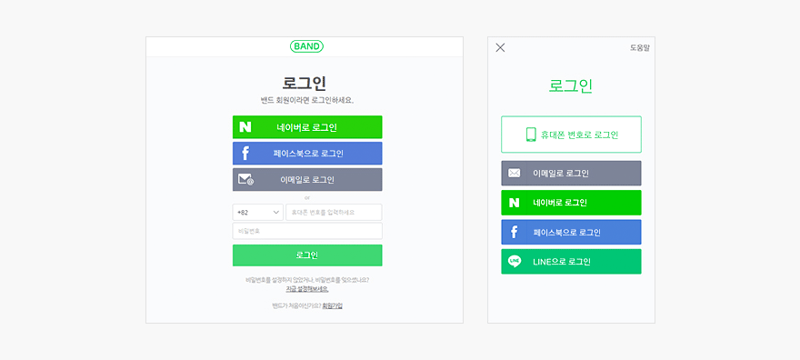
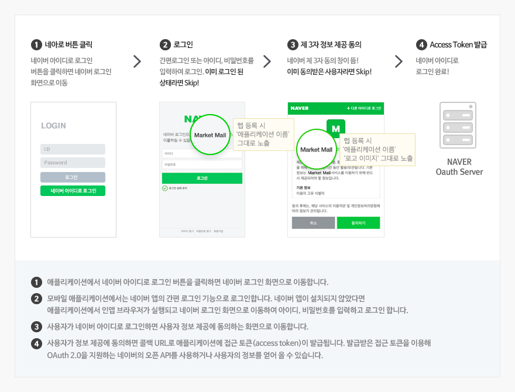

# 개요

<html lang="ko">
<head>
    <title>NAVER Developers - 네이버아이디로로그인 개요</title>
    <meta name="description" content="NAVER Developers - 네이버아이디로로그인 개요">
</head>
<body>

    

        

    

    

        네이버 아이디로 로그인은 OAuth 2.0 기반의 사용자 인증 기능을 제공해 네이버가 아닌 다른 서비스에서 네이버의 사용자 인증 기능을 이용할 수 있게 하는 서비스입니다.
        별도의 아이디나 비밀번호를 기억할 필요 없이 네이버 아이디로 간편하고 안전하게 서비스에 로그인할 수 있어, 가입이 귀찮거나 가입한 계정이 생각나지 않아 서비스를 이탈하는 사용자를 잡고 싶다면 네이버 아이디로 로그인을 사용해 보세요.
    

    

        <a class="btn_b_hi3" href="/apps/#/register?api=nvlogin">오픈 API 이용 신청 &gt;</a>
    

     
    

    
네이버 아이디로 로그인을 통해 로그인하는 기본 절차는 다음과 같습니다.

    

    <ol class="blind">
        <li>로그인. 네이버 로그인 창이 뜸! 간편로그인 또는 인앱 브라우저 로그인. 이미 로그인 된 상태라면 Skip!</li>
        <li>제삼자 동의. 네이버 제삼자 동의 창이 뜸! 이미 동의받은 사용자라면 Skip!</li>
        <li>Access Token 발급. 해지된 네이버 아이디로 로그인 완료!</li>
    </ol>
    <h3 class="h_sub">1. 특징</h3>
    <h4 class="h_subsub">1.1. 불필요한 회원 정보 입력 과정을 없애 주는 프로필 조회 API 제공</h4>
    
네이버 아이디로 로그인한 사용자의 이름, 메일 주소, 휴대전화번호, 생일, 성별, 연령대 등 필요한 정보를 사용자 동의하에 API로 조회할 수 있습니다.
        또한, 다양한 네이버 서비스에 활용할 수 있습니다.

    <h4 class="h_subsub">1.2. 빠른 개발, 간편한 운영</h4>
    
PC 웹과 모바일 웹은 물론 Android, iOS, Windows 등 플랫폼에 따라 네이버 아이디로 로그인을 적용할 수 있는 SDK를 제공해 쉽고 빠르게 개발할 수 있습니다. 또한 다양한 통계를 제공해 서비스 운영 현황을 손쉽게 확인할 수 있습니다.

    <h4 class="h_subsub">1.3. 네이버의 오픈 API를 이용한 매시업</h4>
    

        네이버 아이디로 로그인을 활용해 오픈 API로 제공되는 네이버 서비스를 이용할 수 있습니다.
        네이버 아이디로 로그인한 사용자가 애플리케이션에서 캘린더에 일정을 담을 수 있으며 카페에 가입하고 게시판에 글을 쓸 수 있습니다.
        네이버 아이디로 로그인을 이용할 수 있는 오픈 API는 계속해서 추가할 예정입니다. 자세한 내용은 개발자 센터의 API 사용 가이드를 참고해 주세요.
    

    <ul class="list_type1">
        <li><a class="color_p2 underline" href="/docs/cafe/api">카페 가입 글쓰기 API &gt;</a></li>
        <li><a class="color_p2 underline" href="/docs/calendar/api">캘린더 일정 담기 API &gt;</a></li>
    </ul>
    <h3 class="h_sub">2. 적용 절차</h3>
    
네이버 아이디로 로그인은 다음과 같은 절차를 거쳐 서비스에 적용할 수 있습니다.

    <h4 class="h_subsub">2.1. 애플리케이션 등록</h4>
    
네이버 아이디로 로그인을 적용하기 위해 애플리케이션을 등록하고 클라이언트 아이디와 클라이언트 시크릿을 발급받습니다.

    <h4 class="h_subsub">2.2. 애플리케이션 개발</h4>
    
네이버 아이디로 로그인을 이용하기 위한 정보를 확인하고 등록한 환경에 맞는 개발가이드를 참고해 애플리케이션을 개발합니다.

    <ul class="list_type1">
        <li><a class="color_p2 underline" href="/docs/login/api">API 명세 &gt;</a><a class="color_p2 underline" href="/docs/login/sdks">/SDK 다운로드 &gt;</a></li>
        <li><a class="color_p2 underline" href="/docs/login/android">Android 애플리케이션 개발 가이드 &gt;</a></li>
        <li><a class="color_p2 underline" href="/docs/login/ios">iOS 애플리케이션 개발 가이드 &gt;</a></li>
        <li><a class="color_p2 underline" href="/docs/login/windows">Windows 애플리케이션 개발 가이드 &gt;</a></li>
        <li><a class="color_p2 underline" href="/docs/login/web">웹 애플리케이션 개발 가이드 &gt;</a></li>
    </ul>
    <h4 class="h_subsub">2.3. 서비스 적용</h4>
    
개발을 완료하면 서비스에 네이버 아이디로 로그인을 적용합니다.

    <h3 class="h_sub">3. 네아로 뱃지 노출 관련</h3>
    
네이버 개발자센터에 등록된 서비스 url 과 노출중인 사이트 url이 동일하고, 일정수준의 사용자 발생시 따로 신청하지 않아도 네아로 뱃지가 노출됩니다.
        사용자 이용 수준의 의미는 네아로 적용 후 정상적인 사용자가 이용하고 있는 수준이라 보시면 되겠습니다. 뱃지가 미노출중이라면, 아래 사항을 먼저 확인 부탁드립니다.
    

    <ul class="list_type1">
        <li>1. <a href="https://developers.naver.com/appinfo" class="color_p2 underline">애플리케이션 설정</a> '서비스 URL' = 실제 서비스 중인 URL = 검색 노출중인 URL </li>
        <li>2. <a href="https://developers.naver.com/appinfo" class="color_p2 underline">애플리케이션 설정</a>의 'Callback URL' = 실제 서비스 중인 Callback URL</li>
    </ul>
    <h3 class="h_sub">4. 기타  </h3>
    <ul class="list_type1">
        <li><a class="color_p2 underline" href="http://oauth.org" target="_blank">OAuth 2.0 &gt;</a></li>
    </ul>
     
     
     
     

</body>
</html>
