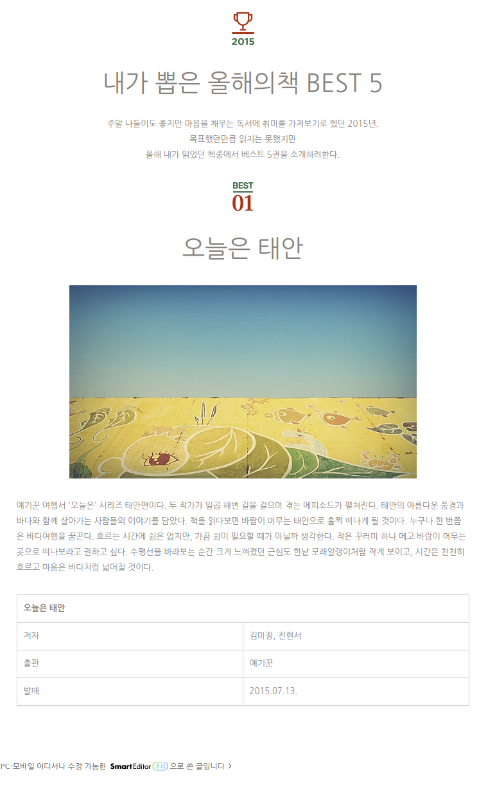

스마트 에디터 문서 튜토리얼
=================

[[TOC]]

이 문서는 스마트에디터 3.0에서 지원하는 포맷으로 글을 저장하기 위한 방법을 설명합니다. 스마트에디터 3.0 형식에 맞는 문서를 작성하시려면, 아래 가이드대로 가능한 단순한 형태의 HTML을 작성하는 것을 권장합니다.

## 작성 예시
### HTML 코드
```html
<div align="center"></div>
<div align="center"><h1> 내가 뽑은 올해의책 BEST 5 </h1></div>
<p align="center">
   주말 나들이도 좋지만 마음을 채우는 독서에 취미를 가져보기로 했던 2015년.<br>
   목표했던만큼 읽지는 못했지만<br>
   올해 내가 읽었던 책중에서 베스트 5권을 소개하려한다.<br>
</p>
<div align="center"></div>
<div align="center"><h1>오늘은 태안</h1></div>
<div align="center"></div>
<p>얘기꾼 여행서 '오늘은' 시리즈 태안편이다. 두 작가가 일곱 해변 길을 걸으며 겪는 에피소드가 펼쳐진다.
 태안의 아름다운 풍경과 바다와 함께 살아가는 사람들의 이야기를 담았다. 책을 읽다보면 바람이 머무는
 태안으로 훌쩍 떠나게 될 것이다. 누구나 한 번쯤은 바다여행을 꿈꾼다. 흐르는 시간에 쉼은 없지만, 가끔
 쉼이 필요할 때가 아닐까 생각한다. 작은 꾸러미 하나 메고 바람이 머무는 곳으로 떠나보라고 권하고 싶다.
 수평선을 바라보는 순간 크게 느껴졌던 근심도 한낱 모래알갱이처럼 작게 보이고, 시간은 천천히 흐르고
 마음은 바다처럼 넓어질 것이다.</p>
<div align="center">
   <table>
       <tr>
           <td colspan="2"><b>오늘은 태안</b></td>
       </tr>
       <tr>
           <td>저자</td>
           <td>김미정, 전현서</td>
       </tr>
       <tr>
           <td>출판</td>
           <td>얘기꾼</td>
       </tr>
       <tr>
           <td>발매</td>
           <td>2015.07.13.</td>
       </tr>
   </table>
</div>
```
### 스마트에디터 3.0으로 저장된 결과


## HTML 작성 가이드

### `<p>` 태그
- 작성하는 모든 본문 텍스트는 `<p>` 태그로 감싸야 합니다.
```html
<p> 본문 내용 </p>
```
- align 속성은 문단의 정렬을 지정합니다.
```html
<p align="center"> 중앙 정렬 예제 </p>
```
- `<p>` 태그 내부에는 `<b> <i> <u> <a>` 태그를 사용할 수 있습니다.
```html
<p> <b>굵게</b> <i>기울임</i> <u>밑줄</u> <a href="blog.naver.com">링크</a></p>
```

### `<h1>` to `<h6>` 태그
- `<h1>`, `<h2>`, `<h3>` 태그로 소제목을 표현합니다.
- `<h4>`, `<h5>`, `<h6>` 태그는 지원하지 않습니다.
- `<div>` 태그로 감싼 뒤 align 속성을 사용하면 문단의 정렬을 지정할 수 있습니다.
```html
<div align="center"><h1> 소제목</h1></div>
```

### `<span>` 태그
- `<span>`태그의 스타일 속성을 이용하여 폰트 색상, 폰트 사이즈를 지정할 수 있습니다.
- 폰트 색상은 hex code와 rgb만 지원합니다.
```html
<p>My dog has <span style="color:rgb(0, 0, 255)">blue</span> eyes.</p>
<p>My dog has <span style="color:#0000ff">blue</span> eyes.</p>
```
- 폰트 사이즈는 픽셀 단위만 지원하며, 11, 13, 16, 19, 28 px만 사용 가능합니다
```html
<p><span style="font-size:13;">hello world!</span></p>
<p><span style="font-size:13px;">hello world!</span></p>
```

### `` 태그
- `<div>` 태그로 감싸서 사용해야하며 `<div>` 태그의 align 속성으로 정렬을 지정할 수 있습니다.
- 연속된 `` 태그는 세로만 배치되며, 가로 배치는 지원하지 않습니다.
- 텍스트 옆에 `` 를 넣어도 나란히 표시되지 않습니다. 아래는 잘못 사용된 예시로, 아래처럼 사용하실 경우 이미지는 텍스트 아래에 노출됩니다.
```html
<p> 사진 : </p> 
```
- widht / height 속성에 정확한 크기를 명시해야 합니다.
```html
<div align="center></div>
```
- alt 옵션으로 이미지 캡션을 지정할 수 있습니다
```html

```

### `<table>` 태그
- `<div>` 태그로 감싸서 사용해야하며 `<div>` 태그의 align 속성으로 테이블 전체 정렬을 지정할 수 있습니다.
```html
<div align="center"><table> ...... </table></div>
```
- rowspan / colspan 속성을 지원합니다.
```html
<div><table><tr><td colspan="2">표제목</td></tr></table></div>
```
- `<td>` 태그는  `<b> <i> <u>`태그와 함께 사용할 수 있습니다.
```html
<div><table><tr><td><b>굵게</b> <i>기울임</i> <u>밑줄</u></td></tr></table></div>
```
- `<td>`태그의 스타일 옵션으로 셀 정렬과 셀 배경색을 지정할 수 있습니다.
```html
<table>
   <tr>
      <td style="text-align: center; background-color: #880088"> Cheer up! </td>
   </tr>
</table>
```
- 셀 안에 있는 글자는 `<span>`태그의 스타일 속성을 이용하여 폰트 색상, 폰트 사이즈를 지정할 수 있습니다.
```html
<table>
   <tr>
      <td> Can you see <span style="color:rgb(255, 0, 0); font-size:13px;">The Red</span> one? </td>
   </tr>
</table>
```
- `<td>`태그 내부에는 `` 태그를 사용할 수 없습니다.

### `<a>` 태그
- `<a>` 태그는 `` `<p>` 태그와 함께 사용할 수 있습니다.

## 기타 작성 가이드

### 여러장의 이미지를 첨부하는 법
- 여러장의 이미지를 multipart request를 이용하여 첨부할 수 있습니다.
- html 문서내에 ``태그에 아래와 같이 src=”#숫자”로 지칭할 수 있습니다.
```html
<div>
Hello world
This is image example.


Fig. 1-1

Good day!
</div>
```

### 동영상
- 네이버 TV나 유튜브에 올린 동영상은 iframe을 이용하여 첨부할 수 있습니다.
```html
<iframe src='http://serviceapi.rmcnmv.naver.com/flash/outKeyPlayer.nhn?vid=.....'
frameborder='no' scrolling='no' marginwidth='0' marginheight='0'
WIDTH='544' HEIGHT='306' allowfullscreen></iframe>
```


---

## FAQ

#### 스마트에디터 3.0에서 기본으로 제공하는 표 스타일 옵션을 사용할 수 있나요?
아니요. 표 스타일은 지원하지 않습니다.
 
#### 테이블 안에 이미지를 삽입할 수 있나요?
아니요. 삽입할 수 없습니다.

#### 문서 내 모든 요소들의 정렬을 한 번에 지정할 수 있나요?
모든 요소를 `<div>` 태그로 한번 감싼 뒤 align 속성으로 전체 정렬을 지정할 수 있습니다.

#### 제목에 배경 이미지를 삽입할 수 있나요?
아니요. 삽입할 수 없습니다.

#### 한 줄에 연속해서 여러 이미지를 추가할 수 있나요?
아니요. 연속해서 여러 이미지를 추가하면 이미지는 세로로 노출됩니다.

#### 텍스트와 이미지를 한 줄에 표현할 수 있나요?
아니요. 텍스트와 이미지는 한 줄에 같이 있을 수 없습니다.

#### 이미지 캡션은 어떻게 등록하나요?
`` 태그의 alt 속성을 이용해서 등록할 수 있습니다.

#### 테이블 캡션은 어떻게 등록하나요?
현재 테이블 내 캡션 태그는 지원하지 않습니다.

#### 인용구는 어떻게 추가하나요?
`<blockquote>` 태그를 사용해 추가할 수 있으며, 스타일은 지정할 수 없습니다.

