네아로 사전 검수 가이드
=================

[[TOC]]

## 사전 검수가 어렵다면 이것만은 꼭 확인해 주세요

| 확인 항목 | 설명 |
|----------|------|
| 1. 서비스 운영에 반드시 필요한 정보의 조회 권한만 선택했나요? | ‘이용자 고유 식별자’ 외에 추가 제공 정보(예: 이름, 메일 주소, 휴대전화번호, 생일, 성별, 연령대 등) 조회 권한을 선택했다면, 사전 검수 시 해당 정보가 서비스에서 실제 활용되는 사례를 확인합니다. 사전 검수 가이드 [2.3 제공 정보 활용처 확인](https://developers.naver.com/docs/login/verify/verify.md/#2-3-제공-정보-활용처-확인)을 참고해 주세요. |
| 2. 서비스에서 네아로가 동작하는 전 과정을 확인할 수 있는 자료를 첨부했나요? | 사전 검수가 진행되려면 반드시 네아로가 동작하는 전 과정을 확인할 수 있는 자료가 첨부되어야 합니다. 사전 검수 가이드 [3.2 사전 검수 자료 첨부 방법의 '네아로 적용 형태 확인을 위한 자료 제출 방법'](https://developers.naver.com/docs/login/verify/verify.md/#네아로-적용-형태-확인을-위한-자료-제출-방법)을 참고해 주세요. |
| 3. 네아로를 통한 회원가입 과정에서 서비스 고유의 별도 비밀번호를 받지 않도록 개발되어 있나요? | 네아로를 통한 가입 과정에서 서비스 고유의 별도 비밀번호를 요구한다면 사전 검수에서 반려됩니다([네이버 아이디로 로그인 API 서비스 특약조건](https://developers.naver.com/products/intro/terms/terms.md#1--%EB%84%A4%EC%9D%B4%EB%B2%84-%EC%95%84%EC%9D%B4%EB%94%94%EB%A1%9C-%EB%A1%9C%EA%B7%B8%EC%9D%B8-api-%EC%84%9C%EB%B9%84%EC%8A%A4) 참고). 만약 별도 비밀번호를 요구하도록 기획/개발되어 있다면 별도 비밀번호를 받지 않도록 수정한 후 사전 검수를 신청해 주세요. |

## 1. 사전 검수란

네이버 아이디로 로그인(이하 네아로)은 이용자가 편리하고 안전하게 네아로를 이용할 수 있도록 개발/적용 가이드를 제시하고, 사전 검수 제도를 통해 네아로 적용 서비스의 가이드 준수 여부를 확인하고 있습니다.

사전 검수를 통과하지 않아도 테스터, 관리자로 등록된 아이디는 네아로 이용이 가능하여 개발 테스트 진행에는 문제가 없지만, 모든 아이디에서 네아로 이용이 가능하도록 네아로를 정식 오픈하려면 반드시 사전 검수를 통과해야 합니다.

따라서 네아로 적용 서비스 기획/개발 담당자 여러분께서는 반드시 아래 안내된 사전 검수 가이드를 참고하여 사전 검수 통과에 문제가 없도록 네아로를 적용해 주세요.

## 2. 사전 검수 항목 및 기준

네아로 사전 검수가 진행되면 검수자는 네아로 적용 서비스에 대해 아래 사항을 확인합니다.

### 2.1 서비스 콘텐츠 확인

네아로 운영원칙, 약관, 관계 법령 등에 따라 검수를 신청한 서비스(네아로 적용 예정 서비스)가 네아로 적용이 가능한 유형인지 확인합니다. 또한 업종별로 특별히 준수해야하는 법적 요건들이 식별될 경우, 이를 준수하여 운영하는지 여부도 확인 합니다. 이 과정에서 네아로 적용이 불가한 유형의 서비스로 파악되면 검수가 거절되며, 준수해야할 법적 요건들이 준수되지 않은 상태로 파악될 경우 관련 내용 수정 후 재검수를 요청하도록 안내 드립니다. 

네아로 적용이 불가한 유형의 서비스에 대해서는 [네아로 적용이 불가한 서비스 도움말](https://help.naver.com/support/contents/contents.help?serviceNo=17063&categoryNo=21027)을 참고해 주세요.

### 2.2 네아로 적용 형태 확인

서비스에 적용된 네아로가 동작하는 과정이 가이드를 준수하여 이용자 친화적으로 구성되어 있는지 확인합니다. ‘네아로가 동작하는 과정’이란 네아로 버튼 클릭 시부터 로그인, 회원가입이 완료되기까지의 전 과정을 의미합니다.

이 과정에서 특히 네아로를 통한 회원가입 진행 시 이용자에게 서비스 고유의 ‘별도 비밀번호’를 요구할 경우 사전 검수에서 반려됩니다([네이버 아이디로 로그인 API 서비스 특약조건](https://developers.naver.com/products/intro/terms/terms.md#1--%EB%84%A4%EC%9D%B4%EB%B2%84-%EC%95%84%EC%9D%B4%EB%94%94%EB%A1%9C-%EB%A1%9C%EA%B7%B8%EC%9D%B8-api-%EC%84%9C%EB%B9%84%EC%8A%A4) 참고).

권장되는 네아로 적용 형태(동작 과정)는 [네이버 아이디로 로그인 적용 가이드](https://developers.naver.com/products/login/userguide/userguide.md)를 참고해 주세요.(적용 가이드의 내용 중 '별도 비밀번호' 입력 요구 금지 관련 내용 외에는 모두 권장 사항이므로, 반드시 적용 가이드 내용 전체를 준수해야 사전검수가 통과되는 것은 아닙니다. 단, 이용자들의 정상적인 로그인/회원가입이 불가능한 수준으로써, 전체 네아로 이용자들의 '네아로 사용경험'을 해칠 우려가 있을 정도의 형태라고 판단되는 경우는 검수가 거절될 수 있으므로, 가급적 적용 가이드의 내용을 준수하는 방향으로 네아로를 적용하시길 권장 드립니다.) 

### 2.3 제공 정보 활용처 확인

네아로 애플리케이션 API 설정 시 ‘이용자 고유 식별자(기본 제공 정보)’ 외의 정보(예: 이름, 메일 주소, 휴대전화번호, 생일, 성별, 연령대 등) 조회 권한을 선택했다면, 해당 정보가 서비스에서 활용되는 사례를 확인합니다(필수/추가 정보 구분 없이 ‘이용자 고유 식별자’ 외에 조회 권한을 선택한 정보는 모두 활용 사례를 확인함).

단순히 통계 목적으로 정보(성별, 연령대 등)를 수집하는 것은 활용 사례로 인정되지 않으므로 사전 검수 반려 사유가 되며(로그인 사용자의 성별/연령대 통계 정보는 기본적으로 '네이버 개발자센터 > Application > 내 애플리케이션'의 '로그인 통계' 탭에서 열람할 수 있도록 제공합니다.), 조회 권한을 선택한 정보 중 명확한 활용 사례가 확인되지 않는 정보가 있는 경우에도 사전 검수에서 반려됩니다. 사전 검수 승인을 위해서는 반드시 선택한 제공 정보가 서비스 운영을 위해 실제 활용되는 사례를 제시할 수 있어야 합니다.

예를 들어, ‘이름’ 정보 조회 권한을 선택한 경우 다음과 같습니다.

* 쇼핑몰에서 물건을 구매한 구매자명으로 '이름'을 활용한다면, 사전 검수 통과
* '이름' 정보를 조회하여 저장하나, 실제 이용되는 사례를 제시하지 못한다면, 사전 검수 반려

또한, '휴대전화번호' 조회 권한을 선택한 경우는 사전 검수 단계에서 정상적인 사업자로 등록되었는지 확인하는 단계를 거칩니다.

따라서 애플리케이션 API 설정 시, 이용자의 정보가 과다하게 조회되지 않도록 실제로 활용처가 분명한 정보만 조회 권한을 선택해 주세요.

> _위 2.2~2.3 사전 검수 항목을 위한 제출 자료 준비는 사전 검수 가이드 [3.2 사전 검수 자료 첨부 방법](https://developers.naver.com/docs/login/verify/verify.md#3-2-사전-검수-자료-첨부-방법)을 참고해 주세요._

### 2.4 로고 이미지, 애플리케이션 이름 확인

애플리케이션에 등록된 로고 이미지와 애플리케이션 이름이 정상적인지 확인합니다. 로고 이미지가 없거나 네이버가 연상되는 로고를 등록한 경우, 애플리케이션 이름이 네이버를 연상시키거나 비정상적인 경우(예: 애플리케이션 이름을 ‘네이버 로그인’ 또는 ‘로그인’ 등으로 입력) 사전 검수에서 반려됩니다.

로고 이미지와 애플리케이션 이름은 ‘네아로 정보제공동의 화면’에 노출되어 서비스의 브랜드를 나타내는 항목이며, 이용자 입장에서는 정보 제공 동의 전에 자신의 정보가 어떤 사업자에게 전달될 예정인지 식별할 수 있도록 돕는 중요한 정보입니다.

따라서 애플리케이션 설정 시 로고 이미지와 이름은 반드시 서비스 브랜드를 대표할 수 이미지와 이름으로 입력해 주세요.

## 3. 사전 검수 신청 방법

### 3.1 사전 검수 신청 프로세스

네아로 개발이 완료되었다면, 네이버 개발자센터에서 아래 절차에 따라 사전 검수를 신청할 수 있습니다.

1. **네이버 개발자센터 > Application > 내 애플리케이션**으로 접속합니다.

2. 왼쪽 메뉴에서 사전 검수를 신청할 애플리케이션을 선택한 후 **네아로 검수 상태** 탭으로 이동합니다.

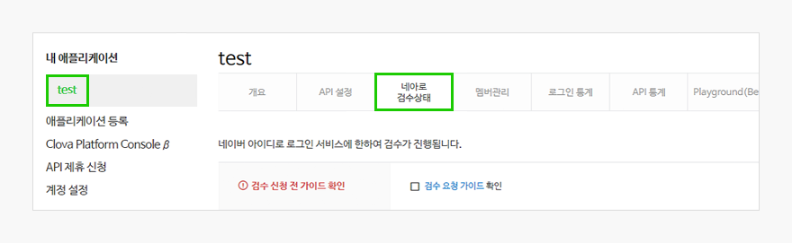

3. **네아로 검수 상태** 탭에서 사전 검수 신청에 필요한 제출 자료들을 첨부한 뒤 하단 **검수 요청** 버튼을 클릭합니다(사전 검수 자료 준비 및 첨부 방법은 사전 검수 가이드 [3.2 사전 검수 자료 첨부 방법](/verify/verify.md/#3-2-사전-검수-자료-첨부-방법) 참고).

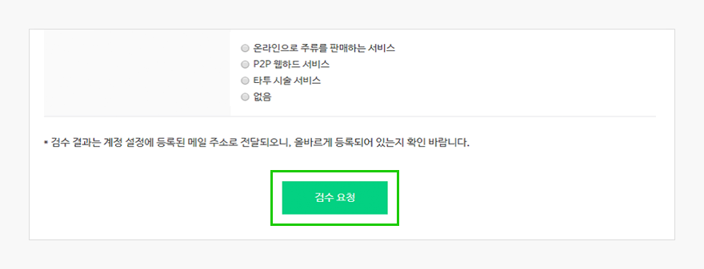
    사전 검수 신청이 완료되면 검수 상태가 아래와 같이 **검수요청**으로 바뀝니다.

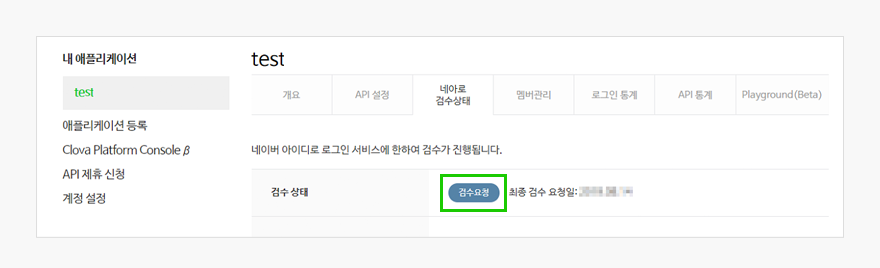

사전 검수 결과는 신청일로부터 2~3 영업일 이내에 이메일로 전달되며, 사전 검수가 승인되면 **네아로 검수 상태** 탭은 사라집니다.

사전 검수에서 반려된 경우에는 **네아로 검수 상태** 탭 상단의 검수 상태가 **승인거부**로 변경됩니다. **승인거부** 상태에서는 반려 사유에 따라 애플리케이션 설정 또는 사전 검수 자료 등을 일부 수정한 뒤 재검수를 신청할 수 있습니다.

### 3.2 사전 검수 자료 첨부 방법

#### 제공 정보 활용처 확인 자료 제출 방법

사전 검수  [2.3 제공 정보 활용처 확인](https://developers.naver.com/docs/login/verify/verify.md#2-3-%EC%A0%9C%EA%B3%B5-%EC%A0%95%EB%B3%B4-%ED%99%9C%EC%9A%A9%EC%B2%98-%ED%99%95%EC%9D%B8)에 따라, 기본 제공 정보인 ‘이용자 고유 식별자’ 외에 정보 조회 권한(예: 이름, 메일 주소, 휴대전화번호, 생일, 성별, 연령대 등)을 선택했다면 해당 정보의 활용처를 확인할 수 있는 자료를 제출해야 합니다.

자료 제출 방법은 다음과 같습니다.

1. 먼저 **네아로 검수 상태** 탭의 **제공정보 활용처** 확인란에서 추가로 선택한 정보가 무엇인지 확인합니다(선택 정보가 없다면 화면에 '제공정보 활용처 확인' 항목은 나타나지 않음).

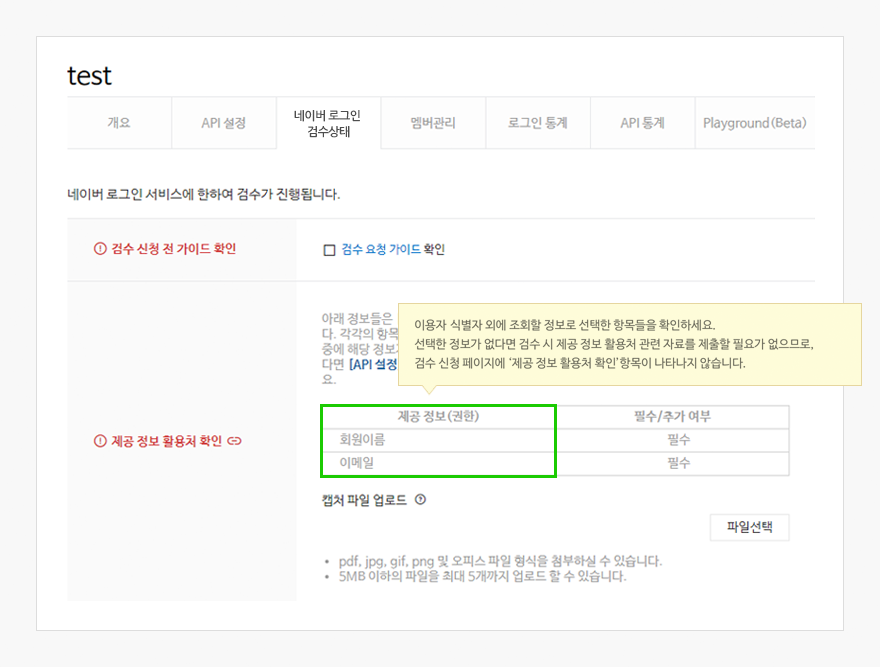

2. 선택한 정보가 무엇인지 확인했다면, 해당 정보가 서비스 페이지에서 노출(활용)되는 페이지를 찾아 캡처합니다.

    예를 들어, 위의 1번 설명의 예시 이미지처럼 '회원이름', '이메일' 정보 조회 권한을 선택했다면 서비스 페이지 중 아래와 같이 '이름', '이메일'이 노출되는 페이지를 캡처합니다.(아래 예시 이미지는 '이름', '이메일' 정보를 ‘내정보 관리 페이지’에서 활용하고 있는 화면입니다.)

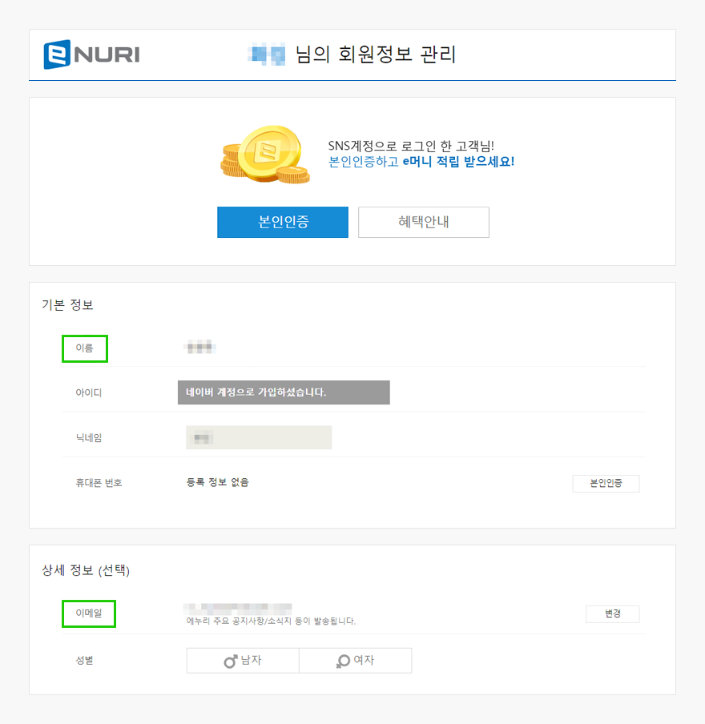
>_반드시 위의 예시 화면처럼 '내정보 관리 페이지'를 캡처할 필요는 없습니다. 서비스 페이지 중 조회 권한을 선택하신 정보가 노출되는 페이지라면 어느 화면이든 무관합니다. 예를들어, 네아로를 통한 회원가입이 아닌 서비스 자체의 '일반 회원가입' 과정에서 선택한 정보들을 입력받는 화면이 있다면, '일반 회원가입' 페이지를 캡처하여 제출해도 무관합니다._

3. 캡처한 이미지를 아래 **파일 첨부** 기능을 이용하여 사전 검수 자료로 첨부합니다.

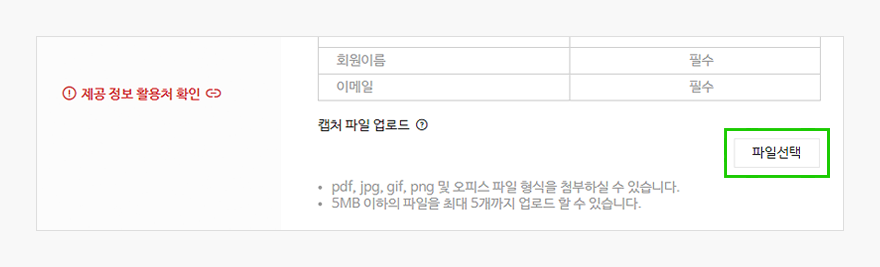

만약 선택한 제공 정보를 서비스에서 실제로 활용하는 사례가 없다면 불필요한 정보를 수집하지 않도록 **API 설정** 탭에서 조회 권한을 회수해 주세요.

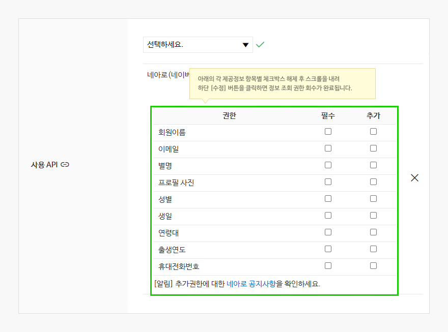

이용자 고유 식별자 외에 모든 정보 조회 권한을 회수하면 사전 검수 시 제공 정보 활용처 확인을 위한 자료는 제출하지 않아도 됩니다.

#### 네아로 적용 형태 확인을 위한 자료 제출 방법

사전 검수 기준 [2.2 네아로 적용 형태 확인](https://developers.naver.com/docs/login/verify/verify.md#2-2-네아로-적용-형태-확인)에 따라 서비스에 네아로가 적용된 형태를 확인하기 위한 자료를 제출해야 합니다.

개발 환경이나 운영 서비스에 이미 네아로 적용을 완료한 상태라면 관리자/테스터 ID 또는 애플리케이션 등록자 아이디를 통해 네아로를 실제로 동작시키면서 네아로 동작 과정을 캡처하여 제출할 수 있습니다.

자료 제출 방법은 아래와 같습니다.

> _애플리케이션을 생성할 때 이용한 아이디로 테스트를 진행한다면, 아래 1~3번 절차는 생략해도 됩니다. 애플리케이션 등록자 아이디는 ‘멤버’로 등록하지 않아도 ‘개발 중’ 상태의 네아로 애플리케이션에 로그인을 진행할 수 있습니다._

1. **네이버 개발자센터 > Application > 내 애플리케이션**에 접속합니다.

2. 왼쪽에서 사전 검수를 신청할 애플리케이션을 선택한 후 **멤버관리** 탭으로 이동합니다.

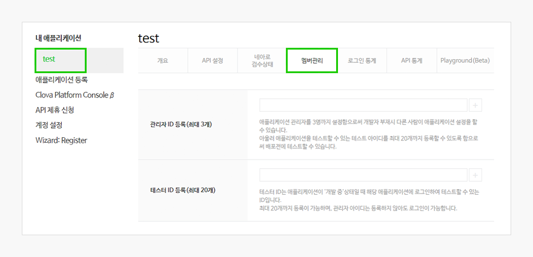

3. 관리자나 테스터로 추가할 아이디를 입력하고 **+** 버튼을 클릭하여 등록을 완료합니다.
   
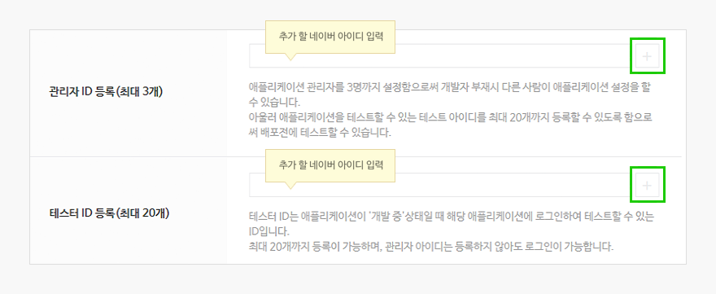
 
4. 서비스 웹사이트로 이동하여 네아로 버튼이 노출되는 화면을 캡처합니다.

5. 위의 3번에서 등록한 아이디(또는 애플리케이션 등록자 아이디)로 서비스 페이지에 적용된 네아로를 통해 로그인합니다.

6. 이후 로그인/회원가입이 완료되기까지 노출되는 화면을 단계별로 모두 캡처합니다.

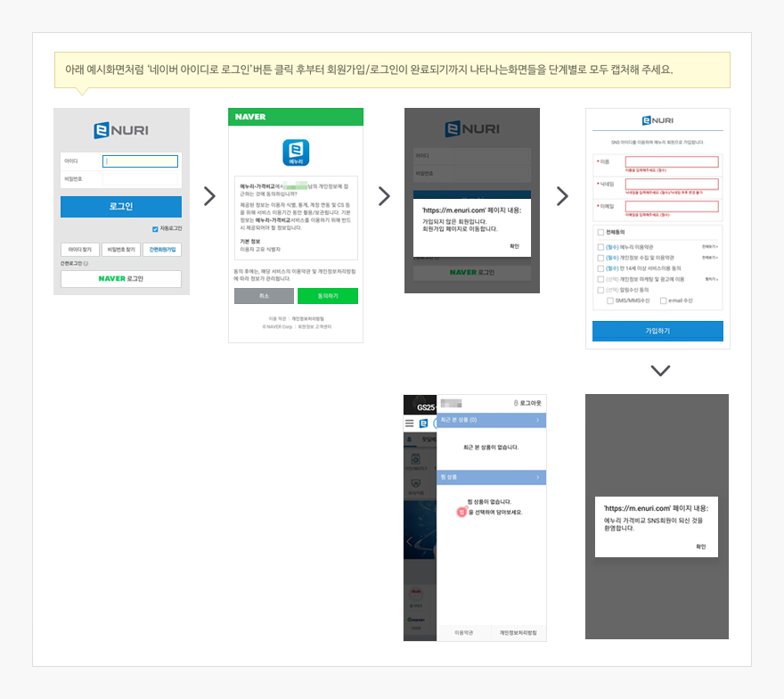

 >_위의 화면은 예시 화면입니다. 반드시 위와 같은 프로세스로 네아로가 동작할 필요는 없습니다. 오히려 추가 정보 입력 없이 네아로 버튼 클릭만으로 회원가입이 완료되는 간단한 프로세스를 더욱 권장합니다. 따라서 추가 정보 입력 단계가 없다면, 네아로 버튼이 노출되는 화면과 네아로 버튼 클릭 후 로그인/회원가입이 완료되었을 때 노출되는 화면을 캡처하여 추가 정보 입력 없이 바로 로그인이 완료됨을 명시해주시면 됩니다._

7. 캡처한 파일을 하나로 묶은 뒤 아래 **파일 첨부** 기능을 이용하여 사전 검수 자료로 첨부합니다.

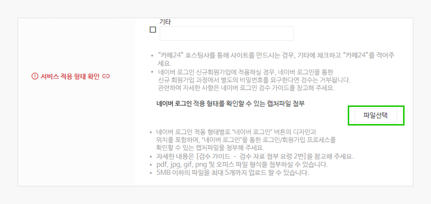

 >_아직 네아로 개발 적용 전이지만(화면을 캡처할 수 없지만) 사전 검수를 먼저 진행하고 싶다면 ‘네아로 적용 형태 확인 자료’는 화면 기획서로 대체할 수 있습니다. 캡처파일 대신 네아로가 적용되는 전 과정을 확인할 수 있는 기획서를 작성하여 첨부해 주세요._

#### 업종별 추가 서류 제출 방법

네아로 운영 정책 또는 관련 법률에 따라 네아로 적용을 위해 별도 증빙서류가 필요한 업종이 있습니다.

아래 화면에서 운영중인 서비스에 해당되는 업종을 선택하면, 추가 제출이 필요한 서류에 대한 안내가 나타나므로, 안내사항을 참고하여 추가 서류를 제출해 주시면 됩니다. 해당하는 업종이 없을 경우에는 **없음**을 선택하면 되며, **없음**을 선택한 경우 추가 증빙서류를 제출할 필요가 없으므로, **파일 첨부** 버튼은 나타나지 않습니다.

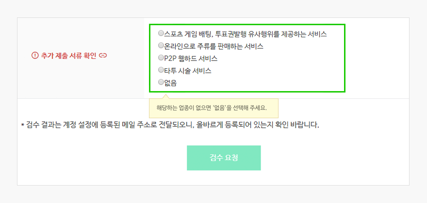

## 4. FAQ

### 4.1 서비스 소개 자료 첨부를 요청받았습니다

사전 검수 기준 [2.1 서비스 콘텐츠 확인](https://developers.naver.com/docs/login/verify/verify.md#2-1-서비스-콘텐츠-확인)에 따라 네아로를 적용할 서비스 콘텐츠 확인을 위한 자료를 제출해야 합니다.

검수자가 애플리케이션에 등록된 서비스 URL에 정상적으로 접속할 수 있고 해당 페이지에서 서비스 콘텐츠가 운영 중인 경우, 또는 접속 가능한 URL은 없지만 사전 검수 기준 [2.2 네아로 적용 형태 확인](https://developers.naver.com/docs/login/verify/verify.md#2-2-네아로-적용-형태-확인)에 따라 제출한 자료를 통해 서비스 콘텐츠가 확인되는 경우에는 별도의 서비스 소개 자료를 요청하지 않습니다.

하지만 검수자가 서비스 페이지나 기획서, 캡처 파일 등으로 서비스 콘텐츠를 확인할 수 없는 경우 사전 검수에서 반려하고 별도 서비스 소개 자료 첨부를 요청합니다. 일반적으로 아래 두 가지 경우에 해당하며, 서비스 업종에 특이사항이 있을 경우 기재한 서비스 URL의 사이트에서 서비스 콘텐츠가 확인되더라도 추가 소개 자료를 요청할 수 있습니다.

* 아직 서비스가 오픈 전이라 접속 가능한 URL이 없을 때
* 접속 가능한 URL이 있지만 아직 개발이 진행 중인 상태라 서비스 콘텐츠가 완전하지 않을 때

이 경우 서비스 소개 자료를 추가로 첨부하여 재검수를 신청해 주세요.

> _서비스 소개 자료 양식은 자유입니다. 어떤 문서이든 검수자가 서비스에서 다루는 콘텐츠를 확인할 수 있는 자료라면 사전 검수 진행이 가능합니다._

### 4.2 재검수 요청 방법을 모르겠습니다

사전 검수 반려 사유에 따라 **네아로 검수 상태** 탭의 내용을 일부 수정하거나 로고 이미지, 애플리케이션 이름을 변경한 경우 **네아로 검수 상태** 탭 하단의 **재검수 요청** 버튼이 활성화됩니다. 재검수 요청은 이 때 활성화된 **재검수 요청** 버튼을 클릭하면 완료됩니다.

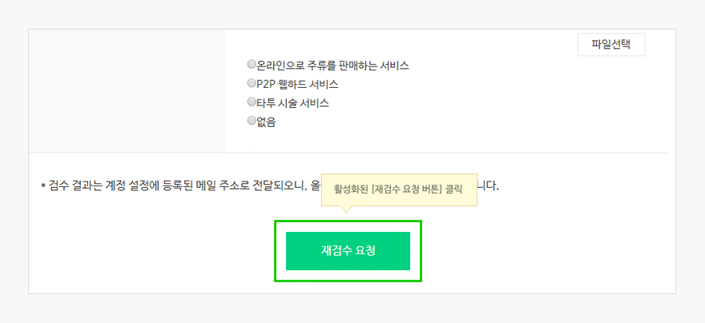

재검수 결과는 신청일로부터 2~3 영업일 이내에 이메일로 전달되며, 사전 검수가 승인되면 **네아로 검수 상태** 탭은 사라집니다.

 >_**네아로 검수 상태** 탭의 내용이나 로고 이미지, 애플리케이션 이름 등을 변경할 필요 없이 재검수를 신청해야 하는 경우(예: 애플리케이션이 휴면으로 전환되어 재검수를 받아야 하나 네아로 적용 형태 등이 이전과 전혀 달라지지 않은 경우), **네아로 검수 상태** 탭 '서비스 적용 형태 확인' 항목의 '기타' 텍스트 박스에 마침표를 찍어 임의로 변경 사항을 발생시킨 후 활성화된 **재검수 요청** 버튼을 클릭하세요._

### 4.3 이미 승인된 애플리케이션을 사용하라는 안내를 받았습니다

네아로에서 전달하는 ‘이용자 고유 식별자’는 애플리케이션마다 다르게 전달되기 때문에 이미 적용되었던 애플리케이션을 다른 애플리케이션으로 변경하는 경우 기존에 연동한 이용자를 식별하지 못하는 등의 문제가 발생합니다.

따라서 네아로는 사전 검수 진행 시 동일 서비스 URL로 이미 승인받은 애플리케이션이 식별되는 경우, 신규 생성한 애플리케이션 대신 이미 승인받은 애플리케이션을 사용하도록 안내하고 있습니다.

만약 기존에 이용 중이던 애플리케이션의 접속 계정(네이버 계정) 정보를 잊으셨다면, [애플리케이션 등록자 아이디 변경 요청하기](https://help.naver.com/support/alias/naveridlogin/naveridlogin_03.naver)를 참고하여 애플리케이션 등록자 아이디를 접속 가능하신 네이버 계정으로 변경해 보세요.

### 4.4 특정 내용을 소명하거나 추가 증빙서류를 제출해야만 검수가 진행된다는 안내를 받았습니다

관련 법령 혹은 네아로 운영 정책상 기본적인 검수 기준 외에 추가 확인이 필요한 사항이 있는 경우 관련 내용에 대해 소명을 요청드리거나, 추가 증빙서류 제출을 요청드릴 수 있습니다. 또한 이용자 피해가 우려되는 서비스, 네이버 등 여러 포털 서비스의 정상적인 운영을 저해하는 어뷰징 우려가 있는 서비스 등 서비스 안전성이 담보되지 않은 것으로 판단되는 서비스의 경우, 사전 검수 시 서비스 관리체계 등에 대한 소명을 요구할 수 있습니다.

서비스가 안전하게 운영됨을 확인하기 위한 절차이므로, 안내된 내용에 따라 **네아로 검수 상태** 탭에 아래와 같이 나타난 소명 입력란에 소명 내용을 입력하시거나 파일 첨부 기능을 이용하여 관련 자료, 증빙서류 등을 첨부해 주시면 됩니다.

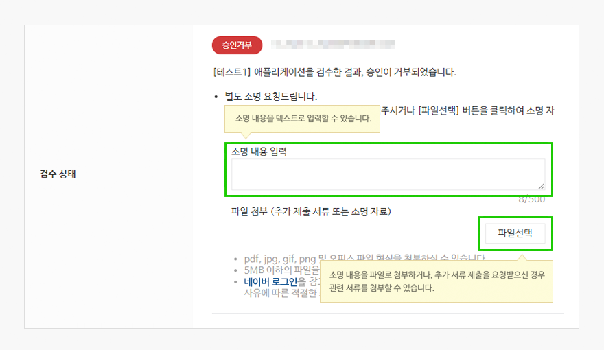

소명 양식은 자유이며, 네아로에서 확인하고자 하는 바 또는 우려하고 있는 바를 타당하게 해소할 수 있는 내용이면 무엇이든 상관 없습니다.

소명 내용과 함께 재검수가 요청되면 내용의 타당성을 검토한 후 문제가 없다고 판단되는 경우에만 사전 검수에 통과됩니다.

### 4.5 애플리케이션 이름, 로고 이미지 수정 방법을 모르겠습니다

애플리케이션 이름, 로고 이미지 수정 방법은 다음과 같습니다.

1. **네이버 개발자센터 > Application > 내 애플리케이션**에 접속합니다.

2. 왼쪽 메뉴에서 사전 검수를 신청할 애플리케이션을 선택하고 **API 설정** 탭으로 이동합니다.

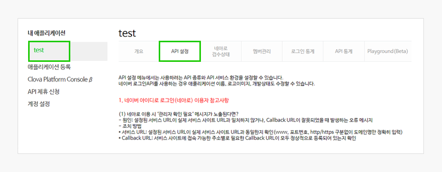

3. 애플리케이션 이름과 로고 이미지를 수정합니다.

    * **애플리케이션 이름** 항목에서 애플리케이션 이름을 수정할 수 있습니다.
    * 스크롤을 내리면 나타나는 **로고 이미지** 항목에서 **파일선택** 버튼을 클릭하여 새로운 로고 이미지를 등록할 수 있습니다.

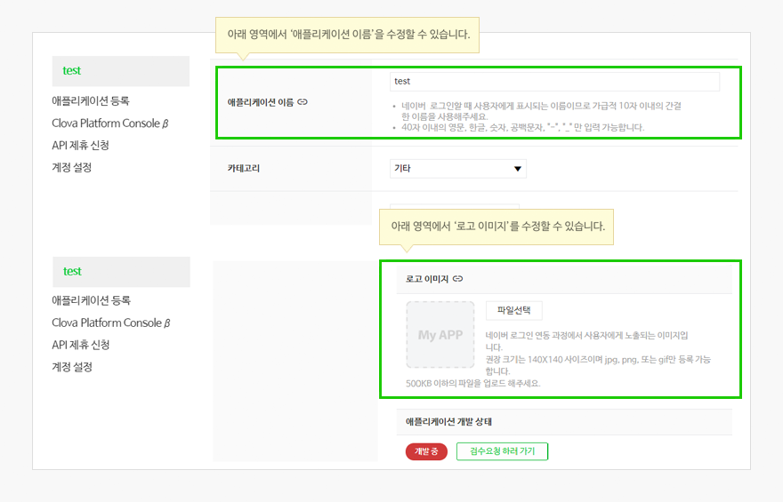

4. 애플리케이션 이름, 로고 이미지를 수정을 완료했다면 스크롤을 내려 **API 설정** 탭 하단 **수정** 버튼을 클릭합니다.(**수정** 버튼을 클릭하면 변경 내역 저장이 완료됩니다.)
