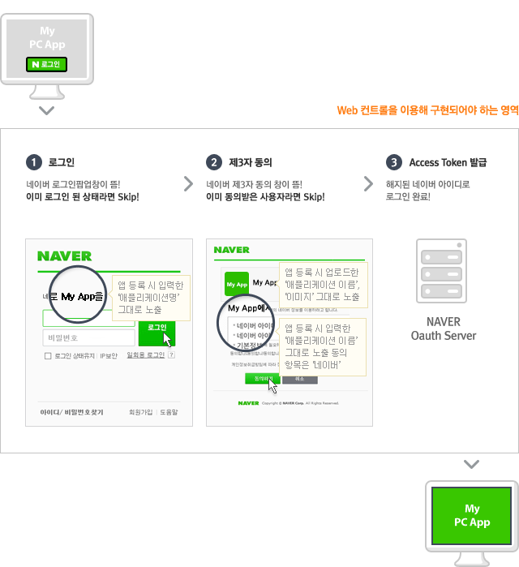
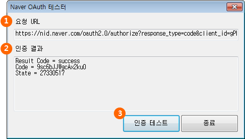

# Windows 애플리케이션

<html lang="ko">
<head>
    <title>NAVER Developers - 네이버아이디로로그인 Windows 애플리케이션 개발가이드</title>
    <meta name="description" content="NAVER Developers - 네이버아이디로로그인 Windows 애플리케이션 개발가이드">
</head>
<body>

    

        

    

    

        Windows App 환경에서 '네이버 아이디로 로그인'을 개발하기 위한 가이드입니다. 네이버 아이디로 로그인은 Visual Studio 2010에서 개발된 MFC Application의 샘플을 제공하고 있습니다.
    

    

        <a class="btn_b_hi3" href="https://developers.naver.com/apps/#/register?api=nvlogin">오픈 API 이용 신청 &gt;</a>
    

    <h3 class="h_sub">1. Windows 애플리케이션에서의 '네이버 아이디로 로그인' 절차</h3>
    
네이버 아이디로 로그인은 OAuth 기반의 사용자 인증 기능을 제공해 네이버가 아닌 다른 서비스나 애플리케이션에서 네이버의 사용자 인증 기능을 이용할 수 있게 하는 서비스입니다. 네이버 아이디로 로그인을 사용하면 서비스나 애플리케이션 사용자는 네이버 아이디와 비밀번호로 로그인할 수 있습니다. Windows 애플리케이션에서 네이버 아이디로 로그인을 통해 로그인하는 기본 절차는 다음과 같습니다.

    

        
&lt;그림 1-1&gt; 네이버 아이디로 로그인 기본 절차

    

    <h3 class="h_sub">2. 내 애플리케이션 등록 (Client등록)</h3>
    

        네이버 아이디로 로그인을 이용하기 위해서는 애플리케이션(client)등록이 필요하며, 등록이 완료된 후 "ClientID"와 "ClientSecret" 값이 발급됩니다. 
        <a class="color_p2 underline" href="https://developers.naver.com/apps/#/register?api=nvlogin">네이버 로그인 등록하기 &gt;</a>
    

    

        소속된 회사나 단체에서 등록하는 경우, 추후 키 관리 등이 용이하도록 네이버 단체회원으로 이용하시는 것을 권해드립니다. 
        <a class="color_p2 underline" href="https://nid.naver.com/group/commonAction.nhn?m=viewTerms" target="_blank">네이버 단체회원 가입하기 &gt;</a>
    

    <h3 class="h_sub">3. 개발환경</h3>
    <ul class="list_type1">
        <li>Visual Studio 2012</li>
        <li>JSON Parser(이 샘플 프로그램에서는 rapidjson을 이용하였음)</li>
    </ul>
    <h3 class="h_sub">4. CDHtmlDialog를 이용한 인증 UI 만들기</h3>
    

    <pre class="prettyprint">로그인 URL :
nin.naver.com/oauth2.0/authorize?response_type=code&client_id={“client_id”}&redirect_uri=http%3A%2F%2Fstatic.nid.naver.com%2Foauth%2FnaverOAuthExp.nhn&state={“state_code”}
cliend_id : 서비스 프로바이더의 고유 ID값
state_code : request / response에 대한 validation 체크를 위한 임의 발생 난수 또는 문자열
Callback URL :
https://nid.naver.com/login/noauth/oauthCallback.nhn
Result data : {"result_code":"success","result_data":{"code":"wWUJbbs1apDexAr3","state":"WC4pksjY"}}
    </pre>
    

    <h4 class="h_subsub">로그인 페이지 이동</h4>
    

    <pre class="prettyprint">BOOL CNaverOAuthDlg::OnInitDialog()
{
CDHtmlDialog::OnInitDialog();

m_strStateCode.Format(_T("%d"), GetTickCount());
// 로그인 URL에 Client id와 임의의 난수로 state code로 로그인 URL 생성
CString sAuthUrl;
sAuthUrl.Format(NAVER_AUTH_URL, CONSUMER_CLIENT_ID, REDIRECT_URL, m_strStateCode);
SetRequestUrl(sAuthUrl);

CComVariant varFlags, varHeader, varTarget, vtPost;
varTarget = "_self";
// ::ATL::CComPtr<IWebBrowser2> 객체의 Navigate함수를 이용해서 로그인 페이지로 이동
	HRESULT hr = m_pBrowserApp->Navigate(sAuthUrl.AllocSysString(), &varFlags, &varTarget, &vtPost, &varHeader );</pre>
    

    <h4 class="h_subsub">인증이 성공한 후 redirect되는 Callbcck 페이지로부터 Access Token 얻어오기</h4>
    

<pre class="prettyprint">/*=============================================================================
IWebBrowser2 객체로부터 브라우저의 Document를 얻고, Document에서 <BADY>태그에 대한
객체에 접근해서 CallBack 페이지에서 전달된 json 데이타를 얻어 오는 함수
===============================================================================*/
BOOL CNaverOAuthDlg::CallbackUrlExtractHtml(LPDISPATCH pDisp, LPCTSTR szUrl)
	{
		CString szCallBackUrl(CALLBACK_URL);
		CString szExtraUrl = ExtractUrl(szUrl);
		if(szCallBackUrl.Compare(szExtraUrl) == 0)
		{
			CComQIPtr<IWebBrowser2> spWebBrowser2 ( pDisp ) ;
			CComPtr<IDispatch> spDocDisp;
			spWebBrowser2->get_Document( &spDocDisp );
			CComQIPtr<IHTMLDocument2> spDoc ( spDocDisp );

			HRESULT hr = E_FAIL ;
			CComPtr<IHTMLElement> lpBodyElm ;
			hr = spDoc->get_body( &lpBodyElm );
			if ( FAILED ( hr ) || lpBodyElm == NULL )
			{
				return FALSE;
			}
			CComPtr<IHTMLElement> lpParentElm ;
			hr = lpBodyElm->get_parentElement ( &lpParentElm ) ;
			if ( FAILED ( hr ) || lpParentElm == NULL )
			{
				return FALSE;
			}
			BSTR bstrHtml;
			lpParentElm->get_outerText( &bstrHtml );
			char* pbstr;
			USES_CONVERSION;
			pbstr = OLE2A(bstrHtml);

			rapidjson::Document rjdoc;
			rjdoc.Parse<0>(pbstr);
			SetResultCode((CString)rjdoc["result_code"].GetString());
			SetCode((CString)rjdoc["result_data"]["code"].GetString());
			SetState((CString)rjdoc["result_data"]["state"].GetString());

			return TRUE;
		}
		else
			return FALSE;
		}
void CNaverOAuthDlg::OnNavigateComplete(LPDISPATCH pDisp, LPCTSTR szUrl)
{
	if(CallbackUrlExtractHtml(pDisp, szUrl) == TRUE)
		EndDialog(IDOK);
</pre>

    <h3 class="h_sub">DEMO Application UI</h3>
    

    <ul class="list_type5">
        <li>① 최초 인증 URL을 보여주는 필드</li>
        <li>② 인증 테스트 후 Callback 페이지로부터 전달된 결과 값</li>
        <li>③ 인증 페이지 호출</li>
    </ul>
     
     
     
     

</body>
</html>