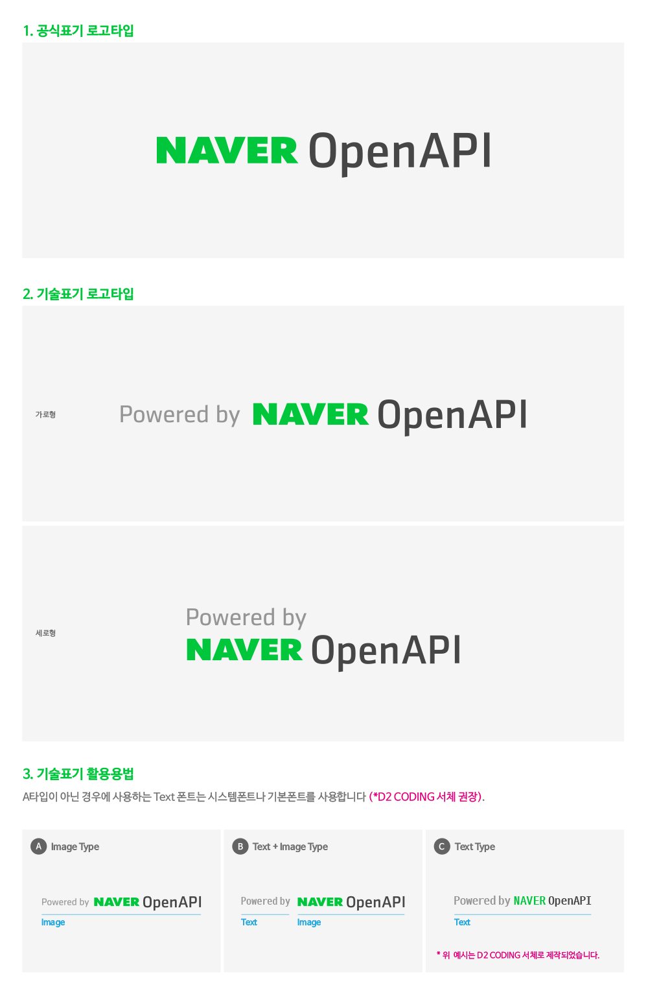

# BI 가이드

여러분이 개발한 프로그램과 서비스가 네이버 오픈 API를 사용해 개발했다는 것을 링크와 로고를 통해 쉽게 표현하도록 도와드리고 있습니다. 본 가이드를 참고하여 해당 애플리케이션 혹은 서비스에 가장 적합한 스타일의 로고를 사용하시기 바랍니다.

### 사용 방법

1\. 사용할 로고를 다운로드하여 원하는 경로에 업로드 후 연결해 사용하실 수 있습니다.  
2\. 로고 클릭시 이동하는 링크는 개발자센터 오픈 API 메인 페이지(<https://developers.naver.com>)로 걸어주시면 됩니다.  
3\. 링크는 다음과 같은 방법으로 적용해주시면 됩니다.

```
<a href="https://developers.naver.com" target="_blank">
    
</a>
```

### 활용 방법

공식 표기는 아래와 같으며 기술표기 로고타입은 가로형이나 세로형이 가능합니다. 이미지가 아닌 텍스트 폰트를 활용해서 적용하실 경우는 [D2 Coding체](https://github.com/naver/d2codingfont) 를 권장하며 시스템폰트나 기본폰트도 사용가능합니다.



### 로고 다운로드

[AI](/inc/devcenter/downloads/AI.zip) [PNG](/inc/devcenter/downloads/PNG.zip)

