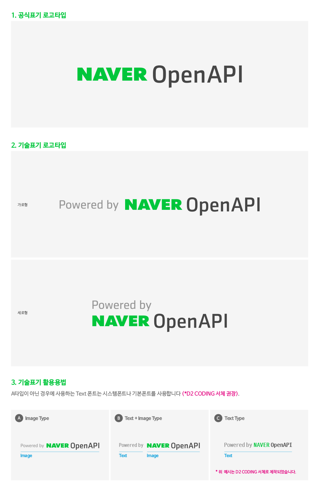

# BI 가이드

<html lang="ko">
<head>
    <title>NAVER Developers - BI 가이드</title>
</head>
<body>

    

        

    

    

        여러분이 개발한 프로그램과 서비스가 네이버 오픈 API를 사용해 개발했다는 것을 링크와 로고를 통해 쉽게 표현하도록 도와드리고 있습니다.
        본 가이드를 참고하여 해당 애플리케이션 혹은 서비스에 가장 적합한 스타일의 로고를 사용하시기 바랍니다.
    

    <h3 class="h_sub">사용 방법</h3>
    

        1. 사용할 로고를 다운로드하여 원하는 경로에 업로드 후 연결해 사용하실 수 있습니다. 
        2. 로고 클릭시 이동하는 링크는 개발자센터 오픈 API 메인 페이지(https://developers.naver.com)로 걸어주시면 됩니다. 
        3. 링크는 다음과 같은 방법으로 적용해주시면 됩니다.
    

    

        <code>
            <pre>&lt;a href="http://developers.naver.com" target="_blank"&gt;     &lt;img src="로고 이미지 위치" alt="NAVER 오픈 API" /&gt; &lt;/a&gt;</pre>
        </code>
    

    <h3 class="h_sub">활용 방법</h3>
    

        공식 표기는 아래와 같으며 기술표기 로고타입은 가로형이나 세로형이 가능합니다.
        이미지가 아닌 텍스트 폰트를 활용해서 적용하실 경우는
        <a class="color_p2 underline" target="_blank" href="http://dev.naver.com/projects/d2coding/">D2 Coding체</a> 를
        권장하며
        시스템폰트나 기본폰트도 사용가능합니다.
    

    

        
    

    <h3 class="h_sub">로고 다운로드</h3>
    

        <dl class="poweredby">
            <dd>
                <a class="btn_n" href="./downloads/AI.zip"><i class="xi-download"></i> AI</a>
                <a class="btn_n" href="./downloads/PNG.zip"><i class="xi-download"></i> PNG</a>
            </dd>
        </dl>
    

</body>
</html>