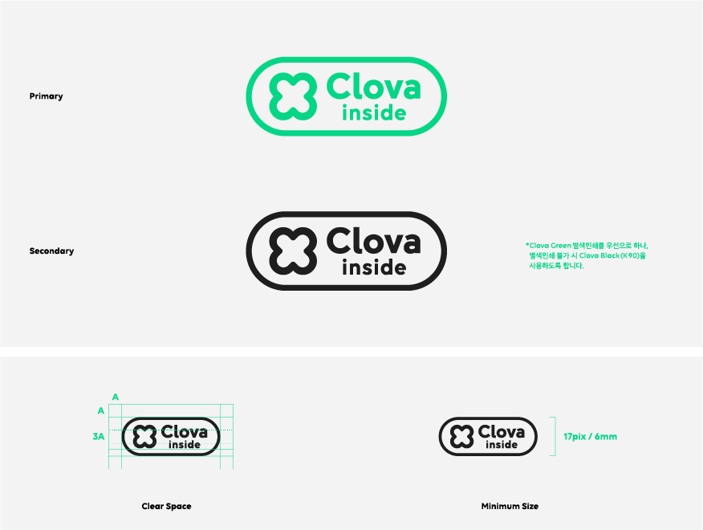
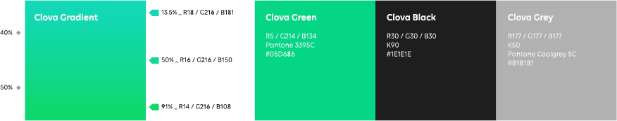
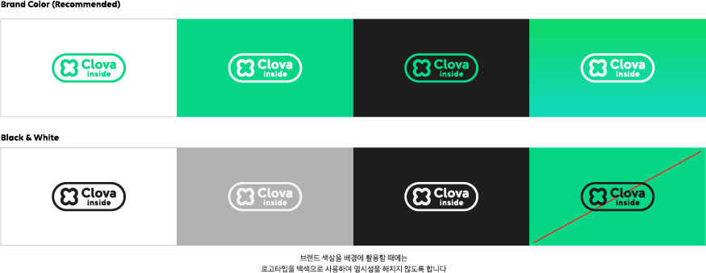
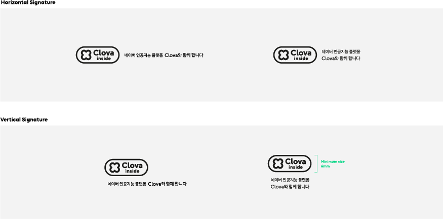
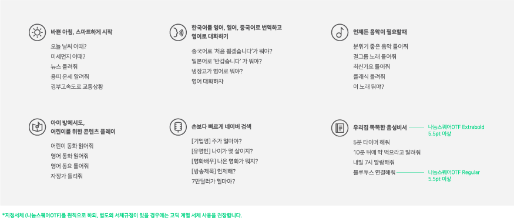

## 클로바 브랜드 가이드라인

### 로고타입(Logotype)

CLOVA 로고타입은 대내외적으로 브랜드 일체감을 조성하고 일관된 이미지를 전달하는 역할을 합니다.  
CLOVA의 브랜드 정체성을 가장 정확하게 전달하는 요소이므로 가장 우선적으로 활용하도록 하며, 사용시 유의를 요합니다.

### 브랜드 컬러(Brand color)

Brand Color는 CLOVA의 정체성을 나타내는 중요한 요소입니다 구현 매체와 환경을 파악하여 일관된 색상을 유지할 수 있도록 섬세하게 적용하여야 하며,  
적용시에는 관리부서와 협의하도록 합니다.

### 앱 아이콘(App Icon)

App Icon은 모바일 환경에서 사용할 수 있도록 고안한 심볼 요소로, 디바이스 및 사용 환경을 고려하여 적합한 항목으로 활용하도록 합니다.  
사용 시에는 컬러와 형태에 변형이 없도록 유의합니다.

### 배경색상 적용(Background Color Usage)

CLOVA 로고타입을 적용할 수 있는 배경 색상 및 사용에 대한 규정입니다. 일관된 아이덴티티 유지 및 전달을 위해 명시된 규정에 따라 올바르게 사용하도록 합니다.  
지정된 컬러 이외의 조합은 금지합니다.

### 그래픽 모티프(Graphic Motif)

Graphic Motif는 CLOVA 브랜드의 정체성을 나타내기위해 고안된 그래픽 언어입니다.  
다양한 색상과 패턴 조합으로 표현 및 활용할 수 있으며, 관리부서와 협의하에 활용하도록 합니다.

### 명칭 표기 규정(Marking Guide)

CLOVA로 커뮤니케이션 시 오용을 최소화하기 위한 명칭 표기 규정입니다.  
표기 규정을 참고하여 적용처에 따라 올바르게 사용할 수 있도록 유의합니다.

### 로고 다운로드

[AI](/inc/devcenter/downloads/Clova_Brand_Guidelines_Summary_170912_outline.ai)

## 클로바 인사이드 브랜드 가이드라인

### 엠블렘(Emblem)

CLOVA Inside의 엠블렘은 특정 디바이스에 CLOVA의 기술이 탑재되었음을 직접적으로 알려주는 중요한 브랜드 요소입니다.  
적용 매체와 환경의 특성을 파악하여 인쇄 등 표현물에 오류가 없도록 합니다.

### 브랜드 컬러(Brand color)

Brand Color는 CLOVA의 정체성을 나타내는 중요한 요소입니다 구현 매체와 환경을 파악하여 일관된 색상을 유지할 수 있도록 섬세하게 적용하여야 하며,  
적용시에는 관리부서와 협의하도록 합니다.

### 배경 색상 적용(Brand Color)

CLOVA inside 엠블렘을 적용할 수 있는 배경 색상 및 사용에 대한 규정입니다. 일관된 아이덴티티 유지 및 전달을 위해  
명시된 규정에 따라 올바르게 사용하도록 합니다. 사용 시에는 컬러와 형태에 변형이 없도록 유의합니다.

### 패키지 시그니처(Signature for Package)

CLOVA inside 엠블렘을 패키지에 적용 시 설명 문구를 조합하여 사용하는 것을 권장합니다.  
엠블렘 최소크기를 준수하여 오용이 없도록 합니다.

### 디바이스 시그니처(signature for Device)

CLOVA inside 엠블렘을 디바이스에 적용 시, 텍스트 형식으로 사용하는 것을 권장합니다.  
텍스트 최소크기를 준수하여 오용이 없도록 유의합니다.

### 패키지 설명문구 작성(Description for Package)

특정 디바이스에 탑재된 CLOVA의 기능 및 사용방법에 대해 직관적으로 알리기 위해, 규정된 설명 문구를 패키지에 적용하여야 합니다.  
인쇄 환경을 고려하여 적절한 위치와 크기로 적용될 수 있도록 아래의 내용을 참고 및 제작합니다.

### 로고 다운로드

[AI](/inc/devcenter/downloads/Clova_inside_Brand_Guidelines_Summary_170912_outline.ai)

