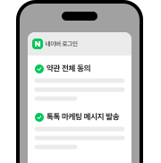

# 네이버 로그인

**한국어** · [English](/products/login/api/api_en)

아이디/비밀번호를 잊어도, 번거로운 회원가입 없이,
네이버 앱이 설치되어 있다면 보다 더 빠르게 네이버 아이디로 편리하고 안전하게 사이트를 이용할 수 있어요.
전 국민 모두가 가지고 있는 네이버 아이디를 기반으로 유입된 이용자를 내 회원으로 만들어보세요.

## 네이버 로그인 플러스

[자세히 보기 &gt;](/docs/login/devguide#5-2-네이버-로그인-플러스)

업그레이드 된 네이버 로그인 플러스를 만나보세요.

간단한 설정으로,

- 네이버 로그인 동의창에서 사이트 가입에 필요한 약관동의를 한번에
- 네이버 톡톡을 통해 사이트의 소식과 다양한 마케팅 메시지 발송을
- 스마트스토어나 쇼핑라이브 운영 중이라면 알림받기까지!

위와 같은 편의를 제공할 수 있습니다.

## 왜 네이버 로그인일까요?

### 네이버페이 배송지 주소 연계

네이버페이 이용자의 배송지 주소를 간편하게 연계하여 사용할 수 있어요. [자세히 보기 &gt;](/docs/login/payaddress-api#네이버-페이-배송지-정보-조회-api)

### 네이버 앱 로그인 유지 기능

사이트에 한 번 로그인하면, 네이버 검색 및 디스플레이 광고를 통해 사이트에 재방문 시 다시 로그인할 필요가 없어요. [자세히 보기 &gt;](/docs/login/devguide#5-1-네이버앱에서-서비스-자동로그인-처리)

### 개인화 광고

사용자의 동의를 통해 맞춤형 광고나 마케팅 분석이 가능해요. (제휴 기반 운영 중) [자세히 보기 &gt;](https://naver-ad-api.github.io/openapi-guide/docs/prepare/developers-my-application#%EC%95%A0%ED%94%8C%EB%A6%AC%EC%BC%80%EC%9D%B4%EC%85%98-%EB%93%B1%EB%A1%9D)

### OIDC(Open ID Connect) 지원

네이버 로그인은 OAuth 2.0을 기반으로 사용자 인증정보를 제공하고 있어 안심하고 사용할 수 있어요. [자세히 보기 &gt;](/docs/login/devguide#3-5-open-id-connect로-네이버-로그인-연동하기)

### SDK

네이버 앱 호출을 통해 빠른 로그인이 가능해요. [자세히 보기 &gt;](/docs/login/sdks)

### 네이버 로그인 뱃지 노출

검색결과에서 '네이버 로그인' 뱃지로 주목도를 높일 수 있어요. [자세히 보기 &gt;](/docs/login/devguide#2-2-5-네이버-로그인-뱃지)

### 주요 호스팅사 자동 연결

카페24/메이크샵/플렉스지 솔루션을 이용중이시라면, 네이버 로그인 연동 기능이 탑재되어 보다 빠르게 적용할 수 있어요.

### SOC인증 취득

네이버 로그인은 2023년부터 SOC(System and Organization Controls: 내부통제의 적절성을 국제 인증업무 기준에 따라 평가하는 제도) 보고서를 발행하여 안정적인 서비스를 제공하고 있어요. [자세히 보기 &gt;](https://policy.naver.com/policy/soc.html)

<a href="/myapps/new">오픈 API 이용 신청</a>
<a href="/docs/login/devguide">개발 가이드 보기</a>

