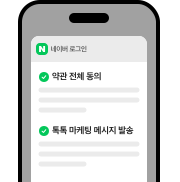
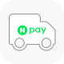
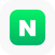
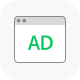
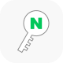
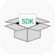
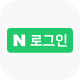
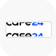

<!-- DONT_APPLY_MARKDOWN_STYLE -->

    

        

            

                <select name="lang" onchange="location.href = this.value === 'en' ? '/products/login/api/api_en.md' : '/products/login/api/api.md'">
                    <option value="ko" selected>한국어</option>
                    <option value="en">English</option>
                </select>
            

        

        

            <dl>
                <dt class="service_title">네이버 로그인</dt>
                <dd>
                    

                        아이디/비밀번호를 잊어도,번거로운 회원가입 없이, 
                        네이버 앱이 설치되어 있다면 보다 더 빠르게 네이버 아이디로 편리하고 안전하게 사이트를 이용할 수 있어요. 
                        전 국민 모두가 가지고 있는 네이버 아이디를 기반으로 유입된 이용자를 내 회원으로 만들어보세요.
                    

                </dd>
            </dl>
            <dl>
                <dt class="service_title">
                    네이버 로그인 플러스
                    <a href="https://developers.naver.com/docs/login/devguide/devguide.md#5-2-네이버-로그인-플러스" class="link">자세히 보기 &gt;</a>
                </dt>
                <dd>
                    

                        

                            
                        

                        

                            

                                업그레이드 된 네이버 로그인 플러스를 만나보세요.  
                                한번의 가입으로,

                            <ul class="service_list">
                                <li>네이버 로그인 동의창에서 사이트 가입에 필요한 약관동의를 한번에</li>
                                <li>네이버 톡톡을 통해 사이트의 소식과 다양한 마케팅 메시지 발송을</li>
                                <li>스마트스토어나 쇼핑라이브 운영 중이라면 알림받기까지!</li>
                            </ul>
                            
위와 같은 혜택을 누려보세요.

                        

                    

                </dd>
            </dl>
            <dl>
                <dt class="service_title">왜 네이버 로그인일까요?</dt>
                <dd>
                    

                        

                            
                        

                        

                            <strong class="sub_title">
                                네이버페이 배송지 주소 연계
                                <a href="https://developers.naver.com/docs/login/payaddress-api/payaddress-api.md#네이버-페이-배송지-정보-조회-api" class="link">자세히 보기 &gt;</a>
                            </strong>
                            
네이버페이 이용자의 배송지 주소를 간편하게 연계하여 사용할 수 있어요.

                        

                    

                    

                        

                            
                        

                        

                            <strong class="sub_title">
                                네이버 앱 로그인 유지 기능
                                <a href="https://developers.naver.com/docs/login/devguide/devguide.md#5-1-1-서비스-자동로그인이란" class="link">자세히 보기 &gt;</a>
                            </strong>
                            
사이트에 한 번 로그인하면, 네이버 검색 및 디스플레이 광고를 통해 사이트에 재방문 시 다시 로그인할 필요가 없어요.

                        

                    

                    

                        

                            
                        

                        

                            <strong class="sub_title">
                                개인화 광고
                                <a href="https://naver-ad-api.github.io/openapi-guide/docs/prepare/developers-my-application#%EC%95%A0%ED%94%8C%EB%A6%AC%EC%BC%80%EC%9D%B4%EC%85%98-%EB%93%B1%EB%A1%9D" class="link">자세히 보기 &gt;</a>
                            </strong>
                            
사용자의 동의를 통해 맞춤형 광고나 마케팅 분석이 가능해요. (제휴 기반 운영 중)

                        

                    

                    

                        

                            
                        

                        

                            <strong class="sub_title">
                                OIDC(Open ID Connect) 지원
                                <a href="https://developers.naver.com/docs/login/devguide/devguide.md#3-5-open-id-connect로-네이버-로그인-연동하기" class="link">자세히 보기 &gt;</a>
                            </strong>
                            
네이버 로그인은 OAuth 2.0을 기반으로 사용자 인증정보를 제공하고 있어 안심하고 사용할 수 있어요.

                        

                    

                    

                        

                            
                        

                        

                            <strong class="sub_title">
                                SDK
                                <a href="https://developers.naver.com/docs/login/devguide/devguide.md#3-2-5-네이버-로그인-sdk를-이용해-개발하세요" class="link">자세히 보기 &gt;</a>
                            </strong>
                            
네이버 앱 호출을 통해 빠른 로그인이 가능해요.

                        

                    

                    

                        

                            
                        

                        

                            <strong class="sub_title">
                                네이버 로그인 뱃지 노출
                                <a href="https://developers.naver.com/docs/login/devguide/devguide.md#2-2-5-네이버-로그인-뱃지" class="link">자세히 보기 &gt;</a>
                            </strong>
                            
검색결과에서 '네이버 로그인' 뱃지로 주목도를 높일 수 있어요.

                        

                    

                    

                        

                            
                        

                        

                            <strong class="sub_title">주요 호스팅사 자동 연결</strong>
                            
카페24/메이크샵/플렉스지 솔루션을 이용중이시라면, 네이버 로그인 연동 기능이 탑재되어 보다 빠르게 적용할 수 있어요.

                        

                    

                    

                        

                            
                        

                        

                            <strong class="sub_title">
                                SOC인증 취득
                                <a href="https://policy.naver.com/policy/soc.html" class="link">자세히 보기 &gt;</a>
                            </strong>
                            
네이버 로그인은 2023년부터 SOC(System and Organization Controls: 내부통제의 적절성을 국제 인증업무 기준에 따라 평가하는 제도) 보고서를 발행하여 안정적인 서비스를 제공하고 있어요.

                        

                    

                </dd>
            </dl>
        

        

            <a href="https://developers.naver.com/apps/#/register?api=nvlogin" class="more_link">오픈 API 이용 신청</a>
            <a href="https://developers.naver.com/docs/login/devguide/devguide.md#네이버 로그인-개발가이드" class="more_link">개발 가이드 보기</a>
        
              
    

