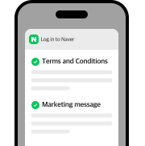
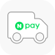
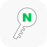
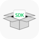
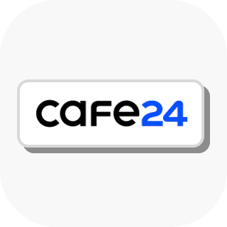

# NAVER Login

[한국어](/products/login/api) · **English**

<a class="secondary" href="/products/login/api/downloads/naverlogin_dev_guide_english_25.2.pdf" download>Development Guide</a>

Even for users who easily forget their password, or for those who are tired of signing up –
With the NAVER app, users have a convenient and secure way of accessing websites quickly using their NAVER ID.
Turn users brought in through NAVER ID – a staple for every Korean – into members of your service.

## NAVER Login Plus

[more details &gt;](/docs/login/devguide#5-2-네이버-로그인-플러스)

Meet NAVER Login Plus, now with an upgrade.

With a single signup, you can:

- Collect all required terms of service consents for site registration in a single step through the NAVER Login consent page,
- Send site updates and marketing messages via NAVER TalkTalk, and
- If you also have a Smart Store or Shopping Live, enable users to receive notifications as well.

Experience all these benefits with just one simple step.

## Why NAVER Login?

### Shipping address integration with NAVER Pay

The shipping address of NAVER Pay users can be easily integrated for use. [more details &gt;](/docs/login/payaddress-api#네이버-페이-배송지-정보-조회-api)

### Staying logged in NAVER App(Android, iOS)

Once logged in, there is no need to log in again when coming back to the site through NAVER search or display ad. [more details &gt;](/docs/login/devguide#5-1-네이버앱에서-서비스-자동로그인-처리)

### Personalized ads

With users’ consent, personalized ads or marketing analysis become available. (Operated with partnerships) [more details &gt;](https://naver-ad-api.github.io/openapi-guide/docs/prepare/developers-my-application#%EC%95%A0%ED%94%8C%EB%A6%AC%EC%BC%80%EC%9D%B4%EC%85%98-%EB%93%B1%EB%A1%9D)

### OIDC (Open ID Connect) support

NAVER Login provides user authentication using OAuth 2.0, ensuring safe and reliable use. [more details &gt;](/docs/login/devguide#3-5-open-id-connect로-네이버-로그인-연동하기)

### SDK

Fast login is available via NAVER app call. [more details &gt;](/docs/login/sdks)

### NAVER Login badge display

Draw users’ attention in the search result with the “NAVER Login” badge. [more details &gt;](/docs/login/devguide#2-2-5-네이버-로그인-뱃지)

### Automatic integration with major hosting companies

If you are using Cafe24, MakeShop, or FLEXG, the built-in NAVER Login integration feature makes it easier to apply to your site.

### SOC compliance

Since 2023, NAVER Login has been issuing the SOC (System and Organization Controls, an international standard for assessing the adequacy of internal controls) reports to provide stable services. [more details &gt;](https://policy.naver.com/policy/soc.html)

<a href="/myapps/new">Apply for Open API</a>
<a href="/docs/login/devguide">Developer Guide</a>

