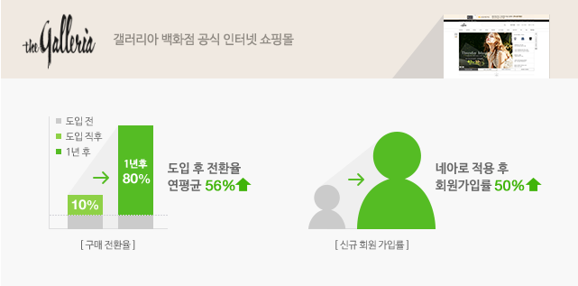
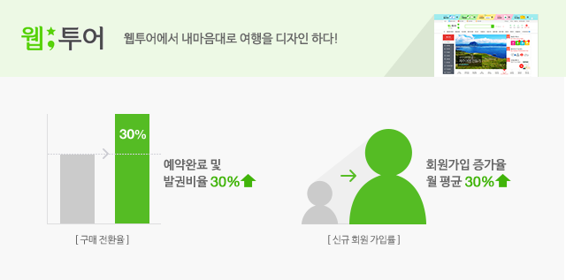
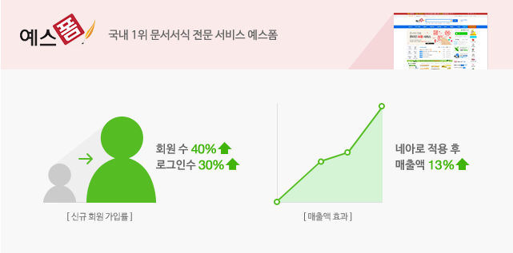
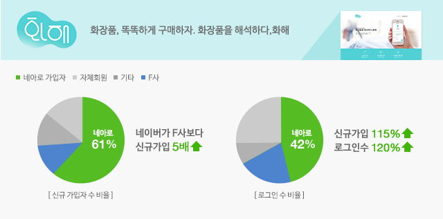
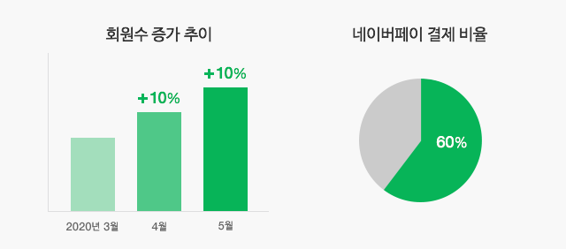
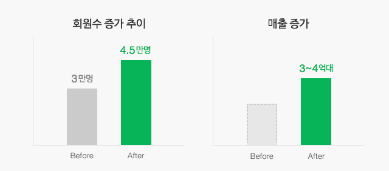
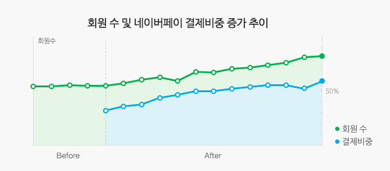
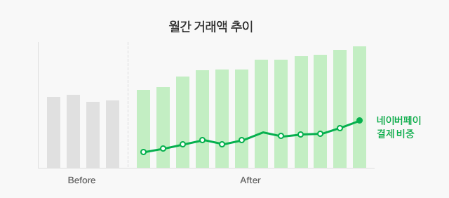

# 네아로 적용사례

<html lang="ko">
<head>
    <title>NAVER Developers - 네이버 아이디로 로그인 적용사례</title>
</head>
<body>
<!-- content -->

    

        

            <a class="btn_n" href="mailto://naveridlogin@naver.com">게시요청</a>
        

    

    

        <a class="cursor">Galleria(갤러리아몰)</a>
         
        

            <a class="btn_b_hi3" href="/apps/#/register?api=nvlogin">오픈 API 이용 신청 &gt;</a>
        

        

        <h3 class="h_sub v4">적용 이후, 회원 가입 부담이 최소화되어 가입률과 구매 전환율이 상승하였습니다.</h3>
        

            과거에는 회원 가입을 하려면 본인 인증부터 이름, 아이디, 비밀번호, 이메일주소 등 입력하는 사항이 많아서 가입 단계에서의 사용자 이탈이 많았습니다.
            네이버 아이디로 로그인 적용 후, 클릭 몇 번만으로 간편하게 회원 가입이 완료되니 가입률과 동시에 구매율이 많이 상승하였습니다.
        

        

            <dl>
                <dt>업체명</dt>
                <dd>Galleria(갤러리아몰)</dd>
            </dl>
            <dl>
                <dt>URL</dt>
                <dd><a target="_blank" class="color_p2 underline" href="http://www.galleria.co.kr">http://www.galleria.co.kr</a></dd>
            </dl>
        

    

    <!-- 2.탭내용:Webtour(웹투어)-->
    

        <a class="cursor">Webtour(웹투어)</a>
         
        

            <a class="btn_b_hi3" href="/apps/#/register?api=nvlogin">오픈 API 이용 신청 &gt;</a>
        

        

        <h3 class="h_sub v4">간편한 가입과 로그인이 매출향상에 도움을 주었습니다.</h3>
        

            여행사 업종 특성상, 1년에 몇번 사용하지 않아서 아이디를 잊어버리는 일이 많습니다. 새로 가입하려고 해도 입력받는 정보가 굉장히 많았고요.
            네이버 아이디로 로그인 적용 후, 아이디를 잊어버린 기존 회원이나 신규 회원에 많은 도움을 주어 네이버에서 들어오는 사용자의 사이트 클릭 대비 실제 발권비율이 30% 상승한 것으로 확인되었습니다.
        

        

            <dl>
                <dt>업체명</dt>
                <dd>Webtour(웹투어)</dd>
            </dl>
            <dl>
                <dt>URL</dt>
                <dd><a target="_blank" class="color_p2 underline" href="http://www.webtour.com">http://www.webtour.com</a></dd>
            </dl>
        

    

    <!-- 3.탭내용:Yesform(예스폼)-->
    

        <a class="cursor">Yesform(예스폼)</a>
         
        

            <a class="btn_b_hi3" href="/apps/#/register?api=nvlogin">오픈 API 이용 신청 &gt;</a>
        

        

        <h3 class="h_sub v4">광고를 통해 유입된 사용자의 결제율이 10%이상 높아졌습니다.</h3>
        

            네이버에서 검색 광고를 집행하고 있는데 네이버 아이디로 로그인 적용 후, 회원 수 증가 및 로그인 페이지 접속률이 30% 상승하여 매출 상승을 일으켰습니다.
            광고 비용은 고정 지출로 되어 있기 때문에  이는 네이버 아이디로 로그인 적용 효과로 보아도 될 것으로 생각됩니다.
        

        

            <dl>
                <dt>업체명</dt>
                <dd>Yesform(예스폼)</dd>
            </dl>
            <dl>
                <dt>URL</dt>
                <dd><a target="_blank" class="color_p2 underline" href="http://www.yesform.com">http://www.yesform.com</a></dd>
            </dl>
        

    

    <!-- 4.탭내용:Hwahae(화해)-->
    

        <a class="cursor">Hwahae(화해)</a>
         
        

            <a class="btn_b_hi3" href="/apps/#/register?api=nvlogin">오픈 API 이용 신청 &gt;</a>
        

        

        <h3 class="h_sub v4">앱 설치 후 신규 회원으로 전환하는 비율이 상승하였습니다.</h3>
        

            F사의 소설로그인도 함께 적용하였으나, 신규 가입자 수와 로그인수 모두 네이버 비율이 가장 높습니다. 오히려 저희 자체 회원보다도 많습니다.
            역시 익숙하고 가장 많이 쓰는 네이버 아이디를 가장 선호하는 것 같습니다.
        

        

            <dl>
                <dt>업체명</dt>
                <dd>Hwahae(화해)</dd>
            </dl>
            <dl>
                <dt>URL</dt>
                <dd><a target="_blank" class="color_p2 underline" href="http://www.hwahae.co.kr">http://www.hwahae.co.kr</a></dd>
            </dl>
        

    

    <!-- 5.탭내용:Happy Campus(해피캠퍼스)-->
    

        <a class="cursor">Happy Campus(해피캠퍼스)</a>
         
        

            <a class="btn_b_hi3" href="/apps/#/register?api=nvlogin">오픈 API 이용 신청 &gt;</a>
        

        

        <h3 class="h_sub v4">적용 후 CS 대응 효율, 매출액이 상승하였습니다</h3>
        

            대학생 회원 외에도 은퇴 후 공부하시는 분들이 많이 이용하시는데, 이 분들의 경우 PC 이용이 익숙지 않아 회원가입 및 아이디/비밀번호에 대한 고객센터 전화 문의가 많았습니다.
            하지만 네아로 도입 이후 이런 문의가 매우 감소하여, CS팀의 업무 효율이 높아졌습니다.
        

        

            <dl>
                <dt>업체명</dt>
                <dd>HappyCampus(해피캠퍼스)</dd>
            </dl>
            <dl>
                <dt>URL</dt>
                <dd><a target="_blank" class="color_p2 underline" href="http://www.happycampus.com/">http://www.happycampus.com</a></dd>
            </dl>
        

    

    <!-- 6.탭내용:Socar(쏘카)-->
    

        <a class="cursor">Socar(쏘카)</a>
         
        

            <a class="btn_b_hi3" href="/apps/#/register?api=nvlogin">오픈 API 이용 신청 &gt;</a>
        

        

        <h3 class="h_sub v4">적용 첫달, SNS 가입 1등!</h3>
        

            네아로가 나왔다는 소식을 듣고, 오랜 개발검토와 우여곡절 끝에 적용하였는데, 적용한 첫달부터 F사를 제치고 SNS가입 1등을 기록하였습니다.
            타사 대비 네아로가 아직 덜 알려졌다고 생각해서 큰 기대는 안했는데, 의외의 결과였습니다.
            또한 네이버 앱스토어, 언론보도 등을 이용하여 '카쉐어링, 네아로로 더욱 빠르고 간편하게' 로 프로모션하여 큰 홍보효과를 거두었습니다.
        

        

            <dl>
                <dt>업체명</dt>
                <dd>SOCAR(쏘카)</dd>
            </dl>
            <dl>
                <dt>URL</dt>
                <dd><a target="_blank" class="color_p2 underline" href="http://www.socar.kr/">http://www.socar.kr</a></dd>
            </dl>
        

    

    

        <h2 class="h_page">네아로 + 네이버페이 동시 적용사례</h2>
    

    <!-- 1.탭내용:S쇼핑몰-->
    

        <a class="cursor">S쇼핑몰</a>
         
        

        

            네이버 아이디로 로그인 도입 후 타 간편 회원 가입 대비 4배 정도 더 네이버 아이디로 로그인 회원 가입이 많습니다.
            회원 가입수가 매월 10% 정도 늘어나고 있는 상황이며,
            네이버 아이디로 로그인하기 회원 중 60%가 네이버페이로 결제를 하고 있습니다.
        

    

    <!-- 2.탭내용:STV쇼핑-->
    

        <a class="cursor">STV쇼핑</a>
         
        

        

            회원 유치 및 비회원 이탈 방지에 네이버 아이디로 로그인하기가 많은 도움을 주고 있다고 생각합니다.
            회원수가 월평균 3만 명대에서 4.5만 명대로 증가하고 있고,
            결제액도 3~4억 원대로 증가 중입니다.
        

    

    <!-- 3.탭내용:K쇼핑몰-->
    

        <a class="cursor">K쇼핑몰</a>
         
        

        

            네이버페이 적용 이후 전체적으로 거래량이 상승하는 것을 
            체감하고 있으며, 박스권에 있던 회원수도 증가하였고, 
            네이버페이 결제 비중도 평균 50% 정도를 차지하고 있어 
            고무적이라고 생각됩니다.
        

    

    <!-- 4.탭내용:M화재사-->
    

        <a class="cursor">M화재사</a>
         
        

        

            네이버페이가 매출 성장에 기여하고 있다고 볼 수 있습니다.
            월간 실적 추이가 우상향하고 있고, 네이버페이의 결제 비중도
            증가하고 있기에, 네이버 아이디로 로그인하기 가맹 이후 
            네이버페이 가맹은 좋은 선택이었다고 생각합니다.
        

    

    

        <a href="/apps/#/register?api=nvlogin" class="btn_nlogin">N 로그인 이용 신청</a>
        <a href="https://admin.pay.naver.com/notice/view?id=200010243" class="btn_npay">N Pay 신청하러 가기</a>
    

</body>
</html>