# 적용 가이드

<html lang="ko">
<head>
    <title>NAVER Developers - 네이버 아이디로 로그인 적용 가이드</title>
</head>
<body>

    <h3 class="h_sub">네이버 아이디로 로그인 적용 사이트 A,B 왜 이렇게 다를까요?</h3>
    

        <a class="btn_b_hi3" href="https://developers.naver.com/apps/#/register?api=nvlogin">오픈 API 이용 신청 &gt;</a>
    

    
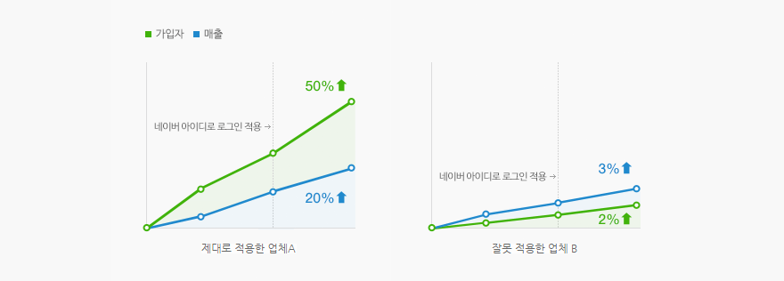

    

        두 업체 모두 네이버 아이디로 로그인을 적용했지만 적용 효과는 확연히 차이가 납니다. 업체 B는 사용자가 소셜로그인에 기대하는 핵심 가치를 제대로 구현하지 않았기 때문입니다. 어떻게 해야 업체 A처럼 확실한 효과를 볼 수 있을지 알려 드리겠습니다.
        다음 내용을 꼭 읽어 보시고 여러분의 사이트와 앱에는 어떻게 적용할지 생각해 보세요.
    

    <h3 class="h_sub">1. 네이버 아이디로 로그인 버튼을 한눈에 알아볼 수 있게 제공하세요</h3>
    

        사용자는 로그인 창에서 아이디와 비밀번호를 입력하는 데 집중하기 때문에 주변의 요소는 잘 인지하지 못합니다. 네이버 아이디로 로그인 버튼이 로그인 페이지에서 눈에 띄게 드러나지 않는다면 사용자는 네이버 아이디로 간편하게 로그인할 수 있다는 것을 알지 못하기 때문에, 적용할 때 기대했던 서비스 활성화 효과를 얻지 못하게 됩니다.
    

    
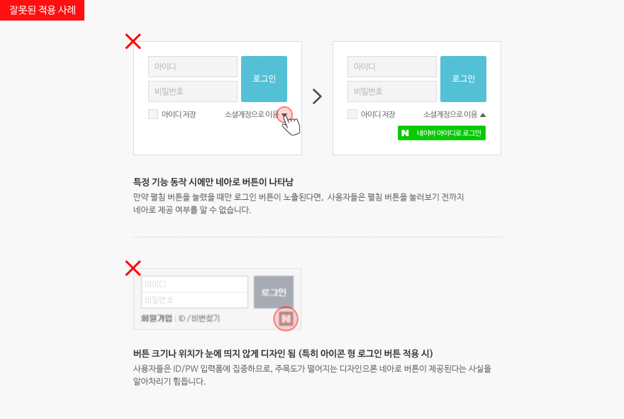

    

        <strong>* 웹사이트 방문자의 97%는 로그인 페이지에서 ID/PW를 입력하는데 집중하느라 페이지 디자인의 변화를 알아차리지 못함</strong>
        
&lt; S. E. Schechter, R. Dhamija, A. Ozment, and 1. Fischer, "The emperor's new security indicators," in SP 'OJ: Proceedings of the 200J IEEE Symposium on Security and Privacy. Washington, DC, USA: IEEE Computer Society, 2007, pp.51-65. &gt;

    

    <h4 class="h_subsub">그럼 로그인 페이지를 어떻게 디자인 해야 하나요?</h4>
    

        1.1. 독립적인 로그인 화면으로 공간이 넉넉한 경우
    

    
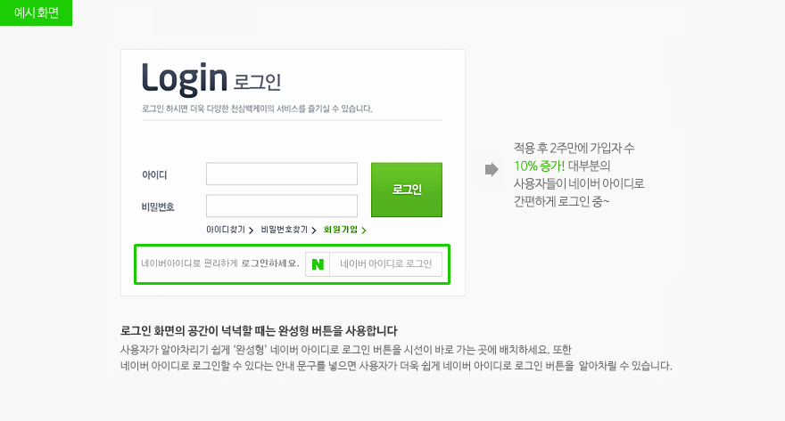

    

        1.2. 공간에 제약이 있는 경우
    

    
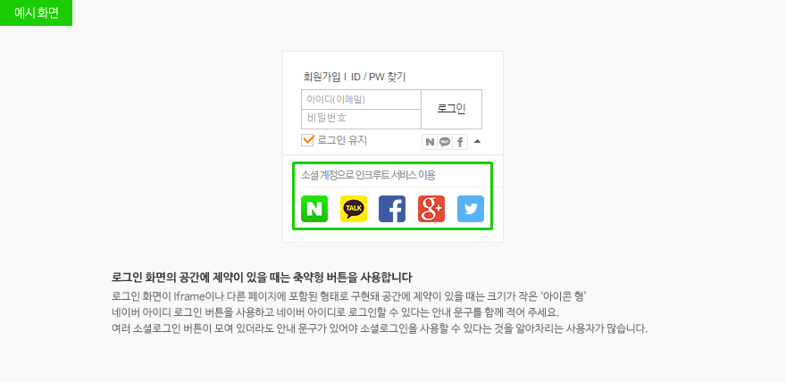

    

        1.3. PC와 모바일 환경 모두에 네이버 아이디로 로그인 버튼을 사용합니다.
    

    
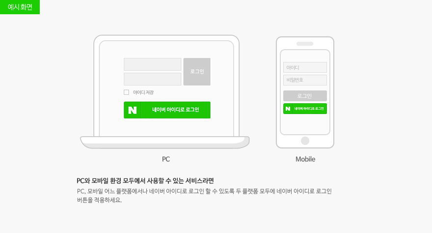

    
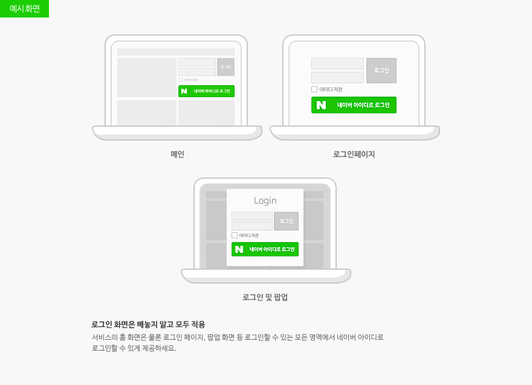

    

        <strong>네이버 아이디로 로그인 버튼 사용 가이드</strong>
        
운영하는 애플리케이션이나 서비스의 상황에 맞게 버튼 이미지의 디자인을 변경할 수 있지만 네이버 고유의 아이덴티티를 유지할 수 있도록 <a class="color_p2 underline" href="https://developers.naver.com/docs/login/bi/bi.md">"네이버 아이디로 로그인 버튼 사용 가이드"</a>에 제시된 디자인을 최대한 유지하는 것을 권장합니다.

    

    <h3 class="h_sub">2. 가입 과정에서 정보는 최소한으로 수집하세요</h3>
    

        사용자는 네이버 아이디로 로그인하면 별도의 가입 절차 없이 바로 서비스를 이용할 수 있기를 기대합니다. 그러나 가입 과정에서 휴대폰 인증을 요구하거나 주소 등과 같은 추가 정보를 과다하게 요구해 ‘네이버 계정으로 간편하게 이용한다’는 느낌을 주지 못한다면 많은 사용자가 ‘별도의 가입 절차’ 앞에서 이탈하게 됩니다.
        추가 정보는 필요한 시점에 수집해 저장하는 것이 좋습니다. 필요할 때 요구하는 정보는 사용자도 당연하다고 느낍니다. 서비스를 이용하도록 하는 것이 우선이라는 것을 기억하세요.
    

    

        또한 이미 네이버 아이디와 패스워드를 입력해 로그인 했는데 별도의 아이디와 패스워드를 한번 더 만들도록 요구한다면 사용자를 매우 불편하게 만드는 절차입니다.  다른 정보에 비해 아이디와 패스워드는 입력 조건이 까다로워 사용자는 더 번거롭게 느낄 수 있습니다.
        ‘네이버 아이디로 로그인’ 연결에 대한 동의 절차에 바로 이어지는 회원 가입 페이지에서 별도의 비밀번호를 입력 받지 않도록 하세요. 이는 매우 중요한 부분이며 미준수시 이용이 제한될 수 있습니다.
    

    
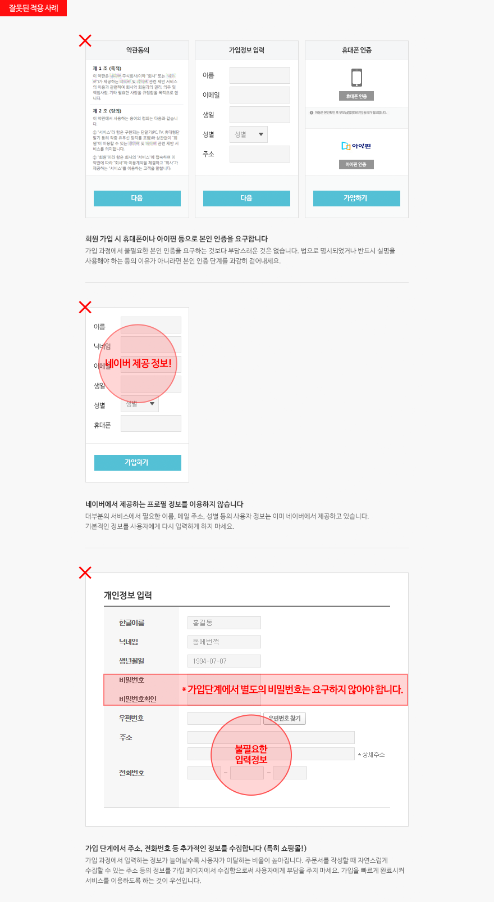

    

        <strong>가입 단계에서 추가 정보를 요청할 때 사용자의 반응</strong>
        
“소셜로그인이래서 클릭하면 바로 이용할 수 있는 줄 알았는데, 이게 더 불편하네요 ㅠㅠ” - 누리꾼 A “주소 입력하고 휴대폰인증도 받으라길래 바로 가입 창 닫았어요” - 누리꾼 B

    

    <h4 class="h_subsub">그럼 가입페이지를 어떻게 구성해야 하나요?</h4>
    

        2.1. 네이버가 제공하는 정보만으로 충분한 경우
    

    
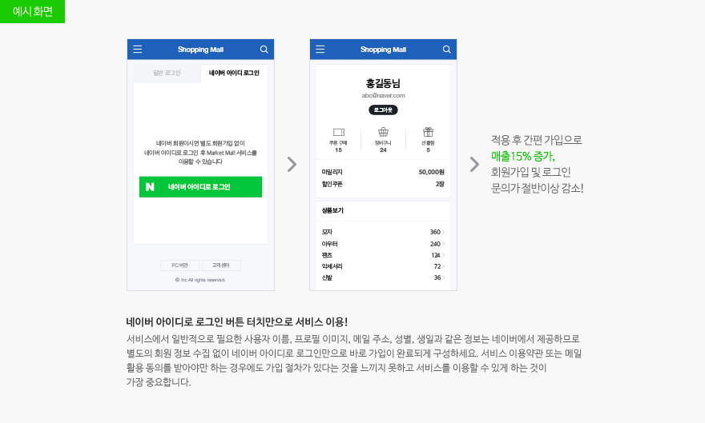

    

        2.2 네이버에서 제공하는 정보로 충분하지만 이용자에게 재입력 받고 싶은 정보가 있는 경우
    

    
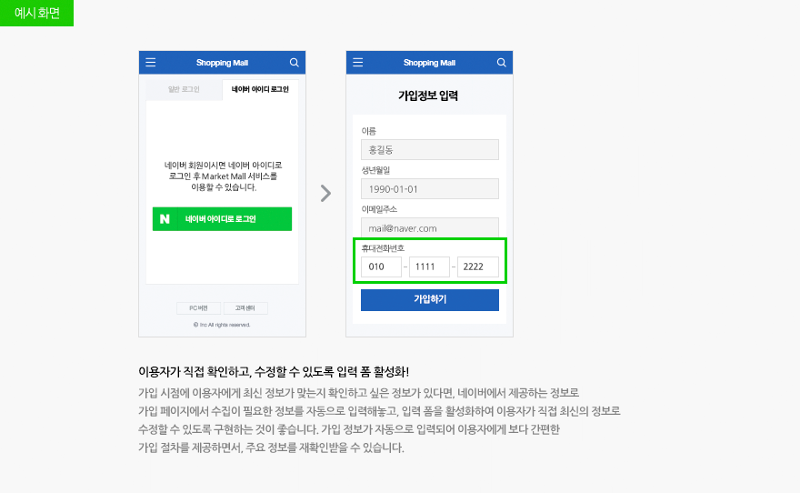

    

        2.3. 네이버가 제공하는 정보외 추가로 필요할 경우
    

    

        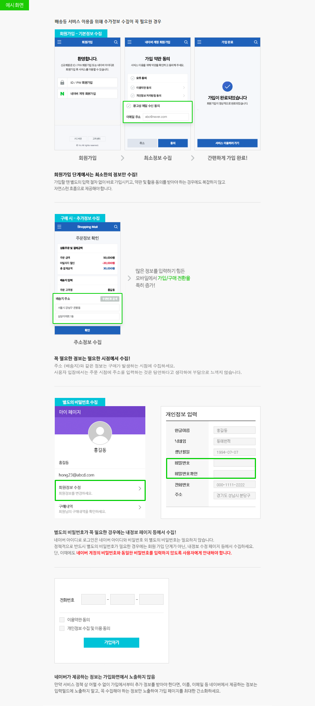

    <h3 class="h_sub">3. 네이버 아이디로 로그인을 가입과 로그인에 모두 적용하세요</h3>
    

        가입 화면과 로그인 화면에 모두 네이버 아이디로 로그인을 적용하고 두 페이지가 자연스럽게 연결되게 하세요.
    

    

        사이트에 처음 방문한 사용자는 일반적으로 ‘가입하기’를 클릭하기 때문에, 로그인 화면에만 네이버 아이디로 로그인을 적용한다면 네이버 아이디로 로그인의 효과는 떨어질 수 밖에 없습니다. 가입 화면과 로그인 화면에 모두 네이버 아이디로 로그인을 적용해 어디로 접근하든 네이버 아이디로 로그인을 이용할 수 있게 하세요.
    

    
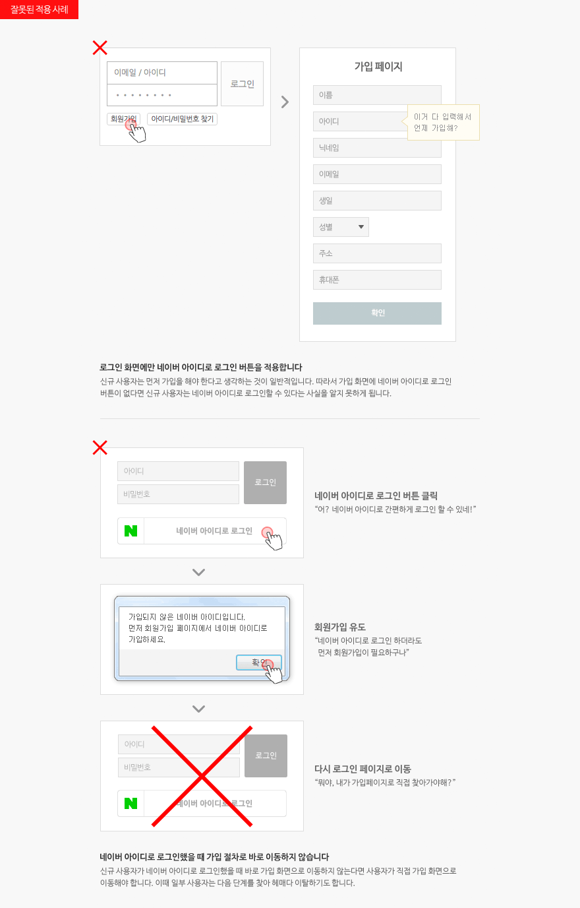

    <h4 class="h_subsub">그럼 어떻게 가입과 로그인 페이지를 구성, 연결해야 할까요?</h4>
    

        3.1. 로그인 뿐만 아니라 가입 화면에도 모두 적용하는 경우
    

    
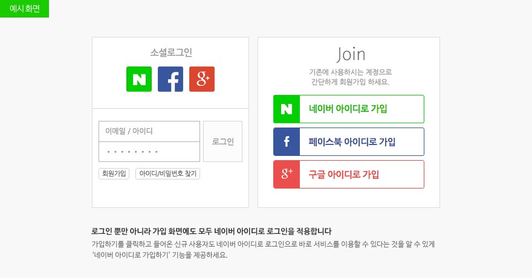

    

        3.2. 네이버 아이디로 로그인 시, 회원 가입으로 바로 이동 시키는 경우
    

    
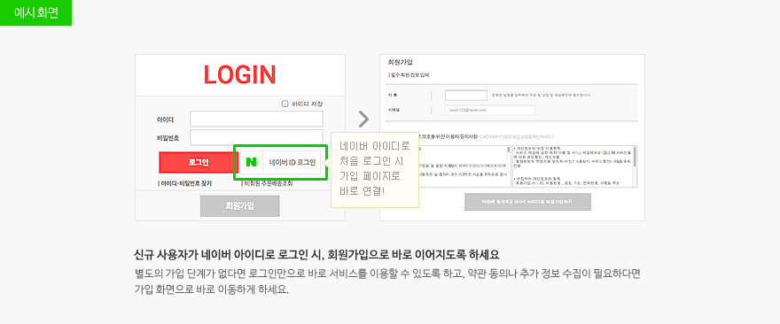

    <h3 class="h_sub">4. 네이버 아이디로 로그인 SDK를 이용해 개발하세요</h3>
    

        네이버 아이디로 로그인은 JavaScript와 Android, iOS를 지원하는 SDK를 제공합니다. SDK에는 샘플 애플리케이션이 포함되어 있으며 이를 이용해 로그인 인증부터 API 호출까지 매우 쉽게 구현할 수 있습니다.
    

    

        <a class="color_p2 underline" href="/docs/login/sdks">네이버 아이디로 로그인 SDK 다운로드 &gt;</a>
    

    

        또한 모바일 애플리케이션을 개발할 때 SDK를 이용하면 네이버 앱을 이용한 간편 로그인을 사용할 수 있어 사용자가 훨씬 편하게 로그인할 수 있습니다.
    

    
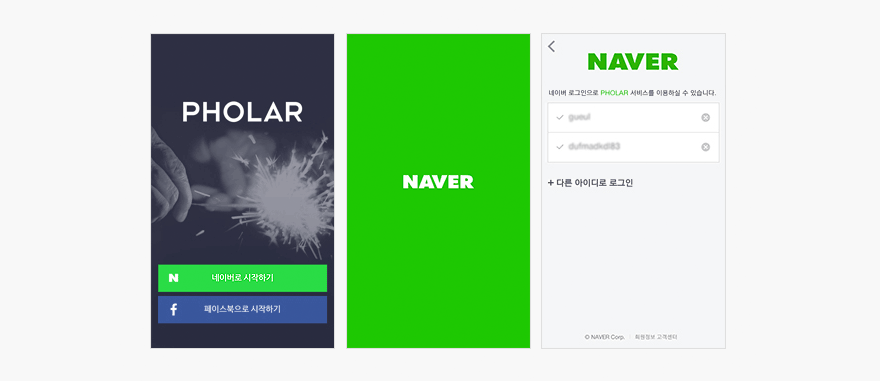

    <h3 class="h_sub">기존 회원 연동 관련 Tip!</h3>
    <h4 class="h_subsub">기존 회원 관리 체계가 있는 서비스는 이렇게</h4>
    

        신규 회원 유입이 중요한 스타트업이나 기존 회원 활성화가 목표인 업체 모두에게 네이버 아이디로 로그인은 좋은 성공 수단이 될 수 있습니다. 그러나 오래 전부터 자체 회원 관리 체계를 갖추고 있는 업체는 기존의 회원 관리 체계에 네이버 아이디로 로그인을 어떻게 적용할지 고민이 있을 수 있습니다.
        이 고민을 해결하기 위해 기존에 가입된 계정과 네이버 아이디를 어떻게 연결하고 가입 페이지는 어떻게 수정하면 좋을지 등을 안내해 드립니다.
    

    <h4 class="h_subsub">✔네이버가 제공하는 프로필 정보로 기존 가입 여부를 확인할 수 있습니다.</h4>
    

        이미 사이트에 가입되어 있지만 이 사실을 모르고 네이버 아이디로 다시 가입하는 경우 한 회원이 여러 아이디를 가지게 되어 구매 이력 등의 관리가 어려워질 수 있습니다.
        기존에 가입한 계정과 네이버 아이디를 자연스럽게 연동하려면 네이버가 제공하는 메일 주소나 이름, 생일, 성별 등의 프로필 정보를 기준으로 동일한 정보로 이미 가입한 회원이 있는지 조회해 가입 여부를 판단하는 절차가 있어야 합니다.
        만약 해당 프로필과 동일한 정보로 가입된 회원이 없다면 신규회원으로 간주해 가입 절차로 넘어갑니다.
    

    
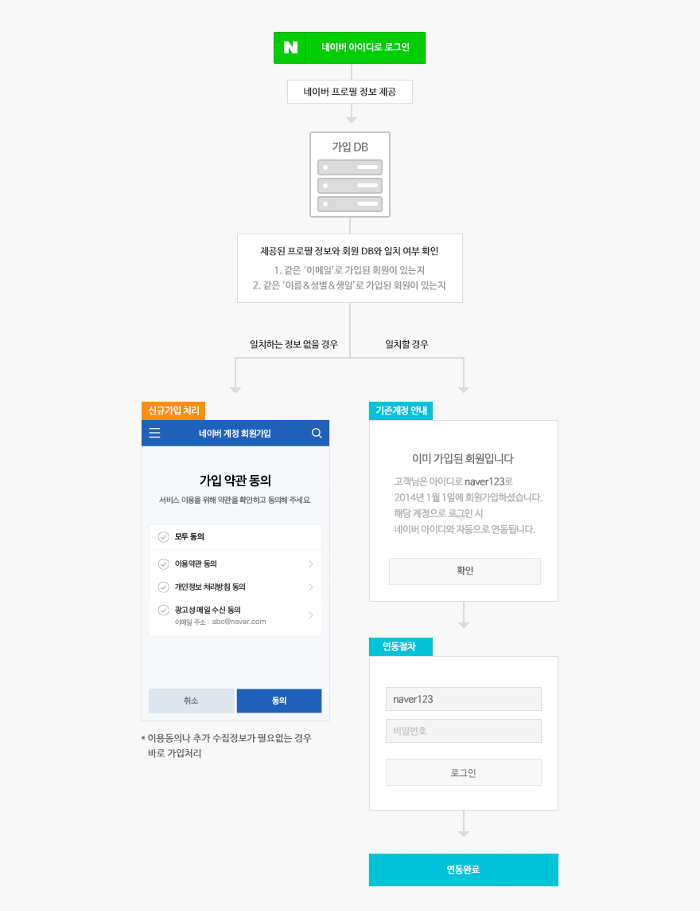

    

        <strong class="color_p3"><i class="xi-info-suqare"></i> 로그인 후 곧바로 기존 아이디와 비밀번호를 요구하지 마세요</strong>
        
이미 네이버 아이디와 패스워드를 입력해 로그인 한 사용자에게, 기존에 가입한 계정을 연동시키려는목적으로 곧바로 기존 아이디와 패스워드 입력을 또다시 요구하는 것은 사용자를 불편하게 만드는 절차입니다. 사용자가 직접 ID/PW를 입력하거나 찾지 않아도 되게끔, 이메일 등의 정보로 이미 가입된 지 여부를 먼저 확인해주세요. 가입된 적이 없다면 신규가입 처리를, 이미 가입되었다면 기존 계정을 안내하여 자연스러운 진행이 가능합니다.

    

    
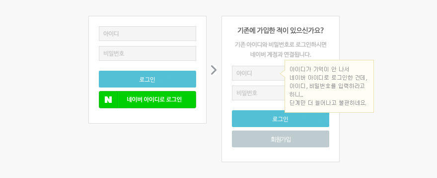

    <h4 class="h_subsub">✔기존 회원을 위한 연동 절차를 제공하세요.</h4>
    

        네이버 아이디로 회원 가입을 하지 않은 기존 회원도 네이버 아이디로 로그인을 사용할 수 있도록 ‘내정보’등 환경 설정 페이지에서 연동 절차를 제공하세요.
    

    
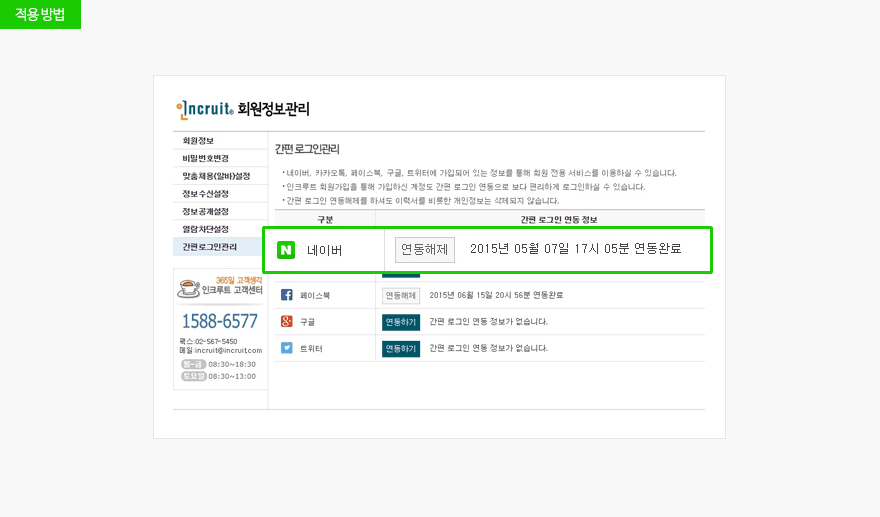

    <h3 class="h_sub">5. 네이버페이도 함께 적용해보세요.</h3>
    

        ‘네이버 아이디로 로그인’과 ‘네이버페이’를 동시에 적용해 보세요. 시너지를 얻을 수 있습니다!
    

    <h4 class="h_subsub">네이버페이 서비스란?</h4>
    

        네이버페이는 네이버 아이디 하나로 가맹점 어디에서나 안심하고 간편하게 구매할 수 있는 서비스입니다.  네이버페이 가맹점이 되면, 다양한 마케팅 활동이 가능해 고객 확보와 매출 증대 등의 혜택을 누리실 수 있습니다.
    

    
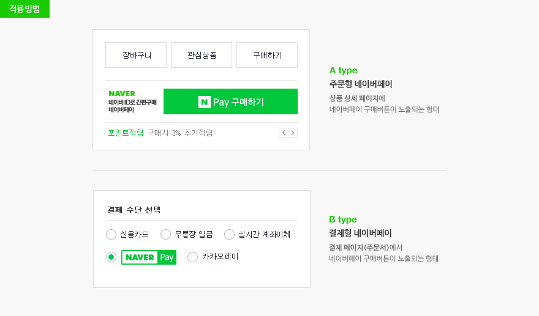

    

        <strong>권장형태</strong>
        

            - 콘텐츠, 용역 등의 비실물 서비스의 경우, 결제형 네이버페이 
            - 의류, 식품 등 실물 상품이 배송되는 경우, 주문형 네이버페이 
            (유형별 가맹 조건은 네이버페이센터에서 확인 가능합니다)
        

        
<a href="https://admin.pay.naver.com/notice/view?id=200010243" class="btn_npay">N Pay 신청하러 가기</a>

    

</body>
</html>