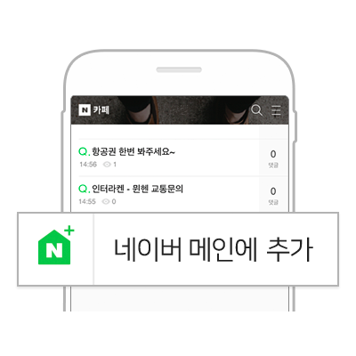

# 네이버 오픈메인

### 여러분의 사이트를 네이버 메인에서 바로 볼 수 있습니다

오픈메인은 사용자가 원하는 웹페이지를 네이버 메인에 추가해 보는 기능입니다.  
이 기능을 사용하면 여러분의 사이트가 그대로 2,900만명이 매일 방문하는 네이버 메인에 노출될 수 있습니다.

사용자들은 검색하거나 주소를 입력해 방문해야 했던 여러분의 사이트를 네이버앱만 실행시키면 바로 볼 수 있어 편리하게 이용할 수 있습니다.  
네이버 메인에 여러분의 사이트가 추가되면 더 많은 사용자가 더 자주, 여러분의 사이트로 방문하게 됩니다.  
원하는 위치로 순서도 변경할 수 있어 여러분의 사이트가 네이버 메인의 첫번째 페이지가 될 수도 있습니다.

여러분의 사이트가 더 많이 추가될 수 있도록 페이지 내에 \[메인에 추가\] 버튼을 달아 보세요.  
오픈메인이 제공하는 스크립트를 복사해 붙이면 쉽고 간편하게 버튼 디자인부터 플로우 실행이 가능해 집니다.

<a href="/docs/service-apis/openmain">개발 가이드 보기</a>

