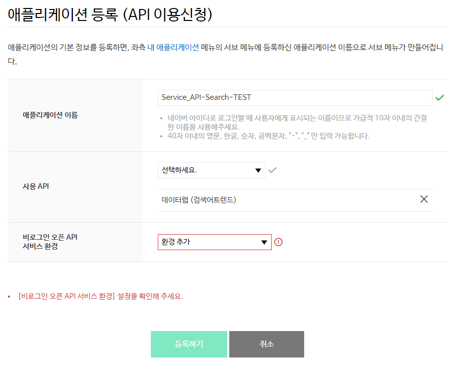
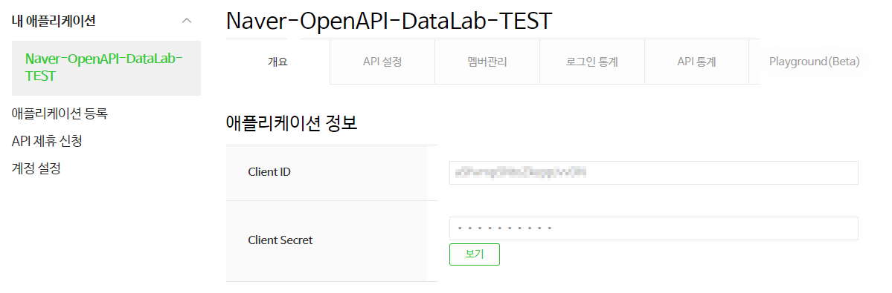

# 통합 검색어 트렌드

<div class="table-of-contents">
<ul>
<li><a href='#통합-검색어-트렌드-개요'>통합 검색어 트렌드 개요</a></li>
    <ul>
        <li><a href='#개요'>개요</a></li>
        <li><a href='#사전-준비-사항'>사전 준비 사항</a></li>
    </ul>
<li><a href='#통합-검색어-트렌드-api-레퍼런스'>통합 검색어 트렌드 API 레퍼런스</a></li>
    <ul>
        <li><a href='#네이버-통합-검색어-트렌드-조회'>네이버 통합 검색어 트렌드 조회</a></li>
        <li><a href='#오류-코드'>오류 코드</a></li>
    </ul>
<li><a href='#통합-검색어-트렌드-api-구현-예제'>통합 검색어 트렌드 API 구현 예제</a></li>
    <ul>
        <li><a href='#java'>Java</a></li>
        <li><a href='#php'>PHP</a></li>
        <li><a href='#node-js'>Node.js</a></li>
        <li><a href='#python'>Python</a></li>
        <li><a href='#c'>C#</a></li>
    </ul>
</ul>
</div>

## 통합 검색어 트렌드 개요

* [개요](#개요)
* [사전 준비 사항](#사전-준비-사항)

### 개요

#### 통합 검색어 트렌드 API 개요

통합 검색어 트렌드 API는 [네이버 데이터랩](http://datalab.naver.com/)의 [**검색어 트렌드**](http://datalab.naver.com/keyword/trendSearch.naver)를 API로 실행할 수 있게하는 RESTful API입니다. 주제어로 묶은 검색어들에 대한 네이버 통합검색에서의 검색 추이 데이터를 JSON 형식으로 반환합니다. API를 호출할 때는 주제어와 검색어, 검색 조건을 JSON 형식의 데이터로 전달합니다.

통합 검색어 트렌드 API의 하루 호출 한도는 1,000회입니다.

#### 통합 검색어 트렌드 API 특징

통합 검색어 트렌드 API는 비로그인 방식 오픈 API입니다.

비로그인 방식 오픈 API는 네이버 오픈API를 호출할 때 HTTP 요청 헤더에 클라이언트 아이디와 클라이언트 시크릿 값만 전송해 사용할 수 있는 오픈 API입니다. 클라이언트 아이디와 클라이언트 시크릿은 네이버 오픈API에서 인증된 사용자인지 확인하는 수단입니다. [네이버 개발자 센터](https://developers.naver.com/)에서 애플리케이션을 등록하면 클라이언트 아이디와 클라이언트 시크릿이 발급됩니다.

> **참고**  
> 네이버 오픈API의 종류와 클라이언트 아이디, 클라이언트 시크릿에 관한 자세한 내용은 "[API 공통 가이드](https://developers.naver.com/docs/common/openapiguide/)"를 참고하십시오.  

### 사전 준비 사항

통합 검색어 트렌드 API를 사용하려면 먼저 [네이버 개발자 센터](https://developers.naver.com/)에서 애플리케이션을 등록하고 클라이언트 아이디와 클라이언트 시크릿을 발급받아야 합니다.

클라이언트 아이디와 클라이언트 시크릿은 인증된 사용자인지를 확인하는 수단이며, 애플리케이션이 등록되면 발급됩니다. 클라이언트 아이디와 클라이언트 시크릿을 네이버 오픈API를 호출할 때 HTTP 헤더에 포함해서 전송해야 API를 호출할 수 있습니다. API 사용량은 클라이언트 아이디별로 합산됩니다.

> **주의**  
> 네이버에 로그인한 사용자 계정으로 애플리케이션이 등록됩니다. 애플리케이션을 등록한 네이버 아이디는 '관리자' 권한을 가지게 되므로 네이버 계정의 보안에 각별히 주의해야 합니다.  
> 회사나 단체에서 애플리케이션을 등록할 때는 추후 키 관리 등이 용이하도록 네이버 단체 회원으로 로그인해 이용할 것을 권장합니다.  
> - [네이버 단체 회원 가입하기](https://nid.naver.com/group/commonAction.nhn?m=viewTerms)  

#### 애플리케이션 등록

네이버 개발자 센터에서 애플리케이션을 등록하는 방법은 다음과 같습니다.

1.  네이버 개발자 센터의 메뉴에서 [**Application &gt; 애플리케이션 등록**](https://developers.naver.com/apps/#/wizard/register)을 선택합니다.
2. **이용약관 동의** 단계에서 **이용약관에 동의합니다.**<!-- -->를 선택한 다음 **확인**을 클릭합니다.
3. **계정 정보 등록** 단계에서 휴대폰 인증을 완료하고 회사 이름을 입력한 다음 **확인**을 클릭합니다. 휴대폰 인증은 담당자 연락처 확인을 위해 필요한 과정이며, 애플리케이션을 처음 등록할 때 한 번만 인증받으면 됩니다.
4. **애플리케이션 등록 (API이용신청)** 페이지에서 [애플리케이션 등록 세부 정보](#애플리케이션-등록-세부-정보)를 입력한 다음 **등록하기**<!-- -->를 클릭합니다.

#### 애플리케이션 등록 세부 정보

**애플리케이션 등록 (API이용신청)** 페이지에서 애플리케이션 세부 정보를 입력하는 방법은 다음과 같습니다.

1.  등록하려는 애플리케이션의 이름을 **애플리케이션 이름**<!-- -->에 입력합니다. 최대 40자까지 입력할 수 있습니다.
2. **사용 API**에서 **데이터랩 (검색어트렌드)**<!-- -->를 선택해 추가합니다.
3. [**비로그인 오픈 API 서비스 환경**](https://developers.naver.com/docs/common/openapiguide/appregister.md#비로그인-오픈-api-서비스-환경)에서 애플리케이션을 서비스할 환경을 추가하고 필요한 상세 정보를 입력합니다.



#### 애플리케이션 등록 확인

애플리케이션이 정상적으로 등록되면 네이버 개발자 센터의 **[Application &gt; 내 애플리케이션](https://developers.naver.com/apps/#/list)** 메뉴의 아래에 등록한 애플리케이션 이름으로 하위 메뉴가 생깁니다.

애플리케이션 이름을 클릭하면 **개요** 탭에서 애플리케이션에 부여된 클라이언트 아이디와 클라이언트 시크릿을 확인할 수 있습니다.



## 통합 검색어 트렌드 API 레퍼런스

* [네이버 통합 검색어 트렌드 조회](#네이버-통합-검색어-트렌드-조회)
* [오류 코드](#오류-코드)

### 네이버 통합 검색어 트렌드 조회

#### 설명

그룹으로 묶은 검색어에 대한 네이버 통합검색에서 검색 추이 데이터를 JSON 형식으로 반환합니다.

#### 요청 URL

```sh
https://openapi.naver.com/v1/datalab/search
```

#### 프로토콜

HTTPS

#### HTTP 메서드

POST

#### 파라미터

파라미터를 JSON 형식으로 전달합니다.

|파라미터|타입|필수 여부|설명|
|---|---|:-:|----|
|startDate|string|Y|조회 기간 시작 날짜(`yyyy-mm-dd` 형식). 2016년 1월 1일부터 조회할 수 있습니다.|
|endDate|string|Y|조회 기간 종료 날짜(`yyyy-mm-dd` 형식)|
|timeUnit|string|Y|구간 단위<br/>- `date`: 일간<br/>- `week`: 주간<br/>- `month`: 월간|
|keywordGroups|array(JSON)|Y|주제어와 주제어에 해당하는 검색어 묶음 쌍의 배열. 최대 5개의 쌍을 배열로 설정할 수 있습니다.|
|keywordGroups.groupName|string|Y|주제어. 검색어 묶음을 대표하는 이름입니다.|
|keywordGroups.keywords|array(string)|Y|주제어에 해당하는 검색어. 최대 20개의 검색어를 배열로 설정할 수 있습니다.|
|device|string|N|범위. 검색 환경에 따른 조건입니다.<br/>- 설정 안 함: 모든 환경<br/>- `pc`: PC에서 검색 추이<br/>- `mo`: 모바일에서 검색 추이|
|gender|string|N|성별. 검색 사용자의 성별에 따른 조건입니다.<br/>- 설정 안 함: 모든 성별<br/>- `m`: 남성<br/>- `f`: 여성|
|ages|array(string)|N|연령. 검색 사용자의 연령에 따른 조건입니다. <br>- 설정 안 함: 모든 연령<br>- `1`: 0&Tilde;12세<br>- `2`: 13&Tilde;18세<br>- `3`: 19&Tilde;24세<br>- `4`: 25&Tilde;29세<br>- `5`: 30&Tilde;34세<br>- `6`: 35&Tilde;39세<br>- `7`: 40&Tilde;44세<br>- `8`: 45&Tilde;49세<br>- `9`: 50&Tilde;54세<br>- `10`: 55&Tilde;59세<br>- `11`: 60세 이상|

#### 참고 사항

API를 요청할 때 다음 예와 같이 HTTP 요청 헤더에 [클라이언트 아이디와 클라이언트 시크릿](https://developers.naver.com/docs/common/openapiguide/appregister.md#클라이언트-아이디와-클라이언트-시크릿-확인)을 추가해야 합니다.

```sh
> POST /v1/datalab/search HTTP/1.1
> Host: openapi.naver.com
> User-Agent: curl/7.49.1
> Accept: */*
> Content-Type: application/x-www-form-urlencoded; charset=UTF-8
> X-Naver-Client-Id: {애플리케이션 등록 시 발급받은 클라이언트 아이디 값}
> X-Naver-Client-Secret: {애플리케이션 등록 시 발급받은 클라이언트 시크릿 값}
> Content-Length: 360
```

#### 요청 예

```sh
curl https://openapi.naver.com/v1/datalab/search \
--header "X-Naver-Client-Id: YOUR_CLIENT_ID" \
--header "X-Naver-Client-Secret: YOUR_CLIENT_SECRET" \
--header "Content-Type: application/json" \
-d @<(cat <<EOF
{
  "startDate": "2017-01-01",
  "endDate": "2017-04-30",
  "timeUnit": "month",
  "keywordGroups": [
    {
      "groupName": "한글",
      "keywords": [
        "한글",
        "korean"
      ]
    },
    {
      "groupName": "영어",
      "keywords": [
        "영어",
        "english"
      ]
    }
  ],
  "device": "pc",
  "ages": [
    "1",
    "2"
  ],
  "gender": "f"
}
EOF
)
```

#### 응답

응답에 성공하면 결괏값을 JSON 형식으로 반환합니다.

|속성|타입|설명|
|---|---|----|
|startDate|string|조회 기간 시작 날짜(`yyyy-mm-dd` 형식).|
|endDate|string|조회 기간 종료 날짜(`yyyy-mm-dd` 형식)|
|timeUnit|string|구간 단위|
|results.title|string|주제어|
|results.keywords|array|주제어에 해당하는 검색어|
|results.data.period|string|구간별 시작 날짜(`yyyy-mm-dd` 형식)|
|results.data.ratio|string|구간별 검색량의 상대적 비율. 구간별 결과에서 가장 큰 값을 100으로 설정한 상댓값입니다.|

#### 응답 예

```json
{
  "startDate": "2017-01-01",
  "endDate": "2017-04-30",
  "timeUnit": "month",
  "results": [
    {
      "title": "한글",
      "keywords": [
        "한글",
        "korean"
      ],
      "data": [
        {
          "period": "2017-01-01",
          "ratio": 47.0
        },
        {
          "period": "2017-02-01",
          "ratio": 53.23
        },
        {
          "period": "2017-03-01",
          "ratio": 100.0
        },
        {
          "period": "2017-04-01",
          "ratio": 85.32
        }
      ]
    },
    {
      "title": "영어",
      "keywords": [
        "영어",
        "english"
      ],
      "data": [
        {
          "period": "2017-01-01",
          "ratio": 40.08
        },
        {
          "period": "2017-02-01",
          "ratio": 36.69
        },
        {
          "period": "2017-03-01",
          "ratio": 52.11
        },
        {
          "period": "2017-04-01",
          "ratio": 44.45
        }
      ]
    }
  ]
}
```

### 오류 코드

통합 검색어 트렌드 API의 주요 오류 코드는 다음과 같습니다.

|오류 코드|HTTP 상태 코드|오류 메세지|설명|
|---|---|----|----|
|400|400|잘못된 요청|API 요청 URL의 프로토콜, 파라미터 등에 오류가 있는지 확인합니다.|
|500|500|서버 내부 오류|서버 내부에 오류가 발생했습니다. "[개발자 포럼](https://developers.naver.com/forum)"에 오류를 신고해 주십시오.|

> **403 오류**  
> 개발자 센터에 등록한 애플리케이션에서 통합 검색어 트렌드 API를 사용하도록 설정하지 않았다면 'API 권한 없음'을 의미하는 403 오류가 발생할 수 있습니다. 403 오류가 발생했다면 네이버 개발자 센터의 [**Application &gt; 내 애플리케이션**](https://developers.naver.com/apps/#/list) 메뉴에서 오류가 발생한 애플리케이션의 **API 설정** 탭을 클릭한 다음 **데이터랩 (검색어트렌드)**<!-- -->가 선택돼 있는지 확인해 보십시오.  

> **참고**  
> 네이버 오픈API 공통 오류 코드는 "[API 공통 가이드](https://developers.naver.com/docs/common/openapiguide/)"의 '[오류 코드](https://developers.naver.com/docs/common/openapiguide/errorcode.md)'를 참고하십시오.  

## 통합 검색어 트렌드 API 구현 예제

다음은 각 언어별 통합 검색어 트렌드 API 구현 예제입니다.

* [Java](#java)
* [PHP](#php)
* [Node.js](#node-js)
* [Python](#python)
* [C&num;](#c)

> **참고**  
> - 샘플 코드에서 `YOUR_CLIENT_ID` 또는 `YOUR-CLIENT-ID`에는 애플리케이션을 등록하고 발급받은 클라이언트 아이디 값을 입력합니다.  
> - 샘플 코드에서 `YOUR_CLIENT_SECRET` 또는 `YOUR-CLIENT-SECRET`에는 애플리케이션을 등록하고 발급받은 클라이언트 시크릿 값을 입력합니다.  

### Java 

```java
import java.io.*;
import java.net.HttpURLConnection;
import java.net.MalformedURLException;
import java.net.URL;
import java.nio.charset.StandardCharsets;
import java.util.HashMap;
import java.util.Map;

public class ApiExamDatalabTrend {

    public static void main(String[] args) {
        String clientId = "YOUR_CLIENT_ID"; // 애플리케이션 클라이언트 아이디
        String clientSecret = "YOUR_CLIENT_SECRET"; // 애플리케이션 클라이언트 시크릿

        String apiUrl = "https://openapi.naver.com/v1/datalab/search";

        Map<String, String> requestHeaders = new HashMap<>();
        requestHeaders.put("X-Naver-Client-Id", clientId);
        requestHeaders.put("X-Naver-Client-Secret", clientSecret);
        requestHeaders.put("Content-Type", "application/json");

        String requestBody = "{\"startDate\":\"2017-01-01\"," +
                "\"endDate\":\"2017-04-30\"," +
                "\"timeUnit\":\"month\"," +
                "\"keywordGroups\":[{\"groupName\":\"한글\"," + "\"keywords\":[\"한글\",\"korean\"]}," +
                "{\"groupName\":\"영어\"," + "\"keywords\":[\"영어\",\"english\"]}]," +
                "\"device\":\"pc\"," +
                "\"ages\":[\"1\",\"2\"]," +
                "\"gender\":\"f\"}";

        String responseBody = post(apiUrl, requestHeaders, requestBody);
        System.out.println(responseBody);
    }

    private static String post(String apiUrl, Map<String, String> requestHeaders, String requestBody) {
        HttpURLConnection con = connect(apiUrl);

        try {
            con.setRequestMethod("POST");
            for(Map.Entry<String, String> header :requestHeaders.entrySet()) {
                con.setRequestProperty(header.getKey(), header.getValue());
            }

            con.setDoOutput(true);
            try (DataOutputStream wr = new DataOutputStream(con.getOutputStream())) {
                wr.write(requestBody.getBytes());
                wr.flush();
            }

            int responseCode = con.getResponseCode();
            if (responseCode == HttpURLConnection.HTTP_OK) { // 정상 응답
                return readBody(con.getInputStream());
            } else {  // 에러 응답
                return readBody(con.getErrorStream());
            }
        } catch (IOException e) {
            throw new RuntimeException("API 요청과 응답 실패", e);
        } finally {
            con.disconnect(); // Connection을 재활용할 필요가 없는 프로세스일 경우
        }
    }

    private static HttpURLConnection connect(String apiUrl) {
        try {
            URL url = new URL(apiUrl);
            return (HttpURLConnection) url.openConnection();
        } catch (MalformedURLException e) {
            throw new RuntimeException("API URL이 잘못되었습니다. : " + apiUrl, e);
        } catch (IOException e) {
            throw new RuntimeException("연결이 실패했습니다. : " + apiUrl, e);
        }
    }

    private static String readBody(InputStream body) {
        InputStreamReader streamReader = new InputStreamReader(body, StandardCharsets.UTF_8);

        try (BufferedReader lineReader = new BufferedReader(streamReader)) {
            StringBuilder responseBody = new StringBuilder();

            String line;
            while ((line = lineReader.readLine()) != null) {
                responseBody.append(line);
            }

            return responseBody.toString();
        } catch (IOException e) {
            throw new RuntimeException("API 응답을 읽는데 실패했습니다.", e);
        }
    }
}

```

* [GitHub에서 보기](https://github.com/naver/naver-openapi-guide/blob/master/sample/java/APIExamDatalabTrend.java)

### PHP

```php
<?php
  // 네이버 데이터랩 통합검색어 트렌드 Open API 예제
  $client_id = "YOUR_CLIENT_ID"; // 네이버 개발자센터에서 발급받은 CLIENT ID
  $client_secret = "YOUR_CLIENT_SECRET";// 네이버 개발자센터에서 발급받은 CLIENT SECRET
  $url = "https://openapi.naver.com/v1/datalab/search";
  $body = "{\"startDate\":\"2017-01-01\",\"endDate\":\"2017-04-30\",\"timeUnit\":\"month\",\"keywordGroups\":[{\"groupName\":\"한글\",\"keywords\":[\"한글\",\"korean\"]},{\"groupName\":\"영어\",\"keywords\":[\"영어\",\"english\"]}],\"device\":\"pc\",\"ages\":[\"1\",\"2\"],\"gender\":\"f\"}";
  $ch = curl_init();
  curl_setopt($ch, CURLOPT_URL, $url);
  curl_setopt($ch, CURLOPT_POST, true);
  curl_setopt($ch, CURLOPT_RETURNTRANSFER, true);
  $headers = array();
  $headers[] = "X-Naver-Client-Id: ".$client_id;
  $headers[] = "X-Naver-Client-Secret: ".$client_secret;
  $headers[] = "Content-Type: application/json";
  curl_setopt($ch, CURLOPT_HTTPHEADER, $headers);
  // SSL 이슈가 있을 경우, 아래 코드 주석 해제
  // curl_setopt($ch, CURLOPT_SSL_VERIFYPEER, 0);
  curl_setopt($ch, CURLOPT_POSTFIELDS, $body);
  $response = curl_exec ($ch);
  $status_code = curl_getinfo($ch, CURLINFO_HTTP_CODE);
  echo "status_code:".$status_code." ";
  curl_close ($ch);
  if($status_code == 200) {
      echo $response;
  } else {
      echo "Error 내용:".$response;
  }
?>
```

* [GitHub에서 보기](https://github.com/naver/naver-openapi-guide/blob/master/sample/php/APIExamDatalabTrend.php)

### Node.js

```js
var request = require('request');
var client_id = 'YOUR_CLIENT_ID';
var client_secret = 'YOUR_CLIENT_SECRET';
var api_url = 'https://openapi.naver.com/v1/datalab/search';
var request_body = {
    "startDate": "2017-01-01",
    "endDate": "2017-04-30",
    "timeUnit": "month",
    "keywordGroups": [
        {
            "groupName": "한글",
            "keywords": [
                "한글",
                "korean"
            ]
        },
        {
            "groupName": "영어",
            "keywords": [
                "영어",
                "english"
            ]
        }
    ],
    "device": "pc",
    "ages": [
        "1",
        "2"
    ],
    "gender": "f"
};

request.post({
        url: api_url,
        body: JSON.stringify(request_body),
        headers: {
            'X-Naver-Client-Id': client_id,
            'X-Naver-Client-Secret': client_secret,
            'Content-Type': 'application/json'
        }
    },
    function (error, response, body) {
        console.log(response.statusCode);
        console.log(body);
    });
```

* [GitHub에서 보기](https://github.com/naver/naver-openapi-guide/blob/master/sample/nodejs/APIExamDatalabTrend.js)

### Python

```python
#-*- coding: utf-8 -*-
import os
import sys
import urllib.request
client_id = "YOUR_CLIENT_ID"
client_secret = "YOUR_CLIENT_SECRET"
url = "https://openapi.naver.com/v1/datalab/search";
body = "{\"startDate\":\"2017-01-01\",\"endDate\":\"2017-04-30\",\"timeUnit\":\"month\",\"keywordGroups\":[{\"groupName\":\"한글\",\"keywords\":[\"한글\",\"korean\"]},{\"groupName\":\"영어\",\"keywords\":[\"영어\",\"english\"]}],\"device\":\"pc\",\"ages\":[\"1\",\"2\"],\"gender\":\"f\"}";

request = urllib.request.Request(url)
request.add_header("X-Naver-Client-Id",client_id)
request.add_header("X-Naver-Client-Secret",client_secret)
request.add_header("Content-Type","application/json")
response = urllib.request.urlopen(request, data=body.encode("utf-8"))
rescode = response.getcode()
if(rescode==200):
    response_body = response.read()
    print(response_body.decode('utf-8'))
else:
    print("Error Code:" + rescode)
```

* [GitHub에서 보기](https://github.com/naver/naver-openapi-guide/blob/master/sample/python/APIExamDatalabTrend.py)

### C&num;

```csharp
using System;
using System.Net;
using System.Text;
using System.IO;

namespace NaverAPI_Guide
{
    public class APIExamDatalabTrend
    {
        static void Main(string[] args)
        {
            string url = "https://openapi.naver.com/v1/datalab/search";
            HttpWebRequest request = (HttpWebRequest)WebRequest.Create(url);
            request.Headers.Add("X-Naver-Client-Id", "YOUR-CLIENT-ID");
            request.Headers.Add("X-Naver-Client-Secret", "YOUR-CLIENT-SECRET");
            request.ContentType = "application/json";
            request.Method = "POST";
            string body = "{\"startDate\":\"2017-01-01\",\"endDate\":\"2017-04-30\",\"timeUnit\":\"month\",\"keywordGroups\":[{\"groupName\":\"한글\",\"keywords\":[\"한글\",\"korean\"]},{\"groupName\":\"영어\",\"keywords\":[\"영어\",\"english\"]}],\"device\":\"pc\",\"ages\":[\"1\",\"2\"],\"gender\":\"f\"}";
            byte[] byteDataParams = Encoding.UTF8.GetBytes(body);
            request.ContentLength = byteDataParams.Length;
            Stream st = request.GetRequestStream();
            st.Write(byteDataParams, 0, byteDataParams.Length);
            st.Close();
            HttpWebResponse response = (HttpWebResponse)request.GetResponse();
            Stream stream = response.GetResponseStream();
            StreamReader reader = new StreamReader(stream, Encoding.UTF8);
            string text = reader.ReadToEnd();
            stream.Close();
            response.Close();
            reader.Close();
            Console.WriteLine(text);
        }
    }
}
```

* [GitHub에서 보기](https://github.com/naver/naver-openapi-guide/blob/master/sample/c%23-asp.net/APIExamDatalabTren.cs)
