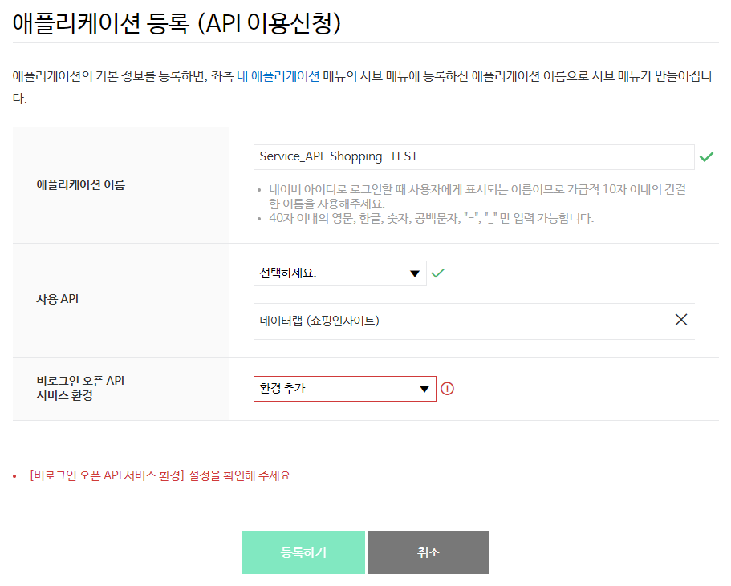
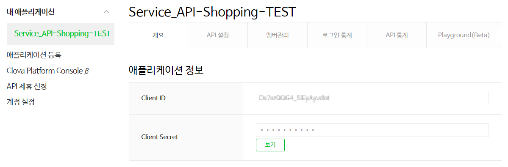

# 쇼핑인사이트

<div class="table-of-contents">
<ul>
    <li><a href="#쇼핑인사이트-개요">쇼핑인사이트 개요</a></li>
    <ul>
        <li><a href="#개요">개요</a></li>
        <li><a href="#사전-준비-사항">사전 준비 사항</a></li>
    </ul>
    <li><a href="#쇼핑인사이트-api-레퍼런스">쇼핑인사이트 API 레퍼런스</a></li>
    <ul>
        <li><a href="#쇼핑인사이트-분야별-트렌드-조회">쇼핑인사이트 분야별 트렌드 조회</a></li>
        <li><a href="#쇼핑인사이트-분야-내-기기별-트렌드-조회">쇼핑인사이트 분야 내 기기별 트렌드 조회</a></li>
        <li><a href="#쇼핑인사이트-분야-내-성별-트렌드-조회">쇼핑인사이트 분야 내 성별 트렌드 조회</a></li>
        <li><a href="#쇼핑인사이트-분야-내-연령별-트렌드-조회">쇼핑인사이트 분야 내 연령별 트렌드 조회</a></li>
        <li><a href="#쇼핑인사이트-키워드별-트렌드-조회">쇼핑인사이트 키워드별 트렌드 조회</a></li>
        <li><a href="#쇼핑인사이트-키워드-기기별-트렌드-조회">쇼핑인사이트 키워드 기기별 트렌드 조회</a></li>
        <li><a href="#쇼핑인사이트-키워드-성별-트렌드-조회">쇼핑인사이트 키워드 성별 트렌드 조회</a></li>
        <li><a href="#쇼핑인사이트-키워드-연령별-트렌드-조회">쇼핑인사이트 키워드 연령별 트렌드 조회</a></li>
        <li><a href="#오류-코드">오류 코드</a></li>
    </ul>
    <li><a href="#쇼핑인사이트-api-구현-예제">쇼핑인사이트 API 구현 예제</a></li>
    <ul>
        <li><a href="#java">Java</a></li>
        <li><a href="#php">PHP</a></li>
        <li><a href="#node-js">Node.js</a></li>
        <li><a href="#python">Python</a></li>
        <li><a href="#c">C#</a></li>
    </ul>
</ul>
</div>

## 쇼핑인사이트 개요

* [개요](#개요)
* [사전 준비 사항](#사전-준비-사항)

### 개요

#### 쇼핑인사이트 API 개요

쇼핑인사이트 API는 [네이버 데이터랩](http://datalab.naver.com/)의 [**쇼핑인사이트**](https://datalab.naver.com/shoppingInsight/sCategory.naver)를 API로 실행할 수 있게 하는 RESTful API입니다.

네이버 통합검색의 쇼핑 영역과 [네이버쇼핑](https://shopping.naver.com)에서의 검색 클릭 추이 데이터를 JSON 형식으로 반환합니다. 쇼핑 분야의 분야별 검색 클릭 추이와 특정한 쇼핑 분야에서 검색 키워드별 검색 클릭 추이를 확인할 수 있습니다.

API를 호출할 때는 쇼핑 분야와 검색 키워드, 검색 조건을 JSON 형식의 데이터로 전달합니다.

쇼핑인사이트 API의 하루 호출 한도는 1,000회입니다.

#### 쇼핑인사이트 API 특징

쇼핑인사이트 API는 비로그인 방식 오픈 API입니다.

비로그인 방식 오픈 API는 네이버 오픈API를 호출할 때 HTTP 요청 헤더에 클라이언트 아이디와 클라이언트 시크릿 값만 전송해 사용할 수 있는 오픈 API입니다. 클라이언트 아이디와 클라이언트 시크릿은 네이버 오픈API에서 인증된 사용자인지 확인하는 수단입니다. [네이버 개발자 센터](https://developers.naver.com/)에서 애플리케이션을 등록하면 클라이언트 아이디와 클라이언트 시크릿이 발급됩니다.

> **참고**  
> 네이버 오픈API의 종류와 클라이언트 아이디, 클라이언트 시크릿에 관한 자세한 내용은 "[API 공통 가이드](https://developers.naver.com/docs/common/openapiguide/)"를 참고하십시오.  

### 사전 준비 사항

쇼핑인사이트 API를 사용하려면 먼저 [네이버 개발자 센터](https://developers.naver.com/)에서 애플리케이션을 등록하고 클라이언트 아이디와 클라이언트 시크릿을 발급받아야 합니다.

클라이언트 아이디와 클라이언트 시크릿은 인증된 사용자인지를 확인하는 수단이며, 애플리케이션이 등록되면 발급됩니다. 클라이언트 아이디와 클라이언트 시크릿을 네이버 오픈API를 호출할 때 HTTP 헤더에 포함해서 전송해야 API를 호출할 수 있습니다. API 사용량은 클라이언트 아이디별로 합산됩니다.

> **주의**  
> 네이버에 로그인한 사용자 계정으로 애플리케이션이 등록됩니다. 애플리케이션을 등록한 네이버 아이디는 '관리자' 권한을 가지게 되므로 네이버 계정의 보안에 각별히 주의해야 합니다.  
> 회사나 단체에서 애플리케이션을 등록할 때는 추후 키 관리 등이 용이하도록 네이버 단체 회원으로 로그인해 이용할 것을 권장합니다.  
> - [네이버 단체 회원 가입하기](https://nid.naver.com/group/commonAction.nhn?m=viewTerms)  

#### 애플리케이션 등록

네이버 개발자 센터에서 애플리케이션을 등록하는 방법은 다음과 같습니다.

1. 네이버 개발자 센터의 메뉴에서 [**Application &gt; 애플리케이션 등록**](https://developers.naver.com/apps/#/wizard/register)을 선택합니다.
2. **이용약관 동의** 단계에서 **이용약관에 동의합니다.**<!-- -->를 선택한 다음 **확인**을 클릭합니다.
3. **계정 정보 등록** 단계에서 휴대폰 인증을 완료하고 회사 이름을 입력한 다음 **확인**을 클릭합니다. 휴대폰 인증은 담당자 연락처 확인을 위해 필요한 과정이며, 애플리케이션을 처음 등록할 때 한 번만 인증받으면 됩니다.
4. **애플리케이션 등록 (API이용신청)** 페이지에서 [애플리케이션 등록 세부 정보](#애플리케이션-등록-세부-정보)를 입력한 다음 **등록하기**<!-- -->를 클릭합니다.

#### 애플리케이션 등록 세부 정보

**애플리케이션 등록 (API이용신청)** 페이지에서 애플리케이션 세부 정보를 입력하는 방법은 다음과 같습니다.

1. 등록하려는 애플리케이션의 이름을 **애플리케이션 이름**에 입력합니다. 최대 40자까지 입력할 수 있습니다.
2. **사용 API**에서 **데이터랩 (쇼핑인사이트)**<!-- -->를 선택해 추가합니다.
3. [**비로그인 오픈 API 서비스 환경**](https://developers.naver.com/docs/common/openapiguide/appregister.md#비로그인-오픈-api-서비스-환경)에서 애플리케이션을 서비스할 환경을 추가하고 필요한 상세 정보를 입력합니다.
 


#### 애플리케이션 등록 확인

애플리케이션이 정상적으로 등록되면 네이버 개발자 센터의 **[Application &gt; 내 애플리케이션](https://developers.naver.com/apps/#/list)** 메뉴의 아래에 등록한 애플리케이션 이름으로 하위 메뉴가 생깁니다.

애플리케이션 이름을 클릭하면 **개요** 탭에서 애플리케이션에 부여된 클라이언트 아이디와 클라이언트 시크릿을 확인할 수 있습니다.



## 쇼핑인사이트 API 레퍼런스

* [쇼핑인사이트 분야별 트렌드 조회](#쇼핑인사이트-분야별-트렌드-조회)
* [쇼핑인사이트 분야 내 기기별 트렌드 조회](#쇼핑인사이트-분야-내-기기별-트렌드-조회)
* [쇼핑인사이트 분야 내 성별 트렌드 조회](#쇼핑인사이트-분야-내-성별-트렌드-조회)
* [쇼핑인사이트 분야 내 연령별 트렌드 조회](#쇼핑인사이트-분야-내-연령별-트렌드-조회)
* [쇼핑인사이트 키워드별 트렌드 조회](#쇼핑인사이트-키워드별-트렌드-조회)
* [쇼핑인사이트 키워드 기기별 트렌드 조회](#쇼핑인사이트-키워드-기기별-트렌드-조회)
* [쇼핑인사이트 키워드 성별 트렌드 조회](#쇼핑인사이트-키워드-성별-트렌드-조회)
* [쇼핑인사이트 키워드 연령별 트렌드 조회](#쇼핑인사이트-키워드-연령별-트렌드-조회)
* [오류 코드](#오류-코드)

### 쇼핑인사이트 분야별 트렌드 조회

#### 설명

네이버 통합검색의 쇼핑 영역과 [네이버쇼핑](https://shopping.naver.com)에서의 검색 클릭 추이를 쇼핑 분야별로 조회한 데이터를 JSON 형식으로 반환합니다.

#### 요청 URL

```sh
https://openapi.naver.com/v1/datalab/shopping/categories
```

#### 프로토콜

HTTPS

#### HTTP 메서드

POST

#### 파라미터

파라미터를 JSON 형식으로 전달합니다.

|파라미터|타입|필수 여부|설명|
|---|---|:-:|----|
|startDate|string|Y|조회 기간 시작 날짜(`yyyy-mm-dd` 형식). 2017년 8월 1일부터 조회할 수 있습니다.|
|endDate|string|Y|조회 기간 종료 날짜(`yyyy-mm-dd` 형식)|
|timeUnit|string|Y|구간 단위<br/>- `date`: 일간<br/>- `week`: 주간<br/>- `month`: 월간|
|category|array(JSON)|Y|분야 이름과 분야 코드 쌍의 배열. 최대 3개의 쌍을 배열로 설정할 수 있습니다.|
|category.name|string|Y|쇼핑 분야 이름|
|category.param|array(string)|Y|쇼핑 분야 코드. [네이버쇼핑](https://shopping.naver.com)에서 카테고리를 선택했을 때의 URL에 있는 `cat_id` 파라미터의 값으로 분야 코드를 확인할 수 있습니다.|
|device|string|N|기기. 검색 환경에 따른 조건입니다.<br/>- 설정 안 함: 모든 기기에서의 검색 클릭 추이<br/>- `pc`: PC에서의 검색 클릭 추이<br/>- `mo`: 모바일 기기에서의 검색 클릭 추이|
|gender|string|N|성별. 검색 사용자의 성별에 따른 조건입니다.<br/>- 설정 안 함: 모든 성별<br/>- `m`: 남성<br/>- `f`: 여성|
|ages|array(JSON)|N|연령. 검색 사용자의 연령에 따른 조건입니다.<br/>- 설정 안 함: 모든 연령<br/>- `10`: 10&Tilde;19세<br/>- `20`: 20&Tilde;29세<br/>- `30`: 30&Tilde;39세<br/>- `40`: 40&Tilde;49세<br/>- `50`: 50&Tilde;59세<br/>- `60`: 60세 이상|

#### 참고 사항

API를 요청할 때 다음 예와 같이 HTTP 요청 헤더에 [클라이언트 아이디와 클라이언트 시크릿](https://developers.naver.com/docs/common/openapiguide/appregister.md#클라이언트-아이디와-클라이언트-시크릿-확인)을 추가해야 합니다.

```sh
POST /v1/datalab/shopping/categories HTTP/1.1
Host: openapi.naver.com
X-Naver-Client-Id: {애플리케이션 등록 시 발급받은 클라이언트 아이디 값}
X-Naver-Client-Secret: {애플리케이션 등록 시 발급받은 클라이언트 시크릿 값}
Content-Type: application/json
Content-Length: 360
```

#### 요청 예

```sh
curl https://openapi.naver.com/v1/datalab/shopping/categories \
--header "X-Naver-Client-Id: {애플리케이션 등록 시 발급받은 클라이언트 아이디 값}" \
--header "X-Naver-Client-Secret: {애플리케이션 등록 시 발급받은 클라이언트 시크릿 값}" \
--header "Content-Type: application/json" \
-d @<(cat <<EOF
{
  "startDate": "2017-08-01",
  "endDate": "2017-09-30",
  "timeUnit": "month",
  "category": [
      {"name": "패션의류", "param": [ "50000000"]},
      {"name": "화장품/미용", "param": [ "50000002"]}
  ],
  "device": "pc",
  "gender": "f",
  "ages": [ "20",  "30"]
}
EOF
)
```

#### 응답

응답에 성공하면 결괏값을 JSON 형식으로 반환합니다.

|속성|타입|설명|
|---|---|----|
|startDate|string|조회 기간 시작 날짜(`yyyy-mm-dd` 형식)|
|endDate|string|조회 기간 종료 날짜(`yyyy-mm-dd` 형식)|
|timeUnit|string|구간 단위<br/>- `date`: 일간<br/>- `week`: 주간<br/>- `month`: 월간|
|results.title|string|쇼핑 분야 이름|
|results.category|string|쇼핑 분야 코드|
|results.data.period|string|구간별 시작 날짜(`yyyy-mm-dd` 형식)|
|results.data.ratio|number|구간별 클릭량의 상대적 비율. 구간별 결과에서 가장 큰 값을 100으로 설정한 상댓값입니다.|

#### 응답 예

```json
{
  "startDate": "2017-08-01",
  "endDate": "2017-09-30",
  "timeUnit": "month",
  "results": [
    {
      "title": "패션의류",
      "category": ["50000000"],
      "data": [
        {
          "period": "2017-08-01",
          "ratio": 84.01252
        },
        {
          "period": "2017-09-01",
          "ratio": 100
        }
      ]
    },
    {
      "title": "화장품/미용",
      "category": ["50000002"],
      "data": [
        {
          "period": "2017-08-01",
          "ratio": 22.21162
        },
        {
          "period": "2017-09-01",
          "ratio": 21.54278
        }
      ]
    }
  ]
}
```

### 쇼핑인사이트 분야 내 기기별 트렌드 조회

#### 설명

네이버 통합검색의 쇼핑 영역과 [네이버쇼핑](https://shopping.naver.com)에서 특정 쇼핑 분야의 검색 클릭 추이를 기기별(PC, 모바일)로 조회한 데이터를 JSON 형식으로 반환합니다.

#### 요청 URL

```sh
https://openapi.naver.com/v1/datalab/shopping/category/device
```

#### 프로토콜

HTTPS

#### HTTP 메서드

POST

#### 파라미터

파라미터를 JSON 형식으로 전달합니다.

|파라미터|타입|필수 여부|설명|
|---|---|:-:|----|
|startDate|string|Y|조회 기간 시작 날짜(`yyyy-mm-dd` 형식). 2017년 8월 1일부터 조회할 수 있습니다.|
|endDate|string|Y|조회 기간 종료 날짜(`yyyy-mm-dd` 형식)|
|timeUnit|string|Y|구간 단위<br/>- `date`: 일간<br/>- `week`: 주간<br/>- `month`: 월간|
|category|string|Y|네이버 쇼핑의 분야 코드. [네이버쇼핑](https://shopping.naver.com)에서 카테고리를 선택했을 때의 URL에 있는 `cat_id` 파라미터의 값으로 분야 코드를 확인할 수 있습니다.|
|device|string|N|기기. 검색 환경에 따른 조건입니다.<br/>- 설정 안 함: 모든 기기에서의 검색 클릭 추이<br/>- `pc`: PC에서의 검색 클릭 추이<br/>- `mo`: 모바일 기기에서의 검색 클릭 추이|
|gender|string|N|성별. 검색 사용자의 성별에 따른 조건입니다.<br/>- 설정 안 함: 모든 성별<br/>- `m`: 남성<br/>- `f`: 여성|
|ages|array(JSON)|N|연령. 검색 사용자의 연령에 따른 조건입니다.<br/>- 설정 안 함: 모든 연령<br/>- `10`: 10&Tilde;19세<br/>- `20`: 20&Tilde;29세<br/>- `30`: 30&Tilde;39세<br/>- `40`: 40&Tilde;49세<br/>- `50`: 50&Tilde;59세<br/>- `60`: 60세 이상|

#### 참고 사항

API를 요청할 때 다음 예와 같이 HTTP 요청 헤더에 [클라이언트 아이디와 클라이언트 시크릿](https://developers.naver.com/docs/common/openapiguide/appregister.md#클라이언트-아이디와-클라이언트-시크릿-확인)을 추가해야 합니다.

```sh
POST /v1/datalab/shopping/category/device HTTP/1.1
Host: openapi.naver.com
X-Naver-Client-Id: {애플리케이션 등록 시 발급받은 클라이언트 아이디 값}
X-Naver-Client-Secret: {애플리케이션 등록 시 발급받은 클라이언트 시크릿 값}
Content-Type: application/json
Content-Length: 360
```

#### 요청 예

```sh
curl https://openapi.naver.com/v1/datalab/shopping/category/device \
--header "X-Naver-Client-Id: {애플리케이션 등록 시 발급받은 클라이언트 아이디 값}" \
--header "X-Naver-Client-Secret: {애플리케이션 등록 시 발급받은 클라이언트 시크릿 값}" \
--header "Content-Type: application/json" \
-d @<(cat <<EOF
{
  "startDate": "2017-08-01",
  "endDate": "2017-09-30",
  "timeUnit": "month",
  "category": "50000000",
  "gender": "f",
  "ages": [ "20",  "30"]
}
EOF
)
```

#### 응답

응답에 성공하면 결괏값을 JSON 형식으로 반환합니다.

|속성|타입|설명|
|---|---|----|
|startDate|string|조회 기간 시작 날짜(`yyyy-mm-dd` 형식)|
|endDate|string|조회 기간 종료 날짜(`yyyy-mm-dd` 형식)|
|timeUnit|string|구간 단위<br/>- `date`: 일간<br/>- `week`: 주간<br/>- `month`: 월간|
|results.title|string|쇼핑 분야 코드|
|results.category|string|쇼핑 분야 코드|
|results.data.period|string|구간별 시작 날짜(`yyyy-mm-dd` 형식)|
|results.data.group|string|기기. 검색 환경에 따른 조건입니다.<br/>- `pc`: PC에서의 검색 클릭 추이<br/>- `mo`: 모바일 기기에서의 검색 클릭 추이|
|results.data.ratio|number|구간별 클릭량의 상대적 비율. 구간별 결과에서 가장 큰 값을 100으로 설정한 상댓값입니다.|

#### 응답 예

```json
{
  "startDate": "2017-08-01",
  "endDate": "2017-09-30",
  "timeUnit": "month",
  "results": [
    {
      "title": "50000000",
      "category": ["50000000"],
      "data": [
        {
          "period": "2017-08-01",
          "group": "mo",
          "ratio": 81.12853
        },
        {
          "period": "2017-08-01",
          "group": "pc",
          "ratio": 6.02597
        },
        {
          "period": "2017-09-01",
          "group": "mo",
          "ratio": 100
        },
        {
          "period": "2017-09-01",
          "group": "pc",
          "ratio": 7.1727
        }
      ]
    }
  ]
}
```

### 쇼핑인사이트 분야 내 성별 트렌드 조회

#### 설명

네이버 통합검색의 쇼핑 영역과 [네이버쇼핑](https://shopping.naver.com)에서 특정 쇼핑 분야의 검색 클릭 추이를 사용자의 성별로 조회한 데이터를 JSON 형식으로 반환합니다.

#### 요청 URL

```sh
https://openapi.naver.com/v1/datalab/shopping/category/gender
```

#### 프로토콜

HTTPS

#### HTTP 메서드

POST

#### 파라미터

파라미터를 JSON 형식으로 전달합니다.

|파라미터|타입|필수 여부|설명|
|---|---|:-:|----|
|startDate|string|Y|조회 기간 시작 날짜(`yyyy-mm-dd` 형식). 2017년 8월 1일부터 조회할 수 있습니다.|
|endDate|string|Y|조회 기간 종료 날짜(`yyyy-mm-dd` 형식)|
|timeUnit|string|Y|구간 단위<br/>- `date`: 일간<br/>- `week`: 주간<br/>- `month`: 월간|
|category|string|Y|쇼핑 분야 코드. [네이버쇼핑](https://shopping.naver.com)에서 카테고리를 선택했을 때의 URL에 있는 `cat_id` 파라미터의 값으로 분야 코드를 확인할 수 있습니다.|
|device|string|N|기기. 검색 환경에 따른 조건입니다.<br/>- 설정 안 함: 모든 기기에서의 검색 클릭 추이<br/>- `pc`: PC에서의 검색 클릭 추이<br/>- `mo`: 모바일 기기에서의 검색 클릭 추이|
|gender|string|N|성별. 검색 사용자의 성별에 따른 조건입니다.<br/>- 설정 안 함: 모든 성별<br/>- `m`: 남성<br/>- `f`: 여성|
|ages|array(JSON)|N|연령. 검색 사용자의 연령에 따른 조건입니다.<br/>- 설정 안 함: 모든 연령<br/>- `10`: 10&Tilde;19세<br/>- `20`: 20&Tilde;29세<br/>- `30`: 30&Tilde;39세<br/>- `40`: 40&Tilde;49세<br/>- `50`: 50&Tilde;59세<br/>- `60`: 60세 이상|

#### 참고 사항

API를 요청할 때 다음 예와 같이 HTTP 요청 헤더에 [클라이언트 아이디와 클라이언트 시크릿](https://developers.naver.com/docs/common/openapiguide/appregister.md#클라이언트-아이디와-클라이언트-시크릿-확인)을 추가해야 합니다.

```sh
POST /v1/datalab/shopping/category/gender HTTP/1.1
Host: openapi.naver.com
X-Naver-Client-Id: {애플리케이션 등록 시 발급받은 클라이언트 아이디 값}
X-Naver-Client-Secret: {애플리케이션 등록 시 발급받은 클라이언트 시크릿 값}
Content-Type: application/json
Content-Length: 360
```

#### 요청 예

```sh
curl https://openapi.naver.com/v1/datalab/shopping/category/gender \
--header "X-Naver-Client-Id: {애플리케이션 등록 시 발급받은 클라이언트 아이디 값}" \
--header "X-Naver-Client-Secret: {애플리케이션 등록 시 발급받은 클라이언트 시크릿 값}" \
--header "Content-Type: application/json" \
-d @<(cat <<EOF
{
  "startDate": "2017-08-01",
  "endDate": "2017-09-30",
  "timeUnit": "month",
  "category": "50000000",
  "device": "pc",
  "ages": [ "20",  "30"]
}
EOF
)
```

#### 응답

응답에 성공하면 결괏값을 JSON 형식으로 반환합니다.

|속성|타입|설명|
|---|---|----|
|startDate|string|조회 기간 시작 날짜(`yyyy-mm-dd` 형식)|
|endDate|string|조회 기간 종료 날짜(`yyyy-mm-dd` 형식)|
|timeUnit|string|구간 단위<br/>- `date`: 일간<br/>- `week`: 주간<br/>- `month`: 월간|
|results.title|string|쇼핑 분야 코드|
|results.category|string|쇼핑 분야 코드|
|results.data.period|string|구간별 시작 날짜(`yyyy-mm-dd` 형식)|
|results.data.group|string|성별. 검색 사용자의 성별에 따른 조건입니다.<br/>- `m`: 남성<br/>- `f`: 여성|
|results.data.ratio|number|구간별 클릭량의 상대적 비율. 구간별 결과에서 가장 큰 값을 100으로 설정한 상댓값입니다.|

#### 응답 예

```json
{
  "startDate": "2017-08-01",
  "endDate": "2017-09-30",
  "timeUnit": "month",
  "results": [
    {
      "title": "50000000",
      "category": ["50000000"],
      "data": [
        {
          "period": "2017-08-01",
          "group": "f",
          "ratio": 84.01252
        },
        {
          "period": "2017-08-01",
          "group": "m",
          "ratio": 56.61947
        },
        {
          "period": "2017-09-01",
          "group": "f",
          "ratio": 100
        },
        {
          "period": "2017-09-01",
          "group": "m",
          "ratio": 67.78792
        }
      ]
    }
  ]
}
```

### 쇼핑인사이트 분야 내 연령별 트렌드 조회

#### 설명

네이버 통합검색의 쇼핑 영역과 [네이버쇼핑](https://shopping.naver.com)에서 특정 쇼핑 분야의 검색 클릭 추이를 사용자의 연령별로 조회한 데이터를 JSON 형식으로 반환합니다.

#### 요청 URL

```sh
https://openapi.naver.com/v1/datalab/shopping/category/age
```

#### 프로토콜

HTTPS

#### HTTP 메서드

POST

#### 파라미터

파라미터를 JSON 형식으로 전달합니다. 

|파라미터|타입|필수 여부|설명|
|---|---|:-:|----|
|startDate|string|Y|조회 기간 시작 날짜(`yyyy-mm-dd` 형식). 2017년 8월 1일부터 조회할 수 있습니다.|
|endDate|string|Y|조회 기간 종료 날짜(`yyyy-mm-dd` 형식)|
|timeUnit|string|Y|구간 단위<br/>- `date`: 일간<br/>- `week`: 주간<br/>- `month`: 월간|
|category|string|Y|쇼핑 분야 코드. [네이버쇼핑](https://shopping.naver.com)에서 카테고리를 선택했을 때의 URL에 있는 `cat_id` 파라미터의 값으로 분야 코드를 확인할 수 있습니다.|
|device|string|N|기기. 검색 환경에 따른 조건입니다.<br/>- 설정 안 함: 모든 기기에서의 검색 클릭 추이<br/>- `pc`: PC에서의 검색 클릭 추이<br/>- `mo`: 모바일 기기에서의 검색 클릭 추이|
|gender|string|N|성별. 검색 사용자의 성별에 따른 조건입니다.<br/>- 설정 안 함: 모든 성별<br/>- `m`: 남성<br/>- `f`: 여성|
|ages|array(JSON)|N|연령. 검색 사용자의 연령에 따른 조건입니다.<br/>- 설정 안 함: 모든 연령<br/>- `10`: 10&Tilde;19세<br/>- `20`: 20&Tilde;29세<br/>- `30`: 30&Tilde;39세<br/>- `40`: 40&Tilde;49세<br/>- `50`: 50&Tilde;59세<br/>- `60`: 60세 이상|

#### 참고 사항

API를 요청할 때 다음 예와 같이 HTTP 요청 헤더에 [클라이언트 아이디와 클라이언트 시크릿](https://developers.naver.com/docs/common/openapiguide/appregister.md#클라이언트-아이디와-클라이언트-시크릿-확인)을 추가해야 합니다.

```sh
POST /v1/datalab/shopping/category/age HTTP/1.1
Host: openapi.naver.com
X-Naver-Client-Id: {애플리케이션 등록 시 발급받은 클라이언트 아이디 값}
X-Naver-Client-Secret: {애플리케이션 등록 시 발급받은 클라이언트 시크릿 값}
Content-Type: application/json
Content-Length: 360
```

#### 요청 예

```sh
curl https://openapi.naver.com/v1/datalab/shopping/category/age \
--header "X-Naver-Client-Id: {애플리케이션 등록 시 발급받은 클라이언트 아이디 값}" \
--header "X-Naver-Client-Secret: {애플리케이션 등록 시 발급받은 클라이언트 시크릿 값}" \
--header "Content-Type: application/json" \
-d @<(cat <<EOF
{
  "startDate": "2017-08-01",
  "endDate": "2017-09-30",
  "timeUnit": "month",
  "category": "50000000",
  "device": "pc",
  "gender": "f",
  "ages": [ "20",  "30"]
}
EOF
)
```

#### 응답

응답에 성공하면 결괏값을 JSON 형식으로 반환합니다.

|속성|타입|설명|
|---|---|----|
|startDate|string|조회 기간 시작 날짜(`yyyy-mm-dd` 형식)|
|endDate|string|조회 기간 종료 날짜(`yyyy-mm-dd` 형식)|
|timeUnit|string|구간 단위<br/>- `date`: 일간<br/>- `week`: 주간<br/>- `month`: 월간|
|results.title|string|쇼핑 분야 코드|
|results.category|string|쇼핑 분야 코드|
|results.data.period|string|구간별 시작 날짜(`yyyy-mm-dd` 형식)|
|results.data.group|string|연령. 검색 사용자의 연령에 따른 조건입니다.<br/>- `10`: 10&Tilde;19세<br/>- `20`: 20&Tilde;29세<br/>- `30`: 30&Tilde;39세<br/>- `40`: 40&Tilde;49세<br/>- `50`: 50&Tilde;59세<br/>- `60`: 60세 이상|
|results.data.ratio|number|구간별 클릭량의 상대적 비율. 구간별 결과에서 가장 큰 값을 100으로 설정한 상댓값입니다.|

#### 응답 예

```json
{
  "startDate": "2017-08-01",
  "endDate": "2017-09-30",
  "timeUnit": "month",
  "results": [
    {
      "title": "50000000",
      "category": ["50000000"],
      "data": [
        {
          "period": "2017-08-01",
          "group": "20",
          "ratio": 71.30781
        },
        {
          "period": "2017-08-01",
          "group": "30",
          "ratio": 81.43603
        },
        {
          "period": "2017-09-01",
          "group": "20",
          "ratio": 81.8108
        },
        {
          "period": "2017-09-01",
          "group": "30",
          "ratio": 100
        }
      ]
    }
  ]
}
```

### 쇼핑인사이트 키워드별 트렌드 조회

#### 설명

네이버 통합검색의 쇼핑 영역과 [네이버쇼핑](https://shopping.naver.com)에서 특정 쇼핑 분야의 검색 클릭 추이를 검색 키워드별로 조회한 데이터를 JSON 형식으로 반환합니다.

#### 요청 URL

```sh
https://openapi.naver.com/v1/datalab/shopping/category/keywords
```

#### 프로토콜

HTTPS

#### HTTP 메서드

POST

#### 파라미터

파라미터를 JSON 형식으로 전달합니다.

|파라미터|타입|필수 여부|설명|
|---|---|:-:|----|
|startDate|string|Y|조회 기간 시작 날짜(`yyyy-mm-dd` 형식). 2017년 8월 1일부터 조회할 수 있습니다.|
|endDate|string|Y|조회 기간 종료 날짜(`yyyy-mm-dd` 형식)|
|timeUnit|string|Y|구간 단위<br/>- `date`: 일간<br/>- `week`: 주간<br/>- `month`: 월간|
|category|string|Y|쇼핑 분야 코드. [네이버쇼핑](https://shopping.naver.com)에서 카테고리를 선택했을 때의 URL에 있는 `cat_id` 파라미터의 값으로 분야 코드를 확인할 수 있습니다.|
|keyword|array(JSON)|Y|검색 키워드 그룹 이름과 검색 키워드 쌍의 배열. 최대 5개의 쌍을 배열로 설정할 수 있습니다.|
|keyword.name|string|Y|검색 키워드 그룹 이름|
|keyword.param|array(string)|Y|비교할 검색어. 1개만 설정할 수 있습니다.|
|device|string|N|기기. 검색 환경에 따른 조건입니다.<br/>- 설정 안 함: 모든 기기에서의 검색 클릭 추이<br/>- `pc`: PC에서의 검색 클릭 추이<br/>- `mo`: 모바일 기기에서의 검색 클릭 추이|
|gender|string|N|성별. 검색 사용자의 성별에 따른 조건입니다.<br/>- 설정 안 함: 모든 성별<br/>- `m`: 남성<br/>- `f`: 여성|
|ages|array(JSON)|N|연령. 검색 사용자의 연령에 따른 조건입니다.<br/>- 설정 안 함: 모든 연령<br/>- `10`: 10&Tilde;19세<br/>- `20`: 20&Tilde;29세<br/>- `30`: 30&Tilde;39세<br/>- `40`: 40&Tilde;49세<br/>- `50`: 50&Tilde;59세<br/>- `60`: 60세 이상|

#### 참고 사항

API를 요청할 때 다음 예와 같이 HTTP 요청 헤더에 [클라이언트 아이디와 클라이언트 시크릿](https://developers.naver.com/docs/common/openapiguide/appregister.md#클라이언트-아이디와-클라이언트-시크릿-확인)을 추가해야 합니다.

```sh
POST /v1/datalab/shopping/category/keywords HTTP/1.1
Host: openapi.naver.com
X-Naver-Client-Id: {애플리케이션 등록 시 발급받은 클라이언트 아이디 값}
X-Naver-Client-Secret: {애플리케이션 등록 시 발급받은 클라이언트 시크릿 값}
Content-Type: application/json
Content-Length: 360
```

#### 요청 예

```sh
curl https://openapi.naver.com/v1/datalab/shopping/category/keywords \
--header "X-Naver-Client-Id: {애플리케이션 등록 시 발급받은 클라이언트 아이디 값}" \
--header "X-Naver-Client-Secret: {애플리케이션 등록 시 발급받은 클라이언트 시크릿 값}" \
--header "Content-Type: application/json" \
-d @<(cat <<EOF
{
  "startDate": "2017-08-01",
  "endDate": "2017-09-30",
  "timeUnit": "month",
  "category": "50000000",
  "keyword": [
      {"name": "패션의류/정장", "param": [ "정장"]},
      {"name": "패션의류/비지니스 캐주얼", "param": [ "비지니스 캐주얼"]}
  ],
  "device": "",
  "gender": "",
  "ages": [ ]
}
EOF
)
```

#### 응답

응답에 성공하면 결괏값을 JSON 형식으로 반환합니다.

|속성|타입|설명|
|---|---|----|
|startDate|string|조회 기간 시작 날짜(`yyyy-mm-dd` 형식)|
|endDate|string|조회 기간 종료 날짜(`yyyy-mm-dd` 형식)|
|timeUnit|string|구간 단위<br/>- `date`: 일간<br/>- `week`: 주간<br/>- `month`: 월간|
|results.title|string|검색 키워드 그룹 이름|
|results.keyword|array(string)|검색 키워드|
|results.data.period|string|구간별 시작 날짜(`yyyy-mm-dd` 형식)|
|results.data.ratio|number|구간별 클릭량의 상대적 비율. 구간별 결과에서 가장 큰 값을 100으로 설정한 상댓값입니다.|

#### 응답 예

```json
{
  "startDate": "2017-08-01",
  "endDate": "2017-09-30",
  "timeUnit": "month",
  "results": [
    {
      "title": "패션의류/정장",
      "keyword": ["정장"],
      "data": [
        {
          "period": "2017-08-01",
          "ratio": 60.49919
        },
        {
          "period": "2017-09-01",
          "ratio": 100
        }
      ]
    },
    {
      "title": "패션의류/비즈니스 캐주얼",
      "keyword": ["비지니스 캐주얼"],
      "data": [
        {
          "period": "2017-08-01",
          "ratio": 0.41981
        },
        {
          "period": "2017-09-01",
          "ratio": 2.18303
        }
      ]
    }
  ]
}
```

### 쇼핑인사이트 키워드 기기별 트렌드 조회

#### 설명

네이버 통합검색의 쇼핑 영역과 [네이버쇼핑](https://shopping.naver.com)에서 특정 쇼핑 분야와 검색 키워드의 검색 클릭 추이를 기기별(PC, 모바일)로 조회한 데이터를 JSON 형식으로 반환합니다.

#### 요청 URL

```sh
https://openapi.naver.com/v1/datalab/shopping/category/keyword/device
```

#### 프로토콜

HTTPS

#### HTTP 메서드

POST

#### 파라미터

파라미터를 JSON 형식으로 전달합니다.

|파라미터|타입|필수 여부|설명|
|---|---|:-:|----|
|startDate|string|Y|조회 기간 시작 날짜(`yyyy-mm-dd` 형식). 2017년 8월 1일부터 조회할 수 있습니다.|
|endDate|string|Y|조회 기간 종료 날짜(`yyyy-mm-dd` 형식)|
|timeUnit|string|Y|구간 단위<br/>- `date`: 일간<br/>- `week`: 주간<br/>- `month`: 월간|
|category|string|Y|쇼핑 분야 코드. [네이버쇼핑](https://shopping.naver.com)에서 카테고리를 선택했을 때의 URL에 있는 `cat_id` 파라미터의 값으로 분야 코드를 확인할 수 있습니다.|
|keyword|string|Y|검색 키워드|
|device|string|N|기기. 검색 환경에 따른 조건입니다.<br/>- 설정 안 함: 모든 기기에서의 검색 클릭 추이<br/>- `pc`: PC에서의 검색 클릭 추이<br/>- `mo`: 모바일 기기에서의 검색 클릭 추이|
|gender|string|N|성별. 검색 사용자의 성별에 따른 조건입니다.<br/>- 설정 안 함: 모든 성별<br/>- `m`: 남성<br/>- `f`: 여성|
|ages|array(JSON)|N|연령. 검색 사용자의 연령에 따른 조건입니다.<br/>- 설정 안 함: 모든 연령<br/>- `10`: 10&Tilde;19세<br/>- `20`: 20&Tilde;29세<br/>- `30`: 30&Tilde;39세<br/>- `40`: 40&Tilde;49세<br/>- `50`: 50&Tilde;59세<br/>- `60`: 60세 이상|

#### 참고 사항

API를 요청할 때 다음 예와 같이 HTTP 요청 헤더에 [클라이언트 아이디와 클라이언트 시크릿](https://developers.naver.com/docs/common/openapiguide/appregister.md#클라이언트-아이디와-클라이언트-시크릿-확인)을 추가해야 합니다.

```sh
POST /v1/datalab/shopping/category/keyword/device HTTP/1.1
Host: openapi.naver.com
X-Naver-Client-Id: {애플리케이션 등록 시 발급받은 클라이언트 아이디 값}
X-Naver-Client-Secret: {애플리케이션 등록 시 발급받은 클라이언트 시크릿 값}
Content-Type: application/json
Content-Length: 360
```

#### 요청 예

```sh
curl https://openapi.naver.com/v1/datalab/shopping/category/keyword/device \
--header "X-Naver-Client-Id: {애플리케이션 등록 시 발급받은 클라이언트 아이디 값}" \
--header "X-Naver-Client-Secret: {애플리케이션 등록 시 발급받은 클라이언트 시크릿 값}" \
--header "Content-Type: application/json" \
-d @<(cat <<EOF
{
  "startDate": "2017-08-01",
  "endDate": "2017-09-30",
  "timeUnit": "month",
  "category": "50000000",
  "keyword": "정장",
  "device": "",
  "gender": "",
  "ages": [ ]
}
EOF
)
```

#### 응답

응답에 성공하면 결괏값을 JSON 형식으로 반환합니다.

|속성|타입|설명|
|---|---|----|
|startDate|string|조회 기간 시작 날짜(`yyyy-mm-dd` 형식)|
|endDate|string|조회 기간 종료 날짜(`yyyy-mm-dd` 형식)|
|timeUnit|string|구간 단위<br/>- `date`: 일간<br/>- `week`: 주간<br/>- `month`: 월간|
|results.title|string|검색 키워드 그룹 이름|
|results.keyword|array(string)|검색 키워드|
|results.data.period|string|구간별 시작 날짜(`yyyy-mm-dd` 형식)|
|results.data.group|string|기기. 검색 환경에 따른 조건입니다.<br/>- `pc`: PC에서의 검색 클릭 추이<br/>- `mo`: 모바일 기기에서의 검색 클릭 추이|
|results.data.ratio|number|구간별 클릭량의 상대적 비율. 구간별 결과에서 가장 큰 값을 100으로 설정한 상댓값입니다.|

#### 응답 예

```json
{
  "startDate": "2017-08-01",
  "endDate": "2017-09-30",
  "timeUnit": "month",
  "results": [
    {
      "title": "정장",
      "keyword": ["정장"],
      "data": [
        {
          "period": "2017-08-01",
          "group": "mo",
          "ratio": 58.06418
        },
        {
          "period": "2017-08-01",
          "group": "pc",
          "ratio": 23.72304
        },
        {
          "period": "2017-09-01",
          "group": "mo",
          "ratio": 100
        },
        {
          "period": "2017-09-01",
          "group": "pc",
          "ratio": 35.18728
        }
      ]
    }
  ]
}
```

### 쇼핑인사이트 키워드 성별 트렌드 조회

#### 설명

네이버 통합검색의 쇼핑 영역과 [네이버쇼핑](https://shopping.naver.com)에서 특정 쇼핑 분야와 검색 키워드의 검색 클릭 추이를 사용자의 성별로 조회한 데이터를 JSON 형식으로 반환합니다.

#### 요청 URL

```sh
https://openapi.naver.com/v1/datalab/shopping/category/keyword/gender
```

#### 프로토콜

HTTPS

#### HTTP 메서드

POST

#### 파라미터

파라미터를 JSON 형식으로 전달합니다.

|파라미터|타입|필수 여부|설명|
|---|---|:-:|----|
|startDate|String|Y|조회 기간 시작 날짜(`yyyy-mm-dd` 형식). 2017년 8월 1일부터 조회할 수 있습니다.|
|endDate|String|Y|조회 기간 종료 날짜(`yyyy-mm-dd` 형식)|
|timeUnit|String|Y|구간 단위<br/>- `date`: 일간<br/>- `week`: 주간<br/>- `month`: 월간|
|category|String|Y|쇼핑 분야 코드. [네이버쇼핑](https://shopping.naver.com)에서 카테고리를 선택했을 때의 URL에 있는 `cat_id` 파라미터의 값으로 분야 코드를 확인할 수 있습니다.|
|keyword|String|Y|검색 키워드|
|device|String|N|기기. 검색 환경에 따른 조건입니다.<br/>- 설정 안 함: 모든 기기에서의 검색 클릭 추이<br/>- `pc`: PC에서의 검색 클릭 추이<br/>- `mo`: 모바일 기기에서의 검색 클릭 추이|
|gender|String|N|성별. 검색 사용자의 성별에 따른 조건입니다.<br/>- 설정 안 함: 모든 성별<br/>- `m`: 남성<br/>- `f`: 여성|
|ages|Array(JSON)|N|연령. 검색 사용자의 연령에 따른 조건입니다.<br/>- 설정 안 함: 모든 연령<br/>- `10`: 10&Tilde;19세<br/>- `20`: 20&Tilde;29세<br/>- `30`: 30&Tilde;39세<br/>- `40`: 40&Tilde;49세<br/>- `50`: 50&Tilde;59세<br/>- `60`: 60세 이상|

#### 참고 사항

API를 요청할 때 다음 예와 같이 HTTP 요청 헤더에 [클라이언트 아이디와 클라이언트 시크릿](https://developers.naver.com/docs/common/openapiguide/appregister.md#클라이언트-아이디와-클라이언트-시크릿-확인)을 추가해야 합니다.

```sh
POST /v1/datalab/shopping/category/keyword/gender HTTP/1.1
Host: openapi.naver.com
X-Naver-Client-Id: {애플리케이션 등록 시 발급받은 클라이언트 아이디 값}
X-Naver-Client-Secret: {애플리케이션 등록 시 발급받은 클라이언트 시크릿 값}
Content-Type: application/json
Content-Length: 360
```

#### 요청 예

```sh
curl https://openapi.naver.com/v1/datalab/shopping/category/keyword/gender \
--header "X-Naver-Client-Id: {애플리케이션 등록 시 발급받은 클라이언트 아이디 값}" \
--header "X-Naver-Client-Secret: {애플리케이션 등록 시 발급받은 클라이언트 시크릿 값}" \
--header "Content-Type: application/json" \
-d @<(cat <<EOF
{
  "startDate": "2017-08-01",
  "endDate": "2017-09-30",
  "timeUnit": "month",
  "category": "50000000",
  "keyword": "정장",
  "device": "",
  "gender": "",
  "ages": [ ]
}
EOF
)
```

#### 응답

응답에 성공하면 결괏값을 JSON 형식으로 반환합니다.

|속성|타입|설명|
|---|---|----|
|startDate|string|조회 기간 시작 날짜(`yyyy-mm-dd` 형식)|
|endDate|string|조회 기간 종료 날짜(`yyyy-mm-dd` 형식)|
|timeUnit|string|구간 단위<br/>- `date`: 일간<br/>- `week`: 주간<br/>- `month`: 월간|
|results.title|string|검색 키워드 그룹 이름|
|results.keyword|array(string)|검색 키워드|
|results.data.period|string|구간별 시작 날짜(`yyyy-mm-dd` 형식)|
|results.data.group|string|성별. 검색 사용자의 성별에 따른 조건입니다.<br/>- `m`: 남성<br/>- `f`: 여성|
|results.data.ratio|number|구간별 클릭량의 상대적 비율. 구간별 결과에서 가장 큰 값을 100으로 설정한 상댓값입니다.|

#### 응답 예

```json
{
  "startDate": "2017-08-01",
  "endDate": "2017-09-30",
  "timeUnit": "month",
  "results": [
    {
      "title": "정장",
      "keyword": ["정장"],
      "data": [
        {
          "period": "2017-08-01",
          "group": "f",
          "ratio": 12.06534
        },
        {
          "period": "2017-08-01",
          "group": "m",
          "ratio": 59.00816
        },
        {
          "period": "2017-09-01",
          "group": "f",
          "ratio": 20.8518
        },
        {
          "period": "2017-09-01",
          "group": "m",
          "ratio": 100
        }
      ]
    }
  ]
}
```

### 쇼핑인사이트 키워드 연령별 트렌드 조회

#### 설명

네이버 통합검색의 쇼핑 영역과 [네이버쇼핑](https://shopping.naver.com)에서 특정 쇼핑 분야와 검색 키워드의 검색 클릭 추이를 사용자의 연령별로 조회한 데이터를 JSON 형식으로 반환합니다.

#### 요청 URL

```sh
https://openapi.naver.com/v1/datalab/shopping/category/keyword/age
```

#### 프로토콜

HTTPS

#### HTTP 메서드

POST

#### 파라미터

파라미터를 JSON 형식으로 전달합니다.

|파라미터|타입|필수 여부|설명|
|---|---|:-:|----|
|startDate|String|Y|조회 기간 시작 날짜(`yyyy-mm-dd` 형식). 2017년 8월 1일부터 조회할 수 있습니다.|
|endDate|String|Y|조회 기간 종료 날짜(`yyyy-mm-dd` 형식)|
|timeUnit|String|Y|구간 단위<br/>- `date`: 일간<br/>- `week`: 주간<br/>- `month`: 월간|
|category|String|Y|쇼핑 분야 코드. [네이버쇼핑](https://shopping.naver.com)에서 카테고리를 선택했을 때의 URL에 있는 `cat_id` 파라미터의 값으로 분야 코드를 확인할 수 있습니다.|
|keyword|String|Y|검색 키워드|
|device|String|N|기기. 검색 환경에 따른 조건입니다.<br/>- 설정 안 함: 모든 기기에서의 검색 클릭 추이<br/>- `pc`: PC에서의 검색 클릭 추이<br/>- `mo`: 모바일 기기에서의 검색 클릭 추이|
|gender|String|N|성별. 검색 사용자의 성별에 따른 조건입니다.<br/>- 설정 안 함: 모든 성별<br/>- `m`: 남성<br/>- `f`: 여성|
|ages|Array(JSON)|N|연령. 검색 사용자의 연령에 따른 조건입니다.<br/>- 설정 안 함: 모든 연령<br/>- `10`: 10&Tilde;19세<br/>- `20`: 20&Tilde;29세<br/>- `30`: 30&Tilde;39세<br/>- `40`: 40&Tilde;49세<br/>- `50`: 50&Tilde;59세<br/>- `60`: 60세 이상|

#### 참고 사항

API를 요청할 때 다음 예와 같이 HTTP 요청 헤더에 [클라이언트 아이디와 클라이언트 시크릿](https://developers.naver.com/docs/common/openapiguide/appregister.md#클라이언트-아이디와-클라이언트-시크릿-확인)을 추가해야 합니다.

```sh
POST /v1/datalab/shopping/category/keyword/age HTTP/1.1
Host: openapi.naver.com
X-Naver-Client-Id: {애플리케이션 등록 시 발급받은 클라이언트 아이디 값}
X-Naver-Client-Secret: {애플리케이션 등록 시 발급받은 클라이언트 시크릿 값}
Content-Type: application/json
Content-Length: 360
```

#### 요청 예

```sh
curl https://openapi.naver.com/v1/datalab/shopping/category/keyword/age \
--header "X-Naver-Client-Id: {애플리케이션 등록 시 발급받은 클라이언트 아이디 값}" \
--header "X-Naver-Client-Secret: {애플리케이션 등록 시 발급받은 클라이언트 시크릿 값}" \
--header "Content-Type: application/json" \
-d @<(cat <<EOF
{
  "startDate": "2017-08-01",
  "endDate": "2017-09-30",
  "timeUnit": "month",
  "category": "50000000",
  "keyword": "정장",
  "device": "",
  "gender": "",
  "ages": ["10", "20" ]
}
EOF
)
```

#### 응답

응답에 성공하면 결괏값을 JSON 형식으로 반환합니다.

|속성|타입|설명|
|---|---|----|
|startDate|string|조회 기간 시작 날짜(`yyyy-mm-dd` 형식)|
|endDate|string|조회 기간 종료 날짜(`yyyy-mm-dd` 형식)|
|timeUnit|string|구간 단위<br/>- `date`: 일간<br/>- `week`: 주간<br/>- `month`: 월간|
|results.title|string|검색 키워드 그룹 이름|
|results.keyword|array(string)|검색 키워드|
|results.data.period|string|구간별 시작 날짜(`yyyy-mm-dd` 형식)|
|results.data.group|string|연령. 검색 사용자의 연령에 따른 조건입니다.<br/>- `10`: 10&Tilde;19세<br/>- `20`: 20&Tilde;29세<br/>- `30`: 30&Tilde;39세<br/>- `40`: 40&Tilde;49세<br/>- `50`: 50&Tilde;59세<br/>- `60`: 60세 이상|
|results.data.ratio|number|구간별 클릭량의 상대적 비율. 구간별 결과에서 가장 큰 값을 100으로 설정한 상댓값입니다.|

#### 응답 예

```json
{
  "startDate": "2017-08-01",
  "endDate": "2017-09-30",
  "timeUnit": "month",
  "results": [
    {
      "title": "정장",
      "keyword": ["정장"],
      "data": [
        {
          "period": "2017-08-01",
          "group": "10",
          "ratio": 9.7021
        },
        {
          "period": "2017-08-01",
          "group": "20",
          "ratio": 57.88466
        },
        {
          "period": "2017-09-01",
          "group": "10",
          "ratio": 13.55561
        },
        {
          "period": "2017-09-01",
          "group": "20",
          "ratio": 100
        }
      ]
    }
  ]
}
```

### 오류 코드

쇼핑인사이트 API의 주요 오류 코드는 다음과 같습니다.


|오류 코드|HTTP 상태 코드|오류 메시지|설명|
|:-:|:-:|---|----|
|400|400|잘못된 요청|API 요청 URL의 프로토콜, 파라미터 등에 오류가 있는지 확인합니다.|
|500|500|서버 내부 오류|서버 내부에 오류가 발생했습니다. "[개발자 포럼](https://developers.naver.com/forum)"에 오류를 신고해 주십시오.|

> **403 오류**  
> 개발자 센터에 등록한 애플리케이션에서 통합 검색어 트렌드 API를 사용하도록 설정하지 않았다면 'API 권한 없음'을 의미하는 403 오류가 발생할 수 있습니다. 403 오류가 발생했다면 네이버 개발자 센터의 [**Application &gt; 내 애플리케이션**](https://developers.naver.com/apps/#/list) 메뉴에서 오류가 발생한 애플리케이션의 **API 설정** 탭을 클릭한 다음 **데이터랩 (쇼핑인사이트)**<!-- -->가 선택돼 있는지 확인해 보십시오.  

> **참고**  
> 네이버 오픈API 공통 오류 코드는 "[API 공통 가이드](https://developers.naver.com/docs/common/openapiguide/)"의 '[오류 코드](https://developers.naver.com/docs/common/openapiguide/errorcode.md)'를 참고하십시오.  

## 쇼핑인사이트 API 구현 예제

다음은 쇼핑인사이트 API로 쇼핑 분야별 검색 클릭 트렌드를 조회하는 구현 예제입니다. 쇼핑인사이트 API의 다른 작업을 구현하는 방법도 이 구현 예제와 유사하기 때문에 이 구현 예제를 참고하면 쇼핑인사이트 API를 구현할 수 있습니다.

* [Java](#java)
* [PHP](#php)
* [Node.js](#node-js)
* [Python](#python)
* [C&num;](#c)

> **참고**  
> - 샘플 코드에서 `YOUR_CLIENT_ID` 또는 `YOUR-CLIENT-ID`에는 애플리케이션을 등록하고 발급받은 클라이언트 아이디 값을 입력합니다.  
> - 샘플 코드에서 `YOUR_CLIENT_SECRET` 또는 `YOUR-CLIENT-SECRET`에는 애플리케이션을 등록하고 발급받은 클라이언트 시크릿 값을 입력합니다.  

### Java

```java
package com.naver.developers.refactoring.datalabtrend;

import java.io.*;
import java.net.HttpURLConnection;
import java.net.MalformedURLException;
import java.net.URL;
import java.nio.charset.StandardCharsets;
import java.util.HashMap;
import java.util.Map;

public class ApiExamDatalabTrendShopping {

    public static void main(String[] args) {
        String clientId = "YOUR_CLIENT_ID"; // 애플리케이션 클라이언트 아이디
        String clientSecret = "YOUR_CLIENT_SECRET"; // 애플리케이션 클라이언트 시크릿

        String apiUrl = "https://openapi.naver.com/v1/datalab/shopping/categories";

        Map<String, String> requestHeaders = new HashMap<>();
        requestHeaders.put("X-Naver-Client-Id", clientId);
        requestHeaders.put("X-Naver-Client-Secret", clientSecret);
        requestHeaders.put("Content-Type", "application/json");

        String requestBody = "{\"startDate\":\"2017-08-01\"," +
                "\"endDate\":\"2017-09-30\"," +
                "\"timeUnit\":\"month\"," +
                "\"category\":[{\"name\":\"패션의류\",\"param\":[\"50000000\"]}," +
                              "{\"name\":\"화장품/미용\",\"param\":[\"50000002\"]}]," +
                "\"device\":\"pc\"," +
                "\"ages\":[\"20\",\"30\"]," +
                "\"gender\":\"f\"}";

        String responseBody = post(apiUrl, requestHeaders, requestBody);
        System.out.println(responseBody);
    }

    private static String post(String apiUrl, Map<String, String> requestHeaders, String requestBody) {
        HttpURLConnection con = connect(apiUrl);

        try {
            con.setRequestMethod("POST");
            for(Map.Entry<String, String> header :requestHeaders.entrySet()) {
                con.setRequestProperty(header.getKey(), header.getValue());
            }

            con.setDoOutput(true);
            try (DataOutputStream wr = new DataOutputStream(con.getOutputStream())) {
                wr.write(requestBody.getBytes());
                wr.flush();
            }

            int responseCode = con.getResponseCode();
            if (responseCode == HttpURLConnection.HTTP_OK) { // 정상 응답
                return readBody(con.getInputStream());
            } else {  // 에러 응답
                return readBody(con.getErrorStream());
            }
        } catch (IOException e) {
            throw new RuntimeException("API 요청과 응답 실패", e);
        } finally {
            con.disconnect(); // Connection을 재활용할 필요가 없는 프로세스일 경우
        }
    }

    private static HttpURLConnection connect(String apiUrl) {
        try {
            URL url = new URL(apiUrl);
            return (HttpURLConnection) url.openConnection();
        } catch (MalformedURLException e) {
            throw new RuntimeException("API URL이 잘못되었습니다. : " + apiUrl, e);
        } catch (IOException e) {
            throw new RuntimeException("연결이 실패했습니다. : " + apiUrl, e);
        }
    }

    private static String readBody(InputStream body) {
        InputStreamReader streamReader = new InputStreamReader(body, StandardCharsets.UTF_8);

        try (BufferedReader lineReader = new BufferedReader(streamReader)) {
            StringBuilder responseBody = new StringBuilder();

            String line;
            while ((line = lineReader.readLine()) != null) {
                responseBody.append(line);
            }

            return responseBody.toString();
        } catch (IOException e) {
            throw new RuntimeException("API 응답을 읽는데 실패했습니다.", e);
        }
    }
}

```

### PHP

```php
<?php

$client_id = "YOUR_CLIENT_ID";
$client_secret = "YOUR_CLIENT_SECRET";

$url = "https://openapi.naver.com/v1/datalab/shopping/categories";
$body = "{\"startDate\":\"2017-08-01\",\"endDate\":\"2017-09-30\",\"timeUnit\":\"month\",\"category\":[{\"name\":\"패션의류\",\"param\":[\"50000000\"]},{\"name\":\"화장품/미용\",\"param\":[\"50000002\"]}],\"device\":\"pc\",\"ages\":[\"20\",\"30\"],\"gender\":\"f\"}";

$ch = curl_init();
curl_setopt($ch, CURLOPT_URL, $url);
curl_setopt($ch, CURLOPT_POST, true);
curl_setopt($ch, CURLOPT_RETURNTRANSFER, true);
$headers = array();
$headers[] = "X-Naver-Client-Id: ".$client_id;
$headers[] = "X-Naver-Client-Secret: ".$client_secret;
$headers[] = "Content-Type: application/json";
curl_setopt($ch, CURLOPT_HTTPHEADER, $headers);
curl_setopt($ch, CURLOPT_SSL_VERIFYPEER, 0);

curl_setopt($ch, CURLOPT_POSTFIELDS, $body);

$response = curl_exec ($ch);
$status_code = curl_getinfo($ch, CURLINFO_HTTP_CODE);
echo "status_code:".$status_code."
";
curl_close ($ch);
if($status_code == 200) {
    echo $response;
} else {
    echo "Error 내용:".$response;
}
?>
```

### Node.js

```js
var request = require('request');

var client_id = 'YOUR_CLIENT_ID';
var client_secret = 'YOUR_CLIENT_SECRET';

var api_url = 'https://openapi.naver.com/v1/datalab/shopping/categories';
var request_body = {
    "startDate": "2017-08-01",
    "endDate": "2017-09-30",
    "timeUnit": "month",
    "category": [
        {"name": "패션의류", "param": ["50000000"]},
        {"name": "화장품/미용", "param": ["50000002"]}
    ],
    "device": "pc",
    "ages": ["20", "30"],
    "gender": "f"
};

request.post({
        url: api_url,
        body: JSON.stringify(request_body),
        headers: {
            'X-Naver-Client-Id': client_id,
            'X-Naver-Client-Secret': client_secret,
            'Content-Type': 'application/json'
        }
    },
    function (error, response, body) {
        console.log(response.statusCode);
        console.log(body);
    });
```

### Python

```python
#-*- coding: utf-8 -*-
import os
import sys
import urllib.request
client_id = "YOUR_CLIENT_ID"
client_secret = "YOUR_CLIENT_SECRET"
url = "https://openapi.naver.com/v1/datalab/shopping/categories";
body = "{\"startDate\":\"2017-08-01\",\"endDate\":\"2017-09-30\",\"timeUnit\":\"month\",\"category\":[{\"name\":\"패션의류\",\"param\":[\"50000000\"]},{\"name\":\"화장품/미용\",\"param\":[\"50000002\"]}],\"device\":\"pc\",\"ages\":[\"20\",\"30\"],\"gender\":\"f\"}";

request = urllib.request.Request(url)
request.add_header("X-Naver-Client-Id",client_id)
request.add_header("X-Naver-Client-Secret",client_secret)
request.add_header("Content-Type","application/json")
response = urllib.request.urlopen(request, data=body.encode("utf-8"))
rescode = response.getcode()
if(rescode==200):
    response_body = response.read()
    print(response_body.decode('utf-8'))
else:
    print("Error Code:" + rescode)
```

### C&num;

```csharp
using System;
using System.Net;
using System.Text;
using System.IO;

namespace NaverAPI_Guide
{
    public class APIExamDatalabTrend
    {
        static void Main(string[] args)
        {
            string url = "https://openapi.naver.com/v1/datalab/shopping/categories";
            HttpWebRequest request = (HttpWebRequest)WebRequest.Create(url);
            request.Headers.Add("X-Naver-Client-Id", "YOUR-CLIENT-ID");
            request.Headers.Add("X-Naver-Client-Secret", "YOUR-CLIENT-SECRET");
            request.ContentType = "application/json";
            request.Method = "POST";
            string body = "{\"startDate\":\"2017-08-01\",\"endDate\":\"2017-09-30\",\"timeUnit\":\"month\",\"category\":[{\"name\":\"패션의류\",\"param\":[\"50000000\"]},{\"name\":\"화장품/미용\",\"param\":[\"50000002\"]}],\"device\":\"pc\",\"ages\":[\"20\",\"30\"],\"gender\":\"f\"}";
            byte[] byteDataParams = Encoding.UTF8.GetBytes(body);
            request.ContentLength = byteDataParams.Length;
            Stream st = request.GetRequestStream();
            st.Write(byteDataParams, 0, byteDataParams.Length);
            st.Close();
            HttpWebResponse response = (HttpWebResponse)request.GetResponse();
            Stream stream = response.GetResponseStream();
            StreamReader reader = new StreamReader(stream, Encoding.UTF8);
            string text = reader.ReadToEnd();
            stream.Close();
            response.Close();
            reader.Close();
            Console.WriteLine(text);
        }
    }
}
```
