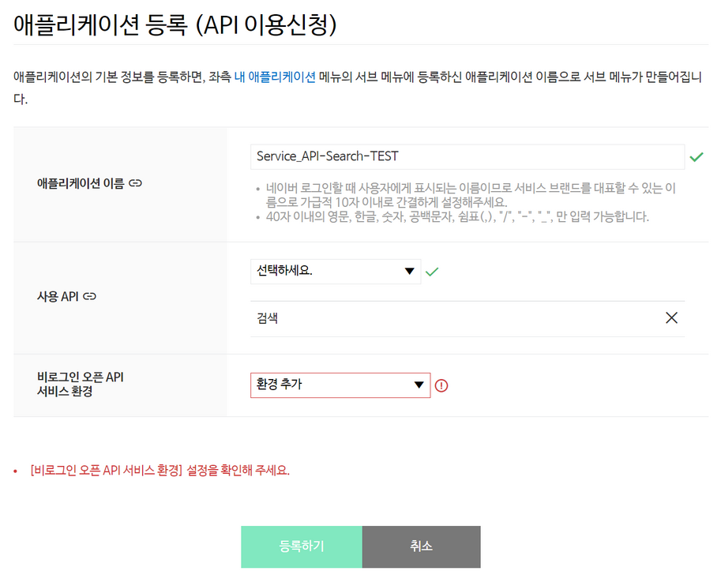
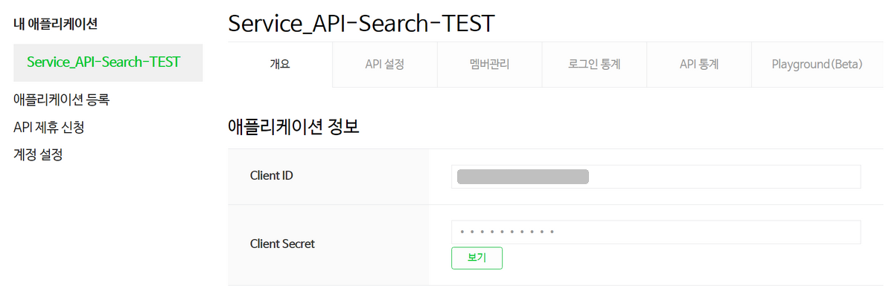

검색 &gt; 블로그
====================
 
<div class="table-of-contents">
<ul>
    <li><a href="#블로그-검색-개요">블로그 검색 개요</a></li>
    <ul>
        <li><a href="#개요">개요</a></li>
        <li><a href="#사전-준비-사항">사전 준비 사항</a></li>
    </ul>
    <li><a href="#블로그-검색-api-레퍼런스">블로그 검색 API 레퍼런스</a></li>
    <ul>
        <li><a href="#블로그-검색-결과-조회">블로그 검색 결과 조회</a></li>
        <li><a href="#오류-코드">오류 코드</a></li>
    </ul>
    <li><a href="#검색-api-블로그-검색-구현-예제">검색 API 블로그 검색 구현 예제</a></li>
    <ul>
        <li><a href="#java">Java</a></li>
        <li><a href="#php">PHP</a></li>
        <li><a href="#node-js">Node.js</a></li>
        <li><a href="#python">Python</a></li>
        <li><a href="#c">C#</a></li>
    </ul>
</ul>
</div>

## 블로그 검색 개요

* [개요](#개요)
* [사전 준비 사항](#사전-준비-사항)

### 개요

#### 검색 API와 블로그 검색 개요

검색 API는 네이버 검색 결과를 뉴스, 백과사전, 블로그, 쇼핑, 웹 문서, 전문정보, 지식iN, 책, 카페글 등 분야별로 볼 수 있는 API입니다. 그 외에 지역 검색 결과와 성인 검색어 판별 기능, 오타 변환 기능을 제공합니다.

블로그 검색은 검색 API를 사용해 네이버 검색의 블로그 검색 결과를 반환하는 RESTful API입니다. 블로그 검색 결과를 XML 형식 또는 JSON 형식으로 반환합니다. API를 호출할 때는 검색어와 검색 조건을 쿼리 스트링(Query String) 형식의 데이터로 전달합니다.

블로그 검색은 검색 API를 사용하며, 검색 API의 하루 호출 한도는 25,000회입니다.

#### 검색 API 특징

검색 API는 비로그인 방식 오픈 API입니다.

비로그인 방식 오픈 API는 네이버 오픈API를 호출할 때 HTTP 요청 헤더에 클라이언트 아이디와 클라이언트 시크릿 값만 전송해 사용할 수 있는 오픈 API입니다. 클라이언트 아이디와 클라이언트 시크릿은 네이버 오픈API에서 인증된 사용자인지 확인하는 수단입니다. [네이버 개발자 센터](https://developers.naver.com/)에서 애플리케이션을 등록하면 클라이언트 아이디와 클라이언트 시크릿이 발급됩니다.

> **참고**  
> 네이버 오픈API의 종류와 클라이언트 아이디, 클라이언트 시크릿에 관한 자세한 내용은 "[API 공통 가이드](https://developers.naver.com/docs/common/openapiguide/)"를 참고하십시오.  

### 사전 준비 사항

검색 API를 사용해 블로그 검색을 실행하려면 먼저 [네이버 개발자 센터](https://developers.naver.com/)에서 애플리케이션을 등록하고 클라이언트 아이디와 클라이언트 시크릿을 발급받아야 합니다.

클라이언트 아이디와 클라이언트 시크릿은 인증된 사용자인지를 확인하는 수단이며, 애플리케이션이 등록되면 발급됩니다. 클라이언트 아이디와 클라이언트 시크릿을 네이버 오픈API를 호출할 때 HTTP 헤더에 포함해서 전송해야 API를 호출할 수 있습니다. API 사용량은 클라이언트 아이디별로 합산됩니다.

블로그 검색을 실행하기 위해 발급받은 클라이언트 아이디와 클라이언트 시크릿은 검색 API의 다른 작업을 실행할 때에도 사용할 수 있습니다.

> **주의**  
> 네이버에 로그인한 사용자 계정으로 애플리케이션이 등록됩니다. 애플리케이션을 등록한 네이버 아이디는 '관리자' 권한을 가지게 되므로 네이버 계정의 보안에 각별히 주의해야 합니다.  
> 회사나 단체에서 애플리케이션을 등록할 때는 추후 키 관리 등이 용이하도록 네이버 단체 회원으로 로그인해 이용할 것을 권장합니다.  
> - [네이버 단체 회원 가입하기](https://nid.naver.com/group/commonAction.nhn?m=viewTerms)  

#### 애플리케이션 등록

네이버 개발자 센터에서 애플리케이션을 등록하는 방법은 다음과 같습니다.

1. 네이버 개발자 센터의 메뉴에서 [**Application &gt; 애플리케이션 등록**](https://developers.naver.com/apps/#/register)을 선택합니다.
2. **이용약관 동의** 단계에서 **이용약관에 동의합니다.**<!-- -->를 선택한 다음 **확인**을 클릭합니다.
3. **계정 정보 등록** 단계에서 휴대폰 인증을 완료하고 회사 이름을 입력한 다음 **확인**을 클릭합니다. 휴대폰 인증은 담당자 연락처 확인을 위해 필요한 과정이며, 애플리케이션을 처음 등록할 때 한 번만 인증받으면 됩니다.
4. **애플리케이션 등록 (API이용신청)** 페이지에서 [애플리케이션 등록 세부 정보](#애플리케이션-등록-세부-정보)를 입력한 다음 **등록하기**<!-- -->를 클릭합니다.

#### 애플리케이션 등록 세부 정보

**애플리케이션 등록 (API이용신청)** 페이지에서 애플리케이션 세부 정보를 입력하는 방법은 다음과 같습니다.

1. 등록하려는 애플리케이션의 이름을 **애플리케이션 이름**에 입력합니다. 최대 40자까지 입력할 수 있습니다.
2. **사용 API**에서 **검색**<!-- -->을 선택해 추가합니다.
3. [**비로그인 오픈 API 서비스 환경**](https://developers.naver.com/docs/common/openapiguide/appregister.md#비로그인-오픈-api-서비스-환경)에서 애플리케이션을 서비스할 환경을 추가하고 필요한 상세 정보를 입력합니다.
 


#### 애플리케이션 등록 확인

애플리케이션이 정상적으로 등록되면 네이버 개발자 센터의 **[Application &gt; 내 애플리케이션](https://developers.naver.com/apps/#/list)** 메뉴의 아래에 등록한 애플리케이션 이름으로 하위 메뉴가 생깁니다.

애플리케이션 이름을 클릭하면 **개요** 탭에서 애플리케이션에 부여된 클라이언트 아이디와 클라이언트 시크릿을 확인할 수 있습니다.



## 블로그 검색 API 레퍼런스

* [블로그 검색 결과 조회](#블로그-검색-결과-조회)

### 블로그 검색 결과 조회

#### 설명

네이버 검색의 블로그 검색 결과를 XML 형식 또는 JSON 형식으로 반환합니다.

#### 요청 URL

|요청 URL|결괏값 반환 형식|
|---|:-:|
|`https://openapi.naver.com/v1/search/blog.xml`|XML|
|`https://openapi.naver.com/v1/search/blog.json`|JSON|

#### 프로토콜

HTTPS

#### HTTP 메서드

GET

#### 파라미터

파라미터를 쿼리 스트링 형식으로 전달합니다.

|파라미터|타입|필수 여부|설명|
|---|---|:-:|---|
|query|String|Y|검색어. UTF-8로 인코딩되어야 합니다.|
|display|Integer|N|한 번에 표시할 검색 결과 개수(기본값: 10, 최댓값: 100)|
|start|Integer|N|검색 시작 위치(기본값: 1, 최댓값: 1000)|
|sort|String|N|검색 결과 정렬 방법<br/>- `sim`: 정확도순으로 내림차순 정렬(기본값)<br/>- `date`: 날짜순으로 내림차순 정렬|

#### 참고 사항

API를 요청할 때 다음 예와 같이 HTTP 요청 헤더에 [클라이언트 아이디와 클라이언트 시크릿](https://developers.naver.com/docs/common/openapiguide/appregister.md#클라이언트-아이디와-클라이언트-시크릿-확인)을 추가해야 합니다.

```sh
> GET /v1/search/blog.xml?query=%EB%A6%AC%EB%B7%B0&display=10&start=1&sort=sim HTTP/1.1
> Host: openapi.naver.com
> User-Agent: curl/7.49.1
> Accept: */*
> X-Naver-Client-Id: {애플리케이션 등록 시 발급받은 클라이언트 아이디 값}
> X-Naver-Client-Secret: {애플리케이션 등록 시 발급받은 클라이언트 시크릿 값}
>
```

#### 요청 예

```sh
curl  "https://openapi.naver.com/v1/search/blog.xml?query=%EB%A6%AC%EB%B7%B0&display=10&start=1&sort=sim" \
    -H "X-Naver-Client-Id: {애플리케이션 등록 시 발급받은 클라이언트 아이디 값}" \
    -H "X-Naver-Client-Secret: {애플리케이션 등록 시 발급받은 클라이언트 시크릿 값}" -v
```

#### 응답

응답에 성공하면 결괏값을 XML 형식 또는 JSON 형식으로 반환합니다. XML 형식의 결괏값은 다음과 같습니다.

|요소|타입|설명|
|---|:-:|---|
|rss|-|RSS 컨테이너. RSS 리더기를 사용해 검색 결과를 확인할 수 있습니다.|
|rss/channel|-|검색 결과를 포함하는 컨테이너. `channel` 요소의 하위 요소인 `title`, `link`, `description`은 RSS에서 사용하는 정보이며, 검색 결과와는 상관이 없습니다.|
|rss/channel/lastBuildDate|dateTime|검색 결과를 생성한 시간|
|rss/channel/total|Integer|총 검색 결과 개수|
|rss/channel/start|Integer|검색 시작 위치|
|rss/channel/display|Integer|한 번에 표시할 검색 결과 개수|
|rss/channel/item|-|개별 검색 결과. JSON 형식의 결괏값에서는 `items` 속성의 JSON 배열로 개별 검색 결과를 반환합니다.|
|rss/channel/item/title|String|블로그 포스트의 제목. 제목에서 검색어와 일치하는 부분은 `<b>` 태그로 감싸져 있습니다.|
|rss/channel/item/link|String|블로그 포스트의 URL|
|rss/channel/item/description|String|블로그 포스트의 내용을 요약한 패시지 정보. 패시지 정보에서 검색어와 일치하는 부분은 `<b>` 태그로 감싸져 있습니다.|
|rss/channel/item/bloggername|String|블로그 포스트가 있는 블로그의 이름|
|rss/channel/item/bloggerlink|String|블로그 포스트가 있는 블로그의 주소|
|rss/channel/item/postdate|dateTime|블로그 포스트가 작성된 날짜|

#### 응답 예

```xml
< HTTP/1.1 200 OK
< Server: nginx
< Date: Mon, 26 Sep 2016 01:39:37 GMT
< Content-Type: text/xml;charset=utf-8
< Transfer-Encoding: chunked
< Connection: keep-alive
< Keep-Alive: timeout=5
< Vary: Accept-Encoding
< X-Powered-By: Naver
< Cache-Control: no-cache, no-store, must-revalidate
< Pragma: no-cache
<
<?xml version="1.0" encoding="UTF-8"?>
<rss version="2.0">
    <channel>
        <title>Naver Open API - blog ::'리뷰'</title>
        <link>http://search.naver.com</link>
        <description>Naver Search Result</description>
        <lastBuildDate>Mon, 26 Sep 2016 10:39:37 +0900</lastBuildDate>
        <total>8714891</total>
        <start>1</start><display>10</display>
        <item>
            <title>명예훼손 없이 <b>리뷰</b>쓰기</title>
            <link>http://openapi.naver.com/l?AAABWLyw6CMBREv+ayNJe2UrrogvJwg8aYKGvACiSUalNR/t6azGLO5Mzrrd0moVSQJZDl/6I4KIxGpx9y9P4JNANShXSzHXZLu2q3660Jw2bt0k1+aF1rgFYXfZ+c7j3QorYDkCT4JxuIEEyRUYGcxpGXMeMs3VPBOUEWGXntynUW03k7ohBYfG+mOdRqbPL6E84/apnqgaEAAAA=</link>
            <description>명예훼손 없이 <b>리뷰</b>쓰기 우리 블로그하시는 분들께는 꽤 중요한 내용일 수도 있습니다 그것도 주로 <b>리뷰</b> 위주로 블로그를 진행하신 분이라면 더욱 더 말이죠
                오늘 포스팅은, 어떻게 하면 객관적이고 좋은 <b>리뷰</b>를... </description>
            <bloggername>건짱의 Best Drawing World2</bloggername>
            <bloggerlink>http://blog.naver.com/yoonbitgaram</bloggerlink>
            <postdate>20161208</postdate>
        </item>
        ...
    </channel>
</rss>
```

### 오류 코드

검색 API 블로그 검색의 주요 오류 코드는 다음과 같습니다.

|오류 코드|HTTP 상태 코드|오류 메시지|설명|
|:-:|:-:|---|---|
|SE01|400|Incorrect query request (잘못된 쿼리요청입니다.)|API 요청 URL의 프로토콜, 파라미터 등에 오류가 있는지 확인합니다.|
|SE02|400|Invalid display value (부적절한 display 값입니다.)|`display` 파라미터의 값이 허용 범위의 값(1\~100)인지 확인합니다.|
|SE03|400|Invalid start value (부적절한 start 값입니다.)|`start` 파라미터의 값이 허용 범위의 값(1\~1000)인지 확인합니다.|
|SE04|400|Invalid sort value (부적절한 sort 값입니다.)|`sort` 파라미터의 값에 오타가 있는지 확인합니다.|
|SE06|400|Malformed encoding (잘못된 형식의 인코딩입니다.)|검색어를 UTF-8로 인코딩합니다.|
|SE05|404|Invalid search api (존재하지 않는 검색 api 입니다.)|API 요청 URL에 오타가 있는지 확인합니다.|
|SE99|500|System Error (시스템 에러)|서버 내부에 오류가 발생했습니다. "[개발자 포럼](https://developers.naver.com/forum)"에 오류를 신고해 주십시오.|

> **403 오류**  
> 개발자 센터에 등록한 애플리케이션에서 검색 API를 사용하도록 설정하지 않았다면 'API 권한 없음'을 의미하는 403 오류가 발생할 수 있습니다. 403 오류가 발생했다면 네이버 개발자 센터의 [**Application &gt; 내 애플리케이션**](https://developers.naver.com/apps/#/list) 메뉴에서 오류가 발생한 애플리케이션의 **API 설정** 탭을 클릭한 다음 **검색**<!-- -->이 선택돼 있는지 확인해 보십시오.  

> **참고**  
> 네이버 오픈API 공통 오류 코드는 "[API 공통 가이드](https://developers.naver.com/docs/common/openapiguide/)"의 '[오류 코드](https://developers.naver.com/docs/common/openapiguide/errorcode.md)'를 참고하십시오.  

## 검색 API 블로그 검색 구현 예제

다음은 검색 API로 블로그 검색 결과를 조회하는 구현 예제입니다. 검색 API의 다른 작업을 구현하는 방법도 이 구현 예제와 유사하기 때문에 이 구현 예제를 참고하면 검색 API를 구현할 수 있습니다.

* [Java](#java)
* [PHP](#php)
* [Node.js](#node-js)
* [Python](#python)
* [C&num;](#c)

> **참고**  
> - 샘플 코드에서 `YOUR_CLIENT_ID` 또는 `YOUR-CLIENT-ID`에는 애플리케이션을 등록하고 발급받은 클라이언트 아이디 값을 입력합니다.  
> - 샘플 코드에서 `YOUR_CLIENT_SECRET` 또는 `YOUR-CLIENT-SECRET`에는 애플리케이션을 등록하고 발급받은 클라이언트 시크릿 값을 입력합니다.  

### Java

```java
// 네이버 검색 API 예제 - 블로그 검색
import java.io.*;
import java.net.HttpURLConnection;
import java.net.MalformedURLException;
import java.net.URL;
import java.net.URLEncoder;
import java.util.HashMap;
import java.util.Map;


public class ApiExamSearchBlog {


    public static void main(String[] args) {
        String clientId = "YOUR_CLIENT_ID"; //애플리케이션 클라이언트 아이디
        String clientSecret = "YOUR_CLIENT_SECRET"; //애플리케이션 클라이언트 시크릿


        String text = null;
        try {
            text = URLEncoder.encode("그린팩토리", "UTF-8");
        } catch (UnsupportedEncodingException e) {
            throw new RuntimeException("검색어 인코딩 실패",e);
        }


        String apiURL = "https://openapi.naver.com/v1/search/blog?query=" + text;    // JSON 결과
        //String apiURL = "https://openapi.naver.com/v1/search/blog.xml?query="+ text; // XML 결과


        Map<String, String> requestHeaders = new HashMap<>();
        requestHeaders.put("X-Naver-Client-Id", clientId);
        requestHeaders.put("X-Naver-Client-Secret", clientSecret);
        String responseBody = get(apiURL,requestHeaders);


        System.out.println(responseBody);
    }


    private static String get(String apiUrl, Map<String, String> requestHeaders){
        HttpURLConnection con = connect(apiUrl);
        try {
            con.setRequestMethod("GET");
            for(Map.Entry<String, String> header :requestHeaders.entrySet()) {
                con.setRequestProperty(header.getKey(), header.getValue());
            }


            int responseCode = con.getResponseCode();
            if (responseCode == HttpURLConnection.HTTP_OK) { // 정상 호출
                return readBody(con.getInputStream());
            } else { // 오류 발생
                return readBody(con.getErrorStream());
            }
        } catch (IOException e) {
            throw new RuntimeException("API 요청과 응답 실패", e);
        } finally {
            con.disconnect();
        }
    }


    private static HttpURLConnection connect(String apiUrl){
        try {
            URL url = new URL(apiUrl);
            return (HttpURLConnection)url.openConnection();
        } catch (MalformedURLException e) {
            throw new RuntimeException("API URL이 잘못되었습니다. : " + apiUrl, e);
        } catch (IOException e) {
            throw new RuntimeException("연결이 실패했습니다. : " + apiUrl, e);
        }
    }


    private static String readBody(InputStream body){
        InputStreamReader streamReader = new InputStreamReader(body);


        try (BufferedReader lineReader = new BufferedReader(streamReader)) {
            StringBuilder responseBody = new StringBuilder();


            String line;
            while ((line = lineReader.readLine()) != null) {
                responseBody.append(line);
            }


            return responseBody.toString();
        } catch (IOException e) {
            throw new RuntimeException("API 응답을 읽는 데 실패했습니다.", e);
        }
    }
}
```

### PHP

```php
// SSL 사용에 문제가 있으면 curl_setopt($ch, CURLOPT_SSL_VERIFYPEER, false); 를 추가해 보시기 바랍니다.
// 네이버 검색 API 예제 - 블로그 검색
<?php
  $client_id = "YOUR_CLIENT_ID";
  $client_secret = "YOUR_CLIENT_SECRET";
  $encText = urlencode("네이버오픈API");
  $url = "https://openapi.naver.com/v1/search/blog?query=".$encText; // json 결과
//  $url = "https://openapi.naver.com/v1/search/blog.xml?query=".$encText; // xml 결과
  $is_post = false;
  $ch = curl_init();
  curl_setopt($ch, CURLOPT_URL, $url);
  curl_setopt($ch, CURLOPT_POST, $is_post);
  curl_setopt($ch, CURLOPT_RETURNTRANSFER, true);
  $headers = array();
  $headers[] = "X-Naver-Client-Id: ".$client_id;
  $headers[] = "X-Naver-Client-Secret: ".$client_secret;
  curl_setopt($ch, CURLOPT_HTTPHEADER, $headers);
  curl_setopt($ch, CURLOPT_SSL_VERIFYPEER, 0);
  $response = curl_exec ($ch);
  $status_code = curl_getinfo($ch, CURLINFO_HTTP_CODE);
  echo "status_code:".$status_code."
";
  curl_close ($ch);
  if($status_code == 200) {
    echo $response;
  } else {
    echo "Error 내용:".$response;
  }
?>
```

### Node.js

```js
// 네이버 검색 API 예제 - 블로그 검색
var express = require('express');
var app = express();
var client_id = 'YOUR_CLIENT_ID';
var client_secret = 'YOUR_CLIENT_SECRET';
app.get('/search/blog', function (req, res) {
   var api_url = 'https://openapi.naver.com/v1/search/blog?query=' + encodeURI(req.query.query); // JSON 결과
//   var api_url = 'https://openapi.naver.com/v1/search/blog.xml?query=' + encodeURI(req.query.query); // XML 결과
   var request = require('request');
   var options = {
       url: api_url,
       headers: {'X-Naver-Client-Id':client_id, 'X-Naver-Client-Secret': client_secret}
    };
   request.get(options, function (error, response, body) {
     if (!error && response.statusCode == 200) {
       res.writeHead(200, {'Content-Type': 'text/json;charset=utf-8'});
       res.end(body);
     } else {
       res.status(response.statusCode).end();
       console.log('error = ' + response.statusCode);
     }
   });
 });
 app.listen(3000, function () {
   console.log('http://127.0.0.1:3000/search/blog?query=검색어 app listening on port 3000!');
 });
```

### Python

```python
# 네이버 검색 API 예제 - 블로그 검색
import os
import sys
import urllib.request
client_id = "YOUR_CLIENT_ID"
client_secret = "YOUR_CLIENT_SECRET"
encText = urllib.parse.quote("검색할 단어")
url = "https://openapi.naver.com/v1/search/blog?query=" + encText # JSON 결과
# url = "https://openapi.naver.com/v1/search/blog.xml?query=" + encText # XML 결과
request = urllib.request.Request(url)
request.add_header("X-Naver-Client-Id",client_id)
request.add_header("X-Naver-Client-Secret",client_secret)
response = urllib.request.urlopen(request)
rescode = response.getcode()
if(rescode==200):
    response_body = response.read()
    print(response_body.decode('utf-8'))
else:
    print("Error Code:" + rescode)
```

### C&num;

```csharp
using System;
using System.Net;
using System.Text;
using System.IO;


namespace NaverAPI_Guide
{
    public class APIExamSearchBlog
    {
        static void Main(string[] args)
        {
            string query = "네이버 Open API"; // 검색할 문자열
            string url = "https://openapi.naver.com/v1/search/blog?query=" + query; // JSON 결과
            // string url = "https://openapi.naver.com/v1/search/blog.xml?query=" + query;  // XML 결과
            HttpWebRequest request = (HttpWebRequest)WebRequest.Create(url);
            request.Headers.Add("X-Naver-Client-Id", "YOUR-CLIENT-ID"); // 클라이언트 아이디
            request.Headers.Add("X-Naver-Client-Secret", "YOUR-CLIENT-SECRET");       // 클라이언트 시크릿
            HttpWebResponse response = (HttpWebResponse)request.GetResponse();
            string status = response.StatusCode.ToString();
            if(status == "OK")
            {
                Stream stream = response.GetResponseStream();
                StreamReader reader = new StreamReader(stream, Encoding.UTF8);
                string text = reader.ReadToEnd();
                Console.WriteLine(text);
            }
            else
            {
                Console.WriteLine("Error 발생=" + status);
            }
        }
    }
}
```