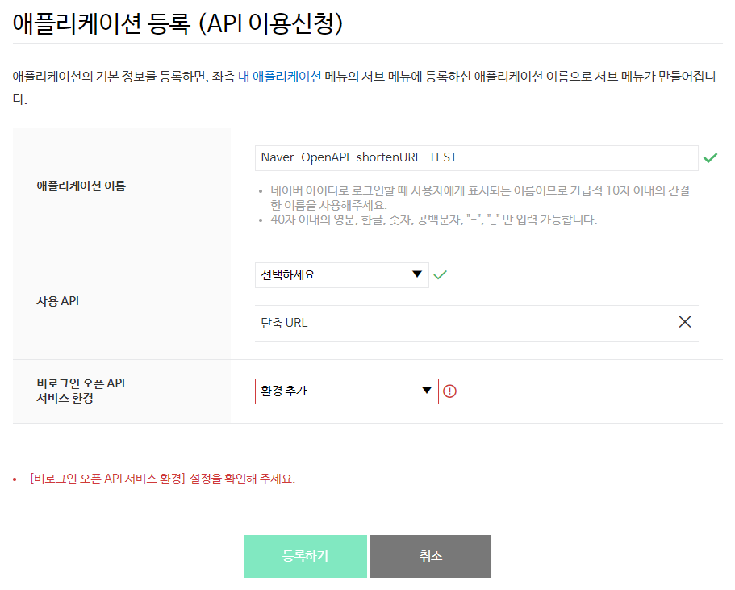

단축 URL
====================

<div class="table-of-contents">
<ul>
    <li><a href="#단축-url-개요">단축 URL 개요</a></li>
    <ul>
        <li><a href="#개요">개요</a></li>
        <li><a href="#사전-준비-사항">사전 준비 사항</a></li>
    </ul>
    <li><a href="#단축-url-api-레퍼런스">단축 URL API 레퍼런스</a></li>
    <ul>
        <li><a href="#단축-url-요청-json">단축 URL 요청(JSON)</a></li>
        <li><a href="#단축-url-요청-xml">단축 URL 요청(XML)</a></li>
        <li><a href="#오류-코드 ">오류 코드</a></li>
    </ul>
    <li><a href="#단축-url-api-구현-예제">단축 URL API 구현 예제</a></li>
    <ul>
        <li><a href="#java">Java</a></li>
        <li><a href="#php">PHP</a></li>
        <li><a href="#node-js">Node.js</a></li>
        <li><a href="#python">Python</a></li>
        <li><a href="#c">C#</a></li>
    </ul>
    <li><a href="/docs/utils/shortenurl_tutorial/">단축 URL API 튜토리얼</a></li>
    <ul>
        <li><a href="/docs/utils/shortenurl_tutorial/#개요">개요</a></li>
        <li><a href="/docs/utils/shortenurl_tutorial/#개발-환경">개발 환경</a></li>
        <li><a href="/docs/utils/shortenurl_tutorial/#단축-url-api-구현">단축 URL API 구현</a></li>
    </ul>    
</ul>
</div>

## 단축 URL 개요

* [개요](#개요)
* [사전 준비 사항](#사전-준비-사항)

### 개요

#### 단축 URL API 개요

단축 URL API는 원본 URL을 `https://me2.do/example`과 같은 형태의 짧은 URL로 반환하는 RESTful API입니다. 네이버가 서비스하는 QR코드 이미지도 함께 생성됩니다. `https://me2.do/example.qr`과 같이 반환받은 단축 URL의 끝에 `.qr`을 붙이면 QR코드 이미지 주소를 확인할 수 있습니다.

단축 URL API의 하루 API 호출 한도는 25,000회입니다.

#### 단축 URL API 특징

단축 URL API는 비로그인 방식 오픈 API입니다.

비로그인 방식 오픈 API는 네이버 오픈API를 호출할 때 HTTP 요청 헤더에 클라이언트 아이디와 클라이언트 시크릿 값만 전송해 사용할 수 있는 오픈 API입니다. 클라이언트 아이디와 클라이언트 시크릿은 네이버 오픈API에서 인증된 사용자인지 확인하는 수단입니다. [네이버 개발자 센터](https://developers.naver.com/)에서 애플리케이션을 등록하면 클라이언트 아이디와 클라이언트 시크릿이 발급됩니다.

> **참고**  
> 네이버 오픈API의 종류와 클라이언트 아이디, 클라이언트 시크릿에 관한 자세한 내용은 "<a href="/docs/common/openapiguide/" target="_blank">API 공통 가이드</a>"를 참고하십시오.  

### 사전 준비 사항

단축 URL API를 사용하려면 먼저 [네이버 개발자 센터](https://developers.naver.com/)에서 애플리케이션을 등록하고 클라이언트 아이디와 클라이언트 시크릿을 발급받아야 합니다.

클라이언트 아이디와 클라이언트 시크릿은 인증된 사용자인지를 확인하는 수단이며, 애플리케이션이 등록되면 발급됩니다. 클라이언트 아이디와 클라이언트 시크릿을 네이버 오픈API를 호출할 때 HTTP 헤더에 포함해서 전송해야 API를 호출할 수 있습니다. API 사용량은 클라이언트 아이디별로 합산됩니다.

> **주의**  
> 네이버에 로그인한 사용자 계정으로 애플리케이션이 등록됩니다. 애플리케이션을 등록한 네이버 아이디는 '관리자' 권한을 가지게 되므로 네이버 계정의 보안에 각별히 주의해야 합니다.    
> 회사나 단체에서 애플리케이션을 등록할 때는 추후 키 관리 등이 용이하도록 네이버 단체 회원으로 로그인해 이용할 것을 권장합니다.  
> - [네이버 단체 회원 가입하기](https://nid.naver.com/group/commonAction.nhn?m=viewTerms)  

#### 애플리케이션 등록

네이버 개발자 센터에서 애플리케이션을 등록하는 방법은 다음과 같습니다.

1. 네이버 개발자 센터의 메뉴에서 [**Application &gt; 애플리케이션 등록**](https://developers.naver.com/apps/#/wizard/register)을 선택합니다.
2. **이용약관 동의** 단계에서 **이용약관에 동의합니다.**<!-- -->를 선택한 다음 **확인**을 클릭합니다.
3. **계정 정보 등록** 단계에서 휴대폰 인증을 완료하고 회사 이름을 입력한 다음 **확인**을 클릭합니다. 휴대폰 인증은 담당자 연락처 확인을 위해 필요한 과정이며, 애플리케이션을 처음 등록할 때 한 번만 인증받으면 됩니다.
4. [**애플리케이션 등록 (API이용신청)**](https://developers.naver.com/apps/#/register?defaultScope=shorturl) 페이지에서 [애플리케이션 등록 세부 정보](#애플리케이션-등록-세부-정보)를 입력한 다음 **등록하기**를 클릭합니다.

#### 애플리케이션 등록 세부 정보

[**애플리케이션 등록 (API이용신청)**](https://developers.naver.com/apps/#/register?defaultScope=shorturl) 페이지에서 애플리케이션 세부 정보를 입력하는 방법은 다음과 같습니다.

1. 등록하려는 애플리케이션의 이름을 **애플리케이션 이름**에 입력합니다. 최대 40자까지 입력할 수 있습니다.
2. **사용 API**에서 **단축 URL**을 선택해 추가합니다.
3. [**비로그인 오픈 API 서비스 환경**](/docs/common/openapiguide/#/appregister.md#비로그인-오픈-api-서비스-환경)에서 애플리케이션을 서비스할 환경을 추가하고 필요한 상세 정보를 입력합니다.



#### 애플리케이션 등록 확인

애플리케이션이 정상적으로 등록되면 네이버 개발자 센터의 [**Application &gt; 내 애플리케이션**](https://developers.naver.com/apps/#/list) 메뉴의 아래에 등록한 애플리케이션 이름으로 하위 메뉴가 생깁니다.

애플리케이션 이름을 클릭하면 **개요** 탭에서 애플리케이션에 부여된 클라이언트 아이디와 클라이언트 시크릿을 확인할 수 있습니다.


## 단축 URL API 레퍼런스

* [단축 URL 요청(JSON)](#단축-url-요청-json)
* [단축 URL 요청(XML)](#단축-url-요청-xml)
* [오류 코드](#오류-코드)

### 단축 URL 요청(JSON)

#### 설명

원본 URL을 `https://me2.do/example`과 같은 형태로 변환한 단축 URL 정보를 JSON 형식으로 반환합니다.

#### 요청 URL

```sh
https://openapi.naver.com/v1/util/shorturl
```

또는

```sh
https://openapi.naver.com/v1/util/shorturl.json
```

#### 프로토콜

HTTP

#### HTTP 메서드

* GET
* POST

#### 파라미터

|파라미터|타입|필수 여부|설명|
|---|---|:-:|----|
|url|String|Y|단축할 원본 URL|

#### 참고 사항

API를 요청할 때 다음 예와 같이 HTTP 요청 헤더에 [클라이언트 아이디와 클라이언트 시크릿](/docs/common/openapiguide/#/appregister.md#클라이언트-아이디와-클라이언트-시크릿-확인)을 추가해야 합니다.

```sh
> POST /v1/util/shorturl HTTP/1.1
> Host: openapi.naver.com
> User-Agent: curl/7.49.1
> Accept: */*
> Content-Type: application/x-www-form-urlencoded; charset=UTF-8
> X-Naver-Client-Id: {애플리케이션 등록 시 발급받은 클라이언트 아이디 값}
> X-Naver-Client-Secret: {애플리케이션 등록 시 발급받은 클라이언트 시크릿 값}
> Content-Length: 42
```

#### 요청 예

```sh
curl "https://openapi.naver.com/v1/util/shorturl" \
    -d "url=http://d2.naver.com/helloworld/4874130" \
    -H "Content-Type: application/x-www-form-urlencoded; charset=UTF-8" \
    -H "X-Naver-Client-Id: {애플리케이션 등록 시 발급받은 클라이언트 아이디 값}" \
    -H "X-Naver-Client-Secret: {애플리케이션 등록 시 발급받은 클라이언트 시크릿 값}" -v
```

또는

```sh
curl "https://openapi.naver.com/v1/util/shorturl.json" \
    -d "url=http://d2.naver.com/helloworld/4874130" \
    -H "Content-Type: application/x-www-form-urlencoded; charset=UTF-8" \
    -H "X-Naver-Client-Id: {애플리케이션 등록 시 발급받은 클라이언트 아이디 값}" \
    -H "X-Naver-Client-Secret: {애플리케이션 등록 시 발급받은 클라이언트 시크릿 값}" -v
```

#### 응답

응답에 성공하면 결괏값을 JSON 형식으로 반환합니다.

|속성|타입|설명|
|---|---|----|
|message|string|오류 메시지. 응답에 성공하면 `ok`를 반환합니다.|
|code|string|HTTP 상태 코드|
|result.hash|string|단축 URL의 해시 정보|
|result.url|string|단축된 URL|
|result.orgUrl|string|원본 URL|

#### 응답 예

```json
< HTTP/1.1 200 OK
< Server: nginx
< Date: Wed, 28 Sep 2016 08:05:41 GMT
< Content-Type: application/json;charset=utf-8
< Content-Length: 139
< Connection: keep-alive
< Keep-Alive: timeout=5
< Vary: Accept-Encoding
<
* Connection #0 to host openapi.naver.com left intact
{
    "message":"ok",
    "result": {
        "hash":"GyvykVAu",
        "url":"https://me2.do/GyvykVAu",
        "orgUrl":"http://d2.naver.com/helloworld/4874130"
    }
    ,"code":"200"
}
```

### 단축 URL 요청(XML)

#### 설명

원본 URL을 `https://me2.do/example`과 같은 형태로 변환한 단축 URL 정보를 XML 형식으로 반환합니다.

#### 요청 URL

```sh
https://openapi.naver.com/v1/util/shorturl.xml
```

#### 프로토콜

HTTP

#### HTTP 메서드

* GET
* POST

#### 파라미터

|파라미터|타입|필수 여부|설명|
|---|---|:-:|----|
|url|String|Y|단축할 원본 URL|

#### 참고 사항

API를 요청할 때 다음 예와 같이 HTTP 요청 헤더에 [클라이언트 아이디와 클라이언트 시크릿](/docs/common/openapiguide/#/appregister.md#클라이언트-아이디와-클라이언트-시크릿-확인)을 추가해야 합니다.

```sh
> POST /v1/util/shorturl.xml HTTP/1.1
> Host: openapi.naver.com
> User-Agent: curl/7.49.1
> Accept: */*
> Content-Type: application/x-www-form-urlencoded; charset=UTF-8
> X-Naver-Client-Id: {애플리케이션 등록 시 발급받은 클라이언트 아이디 값}
> X-Naver-Client-Secret: {애플리케이션 등록 시 발급받은 클라이언트 시크릿 값}
> Content-Length: 42
```

#### 요청 예

```sh
curl "https://openapi.naver.com/v1/util/shorturl.xml" \
    -d "url=http://d2.naver.com/helloworld/4874130" \
    -H "Content-Type: application/x-www-form-urlencoded; charset=UTF-8" \
    -H "X-Naver-Client-Id: {애플리케이션 등록 시 발급받은 클라이언트 아이디 값}" \
    -H "X-Naver-Client-Secret: {애플리케이션 등록 시 발급받은 클라이언트 시크릿 값}" -v
```

#### 응답

응답에 성공하면 결괏값을 XML 형식으로 반환합니다.

|요소|타입|설명|
|---|---|----|
|result/message|CDATA|오류 메시지. 응답에 성공하면 `ok`를 반환합니다.
|result/code|CDATA|HTTP 상태 코드|
|result/result/hash|CDATA|단축 URL의 해시 정보|
|result/result/url|CDATA|단축된 URL|
|result/result/orgUrl|CDATA|원본 URL|

#### 응답 예

```xml
< HTTP/1.1 200 OK
< Server: nginx
< Date: Wed, 28 Sep 2016 09:54:21 GMT
< Content-Type: text/xml;charset=utf-8
< Content-Length: 284
< Connection: keep-alive
< Keep-Alive: timeout=5
< Vary: Accept-Encoding
<
<?xml version="1.0" encoding="UTF-8"?>
    <result>
        <message><![CDATA[ok]]></message>
        <result>
            <hash><![CDATA[GyvykVAu]]></hash>
            <url><![CDATA[https://me2.do/GyvykVAu]]></url>
            <orgUrl><![CDATA[http://d2.naver.com/helloworld/4874130]]></orgUrl>
        </result>
        <code><![CDATA[200]]></code>
    </result>
```

### 오류 코드

단축 URL API의 주요 오류 코드는 다음과 같습니다.

|오류 코드|HTTP 상태 코드|오류 메시지|설명|
|---|---|----|----|
|1403|403|Invalid url|요청 URL에 오류가 있습니다. 파라미터 이름과 파라미터 값을 확인해 주십시오.|
|1500|500|Internal Server Error|서버 내부에 오류가 발생했습니다. "[개발자 포럼](https://developers.naver.com/forum)"에 오류를 신고해 주십시오.|
|2403|403|Forbidden url|API를 사용할 권한이 없습니다. 네이버 개발자 센터의 [**Application &gt; 내 애플리케이션**](https://developers.naver.com/apps/#/list) 메뉴에서 애플리케이션의 **API 설정** 탭을 클릭한 다음 **단축 URL**이 선택돼 있는지 확인해 보십시오.|
|3403|403|Unavailable url|단축할 원본 URL이 없는 페이지이거나 안전하지 않은 사이트입니다. 원본 URL 페이지의 상태를 점검해 주십시오.

> **참고**  
> 네이버 오픈API 공통 오류 코드는 "[API 공통 가이드](/docs/common/openapiguide/)"의 '[오류 코드](/docs/common/openapiguide/errorcode.md)'를 참고하십시오.  

## 단축 URL API 구현 예제

다음은 각 언어별 단축 URL API 구현 예제입니다.

* [Java](#java)
* [PHP](#php)
* [Node.js](#node-js)
* [Python](#python)
* [C&num;](#c)

> **참고**  
> - 샘플 코드에서 `YOUR_CLIENT_ID` 또는 `YOUR-CLIENT-ID`에는 애플리케이션을 등록하고 발급받은 클라이언트 아이디 값을 입력합니다.  
> - 샘플 코드에서 `YOUR_CLIENT_SECRET` 또는 `YOUR-CLIENT-SECRET`에는 애플리케이션을 등록하고 발급받은 클라이언트 시크릿 값을 입력합니다.  

### Java

```java
// 네이버 검색 API 예제 - 단축 URL - GET
import java.io.BufferedReader;
import java.io.IOException;
import java.io.InputStream;
import java.io.InputStreamReader;
import java.net.HttpURLConnection;
import java.net.MalformedURLException;
import java.net.URL;
import java.util.HashMap;
import java.util.Map;

public class ApiExamShortenUrl {

    public static void main(String[] args) {
        String clientId = "YOUR_CLIENT_ID"; //애플리케이션 클라이언트 아이디값"
        String clientSecret = "YOUR_CLIENT_SECRET"; //애플리케이션 클라이언트 시크릿값"

        String originalURL = "https://developers.naver.com/notice";
        String apiURL = "https://openapi.naver.com/v1/util/shorturl?url=" + originalURL;

        Map<String, String> requestHeaders = new HashMap<>();
        requestHeaders.put("X-Naver-Client-Id", clientId);
        requestHeaders.put("X-Naver-Client-Secret", clientSecret);
        String responseBody = get(apiURL,requestHeaders);

        System.out.println(responseBody);
    }

    private static String get(String apiUrl, Map<String, String> requestHeaders){
        HttpURLConnection con = connect(apiUrl);
        try {
            con.setRequestMethod("GET");
            for(Map.Entry<String, String> header :requestHeaders.entrySet()) {
                con.setRequestProperty(header.getKey(), header.getValue());
            }

            int responseCode = con.getResponseCode();
            if (responseCode == HttpURLConnection.HTTP_OK) { // 정상 호출
                return readBody(con.getInputStream());
            } else { // 에러 발생
                return readBody(con.getErrorStream());
            }
        } catch (IOException e) {
            throw new RuntimeException("API 요청과 응답 실패", e);
        } finally {
            con.disconnect();
        }
    }

    private static HttpURLConnection connect(String apiUrl){
        try {
            URL url = new URL(apiUrl);
            return (HttpURLConnection)url.openConnection();
        } catch (MalformedURLException e) {
            throw new RuntimeException("API URL이 잘못되었습니다. : " + apiUrl, e);
        } catch (IOException e) {
            throw new RuntimeException("연결이 실패했습니다. : " + apiUrl, e);
        }
    }

    private static String readBody(InputStream body){
        InputStreamReader streamReader = new InputStreamReader(body);

        try (BufferedReader lineReader = new BufferedReader(streamReader)) {
            StringBuilder responseBody = new StringBuilder();

            String line;
            while ((line = lineReader.readLine()) != null) {
                responseBody.append(line);
            }

            return responseBody.toString();
        } catch (IOException e) {
            throw new RuntimeException("API 응답을 읽는데 실패했습니다.", e);
        }
    }
}

```

* [GitHub에서 보기](https://github.com/naver/naver-openapi-guide/blob/master/sample/java/APIExamShortenURL.java)

### PHP

```php
<?php
  // 네이버 단축URL Open API 예제
  $client_id = "YOUR_CLIENT_ID"; // 네이버 개발자센터에서 발급받은 CLIENT ID
  $client_secret = "YOUR_CLIENT_SECRET";// 네이버 개발자센터에서 발급받은 CLIENT SECRET
  $encText = urlencode("https://developers.naver.com/docs/utils/shortenurl");
  $postvars = "url=".$encText;
  //$url = "https://openapi.naver.com/v1/util/shorturl";
  //$is_post = true;
  $url = "https://openapi.naver.com/v1/util/shorturl?url=".$encText ;
  $is_post = false;
  $ch = curl_init();
  curl_setopt($ch, CURLOPT_URL, $url);
  curl_setopt($ch, CURLOPT_POST, $is_post);
  curl_setopt($ch, CURLOPT_RETURNTRANSFER, true);
  //curl_setopt($ch,CURLOPT_POSTFIELDS, $postvars);
  $headers = array();
  $headers[] = "X-Naver-Client-Id: ".$client_id;
  $headers[] = "X-Naver-Client-Secret: ".$client_secret;
  curl_setopt($ch, CURLOPT_HTTPHEADER, $headers);
  $response = curl_exec ($ch);
  $status_code = curl_getinfo($ch, CURLINFO_HTTP_CODE);
  echo "status_code:".$status_code."<br>";
  curl_close ($ch);
  if($status_code == 200) {
    echo $response;
  } else {
    echo "Error 내용:".$response;
  }
?>
```

* [GitHub에서 보기](https://github.com/naver/naver-openapi-guide/blob/master/sample/php/APIExamShortURL.php)

### Node.js

```js
var express = require('express');
var app = express();
var client_id = 'YOUR_CLIENT_ID';//개발자센터에서 발급받은 Client ID
var client_secret = 'YOUR_CLIENT_SECRET'; //개발자센터에서 발급받은 Client Secret
var query = encodeURI("https://developers.naver.com/docs/utils/shortenurl");
app.get('/url', function (req, res) {
   var api_url = 'https://openapi.naver.com/v1/util/shorturl';
   var request = require('request');
   var options = {
       url: api_url,
       form: {'url':query},
       headers: {'X-Naver-Client-Id':client_id, 'X-Naver-Client-Secret': client_secret}
    };
   request.post(options, function (error, response, body) {
     if (!error && response.statusCode == 200) {
       res.writeHead(200, {'Content-Type': 'text/json;charset=utf-8'});
       res.end(body);
     } else {
       res.status(response.statusCode).end();
       console.log('error = ' + response.statusCode);
     }
   });
 });
 app.listen(3000, function () {
   console.log('http://127.0.0.1:3000/url app listening on port 3000!');
 });
```

* [GitHub에서 보기](https://github.com/naver/naver-openapi-guide/blob/master/sample/nodejs/APIExamShortURL.js)

### Python

```python
import os
import sys
import urllib.request
client_id = "YOUR_CLIENT_ID" # 개발자센터에서 발급받은 Client ID 값
client_secret = "YOUR_CLIENT_SECRET" # 개발자센터에서 발급받은 Client Secret 값
encText = urllib.parse.quote("https://developers.naver.com/docs/utils/shortenurl")
data = "url=" + encText
url = "https://openapi.naver.com/v1/util/shorturl"
request = urllib.request.Request(url)
request.add_header("X-Naver-Client-Id",client_id)
request.add_header("X-Naver-Client-Secret",client_secret)
response = urllib.request.urlopen(request, data=data.encode("utf-8"))
rescode = response.getcode()
if(rescode==200):
    response_body = response.read()
    print(response_body.decode('utf-8'))
else:
    print("Error Code:" + rescode)
```

* [GitHub에서 보기](https://github.com/naver/naver-openapi-guide/blob/master/sample/python/APIExamShortURL.py)

### C&num;

```csharp
using System;
using System.Net;
using System.Text;
using System.IO;

namespace NaverAPI_Guide
{
    public class APIExamURL
    {
        static void Main(string[] args)
        {
            string url = "https://openapi.naver.com/v1/util/shorturl";
            HttpWebRequest request = (HttpWebRequest)WebRequest.Create(url);
            request.Headers.Add("X-Naver-Client-Id", "YOUR_CLIENT_ID"); // 개발자센터에서 발급받은 Client ID
            request.Headers.Add("X-Naver-Client-Secret", "YOUR_CLIENT_SECRET"); // 개발자센터에서 발급받은 Client Secret
            request.Method = "POST";
            string query = "https://developers.naver.com/notice"; // 단축할 URL 대상
            byte[] byteDataParams = Encoding.UTF8.GetBytes("url=" + query);
            request.ContentType = "application/x-www-form-urlencoded";
            request.ContentLength = byteDataParams.Length;
            Stream st = request.GetRequestStream();
            st.Write(byteDataParams, 0, byteDataParams.Length);
            st.Close();
            HttpWebResponse response = (HttpWebResponse)request.GetResponse();
            Stream stream = response.GetResponseStream();
            StreamReader reader = new StreamReader(stream, Encoding.UTF8);
            string text = reader.ReadToEnd();
            stream.Close();
            response.Close();
            reader.Close();
            Console.WriteLine(text);
        }
    }
}
```

* [GitHub에서 보기](https://github.com/naver/naver-openapi-guide/blob/master/sample/c%23-asp.net/APIExamURL.cs)
