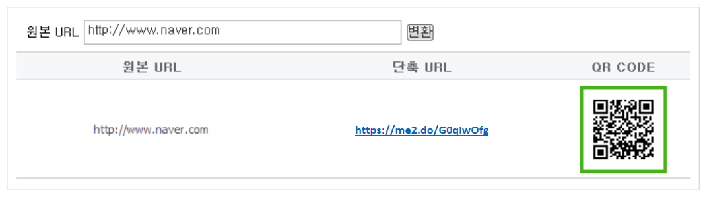

# 단축 URL API 튜토리얼

> **지원 종료 안내**
>
> 단축 URL 기능의 지원이 **2024년 11월 28일(목)**<!-- -->부로 종료됩니다.
> 
> - [공지 사항 보기](https://developers.naver.com/notice/article/17062)

* [개요](#개요)
* [개발 환경](#개발-환경)
* [단축 URL API 구현](#단축-url-api-구현)

## 개요

단축 URL API를 사용해 원본 URL에 해당하는 단축 URL과 QR 코드를 반환받는 웹 페이지를 PHP와 HTML, CSS로 구현하는 방법을 설명합니다.

구현한 웹 페이지를 실행하면 다음과 같은 결과가 나타납니다.



> **참고**  
> 이 튜토리얼은 웹 개발과 PHP, XML에 대한 기본 지식이 있는 사용자를 대상으로 하며, 코드에 관한 자세한 설명은 생략합니다.  

## 개발 환경

### 소프트웨어 요구 사항

* PHP: PHP 5.x 버전 이상

### 개발 환경 설정

튜토리얼에서 구현하는 웹 페이지는 PHP의 [curl_exec() 함수](http://php.net/manual/en/function.curl-exec.php)와 [simplexml_load_string() 함수](http://php.net/manual/en/function.simplexml-load-string.php)를 사용합니다. curl_exec() 함수와 simplexml_load_string() 함수를 사용하려면 PHP의 설정 파일인 **php.ini** 파일에서 `allow_url_fopen` 옵션이 `On`으로 설정돼 있어야 합니다.

```ini
...
;;;;;;;;;;;;;;;;;;
; Fopen wrappers ;
;;;;;;;;;;;;;;;;;;

; Whether to allow the treatment of URLs (like http:// or ftp://) as files.
; http://php.net/allow-url-fopen
allow_url_fopen = On
...
```

### 클라이언트 아이디와 클라이언트 시크릿

단축 URL API를 사용하려면 먼저 [네이버 개발자 센터](https://developers.naver.com/)에서 애플리케이션을 등록하고 클라이언트 아이디와 클라이언트 시크릿을 발급받아야 합니다.

애플리케이션을 등록하는 방법과 발급받은 클라이언트 아이디와 클라이언트 시크릿을 확인하는 방법은 "[단축 URL](/docs/utils/shortenurl/)"의 '[사전 준비 사항](/docs/utils/shortenurl/#사전-준비-사항)'을 참고합니다.

## 단축 URL API 구현

**short_url.php**라는 파일을 만들고 아래의 내용을 작성합니다. `YOUR_CLIENT_ID`와 `YOUR_CLIENT_SECRET`에는 각각 애플리케이션을 등록하고 발급받은 클라이언트 아이디 값과 클라이언트 시크릿 값을 입력합니다.

**short_url.php** 파일에는 단축 URL API를 호출하고 호출 결과를 파싱하는 부분을 하나의 파일에 포함하고 있습니다. 단축 URL API는 POST 방식으로 API를 호출하고, 호출 결과는 XML 형식으로 반환받습니다.

```php
<?php
if ($_GET['mode'] == "transurl") {
        $client_id = "YOUR_CLIENT_ID"; // 네이버 개발자 센터에서 발급받은 클라이언트 아이디
        $client_secret = "YOUR_CLIENT_SECRET"; // 네이버 개발자 센터에서 발급받은 클라이언트 시크릿
        $encText = $_GET['query'];
        $url = "https://openapi.naver.com/v1/util/shorturl.xml?url=".$encText ;
        $headers = array();
        $headers[] = "X-Naver-Client-Id: ".$client_id;
        $headers[] = "X-Naver-Client-Secret: ".$client_secret;

        $ch = curl_init();
        curl_setopt($ch, CURLOPT_URL, $url);
        curl_setopt($ch, CURLOPT_RETURNTRANSFER, true);        
        curl_setopt($ch, CURLOPT_HTTPHEADER, $headers);

        $response = curl_exec ($ch);
        $httpCode = curl_getinfo($ch, CURLINFO_HTTP_CODE);
        $xml = simplexml_load_string($response, 'SimpleXMLElement', LIBXML_NOCDATA);
        if ($httpCode == 200) {
                $transUrl = $xml->result->url;
                $orgUrl = $xml->result->orgUrl;
                $qr = $xml->result->url.".qr";
        } else {
                $errorFormat = "단축 URL 생성에 문제가 있습니다. errorCode:%d, errorMessage:%s";
                $message = sprintf($errorFormat, $xml->errorCode, $xml->errorMessage);
        }
        curl_close($ch);
}
?>

<!DOCTYPE HTML PUBLIC "-//W3C//DTD HTML 4.01 Transitional//EN" "http://www.w3.org/TR/html4/loose.dtd">
<html lang="ko">
<head>
        <meta http-equiv="Content-Type" content="text/html; charset=utf-8">
        <meta http-equiv="Content-Script-Type" content="text/javascript">
        <meta http-equiv="Content-Style-Type" content="text/css">
        <title>ShortURL API</title>
        <style>
        body,p,h1,h2,h3,h4,h5,h6,ul,ol,li,dl,dt,dd,table,th,td,form,fieldset,legend,input,textarea,button,select{margin:0;padding:0}
        body,input,textarea,select,button,table{font-family:'돋움',Dotum,AppleGothic,sans-serif;font-size:12px}
        img,fieldset{border:0}
        ul,ol{list-style:none}
        em,address{font-style:normal}
        a{text-decoration:none}
        a:hover,a:active,a:focus{text-decoration:underline}
        .search_shop {margin: 10px;}
        .result{ margin: 20px;}
        .srch{width:100%;padding:5px 0; margin: 0px 10px;}
        .srch legend{overflow:hidden;visibility:hidden;position:absolute;top:0;left:0;width:1px;height:1px;font-size:0;line-height:0}
        .srch{color:#c4c4c4;text-align:left}
        .srch span{color:#000;text-align:left}
        .srch select,.srch input{margin:-1px 0 1px;font-size:12px;color:#373737;vertical-align:middle}
        .srch .keyword{margin-left:1px;padding:2px 3px 5px;border:1px solid #B5B5B5;font-size:12px;line-height:15px; width: 300px;}
        .tbl_type,.tbl_type th,.tbl_type td{border:0}
        .tbl_type{width:100%;border-bottom:2px solid #DCDCDC;font-family:Tahoma;font-size:11px;text-align:center}
        .tbl_type caption{display:none}
        .tbl_type th{padding:7px 0 4px;border-top:2px solid #DCDCDC;background-color:#f5f7f9;color:#666;font-family:'돋움',dotum;font-size:12px;font-weight:bold}
        .tbl_type td{padding:6px 0 4px;border-top:1px solid #E5E5E5;color:#4c4c4c}
        </style>
</head>
<body>
        <div class="search_shop">
        <form action="<?php echo $_SERVER['PHP_SELF']; ?>" method="get">
        <input type="hidden" name="mode" value="transurl" />
        <fieldset class="srch">
                <legend>검색 영역</legend>
                <span>원본 URL</span> <input type="text" name="query" id="query" accesskey="s" title="URL" class="keyword" value="http://www.naver.com">
                <input type="submit" id="search" value="변환" />
        </fieldset>
        </form>
        <div><?php echo $message; ?></div>
        <table cellspacing="0" border="1" summary="단축 URL API 결과" class="tbl_type">
        <caption>단축 URL API 결과</caption>
                <colgroup>
                        <col width="40%">
                        <col width="40%">
                        <col width="20%">
                </colgroup>
                <thead>
                        <tr>
                        <th scope="col">원본 URL</th>
                        <th scope="col">단축 URL</th>
                        <th scope="col">QR CODE</th>
                        </tr>
                </thead>
                <tbody id="list">
                        <tr>
                                <td><?php echo $orgUrl; ?></td>
                                <td><a href="<?php echo $transUrl; ?>" width="84px" height="84px" target="_blank"><?php echo $transUrl; ?></a></td>
                                <td>" /></td>
                        </tr>
                </tbody>
        </table>
        </div>
</body>
</html>
```
